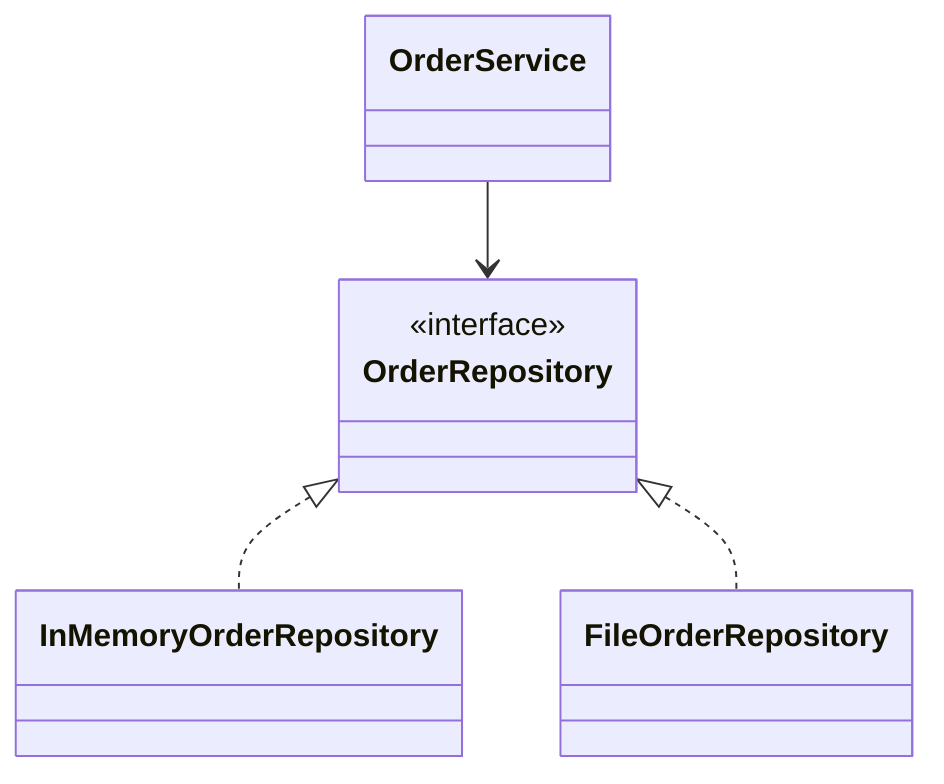

Questa dispensa parte dalle classi più semplici e arriva, un passaggio alla volta, alla costruzione di programmi formati da più oggetti. Gli argomenti vengono introdotti quando diventano utili negli esempi.

Prima di affrontare gli oggetti, la dispensa riprende le conoscenze di Java necessarie per seguire gli esempi. Non si tratta di un corso completo sul linguaggio, ma di un breve ripasso. Gli esempi usano la sintassi moderna del linguaggio; conviene quindi lavorare con un JDK 17 o successivo.

Le classi pubbliche sono mostrate senza `package` per non appesantire il codice. In un progetto Java, ciascuna va salvata in un file con lo stesso nome della classe.

## Preparare ed eseguire gli esempi

Installa un **JDK** (Java Development Kit), che comprende il compilatore `javac` e il comando `java` per avviare i programmi. Apri un terminale e controlla che entrambi siano disponibili:

```text
javac -version
java -version
```

Se un comando non viene riconosciuto, verifica l'installazione del JDK e che la sua cartella `bin` sia nel `PATH`.

Per provare un programma, salva il codice completo in un file `.java`: una classe dichiarata `public class Main` va nel file `Main.java`. Dal terminale entra nella cartella che contiene il file e digita:

```text
javac Main.java
java Main
```

`javac` controlla e compila il sorgente, producendo `Main.class`; `java Main` esegue la classe che contiene il metodo `main`. Nel secondo comando si scrive il nome della classe **senza** `.java` o `.class`. Dopo aver modificato il sorgente, compila di nuovo prima di eseguirlo.

Posso anche compilare ed eseguire direttamente scrivendo semplicemente

```
java Main.java
```

Quando l'esempio è diviso in più file nella stessa cartella, salva ogni classe pubblica nel file corrispondente. Per esempio, con `BankAccount.java` e `Main.java`:

```text
javac BankAccount.java Main.java
java Main
```

Molti riquadri della dispensa mostrano soltanto una parte di un programma: per provarli, inseriscili nella classe o nel metodo indicato dal testo. Più avanti, i progetti con package e librerie esterne useranno una struttura di cartelle e comandi specifici, spiegati nei rispettivi capitoli.

---

# Basi di Java

Questo capitolo raccoglie la sintassi che verrà usata fin dall'inizio: variabili, input e output, condizioni, scelte, cicli e metodi. Chi conosce già questi argomenti può usarlo come ripasso.

## Un programma minimo

Un programma Java può iniziare da una classe `Main`:

```java
public class Main {
    public static void main(String[] args) {
        System.out.println("Ciao");
    }
}
```

Il codice va salvato nel file `Main.java`. Il metodo `main` è il punto da cui parte l'esecuzione; per ora possiamo considerare la sua intestazione come una forma fissa. `System.out.println` stampa una riga sul terminale.

Dalla cartella che contiene il file, compila ed esegui il programma con i comandi mostrati in **Preparare ed eseguire gli esempi**.

Java distingue le lettere maiuscole dalle minuscole. Le istruzioni terminano con `;`, mentre le parentesi graffe delimitano i blocchi di codice.

## Variabili e tipi

Una variabile associa un nome a un valore:

```java
int quantity = 3;
double price = 12.50;
boolean available = true;
char section = 'A';
String title = "Il barone rampante";
```

Il tipo stabilisce quali valori può contenere la variabile e quali operazioni si possono eseguire.

| Tipo | Contiene | Esempio |
|---|---|---|
| `int` | numeri interi | `42` |
| `long` | numeri interi più grandi | `3_000_000_000L` |
| `double` | numeri con parte decimale | `2.5` |
| `boolean` | un valore logico | `true` |
| `char` | un singolo carattere | `'A'` |
| `String` | una sequenza di caratteri | `"Java"` |

Una variabile può ricevere un nuovo valore compatibile con il proprio tipo:

```java
int balance = 100;
balance = 70;
```

Il simbolo `=` esegue un'assegnazione. Non esprime un'uguaglianza matematica.

## Leggere dati da tastiera

`System.out.println()` scrive un risultato sul terminale. Per leggere ciò che l'utente digita si può usare la classe `Scanner` della libreria standard:

```java
import java.util.Scanner;

public class Main {
    public static void main(String[] args) {
        Scanner input = new Scanner(System.in);

        System.out.print("Come ti chiami? ");
        String name = input.nextLine();

        System.out.println("Ciao, " + name);
    }
}
```

La prima riga rende disponibile `Scanner`, che appartiene al package `java.util`. Il significato generale di `import` e dei package verrà approfondito più avanti; per ora basta collocare l'istruzione prima della dichiarazione della classe.

L'espressione `new Scanner(System.in)` prepara la lettura dall'**input standard**, che durante l'esecuzione nel terminale corrisponde normalmente alla tastiera. `input` è il nome scelto per la variabile che permette di effettuare le letture. La creazione degli oggetti con `new` verrà spiegata nel capitolo successivo.

`System.out.print()` mostra il messaggio senza andare a capo, così l'utente può scrivere sulla stessa riga. `input.nextLine()` attende che l'utente inserisca del testo e prema Invio, poi restituisce l'intera riga come `String`.

### Convertire l'input in un numero

Anche quando l'utente digita delle cifre, `nextLine()` restituisce una stringa. Per ottenere un valore numerico bisogna convertirla:

```java
System.out.print("Quanti anni hai? ");
String ageText = input.nextLine();
int age = Integer.parseInt(ageText);

System.out.println("L'anno prossimo avrai "
        + (age + 1) + " anni");
```

`Integer.parseInt()` converte una stringa in un valore di tipo `int`. Per un numero decimale si può usare `Double.parseDouble()`:

```java
System.out.print("Inserisci il prezzo: ");
double price = Double.parseDouble(input.nextLine());
```

In questi primi esempi supponiamo che l'utente inserisca un valore valido. Se la stringa non rappresenta il tipo di numero richiesto, la conversione fallisce; la gestione di questo caso verrà affrontata nel capitolo sulle eccezioni.

`Scanner` offre anche metodi come `nextInt()` e `nextDouble()`. Tuttavia, alternarli con `nextLine()` richiede attenzione perché il carattere di fine riga può rimanere da leggere. Usare `nextLine()` per ogni dato e convertire esplicitamente i numeri rende il flusso iniziale più uniforme.

## Espressioni e operatori

Gli operatori aritmetici più comuni sono `+`, `-`, `*`, `/` e `%`:

```java
int pricePerItem = 12;
int quantity = 3;
int total = pricePerItem * quantity;
int remainder = 17 % 5;
```

Gli operatori di confronto producono un valore booleano:

```java
balance > 0
balance == 100
balance != 0
```

`==` significa “uguale”, mentre `!=` significa “diverso”. Sono disponibili anche `<`, `<=`, `>` e `>=`.

Le condizioni possono essere combinate con gli operatori logici:

```java
amount > 0 && amount <= balance
age < 18 || age > 65
!available
```

`&&` richiede che entrambe le condizioni siano vere, `||` che ne sia vera almeno una e `!` ne inverte il valore di verità (non).

## Scelte con `if`

L'istruzione `if` esegue un blocco soltanto quando la sua condizione è vera:

```java
int balance = 100;
int amount = 30;

if (amount <= balance) {
    balance = balance - amount;
    System.out.println("Operazione eseguita");
} else {
    System.out.println("Saldo insufficiente");
}
```

Il blocco `else` è facoltativo e viene eseguito quando la condizione è falsa.

Quando le alternative sono più di due, si possono aggiungere uno o più blocchi `else if`:

```java
int temperature = 18;

if (temperature > 25) {
    System.out.println("Fa caldo");
} else if (temperature >= 15) {
    System.out.println("La temperatura è mite");
} else {
    System.out.println("Fa freddo");
}
```

Le condizioni vengono controllate dall'alto verso il basso. Appena una risulta vera, viene eseguito il blocco corrispondente e le alternative successive vengono ignorate. L'ultimo `else` rimane facoltativo e gestisce tutti i casi non riconosciuti dalle condizioni precedenti.

## Scelte con `switch`

Quando una scelta confronta lo stesso valore con diverse alternative precise, si può usare `switch`. In Java moderno uno `switch` può produrre direttamente un risultato:

```java
int dayNumber = 3;

String dayName = switch (dayNumber) {
    case 1 -> "lunedì";
    case 2 -> "martedì";
    case 3 -> "mercoledì";
    case 4 -> "giovedì";
    case 5 -> "venerdì";
    case 6 -> "sabato";
    case 7 -> "domenica";
    default -> "numero non valido";
};

System.out.println(dayName);
```

Ogni `case` indica un valore possibile. `default` gestisce i valori che non corrispondono a nessun caso ed è simile all'ultimo `else` di una catena di condizioni. La sintassi con `->` non prosegue automaticamente nel caso successivo.

Nei programmi meno recenti si incontra anche la sintassi classica con `case` seguito da `:`

```java
int choice = 2;

switch (choice) {
    case 1:
        System.out.println("Nuova partita");
        break;
    case 2:
        System.out.println("Carica partita");
        break;
    default:
        System.out.println("Scelta non valida");
}
```

In questa forma `break` termina lo `switch`. Se viene omesso, l'esecuzione prosegue anche nei casi successivi: questo comportamento si chiama *fall-through*. Nei nuovi esempi useremo di preferenza la sintassi con `->`, che evita questo rischio, a meno che non sia un comportamento voluto.

## Cicli

Il ciclo `for` è adatto quando si conosce il numero di ripetizioni:

```java
for (int i = 0; i < 3; i++) {
    System.out.println(i);
}
```

Il ciclo stampa `0`, `1` e `2`. La variabile `i` parte da zero, viene incrementata dopo ogni iterazione e il ciclo continua finché `i < 3`.

Il limite non deve essere necessariamente un numero scritto nel codice. Può dipendere, per esempio, dalla lunghezza di una stringa:

```java
String word = "Java";

for (int i = 0; i < word.length(); i++) {
    System.out.println(word.charAt(i));
}
```

Il metodo `length()` restituisce il numero di caratteri e `charAt(i)` restituisce il carattere nella posizione `i`. Le posizioni partono da `0`, quindi l'ultima posizione valida è `word.length() - 1`.

Un **array** conserva un numero fisso di valori dello stesso tipo. Le parentesi quadre fanno parte del tipo, mentre le graffe elencano i valori iniziali:

```java
int[] values = {4, 7, 9};

for (int i = 0; i < values.length; i++) {
    System.out.println(values[i]);
}
```

Anche gli indici di un array partono da zero. `values[i]` legge l'elemento nella posizione corrente e `values.length` indica quanti elementi contiene l'array.

In Java il modo in cui si ottiene la dimensione cambia in base al tipo:

| Tipo di dato | Dimensione      |
| ------------ | --------------- |
| array        | `values.length` |
| `String`     | `text.length()` |
| collezione   | `items.size()`  |

`length` di un array è un campo e non usa le parentesi; `length()` e `size()` sono invece metodi. Le collezioni verranno introdotte più avanti, ma anche con esse la dimensione può essere usata nella condizione di un `for`.

Il ciclo `while` continua invece finché una condizione rimane vera:

```java
int remaining = 3;

while (remaining > 0) {
    System.out.println(remaining);
    remaining--;
}
```

È importante che il corpo del ciclo modifichi prima o poi la condizione; altrimenti il ciclo non termina.

Il ciclo `do-while` controlla la condizione dopo aver eseguito il corpo:

```java
int attempts = 0;

do {
    attempts++;
    System.out.println("Tentativo " + attempts);
} while (attempts < 3);
```

Il corpo viene quindi eseguito almeno una volta, anche se la condizione fosse falsa fin dall'inizio. A differenza degli altri cicli, la riga con `while` termina con `;`.

### Interrompere o saltare un'iterazione

L'istruzione `break` termina immediatamente il ciclo che la contiene. Può essere utile, per esempio, quando il risultato cercato è già stato trovato:

```java
for (int number = 1; number <= 10; number++) {
    if (number == 6) {
        break;
    }

    System.out.println(number);
}
```

Il ciclo stampa i numeri da `1` a `5`; quando `number` vale `6`, `break` interrompe il ciclo.

L'istruzione `continue` salta invece il resto dell'iterazione corrente e passa alla successiva:

```java
for (int number = 1; number <= 5; number++) {
    if (number == 3) {
        continue;
    }

    System.out.println(number);
}
```

In questo caso vengono stampati `1`, `2`, `4` e `5`. Sia `break` sia `continue` agiscono soltanto sul ciclo più interno in cui si trovano. Vanno usati quando rendono più evidente la condizione di uscita o il caso da saltare: un loro uso eccessivo può rendere meno chiaro il percorso dell'esecuzione.

## Metodi

Un metodo raccoglie alcune istruzioni sotto un nome. Può ricevere valori tramite i parametri e può restituire un risultato:

```java
public static int maximum(int first, int second) {
    if (first > second) {
        return first;
    }

    return second;
}
```

Il metodo si chiama `maximum`, riceve due parametri di tipo `int` e restituisce un altro `int`. Può essere chiamato da `main` in questo modo:

```java
int result = maximum(8, 5);
System.out.println(result); // 8
```

Un metodo che non restituisce alcun valore usa `void`:

```java
public static void printGreeting(String name) {
    System.out.println("Ciao, " + name);
}
```

In questi esempi i metodi sono `static`, quindi possono essere chiamati da `main` senza creare un oggetto. Il significato di `static` verrà ripreso dopo aver studiato classi e oggetti.

## In sintesi

- Una variabile ha un nome, un tipo e un valore.
- `Scanner` permette di leggere l'input; `nextLine()` restituisce la riga inserita come stringa.
- `Integer.parseInt()` e `Double.parseDouble()` convertono una stringa rispettivamente in un intero e in un numero decimale.
- Gli operatori permettono di costruire espressioni e condizioni.
- `if`, `else if` ed `else` permettono di scegliere tra condizioni diverse.
- `switch` confronta uno stesso valore con più alternative precise.
- `for`, `while` e `do-while` ripetono un blocco; `do-while` lo esegue almeno una volta.
- La condizione di un `for` può usare la lunghezza o la dimensione dei dati da attraversare.
- `break` interrompe un ciclo, mentre `continue` passa all'iterazione successiva.
- Un metodo può ricevere parametri e restituire un valore.
- Il metodo `main` è il punto di partenza del programma.

## Esercizi

1. Scrivi un programma per calcolare il costo di un parcheggio. L'utente inserisce le ore intere di sosta: la prima ora costa 2 euro, le successive 1 euro ciascuna, fino a un massimo giornaliero di 10 euro. Un valore minore o uguale a zero è rifiutato. Sposta il calcolo in `parkingCost(int hours)` e verifica almeno i casi `1`, `3`, `12` e `0`.
2. Leggi una sequenza di temperature intere terminata dal valore sentinella `999`. Senza usare array, stampa quante temperature sono state inserite, il minimo, il massimo e la media. Se `999` è il primo valore, stampa un messaggio specifico invece di calcolare la media.
3. Realizza un piccolo menu che continui a essere mostrato finché l'utente non sceglie **Esci**. Le altre scelte permettono di convertire Celsius in Fahrenheit, Fahrenheit in Celsius oppure visualizzare il numero di conversioni eseguite. Usa `switch` per il comando e metodi separati per le due formule; un comando sconosciuto non deve terminare il programma.
4. Scrivi `countOccurrences(String text, char searched)`, che attraversa la stringa e conta quante volte compare il carattere richiesto. Usa poi il metodo per stabilire quale fra due caratteri inseriti dall'utente compare più spesso, gestendo anche il pareggio.
5. Un distributore accetta soltanto importi da 1 o 2 euro e deve raggiungere un prezzo scelto dall'utente. Continua a leggere monete finché il totale non raggiunge il prezzo; ignora con `continue` i tagli non validi e interrompi con `break` se viene inserito `0`. Al termine comunica se l'acquisto è riuscito e l'eventuale resto.

---

# Le basi della programmazione a oggetti

## Classi e oggetti

### Dati e operazioni

Supponiamo di voler rappresentare un conto bancario molto semplice. In un programma scritto soltanto con variabili e funzioni potremmo tenere separati il nome dell'intestatario, il saldo e le operazioni di deposito e prelievo. Questa soluzione funziona per un solo conto, ma diventa presto scomoda quando i conti sono molti.

La programmazione orientata agli oggetti permette di riunire questi elementi. Un conto avrà:

- alcuni dati, come l'intestatario e il saldo;
- alcune operazioni, come il deposito e il prelievo.

I dati formano lo **stato** del conto. Le operazioni ne costituiscono il **comportamento**.

### La classe

Una classe descrive quali dati e quali operazioni avranno gli oggetti di un certo tipo. Questa è una prima versione di `BankAccount`:

```java
public class BankAccount {
    private String owner;
    private int balance;

    public void deposit(int amount) {
        balance = balance + amount;
    }

    public int getBalance() {
        return balance;
    }
}
```

Le variabili dichiarate direttamente nel corpo della classe si chiamano **campi**. Qui i campi sono `owner` e `balance`.

Le funzioni definite in una classe si chiamano **metodi**. `deposit` modifica il saldo, mentre `getBalance` lo restituisce.

Per il momento è sufficiente leggere i modificatori di accesso in questo modo:

- `private` indica un dettaglio interno della classe;
- `public` indica una parte che può essere usata dal resto del programma.

L'incapsulamento e i modificatori di accesso saranno approfonditi più avanti.

### Creare e usare un oggetto

La classe è una descrizione. Per ottenere un conto concreto bisogna creare un **oggetto**, chiamato anche **istanza**:

```java
BankAccount account = new BankAccount();
account.deposit(100);

System.out.println(account.getBalance()); // 100
```

La prima riga contiene tre elementi:

```text
BankAccount account = new BankAccount();
```

- `BankAccount` è il tipo della variabile;
- `account` è il nome della variabile;
- `new BankAccount()` crea l'oggetto.

Il punto permette di chiamare un metodo dell'oggetto. Nell'espressione `account.deposit(100)`, il metodo `deposit` viene eseguito sul conto indicato da `account`.

Per mantenere l'esempio semplice, il saldo è rappresentato con un numero intero. La rappresentazione del denaro nei programmi reali richiede maggiore attenzione, ma non è necessaria per comprendere il funzionamento degli oggetti.

Ogni oggetto possiede il proprio stato:

```java
BankAccount first = new BankAccount();
BankAccount second = new BankAccount();

first.deposit(100);
second.deposit(40);

System.out.println(first.getBalance());  // 100
System.out.println(second.getBalance()); // 40
```

`first` e `second` sono due oggetti distinti. Il deposito sul primo non modifica il secondo.

### Il costruttore

Nella versione precedente un conto nasce senza intestatario. Possiamo richiedere questo dato nel momento in cui l'oggetto viene creato:

```java
public class BankAccount {
    private String owner;
    private int balance;

    public BankAccount(String owner) {
        this.owner = owner;
        this.balance = 0;
    }

    public void deposit(int amount) {
        balance = balance + amount;
    }

    public String getOwner() {
        return owner;
    }

    public int getBalance() {
        return balance;
    }
}
```

`BankAccount(String owner)` è il **costruttore**. Ha lo stesso nome della classe e non dichiara un tipo di ritorno. Viene eseguito quando si usa `new`:

```java
BankAccount account = new BankAccount("Ada");
```

Ora non è più possibile creare un conto senza fornire il nome dell'intestatario.

Se una classe non dichiara alcun costruttore, Java ne fornisce uno vuoto. Quando scriviamo un costruttore, quello vuoto non viene più aggiunto automaticamente.

### Il significato di `this`

Nel costruttore compaiono due elementi chiamati `owner`:

```java
public BankAccount(String owner) {
    this.owner = owner;
}
```

`owner` è il parametro ricevuto dal costruttore. `this.owner` è invece il campo dell'oggetto che si sta costruendo. La parola `this` indica quindi l'oggetto corrente. La stessa distinzione vale nei metodi quando un parametro ha lo stesso nome di un campo.

Quando non c'è ambiguità, `this` può essere omesso. Le istruzioni `balance = balance + amount` e `this.balance = this.balance + amount` hanno lo stesso significato.

### Campi, parametri e variabili locali

Consideriamo questo metodo:

```java
public int balanceAfterDeposit(int amount) {
    int newBalance = balance + amount;
    return newBalance;
}
```

I tre nomi hanno ruoli diversi:

| Nome | Tipo di variabile | Durata |
|---|---|---|
| `balance` | campo | esiste finché esiste l'oggetto |
| `amount` | parametro | esiste durante la chiamata del metodo |
| `newBalance` | variabile locale | esiste durante l'esecuzione del metodo |

Un campo conserva il proprio valore tra una chiamata e l'altra. Parametri e variabili locali servono soltanto durante l'esecuzione di un metodo.

### Metodi che modificano e metodi che leggono

Un metodo `void` esegue un'operazione senza restituire un risultato:

```java
public void deposit(int amount) {
    balance = balance + amount;
}
```

Un metodo che dichiara un tipo di ritorno deve restituire un valore compatibile con quel tipo:

```java
public int getBalance() {
    return balance;
}
```

Il primo metodo modifica lo stato del conto. Il secondo si limita a leggerlo. Entrambi appartengono al comportamento della classe.

Una classe non dovrebbe obbligare il resto del programma a ricostruire da solo le operazioni che riguardano il suo stato. Per esempio, un prelievo è più chiaro se viene espresso con un metodo:

```java
public boolean withdraw(int amount) {
    if (amount <= 0 || amount > balance) {
        return false;
    }

    balance = balance - amount;
    return true;
}
```

Il metodo restituisce `true` se il prelievo è riuscito e `false` in caso contrario. La regola che impedisce al saldo di diventare negativo rimane dentro `BankAccount`, dove può essere controllata più facilmente.

Anche `deposit` dovrebbe rifiutare importi non validi. Per ora possiamo farlo restituendo un valore booleano:

```java
public boolean deposit(int amount) {
    if (amount <= 0) {
        return false;
    }

    balance = balance + amount;
    return true;
}
```

Più avanti vedremo come segnalare questi problemi mediante le eccezioni.

### Un programma completo

Riuniamo ora le parti dell'esempio. Il file `BankAccount.java` contiene la classe:

```java
public class BankAccount {
    private String owner;
    private int balance;

    public BankAccount(String owner) {
        this.owner = owner;
        this.balance = 0;
    }

    public boolean deposit(int amount) {
        if (amount <= 0) {
            return false;
        }

        balance = balance + amount;
        return true;
    }

    public boolean withdraw(int amount) {
        if (amount <= 0 || amount > balance) {
            return false;
        }

        balance = balance - amount;
        return true;
    }

    public String getOwner() {
        return owner;
    }

    public int getBalance() {
        return balance;
    }
}
```

Il file `Main.java` crea un conto e ne usa i metodi:

```java
public class Main {
    public static void main(String[] args) {
        BankAccount account = new BankAccount("Ada");

        account.deposit(100);

        if (account.withdraw(30)) {
            System.out.println("Prelievo eseguito");
        }

        System.out.println("Intestatario: " + account.getOwner());
        System.out.println("Saldo: " + account.getBalance());
    }
}
```

L'output è:

```text
Prelievo eseguito
Intestatario: Ada
Saldo: 70
```

In questo primo esempio `Main` decide quali operazioni eseguire e stampa i risultati. `BankAccount` conserva lo stato del conto e stabilisce come possono avvenire deposito e prelievo.

### In sintesi

- Una **classe** descrive un nuovo tipo.
- Un **oggetto** è un'istanza concreta di una classe.
- I **campi** rappresentano lo stato dell'oggetto.
- I **metodi** ne rappresentano il comportamento.
- Il **costruttore** prepara l'oggetto al momento della creazione.
- `this` indica l'oggetto corrente.

### Esercizi

1. Modella una lampada con nome e stato acceso/spento. Il costruttore riceve il nome e la lampada nasce spenta; `turnOn()`, `turnOff()`, `isOn()` e `description()` costituiscono le operazioni disponibili. Crea due lampade, azionale in modo diverso e mostra che ogni oggetto conserva il proprio stato.
2. Crea `FuelTank` con capacità, quantità iniziale e metodi `add(double liters)`, `consume(double liters)` e `getLevel()`. I primi due restituiscono `false` senza modificare l'oggetto se l'operazione non è possibile. Scrivi un programma che provi rifornimento valido, rifornimento eccessivo, consumo valido e consumo oltre la quantità disponibile.
3. Progetta una classe `QuizQuestion` che conservi domanda, risposta corretta e punteggio. Il metodo `checkAnswer(String answer)` restituisce l'esito, mentre `pointsFor(String answer)` restituisce il punteggio oppure zero. Crea tre domande e calcola il punteggio di un partecipante senza inserire la logica delle risposte nel `main()`.
4. Ti viene consegnata una classe `Thermostat` nella quale `increase()` modifica una variabile locale invece del campo. Scrivi un esempio minimo che renda visibile il difetto, correggilo usando `this` dove serve e spiega come hai verificato che due termostati rimangano indipendenti.

---

## Rappresentare classi e oggetti con UML

Quando si progetta una classe può essere utile descriverla prima di scrivere il codice. UML (*Unified Modeling Language*) fornisce una notazione grafica condivisa. In questo capitolo useremo soltanto due diagrammi: il diagramma delle classi e il diagramma degli oggetti.

### Il diagramma di una classe

Nel diagramma delle classi, una classe è rappresentata da un rettangolo diviso in tre parti:

```text
+----------------------------------+
| BankAccount                      |
+----------------------------------+
| - owner: String                  |
| - balance: int                   |
+----------------------------------+
| + BankAccount(owner: String)     |
| + deposit(amount: int): boolean  |
| + withdraw(amount: int): boolean |
| + getOwner(): String             |
| + getBalance(): int              |
+----------------------------------+
```

La prima parte contiene il nome della classe, la seconda i campi e la terza i costruttori e i metodi.

I simboli davanti ai nomi indicano la visibilità:

| Simbolo | Significato | Java |
|---|---|---|
| `+` | accessibile dall'esterno | `public` |
| `-` | accessibile soltanto nella classe | `private` |

UML scrive il tipo dopo il nome:

```text
- balance: int
+ deposit(amount: int): boolean
```

In Java le stesse dichiarazioni diventano:

```java
private int balance;

public boolean deposit(int amount) {
    // corpo del metodo
}
```

Il valore dopo i due punti, alla fine di un metodo, è il tipo restituito. Se il metodo non restituisce nulla si scrive `void`.

### Che cosa mostra il diagramma

Il diagramma descrive la struttura della classe, ma non contiene le istruzioni dei metodi. Da solo ci permette di capire che:

- un conto possiede un intestatario e un saldo;
- i due campi sono privati;
- per creare un conto serve il nome dell'intestatario;
- deposito e prelievo ricevono un numero intero e restituiscono un valore booleano;
- il saldo e l'intestatario possono essere letti tramite due metodi pubblici.

Non possiamo invece sapere come viene controllato un prelievo. Per scoprirlo dobbiamo leggere il codice del metodo.

Un diagramma non deve necessariamente riportare ogni dettaglio. Si possono omettere gli elementi che non servono alla spiegazione, purché ciò che rimane sia corretto.

### Il diagramma degli oggetti

Il diagramma delle classi descrive il tipo `BankAccount`. Il diagramma degli oggetti mostra invece lo stato di oggetti concreti in un certo momento:

```text
+--------------------------+    +--------------------------+
| first: BankAccount       |    | second: BankAccount      |
+--------------------------+    +--------------------------+
| owner = "Ada"            |    | owner = "Grace"          |
| balance = 70             |    | balance = 40             |
+--------------------------+    +--------------------------+
```

La scrittura `first: BankAccount` indica che `first` è un oggetto della classe `BankAccount`. Sotto il nome vengono riportati i valori assunti dai suoi campi.

Il diagramma corrisponde, per esempio, a questa situazione:

```java
BankAccount first = new BankAccount("Ada");
BankAccount second = new BankAccount("Grace");

first.deposit(100);
first.withdraw(30);
second.deposit(40);
```

Il diagramma degli oggetti è una fotografia: se viene eseguito un altro deposito, il valore di `balance` cambia e la fotografia non è più aggiornata.

### Dal codice al diagramma

Per trasformare una classe Java in un diagramma:

1. si scrive il nome della classe;
2. si riportano i campi con nome, tipo e visibilità;
3. si aggiungono il costruttore e i metodi che interessa mostrare;
4. per ogni metodo si indicano parametri e tipo restituito.

Il procedimento inverso permette di ricavare lo scheletro di una classe da un diagramma. Restano da scrivere i corpi dei metodi, perché UML ne mostra soltanto la firma.

### In sintesi

- Il **diagramma delle classi** descrive la struttura di una classe.
- Il **diagramma degli oggetti** mostra oggetti concreti e il valore dei loro campi.
- In UML il tipo segue il nome: `balance: int`.
- `+` indica un elemento pubblico e `-` un elemento privato.
- I dettagli interni dei metodi rimangono nel codice.

### Esercizi

1. Dal seguente requisito ricava prima una classe e poi il suo diagramma UML: «Un biglietto ferroviario conserva stazione di partenza, destinazione e prezzo; può restituire una descrizione e calcolare il prezzo dopo uno sconto percentuale». Indica tipi, visibilità, parametri e valori restituiti. Infine scrivi lo scheletro Java e controlla che corrisponda al diagramma.
2. Disegna due diagrammi degli oggetti relativi allo stesso `FuelTank`: uno prima di un consumo di 15 litri e uno dopo. Affianca un secondo serbatoio che non viene modificato. I diagrammi devono rendere riconoscibili identità diverse e valori diversi nel tempo.
3. Esamina questo diagramma e individua almeno quattro informazioni mancanti o ambigue: `Student` contiene `name` e `credits` e offre `addCredits` e `description`, ma il diagramma non riporta visibilità, tipi, parametri né valore restituito. Produci una versione completa e coerente, poi scrivi la corrispondente classe Java.
4. Disegna il diagramma di classe e un diagramma degli oggetti per un distributore che conserva nome del prodotto, prezzo e quantità disponibile. Nel diagramma degli oggetti rappresenta due distributori con prodotti diversi e scegli valori che permettano di controllare visivamente il risultato di una vendita.

---

## Incapsulamento e invarianti

Nel capitolo precedente i campi di `BankAccount` erano già dichiarati `private`. Vediamo ora perché questa scelta è importante.

### Il problema dei campi pubblici

Se il saldo fosse pubblico, qualunque parte del programma potrebbe assegnargli un valore:

```java
public class BankAccount {
    public int balance;
}
```

Il codice esterno potrebbe quindi eseguire:

```java
BankAccount account = new BankAccount();
account.balance = -500;
```

Per Java l'assegnazione è corretta, ma il conto si trova in uno stato che non vogliamo permettere. Il problema nasce dal fatto che la classe non controlla più come viene modificato il proprio saldo.

### Nascondere lo stato

Un campo `private` è accessibile soltanto dal codice della classe in cui è dichiarato:

```java
public class BankAccount {
    private int balance;
}
```

Ora un'istruzione come `account.balance = -500` non compila. Il resto del programma può usare soltanto i costruttori e i metodi dichiarati `public`.

L'insieme delle operazioni pubbliche forma l'**interfaccia pubblica** della classe. In questo caso la parola “interfaccia” indica semplicemente il modo in cui la classe può essere usata dall'esterno; il costrutto Java `interface` verrà studiato più avanti.

Rendere privati i campi e controllarne l'accesso attraverso i metodi si chiama **incapsulamento**.

### I modificatori di accesso

`public` e `private` non sono le uniche possibilità. Java prevede quattro livelli di accesso:

| Dichiarazione | Stessa classe | Stesso package | Sottoclasse fuori dal package | Altre classi |
|---|:---:|:---:|:---:|:---:|
| `private` | sì | no | no | no |
| nessun modificatore | sì | sì | no | no |
| `protected` | sì | sì | sì | no |
| `public` | sì | sì | sì | sì |

Un **package** raggruppa classi correlate. Quando non si scrive alcun modificatore, l'elemento è accessibile soltanto alle classi dello stesso package. Questo livello viene chiamato *package-private*:

```java
int balance; // accesso package-private
```

`protected` permette l'accesso alle classi dello stesso package e alle sottoclassi:

```java
protected int balance;
```

Una sottoclasse è una classe ottenuta tramite ereditarietà. Per ora è sufficiente conoscere il significato generale di `protected`; le sue regole d'uso verranno riprese insieme all'ereditarietà.

Nelle classi viste finora, i campi rimangono `private` e i metodi destinati al resto del programma sono `public`. Gli altri livelli non vanno scelti soltanto per evitare di scrivere getter o metodi appropriati.

### Modificare lo stato attraverso i metodi

Poiché `balance` è privato, il saldo può cambiare soltanto nei metodi di `BankAccount`. Il metodo `deposit` accetta esclusivamente importi positivi:

```java
public boolean deposit(int amount) {
    if (amount <= 0) {
        return false;
    }

    balance = balance + amount;
    return true;
}
```

Il metodo `withdraw` deve controllare anche che il conto possieda denaro sufficiente:

```java
public boolean withdraw(int amount) {
    if (amount <= 0 || amount > balance) {
        return false;
    }

    balance = balance - amount;
    return true;
}
```

Entrambi i metodi restituiscono `false` quando l'operazione non può essere eseguita. In quel caso il saldo rimane invariato.

### Mantenere valido un oggetto

Per questa versione semplificata del conto abbiamo scelto una sola regola:

```text
balance >= 0
```

La condizione deve essere vera subito dopo la costruzione dell'oggetto e deve rimanere vera dopo ogni chiamata a un metodo pubblico. Una condizione di questo tipo si chiama **invariante**.

La classe mantiene l'invariante in tre passaggi:

- il costruttore inizializza il saldo a zero;
- `deposit` aggiunge soltanto importi positivi;
- `withdraw` non sottrae più del saldo disponibile.

Il controllo `amount > 0` riguarda invece il singolo deposito o prelievo. Non deve essere sempre vero nello stato dell'oggetto: stabilisce soltanto quali argomenti vengono accettati da quei metodi.

### Getter e setter

Un metodo che restituisce il valore di un campo viene spesso chiamato **getter**:

```java
public int getBalance() {
    return balance;
}
```

Leggere il saldo non permette di modificarlo, perché `int` viene restituito come valore. Dopo questa istruzione:

```java
int currentBalance = account.getBalance();
currentBalance = -100;
```

cambia soltanto la variabile `currentBalance`; il campo privato del conto rimane invariato.

Non è necessario aggiungere un **setter** per ogni campo. Un metodo come questo renderebbe inutile il controllo ottenuto con `private`:

```java
public void setBalance(int balance) {
    this.balance = balance;
}
```

Il chiamante potrebbe eseguire `account.setBalance(-500)` e riportare il conto in uno stato non valido. Per il saldo sono più adatti `deposit` e `withdraw`, perché esprimono operazioni precise e ne controllano le regole.

### La classe completa

Il file `BankAccount.java` contiene ora:

```java
public class BankAccount {
    private String owner;
    private int balance;

    public BankAccount(String owner) {
        this.owner = owner;
        this.balance = 0;
    }

    public String getOwner() {
        return owner;
    }

    public int getBalance() {
        return balance;
    }

    public boolean deposit(int amount) {
        if (amount <= 0) {
            return false;
        }

        balance = balance + amount;
        return true;
    }

    public boolean withdraw(int amount) {
        if (amount <= 0 || amount > balance) {
            return false;
        }

        balance = balance - amount;
        return true;
    }
}
```

Possiamo verificarne il comportamento in `Main.java`:

```java
public class Main {
    public static void main(String[] args) {
        BankAccount account = new BankAccount("Ada");

        account.deposit(100);

        boolean firstWithdrawal = account.withdraw(150);
        boolean secondWithdrawal = account.withdraw(30);

        System.out.println(firstWithdrawal);
        System.out.println(secondWithdrawal);
        System.out.println(account.getBalance());
    }
}
```

Il primo prelievo viene rifiutato e non cambia il saldo. Il secondo viene eseguito:

```text
false
true
70
```

Il campo `balance` rimane sempre maggiore o uguale a zero, anche quando il programma richiede un'operazione non valida.

### In sintesi

- L'**incapsulamento** impedisce al codice esterno di modificare direttamente lo stato di un oggetto.
- I campi sono normalmente `private`.
- Senza modificatore l'accesso è limitato al package; `protected` comprende anche le sottoclassi.
- Costruttori e metodi `public` formano l'interfaccia pubblica della classe.
- Un **invariante** è una condizione che deve rimanere vera per ogni oggetto valido.
- Getter e setter non devono essere aggiunti automaticamente: ogni metodo pubblico deve avere uno scopo.

### Esercizi

1. Realizza `Elevator`, costruito con il numero massimo di piani e inizialmente fermo al piano zero. Espone `goUp()`, `goDown()`, `getCurrentFloor()` e `isAtTop()`, ma nessun metodo per assegnare direttamente il piano. Le operazioni oltre i limiti restituiscono `false`. Verifica con una sequenza di chiamate che l'oggetto non possa mai trovarsi sotto zero o sopra il piano massimo.
2. Una `GiftCard` conserva codice e credito. Può essere ricaricata con un importo positivo e può pagare soltanto importi positivi non superiori al credito. Progetta l'interfaccia pubblica minima, implementala e prova almeno un pagamento valido, uno troppo elevato e una ricarica non valida, controllando che gli errori non alterino il saldo.
3. Rifattorizza una classe `Exam` con campi pubblici `student`, `grade` e `passed`. Elimina gli stati incoerenti, come `grade = 3` insieme a `passed = true`: decidi quale informazione debba essere conservata e quale possa essere calcolata. Motiva ogni getter presente e l'assenza di setter generici.
4. Confronta due versioni di `VolumeControl`: una con `setVolume(int)` pubblico senza controlli e una con `increase()`, `decrease()` e un eventuale setter con validazione. Scrivi una breve sequenza di chiamate che rende invalida la prima versione e non la seconda, poi formula esplicitamente l'invariante.
5. Per una classe `UserAccount`, classifica `password`, `isPasswordCorrect()`, `changePassword()` e `description()` come dettagli privati o operazioni pubbliche. Se ritieni utile un membro package-private o `protected`, indica un caso concreto che lo giustifichi; non usarli soltanto per evitare `private`.

---

## Riferimenti e memoria

Quando creiamo un oggetto, la variabile non contiene direttamente tutti i suoi campi. Contiene un **riferimento**, cioè un valore che permette di raggiungere l'oggetto.

Riprendiamo un'istruzione già incontrata:

```java
BankAccount account = new BankAccount("Ada");
```

`new BankAccount("Ada")` crea l'oggetto. La variabile `account` conserva il riferimento a quell'oggetto.

### Tipi primitivi e riferimenti

Una variabile di tipo primitivo contiene direttamente il proprio valore:

```java
int first = 10;
int second = first;
second = 20;
```

L'assegnazione copia il numero `10`. Cambiare `second` non modifica `first`.

Con gli oggetti viene invece copiato il riferimento:

```java
BankAccount first = new BankAccount("Ada");
BankAccount second = first;
```

Dopo l'assegnazione, entrambe le variabili indicano lo stesso conto:

```text
first  ──┐
         ├──> BankAccount { owner = "Ada", balance = 0 }
second ──┘
```

L'istruzione `second = first` non crea un secondo oggetto. Se il conto viene modificato attraverso una variabile, il cambiamento è visibile anche attraverso l'altra:

```java
second.deposit(100);
System.out.println(first.getBalance()); // 100
```

La presenza di più riferimenti allo stesso oggetto si chiama **aliasing**. `first` e `second` sono alias.

### Modificare un oggetto e riassegnare una variabile

Un'assegnazione copia il valore presente nella variabile in quel momento; non crea un legame permanente fra le due variabili. Due variabili possono quindi indicare lo stesso oggetto e poi essere riassegnate separatamente. Consideriamo questo programma:

```java
public class StringReferences {
    public static void main(String[] args) {
        String a = "Ciao";
        String b = a;

        a = "Buongiorno";

        System.out.println(a + " " + b);
    }
}
```

Subito dopo `b = a`, entrambe le variabili indicano la stringa `"Ciao"`:

```text
a ──┐
    ├──> "Ciao"
b ──┘
```

L'istruzione successiva non modifica quella stringa. Assegna ad `a` il riferimento a un'altra stringa:

```text
a ─────> "Buongiorno"

b ─────> "Ciao"
```

Il programma stampa quindi:

```text
Buongiorno Ciao
```

`b = a` aveva copiato il riferimento alla stessa stringa, ma le due variabili rimangono indipendenti: riassegnare `a` non riassegna automaticamente anche `b`. Inoltre le stringhe sono immutabili, quindi `"Ciao"` non può essere trasformata in `"Buongiorno"`; viene usato un altro oggetto `String`.

È diverso da quanto accade con:

```java
second.deposit(100);
```

Qui `second` non viene riassegnata. Il metodo modifica il `BankAccount` raggiunto sia da `first` sia da `second`, perciò il nuovo saldo è visibile attraverso entrambe le variabili.

### Identità degli oggetti

L'operatore `==`, applicato ai riferimenti, controlla se due variabili indicano lo stesso oggetto:

```java
BankAccount first = new BankAccount("Ada");
BankAccount alias = first;
BankAccount another = new BankAccount("Ada");

System.out.println(first == alias);   // true
System.out.println(first == another); // false
```

`first` e `another` indicano due oggetti distinti, anche se sono stati costruiti con gli stessi dati. Il confronto del contenuto degli oggetti verrà affrontato più avanti.

### Copia superficiale e copia profonda

Quando una variabile indica un oggetto, ci sono tre operazioni diverse da non confondere:

1. copiare soltanto il riferimento;
2. creare una copia superficiale dell'oggetto;
3. creare una copia profonda dell'oggetto.

Il primo caso è quello già incontrato con `BankAccount`. Per distinguere copia superficiale e profonda introdurremo poi un oggetto che contiene un altro oggetto modificabile.

#### 1. Copiare il riferimento

L'assegnazione copia il riferimento contenuto nella variabile, non l'oggetto:

```text
first  ──┐
         ├──> BankAccount { balance = 0 }
second ──┘
```

Il primo esempio richiede soltanto queste istruzioni:

```java
BankAccount first = new BankAccount("Ada");
BankAccount second = first;

second.deposit(100);

System.out.println(first == second);
System.out.println(first.getBalance());
```

L'output è:

```text
true
100
```

Esiste un solo `BankAccount`. `first` e `second` sono due riferimenti allo stesso oggetto, cioè due alias: per questo `first == second` restituisce `true`. Questa non è una copia superficiale, perché non è stato creato alcun nuovo oggetto.

#### 2. Creare una copia superficiale

Per osservare una vera copia superficiale serve un oggetto che ne contenga un altro modificabile. Supponiamo che `Person` abbia un campo `address` di tipo `Address`. Il solo metodo che ci interessa in questo momento è:

```java
Person shallowCopy() {
    return new Person(address);
}
```

Il costruttore crea una nuova `Person`, ma riceve lo stesso oggetto `Address` contenuto nell'originale.

Una **copia superficiale**, o *shallow copy*, crea un secondo oggetto `Person`, ma gli assegna lo stesso riferimento `address` dell'originale:

```text
original  ──> Person ──┐
                       ├──> Address { city = "Genova" }
shallow   ──> Person ──┘
```

Il secondo esempio usa `shallowCopy()`:

```java
Person original = new Person(new Address("Genova"));
Person shallow = original.shallowCopy();

shallow.moveTo("Milano");

System.out.println(original.getCity()); // Milano
```

`original` e `shallow` sono due persone distinte, come mostra il diagramma, ma contengono lo stesso indirizzo. Per questo la modifica eseguita attraverso `shallow` viene letta come `"Milano"` anche attraverso `original`.

#### 3. Creare una copia profonda

Per la copia profonda, `Person` deve invece costruire anche un nuovo indirizzo:

```java
Person deepCopy() {
    return new Person(
            new Address(address.getCity()));
}
```

Una **copia profonda**, o *deep copy*, crea un secondo oggetto `Person` e anche un secondo oggetto `Address`:

```text
original  ──> Person ──> Address { city = "Genova" }

deep      ──> Person ──> Address { city = "Genova" }
```

Il terzo esempio usa `deepCopy()`:

```java
Person original = new Person(new Address("Genova"));
Person deep = original.deepCopy();

deep.moveTo("Roma");

System.out.println(original == deep);
System.out.println(original.getCity());
System.out.println(deep.getCity());
```

L'output è:

```text
false
Genova
Roma
```

Anche in questo caso le persone sono due oggetti distinti. Questa volta, però, possiedono indirizzi indipendenti: modificare quello raggiunto da `deep` non modifica quello raggiunto da `original`.

Una copia profonda non deve duplicare indiscriminatamente ogni oggetto. Gli oggetti immutabili, come `String`, possono essere condivisi; vanno copiati gli oggetti mutabili che devono cambiare in modo indipendente.

#### Il metodo `clone()`

La classe `Object`, dalla quale derivano tutte le classi, dichiara il metodo `clone()`. La sua implementazione crea un nuovo oggetto e copia il valore di ciascun campo come farebbe un'assegnazione:

- i valori primitivi vengono copiati;
- i riferimenti vengono copiati, ma gli oggetti ai quali rimandano non vengono copiati.

`Object.clone()` produce quindi una **copia superficiale**. Più precisamente, è la chiamata a `super.clone()` senza altre operazioni a lasciare condivisi gli oggetti interni.

Per usare questo meccanismo, una classe deve implementare l'interfaccia `Cloneable` e rendere pubblico `clone()`, che in `Object` è `protected`:

```java
final class Person implements Cloneable {
    private Address address;

    @Override
    public Person clone()
            throws CloneNotSupportedException {
        return (Person) super.clone();
    }
}
```

Sono omessi il costruttore e gli altri metodi, che qui non servono. `Cloneable` non dichiara metodi: segnala a `Object.clone()` che la copia è consentita. Il cast serve perché `super.clone()` restituisce un riferimento di tipo `Object`. La dichiarazione `throws CloneNotSupportedException` riguarda le eccezioni controllate e verrà spiegata nel capitolo dedicato.

Questo non limita `clone()` alle copie superficiali. La classe può partire dalla copia prodotta da `super.clone()` e sostituire i riferimenti agli oggetti mutabili con riferimenti a loro copie.

Supponiamo che anche `Address` implementi `Cloneable`. Poiché il suo unico campo è una `String` immutabile, per copiarlo basta:

```java
@Override
public Address clone()
        throws CloneNotSupportedException {
    return (Address) super.clone();
}
```

`Person` può allora ridefinire `clone()` in questo modo:

```java
@Override
public Person clone()
        throws CloneNotSupportedException {
    Person copy = (Person) super.clone();
    copy.address = address.clone();
    return copy;
}
```

La prima istruzione crea la nuova `Person`, inizialmente con lo stesso riferimento `address`. La seconda clona l'indirizzo e sostituisce quel riferimento nella copia. Il risultato è una **deep copy**: persona e indirizzo sono entrambi distinti.

In questa implementazione `address` non è `final`, perché dopo `super.clone()` il riferimento contenuto nella copia deve essere sostituito.

Se `Address` contenesse a sua volta altri oggetti mutabili, il suo `clone()` potrebbe copiarli nello stesso modo. In un oggetto composto da molte parti, la copia profonda può quindi restare breve: ogni classe si occupa di clonare direttamente i propri campi mutabili.

Quando in un progetto una semplice chiamata a `clone()` produce una deep copy, significa che quel comportamento è già stato implementato nelle classi coinvolte o in una libreria. Java non può stabilirlo automaticamente per qualsiasi oggetto, perché alcuni riferimenti devono essere copiati mentre altri possono essere condivisi intenzionalmente.

### Assegnare un nuovo riferimento

Una variabile riferimento può essere fatta puntare a un altro oggetto:

```java
BankAccount account = new BankAccount("Ada");
account = new BankAccount("Grace");
```

Dopo la seconda istruzione, `account` indica il conto di Grace. Il conto di Ada non è stato trasformato e non è stato cancellato dall'assegnazione: è semplicemente diventato irraggiungibile attraverso quella variabile.

Se esiste un altro riferimento al primo oggetto, è ancora possibile usarlo:

```java
BankAccount account = new BankAccount("Ada");
BankAccount saved = account;

account = new BankAccount("Grace");

System.out.println(saved.getOwner()); // Ada
```

Se non esiste un riferimento come `saved`, il primo conto diventa **irraggiungibile**: il programma non ha più un modo per usarlo.

In linguaggi che permettono di liberare manualmente la memoria può verificarsi il problema dei *dangling pointer*, o puntatori pendenti: un puntatore continua a indicare una zona di memoria dopo che l'oggetto è stato eliminato. Nel normale codice Java questo non accade. Il programma non elimina manualmente gli oggetti e la **macchina virtuale Java** (JVM), che esegue il programma compilato, non recupera la memoria di un oggetto finché esiste un riferimento che può raggiungerlo.

### Il garbage collector

La JVM recupera automaticamente la memoria degli oggetti irraggiungibili tramite il **garbage collector**.

Nel frammento seguente, dopo la seconda assegnazione il conto di Ada non è più raggiungibile:

```java
BankAccount account = new BankAccount("Ada");
account = new BankAccount("Grace");
```

Il conto di Ada può quindi essere rimosso dalla memoria. Non è possibile stabilire il momento esatto in cui avverrà: il garbage collector entra in funzione quando la JVM lo ritiene necessario.

Questo meccanismo evita i puntatori pendenti perché un oggetto raggiungibile non viene eliminato. Evita inoltre che il programmatore debba decidere manualmente quando liberare la memoria.

Java non possiede un distruttore che venga eseguito in un momento prevedibile. Il garbage collector recupera la memoria, ma non va usato per decidere quando chiudere un file, una connessione o un'altra risorsa esterna. Queste risorse devono essere chiuse esplicitamente; più avanti useremo il try-with-resources per farlo anche quando si verifica un'eccezione.

### Passaggio dei parametri

In Java i parametri vengono sempre passati **per valore**. Quando si passa un numero, il metodo riceve una copia del numero:

```java
public static void increment(int value) {
    value = value + 1;
}
```

```java
int number = 5;
increment(number);
System.out.println(number); // 5
```

La variabile `value` è locale al metodo. Modificarla non cambia `number`.

Quando si passa un oggetto, viene copiata la variabile riferimento. Il metodo e il chiamante raggiungono quindi lo stesso oggetto:

```java
public static void depositGift(BankAccount account) {
    account.deposit(50);
}
```

```java
BankAccount account = new BankAccount("Ada");
depositGift(account);
System.out.println(account.getBalance()); // 50
```

Il metodo può modificare il conto chiamando `deposit`. Non può invece sostituire la variabile del chiamante:

```java
public static void replace(BankAccount account) {
    account = new BankAccount("Grace");
}
```

```java
BankAccount account = new BankAccount("Ada");
replace(account);
System.out.println(account.getOwner()); // Ada
```

Dentro `replace`, il parametro `account` riceve un nuovo riferimento. La variabile `account` dichiarata dal chiamante rimane invariata.

### Un esempio completo

Il file `ReferenceDemo.java` usa la classe `BankAccount` dei capitoli precedenti:

```java
public class ReferenceDemo {
    public static void depositGift(BankAccount account) {
        account.deposit(50);
    }

    public static void replace(BankAccount account) {
        account = new BankAccount("Grace");
    }

    public static void main(String[] args) {
        BankAccount first = new BankAccount("Ada");
        BankAccount second = first;

        System.out.println(first == second);

        second.deposit(100);
        System.out.println(first.getBalance());

        depositGift(first);
        System.out.println(second.getBalance());

        replace(second);
        System.out.println(second.getOwner());
    }
}
```

L'output è:

```text
true
100
150
Ada
```

Le prime tre righe dipendono dal fatto che `first` e `second` raggiungono lo stesso oggetto. L'ultima mostra invece che riassegnare il parametro di `replace` non cambia la variabile passata dal chiamante.

### Il riferimento `null`

Una variabile riferimento può contenere il valore speciale `null`, che indica l'assenza di un oggetto:

```java
BankAccount account = null;
```

`null` non è un conto vuoto. Non esiste alcun oggetto sul quale chiamare un metodo:

```java
account.getBalance(); // NullPointerException
```

Un riferimento `null` non è un puntatore pendente: non indica memoria già liberata, ma dichiara esplicitamente che non è presente alcun oggetto.

Il programma compila, ma durante l'esecuzione si interrompe con una `NullPointerException`. Questo errore può essere evitato controllando il riferimento prima di usarlo:

```java
if (account != null) {
    System.out.println(account.getBalance());
}
```

Il controllo è utile quando l'assenza dell'oggetto ha un significato previsto dal programma. Se un oggetto è obbligatorio, è preferibile evitare che la variabile assuma `null`.

### In sintesi

- Una variabile di tipo oggetto contiene un riferimento.
- Assegnare un riferimento a un'altra variabile non copia l'oggetto.
- Due riferimenti allo stesso oggetto sono alias.
- Sui riferimenti, `==` verifica l'identità degli oggetti.
- Una copia superficiale crea un nuovo oggetto ma può condividere gli oggetti interni; una copia profonda duplica anche le parti mutabili che devono essere indipendenti.
- `super.clone()` produce inizialmente una copia superficiale; un metodo `clone()` ridefinito può renderla profonda clonando a sua volta i campi mutabili.
- Il garbage collector recupera la memoria degli oggetti non più raggiungibili ed evita i puntatori pendenti nel normale codice Java.
- Il garbage collector non sostituisce la chiusura esplicita di file, connessioni e altre risorse esterne.
- Java passa sempre i parametri per valore, anche quando il valore copiato è un riferimento.
- `null` indica l'assenza di un oggetto.

### Esercizi

1. Traccia su carta l'esecuzione seguente. Dopo ogni riga indica a quale oggetto punta ciascuna variabile e quali oggetti sono ancora raggiungibili; soltanto dopo esegui il codice e confronta la previsione.

```java
Counter a = new Counter();
Counter b = a;
a.increment();
a = new Counter();
b.increment();
Counter c = b;
b = null;
```

2. Un metodo `rename(Player player)` modifica il nome dell'oggetto ricevuto; un metodo `replace(Player player)` assegna invece al parametro un nuovo `Player`. Scrivi entrambi, chiamali sulla stessa variabile e spiega, con un disegno dei riferimenti, perché soltanto una delle due operazioni è visibile al chiamante.
3. Modella `Route` con nome e un oggetto mutabile `Destination`, che conserva città e distanza. Implementa un costruttore di copia superficiale e uno di copia profonda. Prepara due verifiche distinte: cambiare la città attraverso la copia superficiale deve modificare anche l'originale; cambiarla attraverso la copia profonda non deve farlo.
4. Una `Playlist` contiene un oggetto mutabile `PlaybackSettings`, ma il nome del proprietario è una `String`. Decidi quali dati vadano duplicati in una deep copy e quali possano essere condivisi senza rischio. Implementa la copia e giustifica la decisione facendo riferimento a mutabilità e identità, non soltanto al tipo dei campi.
5. Correggi un metodo che può restituire `null` per indicare che un prodotto non è stato trovato. Scrivi il chiamante in modo che non provochi `NullPointerException` e distingui nel testo il riferimento assente da un prodotto esistente con quantità uguale a zero.
6. Valuta questa affermazione: «Quando un oggetto che rappresenta un file non è più raggiungibile, il file viene chiuso immediatamente». Spiega separatamente che cosa può recuperare il garbage collector, che cosa non garantisce e quale responsabilità rimane al programma.

---

## Metodi, overloading, `static` e `final`

Finora abbiamo usato metodi con un solo significato e campi appartenenti ai singoli oggetti. Java permette anche di definire più versioni dello stesso metodo e di dichiarare dati condivisi da tutte le istanze di una classe.

### La firma di un metodo

Consideriamo il metodo:

```java
public boolean withdraw(int amount) {
    // corpo del metodo
}
```

La sua **firma** è formata dal nome `withdraw` e dalla lista dei tipi dei parametri. Può essere indicata in forma abbreviata come `withdraw(int)`.

I nomi dei parametri non fanno parte della firma. Questi due metodi avrebbero quindi la stessa firma e non potrebbero comparire nella stessa classe:

```java
public boolean withdraw(int amount) {
    return true;
}

public boolean withdraw(int value) { // non compila
    return false;
}
```

Neppure il tipo restituito permette di distinguere due metodi. Cambiare `boolean` in `int` nel secondo metodo non risolverebbe l'errore.

### Overloading dei metodi

L'**overloading** consiste nel dichiarare più metodi con lo stesso nome ma con parametri diversi. Un conto potrebbe prevedere un prelievo normale e un prelievo con una commissione:

```java
public boolean withdraw(int amount) {
    return withdraw(amount, 0);
}

public boolean withdraw(int amount, int fee) {
    if (amount <= 0 || fee < 0 || fee > balance || amount > balance - fee) {
        return false;
    }

    balance = balance - amount - fee;
    return true;
}
```

Le firme sono `withdraw(int)` e `withdraw(int, int)`, quindi Java può distinguerle. La prima versione richiama la seconda usando una commissione uguale a zero; in questo modo il controllo non viene duplicato.

Il compilatore sceglie quale versione chiamare osservando il numero e il tipo degli argomenti:

```java
account.withdraw(50);     // chiama withdraw(int)
account.withdraw(50, 2);  // chiama withdraw(int, int)
```

La scelta avviene durante la compilazione. Se nessuna firma è compatibile con gli argomenti, oppure se la scelta è ambigua, il programma non compila.

Anche i costruttori possono essere overloaded:

```java
public class Rectangle {
    private int width;
    private int height;

    public Rectangle(int width, int height) {
        this.width = width;
        this.height = height;
    }

    public Rectangle(int side) {
        this(side, side);
    }
}
```

`new Rectangle(4, 3)` crea un rettangolo, mentre `new Rectangle(5)` crea un quadrato. La chiamata `this(side, side)` esegue l'altro costruttore della stessa classe e deve essere la prima istruzione del costruttore.

### Membri di istanza e membri `static`

I campi e i metodi usati finora appartengono alle singole istanze. Ogni conto possiede il proprio `owner` e il proprio `balance`.

Un membro dichiarato `static` appartiene invece alla classe ed è condiviso da tutti gli oggetti. Possiamo usarlo per contare quanti conti sono stati creati:

```java
public class BankAccount {
    private static int createdAccounts = 0;

    private String owner;
    private int balance;

    public BankAccount(String owner) {
        this.owner = owner;
        this.balance = 0;
        createdAccounts++;
    }

    public static int getCreatedAccounts() {
        return createdAccounts;
    }
}
```

Ogni esecuzione del costruttore incrementa lo stesso campo `createdAccounts`. Il metodo si richiama attraverso il nome della classe:

```java
BankAccount first = new BankAccount("Ada");
BankAccount second = new BankAccount("Grace");

System.out.println(BankAccount.getCreatedAccounts()); // 2
```

Un metodo statico non viene eseguito su un oggetto e non possiede `this`. Per questo motivo può accedere direttamente ai membri statici, ma non ai campi di una singola istanza come `owner` e `balance`.

Il metodo `main` è statico per la stessa ragione: la JVM deve poterlo chiamare prima che il programma abbia creato un oggetto della classe `Main`.

### Variabili e campi `final`

Una variabile dichiarata `final` può ricevere un valore una sola volta:

```java
final int minimumAge = 18;
```

Dopo l'assegnazione iniziale, un'istruzione come `minimumAge = 21` non compila.

Un campo `final` può essere inizializzato direttamente oppure nel costruttore. È adatto a un dato che non deve essere riassegnato durante la vita dell'oggetto:

```java
public class BankAccount {
    private final String owner;
    private int balance;

    public BankAccount(String owner) {
        this.owner = owner;
        this.balance = 0;
    }
}
```

Ogni conto può avere un intestatario diverso, ma il campo `owner` di quel conto viene assegnato una sola volta.

Con i riferimenti, `final` blocca la riassegnazione della variabile, non le modifiche all'oggetto:

```java
final BankAccount account = new BankAccount("Ada");

account.deposit(100);                  // consentito
account = new BankAccount("Grace");    // non compila
```

La variabile `account` continua a indicare lo stesso conto, ma il saldo del conto può cambiare. `final` non rende automaticamente immutabile un oggetto.

Le costanti condivise da tutta la classe si dichiarano combinando `static` e `final`. Per convenzione, il loro nome viene scritto in maiuscolo:

```java
public static final int MAX_LOANS = 5;
```

`final` può essere applicato anche a classi e metodi. Una classe `final` non può avere sottoclassi; un metodo `final` non può essere ridefinito. Questi due usi saranno ripresi insieme all'ereditarietà.

### Metodi che leggono e metodi che modificano

Un metodo che restituisce informazioni senza cambiare lo stato dell'oggetto viene chiamato **query**. `getBalance()` e `canWithdraw(...)` sono query.

Un metodo che modifica lo stato viene chiamato **comando**. `deposit(...)` e `withdraw(...)` sono comandi, anche se restituiscono un valore booleano per comunicare se l'operazione è riuscita.

La distinzione dipende quindi dall'effetto del metodo, non dal suo tipo di ritorno:

```java
public boolean canWithdraw(int amount, int fee) {
    return amount > 0
            && fee >= 0
            && fee <= balance
            && amount <= balance - fee;
}

public boolean withdraw(int amount, int fee) {
    if (!canWithdraw(amount, fee)) {
        return false;
    }

    balance = balance - amount - fee;
    return true;
}
```

Il comando usa la query per controllare l'operazione senza ripetere la condizione.

### La classe completa

La nuova versione di `BankAccount.java` riunisce i concetti del capitolo:

```java
public class BankAccount {
    private static int createdAccounts = 0;

    private final String owner;
    private int balance;

    public BankAccount(String owner) {
        this.owner = owner;
        this.balance = 0;
        createdAccounts++;
    }

    public static int getCreatedAccounts() {
        return createdAccounts;
    }

    public String getOwner() {
        return owner;
    }

    public int getBalance() {
        return balance;
    }

    public boolean deposit(int amount) {
        if (amount <= 0) {
            return false;
        }

        balance = balance + amount;
        return true;
    }

    public boolean canWithdraw(int amount, int fee) {
        return amount > 0
                && fee >= 0
                && fee <= balance
                && amount <= balance - fee;
    }

    public boolean withdraw(int amount) {
        return withdraw(amount, 0);
    }

    public boolean withdraw(int amount, int fee) {
        if (!canWithdraw(amount, fee)) {
            return false;
        }

        balance = balance - amount - fee;
        return true;
    }
}
```

Il file `Main.java` crea due conti e usa entrambe le versioni di `withdraw`:

```java
public class Main {
    public static void main(String[] args) {
        BankAccount first = new BankAccount("Ada");
        BankAccount second = new BankAccount("Grace");

        first.deposit(200);
        first.withdraw(30);
        first.withdraw(50, 2);

        System.out.println(first.getBalance());
        System.out.println(BankAccount.getCreatedAccounts());
    }
}
```

L'output è:

```text
118
2
```

`balance` appartiene a ogni singolo conto; `createdAccounts` è condiviso. Il campo `owner` viene assegnato una volta sola, mentre i due metodi `withdraw` condividono la stessa logica di controllo.

### In sintesi

- La firma di un metodo comprende il nome e i tipi dei parametri.
- L'overloading permette di usare lo stesso nome con liste di parametri diverse.
- Il compilatore sceglie l'overload in base agli argomenti della chiamata.
- Un membro `static` appartiene alla classe ed è condiviso dalle istanze.
- Una variabile `final` può essere assegnata una sola volta.
- Un riferimento `final` può ancora indicare un oggetto modificabile.
- Una query legge lo stato; un comando lo modifica.

### Esercizi

1. Progetta `Duration` con un solo stato interno espresso in secondi e tre costruttori: secondi; minuti e secondi; ore, minuti e secondi. Tutti devono delegare a un unico punto che effettua il calcolo. Aggiungi `format()` e verifica che durate costruite in modi equivalenti producano la stessa descrizione.
2. Una classe `ShippingCost` deve offrire `calculate(double weight)`, `calculate(double weight, boolean express)` e `calculate(double weight, boolean express, int insuredValue)`. Definisci una regola di calcolo semplice e fai delegare gli overload più brevi a quello completo. Prepara casi che dimostrino quale versione viene scelta dal compilatore.
3. Crea `SupportTicket` con un numero progressivo assegnato automaticamente a ogni nuova richiesta. Il contatore è condiviso, mentre numero, oggetto della richiesta e stato appartengono alla singola istanza. Aggiungi una costante `MAX_SUBJECT_LENGTH` e un metodo statico `isSubjectValid(String subject)`; il programma deve consultarlo prima di costruire il ticket e mostrare che una richiesta rifiutata non incrementa il contatore.
4. Scrivi un piccolo esperimento con un riferimento `final` a `FuelTank`: consuma carburante e poi prova a riassegnare la variabile. Prima di compilare, indica quale istruzione è valida e quale no; spiega la differenza fra rendere stabile il riferimento e rendere immutabile l'oggetto.
5. Esamina una classe che usa lo stesso nome `calculate(int)`, `calculate(double)` e `calculate(int, int)`. Scrivi chiamate con argomenti interi, decimali e con due valori e indica, prima di compilare, quale firma verrà selezionata. Inserisci anche una chiamata con un tipo non compatibile, osserva l'errore e spiega come il compilatore usa numero e tipi degli argomenti.

---

# Far collaborare gli oggetti

## Collaborazione e composizione

Finora ogni esempio poteva essere compreso osservando quasi sempre un solo oggetto. Nei programmi reali, invece, gli oggetti si scambiano richieste e si dividono il lavoro.

Consideriamo un'automobile. La classe `Car` gestisce le operazioni offerte al guidatore, mentre il funzionamento del motore appartiene a un oggetto `Engine`.

### Un oggetto come campo di un altro

Il file `Engine.java` contiene una classe che mantiene lo stato del motore:

```java
public class Engine {
    private boolean running;

    public Engine() {
        running = false;
    }

    public boolean start() {
        if (running) {
            return false;
        }

        running = true;
        return true;
    }

    public boolean stop() {
        if (!running) {
            return false;
        }

        running = false;
        return true;
    }

    public boolean isRunning() {
        return running;
    }
}
```

`Car` conserva un riferimento a un motore:

```java
public class Car {
    private final String model;
    private final Engine engine;

    public Car(String model) {
        this.model = model;
        this.engine = new Engine();
    }

    public String getModel() {
        return model;
    }

    public boolean start() {
        return engine.start();
    }

    public boolean stop() {
        return engine.stop();
    }

    public boolean isRunning() {
        return engine.isRunning();
    }
}
```

Il campo `engine` è un riferimento come quelli studiati nel capitolo precedente. La differenza è che ora il riferimento fa parte dello stato di un altro oggetto.

Il costruttore di `Car` crea il motore e lo assegna una sola volta. Nel modello scelto, ogni automobile possiede esattamente un motore.

### Collaborazione e delega

Quando il programma chiama:

```java
car.start();
```

`Car` riceve la richiesta e la inoltra al proprio motore:

```java
public boolean start() {
    return engine.start();
}
```

Questo passaggio viene chiamato **delega**. `Car` non modifica direttamente il campo `running` del motore e non ripete la logica necessaria per avviarlo. Chiede a `Engine` di eseguire l'operazione e restituisce il risultato.

Una chiamata a un metodo può essere descritta anche come un **messaggio** inviato a un oggetto. Nell'espressione `engine.start()`, `engine` è il destinatario e `start()` è il messaggio.

### Dipendenza

Una classe dipende da un'altra quando la usa per svolgere un'operazione. Se l'oggetto viene ricevuto come parametro e non viene conservato, la relazione è temporanea:

```java
public class Mechanic {
    public boolean canInspect(Car car) {
        return car != null && !car.isRunning();
    }
}
```

`Mechanic` usa un oggetto `Car` durante la chiamata a `canInspect`, ma non lo salva in un campo. Per questo si parla di **dipendenza**.

### Associazione

Quando un oggetto conserva stabilmente il riferimento a un altro, esiste un'**associazione**. Il campo `engine` crea un'associazione tra `Car` ed `Engine`.

Un altro esempio è un garage che può contenere un'automobile:

```java
public class Garage {
    private Car parkedCar;

    public Garage() {
        parkedCar = null;
    }

    public boolean isEmpty() {
        return parkedCar == null;
    }

    public boolean park(Car car) {
        if (car == null || !isEmpty()) {
            return false;
        }

        parkedCar = car;
        return true;
    }

    public Car removeCar() {
        Car car = parkedCar;
        parkedCar = null;
        return car;
    }
}
```

`Garage` mantiene l'invariante di contenere al massimo un'automobile. `park` non sovrascrive quella già presente, mentre `removeCar` restituisce il riferimento conservato e lascia libero il garage. Se il garage è vuoto, `removeCar` restituisce `null`.

### Aggregazione e composizione

Aggregazione e composizione sono due associazioni che descrivono un rapporto tra un intero e una sua parte.

Nel nostro modello, la relazione tra `Garage` e `Car` è un'**aggregazione**:

- l'automobile viene creata prima di essere parcheggiata;
- può essere rimossa e continuare a esistere;
- il garage non controlla la sua intera vita.

La relazione tra `Car` ed `Engine` è invece una **composizione**:

- il motore viene creato dal costruttore di `Car`;
- non viene fornito dall'esterno;
- nel modello non viene condiviso con altre automobili.

La distinzione dipende dal significato attribuito agli oggetti, non da una parola chiave Java. Aggregazione e composizione sono entrambe implementate mediante normali campi riferimento.

### Rappresentare le relazioni con UML

UML usa simboli diversi per le relazioni appena viste:

```text
Mechanic ..> Car             dipendenza
Garage o-- "0..1" Car        aggregazione
Car *-- "1" Engine           composizione
```

La freccia tratteggiata `..>` indica una dipendenza. Il rombo vuoto `o--` si trova dal lato dell'aggregato; il rombo pieno `*--` si trova dal lato dell'oggetto composto.

I valori alle estremità indicano la **molteplicità**:

| Molteplicità | Significato |
|---|---|
| `1` | esattamente un oggetto |
| `0..1` | nessun oggetto oppure uno |
| `*` | un numero qualsiasi di oggetti |
| `1..*` | almeno un oggetto |

Nel diagramma ogni `Car` possiede un solo `Engine`, mentre un `Garage` può essere vuoto oppure contenere una sola `Car`.

### La sequenza dei messaggi

Un diagramma di sequenza mostra l'ordine delle chiamate tra gli oggetti. L'avvio dell'automobile può essere rappresentato così:

```text
Main                  car: Car              engine: Engine
  |                       |                       |
  | start()               |                       |
  |---------------------->|                       |
  |                       | start()               |
  |                       |---------------------->|
  |                       |<----------------------| true
  |<----------------------| true                  |
```

Il diagramma si legge dall'alto verso il basso. `Main` invia `start()` a `car`; l'automobile delega la richiesta a `engine`; il risultato torna infine al chiamante.

### Un programma completo

Usando le classi `Engine`, `Car` e `Garage` mostrate sopra, il file `Main.java` può contenere:

```java
public class Main {
    public static void main(String[] args) {
        Car car = new Car("City Car");
        Garage garage = new Garage();

        System.out.println(garage.park(car));

        Car removedCar = garage.removeCar();
        System.out.println(removedCar == car);

        System.out.println(car.start());
        System.out.println(car.isRunning());
    }
}
```

L'output è:

```text
true
true
true
true
```

Il confronto `removedCar == car` conferma che il garage ha restituito lo stesso oggetto ricevuto, non una copia.

### In sintesi

- Gli oggetti collaborano chiamando i rispettivi metodi.
- La delega affida un'operazione all'oggetto che ne possiede la responsabilità.
- Una dipendenza usa un oggetto temporaneamente.
- Un'associazione conserva un riferimento.
- Aggregazione e composizione sono relazioni tra un intero e le sue parti.
- La composizione attribuisce all'intero un controllo più forte sulla vita delle parti.
- UML rappresenta le relazioni, le molteplicità e la sequenza dei messaggi.

### Esercizi

1. Modella una camera d'albergo con `Room`, `Door` e `KeyCard`. La camera possiede la porta per tutta la propria vita; una tessera, creata altrove, viene usata per tentare l'apertura ma non diventa parte della porta. Assegna le responsabilità, implementa una sequenza riuscita e una rifiutata e classifica le relazioni presenti.
2. Progetta `CoffeeMachine` composta da un `WaterTank`. Il chiamante chiede un caffè alla macchina, non estrae il serbatoio per consumarne direttamente l'acqua. Implementa la delega e garantisci che un'erogazione impossibile non modifichi il livello. Disegna poi il diagramma di sequenza della richiesta.
3. Un `ParkingSpot` può essere vuoto oppure associato a una sola `Car`, che continua a esistere quando lascia il posto. Definisci `park()`, `removeCar()` e `isEmpty()`, stabilisci che cosa restituiscono nei casi non validi e disegna la molteplicità UML corretta.
4. Analizza una classe `Order` che crea internamente `Printer`, `EmailSender` e `PaymentTerminal` e usa tutti e tre in un unico metodo. Separa oggetti posseduti stabilmente, collaboratori ricevuti come parametri e semplici dipendenze temporanee. Non basta disegnare le frecce: per ogni relazione spiega chi crea l'oggetto e per quanto tempo lo conserva.

---

## Ereditarietà

La composizione mette in relazione oggetti che svolgono compiti diversi: un'automobile **ha un** motore. L'ereditarietà descrive invece una specializzazione: uno smartphone **è un** dispositivo con alcune caratteristiche aggiuntive.

### Superclasse e sottoclasse

Partiamo da una classe `Device`, che gestisce lo stato acceso o spento:

```java
public class Device {
    private final String model;
    private boolean poweredOn;

    public Device(String model) {
        this.model = model;
        this.poweredOn = false;
    }

    public String getModel() {
        return model;
    }

    public boolean turnOn() {
        if (poweredOn) {
            return false;
        }

        poweredOn = true;
        return true;
    }

    public boolean turnOff() {
        if (!poweredOn) {
            return false;
        }

        poweredOn = false;
        return true;
    }

    protected boolean isPoweredOn() {
        return poweredOn;
    }

    public String description() {
        if (poweredOn) {
            return model + " - acceso";
        }

        return model + " - spento";
    }
}
```

Uno smartphone possiede anche un numero telefonico. Possiamo definirlo come specializzazione di `Device`:

```java
public class Smartphone extends Device {
    private final String phoneNumber;

    public Smartphone(String model, String phoneNumber) {
        super(model);
        this.phoneNumber = phoneNumber;
    }

    public String getPhoneNumber() {
        return phoneNumber;
    }
}
```

La parola `extends` stabilisce la relazione di ereditarietà. `Device` è la **superclasse**; `Smartphone` è la **sottoclasse**.

Un oggetto `Smartphone` possiede i campi definiti dalla propria classe e la parte di stato gestita da `Device`. Può inoltre usare i metodi pubblici ereditati:

```java
Smartphone phone = new Smartphone("Phone X", "555-0100");
phone.turnOn();
System.out.println(phone.getModel()); // Phone X
```

I campi `model` e `poweredOn` rimangono privati e non possono essere letti direttamente dal codice di `Smartphone`. È la superclasse a conservarli e a stabilire come possono essere usati.

### Costruire una sottoclasse con `super`

Il costruttore di `Smartphone` inizia con:

```java
super(model);
```

`super(...)` richiama un costruttore della superclasse. La chiamata deve essere la prima istruzione, perché la parte `Device` dell'oggetto deve essere inizializzata prima dei campi specifici di `Smartphone`.

Se il costruttore della sottoclasse non contiene una chiamata esplicita, il compilatore prova a inserire `super()`. Il codice compila soltanto se la superclasse possiede un costruttore senza parametri accessibile.

I costruttori non vengono ereditati. Ogni sottoclasse dichiara i propri costruttori e decide quali costruttori della superclasse richiamare.

### Usare `protected`

Il metodo `isPoweredOn()` è stato dichiarato `protected`:

```java
protected boolean isPoweredOn() {
    return poweredOn;
}
```

Può essere usato dalle classi dello stesso package e dalle sottoclassi, ma non dal normale codice esterno. `Smartphone` può quindi controllare se il dispositivo è acceso senza rendere pubblica questa informazione:

```java
public boolean canMakeCall() {
    return isPoweredOn();
}
```

Un campo `private` accompagnato da un metodo `protected` mirato mantiene il controllo nella superclasse. Dichiarare direttamente `poweredOn` come `protected` permetterebbe invece alle sottoclassi di modificarlo senza passare da `turnOn()` e `turnOff()`.

Fuori dal package, `protected` concede l'accesso attraverso l'ereditarietà; non rende il membro accessibile a qualsiasi oggetto `Device`. Le situazioni più comuni non richiedono di aggirare questa distinzione: la sottoclasse usa il membro sul proprio stato ereditato.

### Ridefinire un metodo

La descrizione di uno smartphone deve includere anche il numero telefonico. La sottoclasse può sostituire il comportamento ereditato dichiarando un metodo con la stessa firma:

```java
@Override
public String description() {
    return super.description() + ", numero " + phoneNumber;
}
```

Questa operazione si chiama **override**. L'annotazione `@Override` chiede al compilatore di verificare che nella superclasse esista davvero un metodo compatibile da ridefinire. Se il nome o i parametri sono sbagliati, il compilatore segnala l'errore.

Il metodo ridefinito deve mantenere una visibilità almeno pari a quella originale. Un metodo `public`, per esempio, non può diventare `protected` nella sottoclasse.

La parola `super` può essere usata anche per richiamare l'implementazione della superclasse. In questo esempio, `super.description()` esegue il metodo definito in `Device`; `Smartphone` aggiunge poi il numero telefonico.

### Overloading e override

I due termini descrivono situazioni diverse:

| Overloading | Override |
|---|---|
| stesso nome, parametri diversi | stessa firma della superclasse |
| può trovarsi nella stessa classe | richiede una sottoclasse |
| il compilatore sceglie in base agli argomenti | la sottoclasse fornisce un nuovo comportamento |

Il capitolo sul polimorfismo mostrerà che cosa accade quando un oggetto di una sottoclasse viene usato attraverso il tipo della superclasse.

### La classe completa

Il file `Smartphone.java` diventa:

```java
public class Smartphone extends Device {
    private final String phoneNumber;

    public Smartphone(String model, String phoneNumber) {
        super(model);
        this.phoneNumber = phoneNumber;
    }

    public String getPhoneNumber() {
        return phoneNumber;
    }

    public boolean canMakeCall() {
        return isPoweredOn();
    }

    @Override
    public String description() {
        return super.description() + ", numero " + phoneNumber;
    }
}
```

Usando questa classe insieme a `Device.java`, il file `Main.java` può contenere:

```java
public class Main {
    public static void main(String[] args) {
        Smartphone phone =
                new Smartphone("Phone X", "555-0100");

        System.out.println(phone.getModel());
        System.out.println(phone.canMakeCall());

        phone.turnOn();

        System.out.println(phone.canMakeCall());
        System.out.println(phone.description());
    }
}
```

L'output è:

```text
Phone X
false
true
Phone X - acceso, numero 555-0100
```

`getModel()` e `turnOn()` sono ereditati senza modifiche. `canMakeCall()` appartiene a `Smartphone` e usa il metodo protetto `isPoweredOn()`. `description()` esegue invece la versione ridefinita nella sottoclasse.

### Rappresentare l'ereditarietà con UML

UML rappresenta la generalizzazione con una linea terminata da un triangolo vuoto rivolto verso la superclasse:

```text
Smartphone --|> Device
```

La freccia si legge “`Smartphone` è un tipo di `Device`”.

### Quando non usare l'ereditarietà

L'ereditarietà è adatta soltanto quando la sottoclasse rappresenta davvero un caso particolare della superclasse e ne conserva il significato.

Scrivere:

```java
public class Smartphone extends Battery {
}
```

sarebbe sbagliato: uno smartphone non è una batteria. Una batteria dovrebbe essere modellata come parte del dispositivo, usando la composizione.

Anche il semplice desiderio di riutilizzare alcune righe di codice non basta a giustificare una gerarchia. Se due oggetti hanno responsabilità diverse e uno usa l'altro, la composizione è spesso una rappresentazione più fedele.

### `final` ed ereditarietà

Una classe dichiarata `final` non può essere estesa:

```java
public final class Configuration {
}
```

Un metodo `final` viene ereditato, ma non può essere ridefinito:

```java
public final String getModel() {
    return model;
}
```

Questi modificatori permettono alla superclasse di dichiarare esplicitamente quali parti della propria struttura non possono essere specializzate.

### In sintesi

- `extends` definisce una sottoclasse.
- La sottoclasse eredita i membri accessibili della superclasse.
- `super(...)` richiama un costruttore della superclasse.
- `protected` permette di offrire operazioni destinate alle sottoclassi senza renderle pubbliche.
- L'override ridefinisce un metodo mantenendone la firma.
- `@Override` permette al compilatore di controllare la ridefinizione.
- La composizione descrive una relazione “ha un”; l'ereditarietà una relazione “è un”.

### Esercizi

1. Crea una superclasse `Ticket` con codice, prezzo base e `description()`. Aggiungi `ReducedTicket`, che conserva la percentuale di riduzione, usa `super` nel costruttore e ridefinisce il prezzo restituito e la descrizione. Verifica costruzione, metodi ereditati e override con almeno due oggetti.
2. Una superclasse `Employee` conserva nome e ore settimanali; `RemoteEmployee` aggiunge il paese dal quale lavora. Progetta costruttori coerenti e un metodo protetto che produca la parte comune della descrizione, evitando sia campi pubblici sia duplicazione nelle sottoclassi.
3. Parti da `ElectricCar extends Battery`. Elenca almeno tre operazioni o proprietà della batteria che non descrivono un'automobile, poi rifattorizza il modello usando composizione. Disegna prima e dopo in UML e indica quale versione esprime correttamente «è un» e «ha un».
4. Valuta se `PremiumUser extends User`, `ElectricScooter extends Vehicle` e `Printer extends UsbPort` siano relazioni di ereditarietà plausibili. Per ciascuna scrivi una frase sostituendo `extends` con «è un» e controlla se stato e operazioni ereditati hanno senso per la sottoclasse. Implementa soltanto uno dei casi che ritieni corretti.
5. Progetta una classe base che non debba poter essere estesa oppure un metodo il cui comportamento non debba essere ridefinito. Usa `final` nel punto appropriato e spiega quale rischio concreto stai impedendo, invece di aggiungerlo senza motivo.

---

## Collezioni di oggetti

Finora, quando un esempio richiedeva più oggetti, abbiamo dichiarato una variabile per ciascuno di essi. Questo approccio diventa scomodo quando il numero di oggetti cresce oppure non è noto in anticipo.

Una **collezione** raccoglie più elementi e permette di trattarli come un gruppo. Iniziamo da `ArrayList`, una classe della libreria standard che rappresenta una sequenza ordinata la cui dimensione può cambiare durante l'esecuzione.

### Creare un oggetto `ArrayList`

Per usare `ArrayList` bisogna importarla:

```java
import java.util.ArrayList;
```

Il tipo degli elementi viene scritto tra parentesi angolari:

```java
ArrayList<String> models = new ArrayList<>();
```

`ArrayList<String>` può contenere soltanto riferimenti a oggetti `String`. La coppia vuota `<>` a destra indica al compilatore di ricavare lo stesso tipo dalla dichiarazione. Questa sintassi appartiene ai **generics**, che verranno approfonditi più avanti; per ora è sufficiente leggerla come “lista di stringhe”.

Una collezione può contenere anche oggetti definiti da noi:

```java
ArrayList<Smartphone> phones = new ArrayList<>();
```

La collezione conserva i riferimenti agli oggetti, non copie degli oggetti stessi. Se due elementi fanno riferimento allo stesso oggetto, una modifica osservata attraverso uno dei due riferimenti è visibile anche attraverso l'altro.

### Aggiungere, leggere e rimuovere elementi

Il metodo `add` aggiunge un elemento alla fine:

```java
models.add("Phone X");
models.add("Watch S");
models.add("Speaker Mini");
```

Gli elementi sono identificati da un indice che parte da zero. `get` legge un elemento, `set` lo sostituisce e `remove` lo elimina:

```java
String first = models.get(0);
models.set(1, "Watch Pro");
models.remove(2);
```

`size()` restituisce il numero di elementi e `isEmpty()` indica se la collezione è vuota:

```java
System.out.println(models.size());    // 2
System.out.println(models.isEmpty()); // false
```

Un indice negativo o maggiore o uguale a `size()` non identifica alcun elemento e causa un errore durante l'esecuzione.

### Attraversare la collezione

Un normale ciclo `for` permette di usare gli indici:

```java
for (int i = 0; i < models.size(); i++) {
    System.out.println(models.get(i));
}
```

Quando serve usare tutti gli elementi senza conoscere il loro indice, Java offre il ciclo **for-each**:

```java
for (String model : models) {
    System.out.println(model);
}
```

A ogni iterazione, la variabile `model` riceve il riferimento all'elemento successivo. Il suo tipo coincide con il tipo dichiarato tra parentesi angolari.

Non bisogna aggiungere o rimuovere elementi dalla stessa `ArrayList` mentre la si attraversa con un for-each. Le tecniche adatte a modificare una collezione durante l'iterazione verranno presentate più avanti.

### Altri tipi di collezione

`ArrayList` è adatta quando contano l'ordine degli elementi e l'accesso tramite indice. La libreria standard offre anche collezioni con proprietà diverse: i set evitano i duplicati, le mappe associano chiavi a valori e le code seguono un ordine di elaborazione.

### Un programma completo

Il file `Main.java` mostra insieme la creazione, l'aggiunta e l'attraversamento degli elementi:

```java
import java.util.ArrayList;

public class Main {
    public static void main(String[] args) {
        ArrayList<String> models = new ArrayList<>();
        models.add("Phone X");
        models.add("Watch S");
        models.add("Speaker Mini");

        for (String model : models) {
            System.out.println(model);
        }
    }
}
```

L'output è:

```text
Phone X
Watch S
Speaker Mini
```

### In sintesi

- Una collezione permette di trattare più elementi come un gruppo.
- `ArrayList` mantiene l'ordine e può cambiare dimensione.
- Il tipo tra parentesi angolari stabilisce quali elementi si possono inserire.
- `add`, `get`, `set`, `remove`, `size` e `isEmpty` sono operazioni comuni di `ArrayList`.
- Il ciclo for-each attraversa tutti gli elementi senza usare esplicitamente gli indici.
- Una collezione di oggetti conserva riferimenti agli oggetti.

### Esercizi

1. Realizza `ContactList`, che conserva una `ArrayList<Contact>`. Deve aggiungere contatti, cercarne uno per numero di telefono e rimuoverlo soltanto se esiste. Il `main()` inserisce almeno quattro contatti e verifica ricerca presente, ricerca assente e rimozione senza accedere direttamente alla lista interna.
2. Una classe `Playlist` conserva brani con titolo e durata in secondi. Implementa il calcolo della durata totale, la ricerca del primo brano con un certo titolo e la stampa dei soli brani più lunghi di una durata ricevuta. Usa un unico attraversamento per ciascuna operazione e gestisci la playlist vuota.
3. Crea `Classroom`, che mantiene un elenco di studenti e una capienza massima. `enroll()` deve rifiutare l'iscrizione quando l'aula è piena; `findByName()` restituisce lo studente trovato oppure `null`. Verifica che un tentativo rifiutato non aumenti la dimensione della collezione.
4. Scrivi `availableProducts(ArrayList<Product> products)`, che costruisce e restituisce una nuova lista contenente soltanto i prodotti disponibili. La lista ricevuta non deve essere modificata. Verifica lista vuota, nessun prodotto disponibile e una combinazione di prodotti disponibili ed esauriti.

---

## Polimorfismo

### Tipo dichiarato e tipo effettivo

Una variabile può avere come tipo una superclasse e contenere il riferimento a un oggetto di una sottoclasse:

```java
Device device = new Smartphone("Phone X", "555-0100");
```

In questa istruzione:

- il tipo **dichiarato** della variabile `device` è `Device`;
- il tipo **effettivo** dell'oggetto creato è `Smartphone`.

L'assegnazione è valida perché ogni `Smartphone` è anche un `Device`. La conversione implicita da un tipo più specifico a uno più generale viene chiamata **upcast**.

### Quali metodi si possono chiamare

Il compilatore controlla le chiamate usando il tipo dichiarato della variabile. Attraverso `device` possiamo quindi usare i metodi definiti in `Device`:

```java
device.turnOn();
System.out.println(device.getModel());
System.out.println(device.description());
```

Non possiamo invece chiamare direttamente un metodo presente soltanto in `Smartphone`:

```java
device.canMakeCall(); // non compila
```

Il compilatore conosce la variabile come `Device` e non può presumere che contenga sempre uno smartphone. In un'altra parte del programma la stessa variabile potrebbe indicare una diversa sottoclasse.

### Il metodo eseguito

Il controllo del compilatore stabilisce se il metodo può essere chiamato. Quando il metodo è stato ridefinito, la JVM deve poi scegliere quale implementazione eseguire.

Nel capitolo sull'ereditarietà `Smartphone` ha ridefinito `description()`. La chiamata:

```java
Device device = new Smartphone("Phone X", "555-0100");
System.out.println(device.description());
```

esegue la versione dichiarata in `Smartphone`, perché quello è il tipo effettivo dell'oggetto:

```text
Phone X - spento, numero 555-0100
```

La scelta del metodo ridefinito durante l'esecuzione, cioè a **runtime**, si chiama **dispatch dinamico**.

Se un metodo non è stato ridefinito, viene eseguita l'implementazione ereditata dalla superclasse. `Smartphone`, per esempio, usa senza modifiche `turnOn()` definito in `Device`.

### Un'altra sottoclasse

Per vedere il vantaggio del polimorfismo aggiungiamo un altro tipo di dispositivo. Il file `Smartwatch.java` contiene:

```java
public class Smartwatch extends Device {
    private final String strapType;

    public Smartwatch(String model, String strapType) {
        super(model);
        this.strapType = strapType;
    }

    @Override
    public String description() {
        return super.description() + ", cinturino " + strapType;
    }
}
```

Ora due oggetti diversi possono essere usati attraverso lo stesso tipo:

```java
Device first = new Smartphone("Phone X", "555-0100");
Device second = new Smartwatch("Watch S", "sportivo");
```

Entrambe le variabili offrono le operazioni di `Device`. Quando viene chiamato `description()`, ciascun oggetto risponde con la propria implementazione.

### Una collezione del tipo comune

Una collezione dichiarata con il tipo `Device` può contenere oggetti appartenenti a classi diverse della stessa gerarchia:

```java
ArrayList<Device> devices = new ArrayList<>();
devices.add(new Smartphone("Phone X", "555-0100"));
devices.add(new Smartwatch("Watch S", "sportivo"));
```

Ogni elemento viene accettato perché sia `Smartphone` sia `Smartwatch` sono sottotipi di `Device`. Non sarebbe invece possibile aggiungere una stringa o un oggetto estraneo alla gerarchia.

Il ciclo for-each tratta ogni elemento come `Device`:

```java
for (Device device : devices) {
    System.out.println(device.description());
}
```

La variabile `device` ha lo stesso tipo dichiarato a ogni iterazione, ma il tipo effettivo dell'oggetto cambia. Il ciclo non deve controllare se l'elemento corrente è uno smartphone o uno smartwatch: invia sempre il messaggio `description()` e lascia che il dispatch dinamico scelga il comportamento.

Questo è il **polimorfismo**: oggetti di tipi effettivi diversi vengono raccolti e usati attraverso un tipo comune, ma rispondono allo stesso metodo secondo la propria implementazione.

### Un programma completo

Usando `Device`, `Smartphone` e `Smartwatch`, il file `Main.java` può contenere:

```java
import java.util.ArrayList;

public class Main {
    public static void main(String[] args) {
        ArrayList<Device> devices = new ArrayList<>();
        devices.add(new Smartphone("Phone X", "555-0100"));
        devices.add(new Smartwatch("Watch S", "sportivo"));

        for (Device device : devices) {
            device.turnOn();
            System.out.println(device.description());
        }
    }
}
```

L'output è:

```text
Phone X - acceso, numero 555-0100
Watch S - acceso, cinturino sportivo
```

Il corpo del ciclo conosce ogni elemento soltanto come `Device`. Nonostante questo, alla prima iterazione viene eseguito `Smartphone.description()` e alla seconda `Smartwatch.description()`.

### Perché è utile

Senza polimorfismo, il codice che attraversa la collezione dovrebbe conoscere ogni tipo concreto e decidere manualmente che cosa fare. Con il polimorfismo, la scelta rimane negli oggetti.

Se in futuro viene aggiunta un'altra sottoclasse di `Device` che ridefinisce `description()`, il ciclo non deve essere modificato. Il nuovo oggetto può essere aggiunto alla stessa collezione e risponderà allo stesso metodo secondo la propria implementazione.

### In sintesi

- Il tipo dichiarato appartiene alla variabile; il tipo effettivo appartiene all'oggetto.
- Un riferimento a una sottoclasse può essere assegnato a una variabile della superclasse.
- Il compilatore consente i metodi presenti nel tipo dichiarato.
- Per un metodo ridefinito, la JVM sceglie l'implementazione in base al tipo effettivo.
- Questa scelta a runtime è il dispatch dinamico.
- Una collezione del tipo comune può contenere oggetti di sottoclassi diverse.
- Il polimorfismo permette allo stesso codice di attraversarli senza controllarne esplicitamente il tipo.

### Esercizi

1. Costruisci una gerarchia `Notification`, `EmailNotification` e `SmsNotification`. Ogni classe ridefinisce `send()`. Inserisci oggetti diversi in una `ArrayList<Notification>` e inviali con un unico ciclo; aggiungi poi `PushNotification` senza modificare il ciclo. Per ogni iterazione annota tipo dichiarato, tipo effettivo e metodo eseguito.
2. Un programma conserva in `Delivery` una stringa che indica il mezzo e calcola il costo con uno `switch`. Sostituisci questa soluzione con `Delivery`, `BikeDelivery` e `VanDelivery`, ognuna responsabile del proprio calcolo, quindi confronta il codice prima e dopo: quale parte non deve più conoscere tutte le varianti?
3. Prevedi l'output di una sequenza che assegna prima un `Smartphone` e poi uno `Smartwatch` alla stessa variabile `Device`. Inserisci una chiamata valida a un metodo comune e una chiamata che il compilatore rifiuta perché appartiene soltanto a una sottoclasse. Verifica la previsione e spiega separatamente controllo del compilatore e dispatch dinamico.
4. Progetta `Report`, `SalesReport` e `InventoryReport` affinché un metodo `printAll(ArrayList<Report>)` possa elaborare entrambi i tipi. I dati specifici devono comparire grazie all'override, senza `instanceof` nel ciclo. Aggiungi un terzo report per verificare che il metodo resti invariato.

---

## Classi astratte e interfacce

Nel capitolo precedente abbiamo usato `Device` come tipo comune di oggetti diversi. Ora costruiamo una nuova gerarchia in cui la differenza tra una famiglia di tipi e una capacità risulta particolarmente evidente.

Un cane e un'anatra sono entrambi animali: hanno un nome e possono dormire, ma producono versi diversi. Un'anatra, inoltre, sa volare e nuotare. Queste due capacità non appartengono necessariamente a tutti gli animali e possono essere possedute anche da oggetti esterni alla gerarchia.

### Una base comune ma incompleta

Potremmo raccogliere nome e comportamento comune in una classe `Animal`, ma non esiste un verso generico adatto a ogni animale. La classe conosce quindi una parte completa del comportamento e lascia alle sottoclassi un'operazione da definire.

La parola chiave `abstract` dichiara che una classe rappresenta una base incompleta. Il file `Animal.java` contiene:

```java
public abstract class Animal {
    private final String name;

    protected Animal(String name) {
        this.name = name;
    }

    public String getName() {
        return name;
    }

    public void sleep() {
        System.out.println(name + " dorme");
    }

    public abstract void makeSound();
}
```

Una classe astratta può avere campi, costruttori e metodi concreti come qualsiasi altra classe. Può inoltre dichiarare **metodi astratti**, che non possiedono un corpo e terminano con `;`.

Il costruttore di `Animal` è `protected`: non viene chiamato per creare direttamente un animale generico, ma attraverso `super(...)` durante la costruzione di una sottoclasse.

### Completare un metodo astratto

Una classe astratta non può essere istanziata:

```java
Animal animal = new Animal("Animale"); // non compila
```

Una sottoclasse concreta deve implementare tutti i metodi astratti ereditati. Il file `Dog.java` contiene:

```java
public class Dog extends Animal {
    public Dog(String name) {
        super(name);
    }

    @Override
    public void makeSound() {
        System.out.println("Bau");
    }
}
```

`Dog` eredita il nome e `sleep()`, mentre completa `makeSound()` con il proprio comportamento. Se non eseguisse questo override, anche `Dog` dovrebbe essere dichiarata astratta.

Una classe astratta può comunque essere usata come tipo dichiarato:

```java
Animal animal = new Dog("Rex");
animal.makeSound();
```

Il compilatore accetta i metodi dichiarati in `Animal`; il dispatch dinamico esegue l'implementazione fornita da `Dog`.

### Descrivere una capacità con un'interfaccia

L'ereditarietà esprime che un cane o un'anatra **è un** animale. Volare e nuotare descrivono invece capacità che alcuni tipi possiedono e altri no.

Un'**interfaccia** definisce un contratto: stabilisce quali operazioni deve offrire un oggetto senza fornirgli normale stato di istanza. Il file `Flyable.java` contiene:

```java
public interface Flyable {
    void fly();

    default void land() {
        System.out.println("Atterraggio completato");
    }
}
```

Il metodo `fly()` non ha corpo ed è implicitamente `public abstract`. Il metodo `land()` è invece `default`: fornisce un comportamento che le classi ricevono insieme al contratto e possono eventualmente ridefinire.

La seconda capacità viene dichiarata nel file `Swimmable.java`:

```java
public interface Swimmable {
    void swim();
}
```

Un'interfaccia non possiede costruttori. Gli eventuali campi dichiarati al suo interno sono costanti `public static final`, non variabili separate per ciascun oggetto.

Le interfacce moderne possono contenere anche metodi `static`, che appartengono all'interfaccia, e metodi `private` usati come supporto interno dai metodi con corpo. Questi strumenti non introducono stato di istanza.

### Estendere una classe e implementare più interfacce

Una classe aderisce a un contratto con `implements`. Java permette a una classe di estendere una sola superclasse, ma di implementare più interfacce.

L'anatra è un animale e possiede entrambe le capacità appena definite. Il file `Duck.java` contiene:

```java
public class Duck extends Animal
        implements Flyable, Swimmable {

    public Duck(String name) {
        super(name);
    }

    @Override
    public void makeSound() {
        System.out.println("Qua qua");
    }

    @Override
    public void fly() {
        System.out.println(
                getName() + " vola battendo le ali");
    }

    @Override
    public void swim() {
        System.out.println(getName() + " nuota");
    }
}
```

La dichiarazione della classe mostra tre relazioni diverse:

- `Duck extends Animal`: ogni anatra è un animale;
- `Duck implements Flyable`: ogni anatra può essere usata come oggetto volante;
- `Duck implements Swimmable`: ogni anatra può essere usata come oggetto capace di nuotare.

I metodi che implementano un'interfaccia devono essere `public`, perché devono poter essere chiamati attraverso un riferimento del tipo dell'interfaccia.

### La stessa capacità in classi non correlate

Un'interfaccia non obbliga le classi che la implementano ad appartenere alla stessa gerarchia. Anche un aeroplano può volare, ma non è un animale.

Il file `Airplane.java` contiene:

```java
public class Airplane implements Flyable {
    private final String model;

    public Airplane(String model) {
        this.model = model;
    }

    @Override
    public void fly() {
        System.out.println(
                model + " vola usando i motori");
    }
}
```

`Duck` e `Airplane` non condividono una superclasse definita da noi. Entrambe le classi rispettano però il contratto `Flyable`, ciascuna con la propria implementazione di `fly()`. Entrambe ereditano inoltre il metodo `default` `land()`.

### Polimorfismo attraverso classi e interfacce

Una classe astratta può essere il tipo di una collezione eterogenea:

```java
ArrayList<Animal> animals = new ArrayList<>();
animals.add(new Dog("Rex"));
animals.add(new Duck("Ducky"));

for (Animal animal : animals) {
    animal.makeSound();
}
```

La collezione accetta le diverse sottoclassi di `Animal`, mentre il ciclo usa il dispatch dinamico per eseguire il verso corretto.

Anche un'interfaccia può essere usata come tipo comune:

```java
ArrayList<Flyable> flyingObjects = new ArrayList<>();
flyingObjects.add(new Duck("Ducky"));
flyingObjects.add(new Airplane("A320"));

for (Flyable flyingObject : flyingObjects) {
    flyingObject.fly();
    flyingObject.land();
}
```

Questa seconda collezione contiene oggetti appartenenti a gerarchie diverse. Il ciclo non deve sapere se l'elemento corrente è un'anatra o un aeroplano: usa soltanto le operazioni previste da `Flyable`.

Se due interfacce forniscono lo stesso metodo `default`, la classe che le implementa deve ridefinirlo e risolvere esplicitamente l'ambiguità.

### Un programma completo

Usando i file `Animal.java`, `Dog.java`, `Flyable.java`, `Swimmable.java`, `Duck.java` e `Airplane.java` mostrati nel capitolo, il file `Main.java` può contenere:

```java
import java.util.ArrayList;

public class Main {
    public static void main(String[] args) {
        Dog dog = new Dog("Rex");
        Duck duck = new Duck("Ducky");

        ArrayList<Animal> animals = new ArrayList<>();
        animals.add(dog);
        animals.add(duck);

        for (Animal animal : animals) {
            System.out.println(animal.getName());
            animal.makeSound();
            animal.sleep();
        }

        Airplane airplane = new Airplane("A320");

        ArrayList<Flyable> flyingObjects =
                new ArrayList<>();
        flyingObjects.add(duck);
        flyingObjects.add(airplane);

        for (Flyable flyingObject : flyingObjects) {
            flyingObject.fly();
            flyingObject.land();
        }

        duck.swim();
    }
}
```

L'output è:

```text
Rex
Bau
Rex dorme
Ducky
Qua qua
Ducky dorme
Ducky vola battendo le ali
Atterraggio completato
A320 vola usando i motori
Atterraggio completato
Ducky nuota
```

La prima collezione rappresenta la famiglia definita dalla classe astratta. La seconda rappresenta una capacità condivisa da classi non correlate. L'oggetto `duck` può comparire in entrambe perché è contemporaneamente un `Animal`, un `Flyable` e uno `Swimmable`.

### Rappresentare le relazioni con UML

La relazione verso una classe astratta usa la freccia di generalizzazione già vista per l'ereditarietà. L'implementazione di un'interfaccia, chiamata **realizzazione**, usa invece una linea tratteggiata con un triangolo vuoto rivolto verso l'interfaccia:

```text
Dog  --|> Animal
Duck --|> Animal

Duck     ..|> Flyable
Duck     ..|> Swimmable
Airplane ..|> Flyable
```

Il nome di una classe astratta viene normalmente scritto in corsivo oppure accompagnato da `{abstract}`. Un'interfaccia può essere indicata con lo stereotipo `«interface»`.

### Scegliere tra classe astratta e interfaccia

La scelta dipende dalla relazione che si vuole rappresentare:

| Classe astratta | Interfaccia |
|---|---|
| descrive una famiglia di tipi correlati | descrive un contratto o una capacità |
| può conservare stato per ogni oggetto | non conserva normale stato di istanza |
| può avere costruttori | non ha costruttori |
| può fornire qualsiasi metodo concreto | può fornire comportamento senza stato con metodi `default` |
| si usa con `extends` | si usa con `implements` |
| una classe può estenderne una sola | una classe può implementarne più di una |

Una classe astratta è adatta quando i sottotipi condividono stato, costruzione e parte dell'implementazione. Un'interfaccia è adatta quando tipi anche appartenenti a gerarchie diverse devono offrire le stesse operazioni.

Le interfacce dovrebbero rimanere concentrate su un ruolo preciso. Separare `Flyable` e `Swimmable` evita di obbligare un cane a implementare operazioni che non gli appartengono e permette a `Duck` di combinare soltanto le capacità necessarie.

### In sintesi

- Una classe astratta rappresenta una base incompleta e non può essere istanziata.
- Può avere stato, costruttori, metodi concreti e metodi astratti.
- Una sottoclasse concreta deve implementare i metodi astratti ereditati.
- Un'interfaccia definisce un contratto che classi anche non correlate possono rispettare.
- `implements` dichiara che una classe implementa un'interfaccia.
- I metodi `default` condividono comportamento senza introdurre stato di istanza.
- Una classe può estendere una sola classe e implementare più interfacce.
- Classi astratte e interfacce possono entrambe essere usate come tipi dichiarati per ottenere polimorfismo.

### Esercizi

1. Modella un sistema di trasporto con una classe astratta `TransportPass`, che conserva l'identificativo e dichiara `canEnter()`. `DailyPass` conserva se la giornata è ancora valida; `RidePass` conserva il numero di corse rimaste. Scrivi un programma che controlli una collezione mista senza conoscere le sottoclassi concrete.
2. Definisci le capacità `Rechargeable` e `Scannable`. Una tessera ricaricabile implementa entrambe, un biglietto cartaceo soltanto `Scannable` e un portafoglio digitale soltanto `Rechargeable`. Costruisci due collezioni basate sulle capacità e dimostra che lo stesso oggetto può partecipare a entrambe senza creare una gerarchia artificiale.
3. Progetta un'interfaccia `Exportable` con `export()` e un metodo `default` che restituisca un nome di file predefinito. Implementala in due classi non correlate; una usa il comportamento predefinito, l'altra lo ridefinisce. Verifica il dispatch attraverso variabili di tipo `Exportable`.
4. Per ciascun requisito scegli classe concreta, classe astratta o interfaccia e motiva la scelta: stato e codice condivisi fra conti bancari; capacità di essere stampato per documenti non correlati; oggetto completamente istanziabile senza varianti; base incompleta con un algoritmo comune e un passaggio variabile.
5. Disegna il diagramma UML dell'esercizio 2 distinguendo generalizzazione e realizzazione. Controlla poi che ogni freccia corrisponda davvero a `extends` oppure `implements` nel codice.

---

## `Object`, uguaglianza e rappresentazione

Nel capitolo sui riferimenti abbiamo visto che `==` controlla se due variabili indicano lo stesso oggetto. A volte, però, oggetti distinti devono essere considerati equivalenti in base ai dati che rappresentano.

Per definire questa equivalenza e una rappresentazione testuale utile bisogna conoscere tre metodi ereditati da una classe comune: `toString()`, `equals()` e `hashCode()`.

### La superclasse comune `Object`

Ogni classe Java deriva direttamente o indirettamente da `Object`, anche quando non scrive `extends Object`.

Le due dichiarazioni seguenti hanno quindi lo stesso significato:

```java
public class Book {
}
```

```java
public class Book extends Object {
}
```

Normalmente la seconda forma non viene scritta. L'ereditarietà da `Object` rende comunque disponibili alcuni metodi di base. In questo capitolo ne ridefiniremo tre:

- `toString()` produce una rappresentazione testuale;
- `equals()` confronta due oggetti secondo una regola di uguaglianza;
- `hashCode()` produce un numero coerente con `equals()`.

### La rappresentazione predefinita

Partiamo da una classe `Book` essenziale. L'ISBN (*International Standard Book Number*) è il codice standard usato per identificare un'edizione di un libro:

```java
public class Book {
    private final String isbn;
    private final String title;

    public Book(String isbn, String title) {
        this.isbn = isbn;
        this.title = title;
    }

    public String getIsbn() {
        return isbn;
    }

    public String getTitle() {
        return title;
    }
}
```

Quando `println` riceve un oggetto, ne usa automaticamente il metodo `toString()`:

```java
Book book = new Book(
        "978-88-0000-001-1",
        "Il sentiero dei nidi di ragno");

System.out.println(book);
```

L'implementazione ereditata da `Object` produce un testo simile a:

```text
Book@2c7b84de
```

La parte dopo `@` può cambiare tra esecuzioni e non descrive i dati del libro. Questa rappresentazione può distinguere sommariamente gli oggetti durante il debug, ma è poco leggibile.

### Ridefinire `toString()`

`Book` può eseguire l'override di `toString()`:

```java
@Override
public String toString() {
    return "Book{isbn='" + isbn
            + "', title='" + title + "'}";
}
```

Ora la stessa istruzione di stampa produce:

```text
Book{isbn='978-88-0000-001-1', title='Il sentiero dei nidi di ragno'}
```

### Identità e uguaglianza logica

Consideriamo tre riferimenti:

```java
Book first = new Book("978-1", "Titolo");
Book alias = first;
Book second = new Book("978-1", "Titolo");
```

`first` e `alias` indicano lo stesso oggetto; `second` indica un oggetto distinto costruito con gli stessi dati:

```java
System.out.println(first == alias);  // true
System.out.println(first == second); // false
```

Questi risultati riguardano l'**identità**. Il programma può però stabilire che due oggetti `Book` rappresentano lo stesso libro quando hanno lo stesso ISBN. Questa è una regola di **uguaglianza logica** scelta in base al dominio.

Se una classe non ridefinisce `equals()`, eredita il comportamento di `Object`, che per questi oggetti distinti restituisce `false`:

```java
System.out.println(first.equals(second)); // false
```

Non tutte le classi hanno bisogno di una diversa uguaglianza logica. L'override è opportuno soltanto quando esiste una regola chiara per stabilire che due oggetti distinti rappresentano lo stesso valore o la stessa entità.

### Ridefinire `equals()`

La firma ereditata da `Object` riceve un parametro di tipo `Object`:

```java
public boolean equals(Object other)
```

Il parametro non è di tipo `Book` perché `equals()` deve poter ricevere qualsiasi oggetto. Una chiamata come:

```java
first.equals(second);
```

assegna il riferimento contenuto in `second` al parametro `other`. Dentro il metodo:

- `this` indica il libro sul quale è stato chiamato `equals()`, cioè `first`;
- `other` indica l'oggetto ricevuto come argomento, cioè `second`;
- il tipo dichiarato di `other` rimane `Object`.

Il confronto può essere costruito in tre passaggi.

Il primo controlla se i due riferimenti indicano già lo stesso oggetto:

```java
if (this == other) {
    return true;
}
```

Il secondo deve stabilire se `other` indica effettivamente un libro. Il suo tipo dichiarato è `Object`, quindi non possiamo scrivere direttamente:

```java
other.isbn // non compila: Object non dichiara il campo isbn
```

Java permette di controllare il tipo e dichiarare nello stesso momento un riferimento più specifico:

```java
if (other instanceof Book book) {
    return isbn.equals(book.isbn);
}
```

La parte `other instanceof Book` chiede se l'oggetto ricevuto è un `Book`. Se il controllo riesce, la parte finale `book` crea una variabile locale di tipo `Book` che indica **lo stesso oggetto** di `other`:

```text
other ──┐
        ├──> Book { isbn = "978-1", title = "Titolo" }
book  ──┘
```

Non viene creato né copiato alcun libro. Serve un secondo riferimento perché attraverso `book`, il cui tipo è `Book`, il compilatore permette di accedere ai dati dichiarati da `Book`. La variabile esiste soltanto nel blocco in cui il controllo ha garantito che il tipo sia corretto.

Prima del pattern matching, lo stesso passaggio avrebbe richiesto un controllo e un cast separati:

```java
if (other instanceof Book) {
    Book book = (Book) other;
    return isbn.equals(book.isbn);
}
```

La forma `instanceof Book book` riunisce queste due operazioni ed evita di ripetere il tipo.

Se `other` vale `null` oppure indica un oggetto di un altro tipo, `instanceof` restituisce `false` e il metodo deve concludere che i due oggetti non sono uguali:

```java
return false;
```

L'implementazione completa diventa quindi:

```java
@Override
public boolean equals(Object other) {
    if (this == other) {
        return true;
    }

    if (other instanceof Book book) {
        return isbn.equals(book.isbn);
    }

    return false;
}
```

Nel confronto `isbn` equivale a `this.isbn`, mentre `book.isbn` appartiene al libro ricevuto come argomento. Il codice della classe `Book` può leggere i campi privati di qualunque oggetto `Book`, non soltanto quelli di `this`.

Il titolo non partecipa all'uguaglianza perché abbiamo scelto l'ISBN come identificatore del libro.

In questo esempio `Book` verrà dichiarata `final`: non sono previste sottoclassi e non dobbiamo stabilire come confrontare un normale `Book` con eventuali specializzazioni che aggiungono altri dati.

### Il contratto di `equals()`

Un'implementazione di `equals()` deve rispettare alcune proprietà:

- **riflessività**: `x.equals(x)` restituisce `true`;
- **simmetria**: se `x.equals(y)` è `true`, anche `y.equals(x)` deve essere `true`;
- **transitività**: se `x` è uguale a `y` e `y` è uguale a `z`, allora `x` deve essere uguale a `z`;
- **coerenza**: confronti ripetuti producono lo stesso risultato finché i dati rilevanti non cambiano;
- **confronto con `null`**: `x.equals(null)` restituisce `false`.

Queste proprietà permettono al resto del programma e alla libreria standard di usare gli oggetti senza incontrare risultati contraddittori.

### Ridefinire anche `hashCode()`

Quando si ridefinisce `equals()`, bisogna ridefinire anche `hashCode()` usando gli stessi dati significativi:

```java
@Override
public int hashCode() {
    return isbn.hashCode();
}
```

Il contratto richiede che due oggetti uguali secondo `equals()` abbiano lo stesso hash code:

```java
System.out.println(first.equals(second)); // true
System.out.println(
        first.hashCode() == second.hashCode()); // true
```

La regola inversa non vale: oggetti diversi possono produrre lo stesso hash code. Il numero non sostituisce quindi il controllo con `equals()`.

Alcune collezioni useranno entrambi i metodi per organizzare e ritrovare gli elementi. Verranno studiate più avanti; per ora è importante mantenere insieme le due definizioni. I campi su cui si basa l'uguaglianza dovrebbero inoltre rimanere stabili: in `Book`, `isbn` è `final`.

### La classe completa

Il file `Book.java` contiene:

```java
public final class Book {
    private final String isbn;
    private final String title;

    public Book(String isbn, String title) {
        this.isbn = isbn;
        this.title = title;
    }

    public String getIsbn() {
        return isbn;
    }

    public String getTitle() {
        return title;
    }

    @Override
    public String toString() {
        return "Book{isbn='" + isbn
                + "', title='" + title + "'}";
    }

    @Override
    public boolean equals(Object other) {
        if (this == other) {
            return true;
        }

        if (other instanceof Book book) {
            return isbn.equals(book.isbn);
        }

        return false;
    }

    @Override
    public int hashCode() {
        return isbn.hashCode();
    }
}
```

Per mantenere l'esempio concentrato sull'uguaglianza, il costruttore assume che ISBN e titolo non siano `null`. Più avanti vedremo come rifiutare argomenti non validi attraverso le eccezioni.

### Un programma completo

Il file `Main.java` può contenere:

```java
public class Main {
    public static void main(String[] args) {
        Book first = new Book("978-1", "Titolo");
        Book alias = first;
        Book second = new Book("978-1", "Titolo");
        Book other = new Book("978-2", "Altro titolo");

        System.out.println(first);

        System.out.println(first == alias);
        System.out.println(first == second);

        System.out.println(first.equals(second));
        System.out.println(first.equals(other));
        System.out.println(first.equals(null));

        System.out.println(
                first.hashCode() == second.hashCode());
    }
}
```

L'output è:

```text
Book{isbn='978-1', title='Titolo'}
true
false
true
false
false
true
```

`first` e `second` hanno identità diverse ma sono logicamente uguali. Poiché `hashCode()` usa lo stesso ISBN di `equals()`, producono anche lo stesso hash code.

### Errori frequenti

Scrivere:

```java
public boolean equals(Book other) {
    return isbn.equals(other.isbn);
}
```

non esegue l'override di `equals(Object)`: crea un overload con un parametro più specifico. L'annotazione `@Override` permette al compilatore di rilevare questo errore.

Altri errori sono ridefinire `equals()` senza `hashCode()`, usare campi diversi nei due metodi oppure basare l'uguaglianza su dati che cambiano durante la vita dell'oggetto.

Uguaglianza e ordinamento rispondono infine a domande diverse. `equals()` stabilisce se due oggetti rappresentano la stessa cosa; non stabilisce quale debba venire prima. `Comparable` e `Comparator` verranno introdotti più avanti, dopo i generics e le operazioni principali delle collezioni.

### In sintesi

- Ogni classe Java deriva da `Object`.
- `toString()` produce una rappresentazione testuale dell'oggetto.
- `==` confronta l'identità dei riferimenti; `equals()` può definire l'uguaglianza logica.
- `instanceof` permette di verificare il tipo del parametro ricevuto da `equals()`.
- Il contratto di `equals()` richiede riflessività, simmetria, transitività, coerenza e un risultato falso per `null`.
- Oggetti uguali devono produrre lo stesso hash code.
- `equals()` e `hashCode()` devono usare gli stessi dati significativi.
- Uguaglianza e ordinamento sono concetti distinti.

### Esercizi

1. Progetta una classe finale `TrainSeat` identificata da numero del treno, carrozza e posto. Due oggetti con gli stessi tre valori devono essere logicamente uguali anche se creati separatamente. Implementa `toString()`, `equals()` e `hashCode()`, poi verifica riflessività, simmetria, transitività, confronto con `null` e confronto con un tipo diverso.
2. In una classe `Product`, `equals(Product other)` sembra funzionare quando le variabili sono dichiarate `Product`, ma fallisce quando una viene assegnata a `Object`. Riproduci il difetto, correggi la firma con `@Override` e spiega perché il primo metodo era soltanto un overload.
3. Una classe `UserProfile` contiene username e descrizione modificabile. Decidi se l'uguaglianza debba dipendere da entrambi o soltanto dallo username. Scrivi due scenari nei quali la scelta produce conseguenze diverse, poi implementa coerentemente `equals()` e `hashCode()`.
4. Ti viene fornita una classe in cui `equals()` confronta codice e categoria, mentre `hashCode()` usa soltanto la descrizione. Costruisci due oggetti che rendano visibile la violazione del contratto, correggi il metodo e spiega perché oggetti non uguali possono comunque avere lo stesso hash code.
5. Confronta la rappresentazione prodotta da `Object.toString()` con una ridefinizione utile per il debug di `TrainSeat`. La nuova stringa deve permettere di riconoscere tutti i dati identificativi, ma non deve essere usata per stabilire l'uguaglianza.

---

# Programmi robusti

## Eccezioni

Nel capitolo precedente il costruttore di `Book` assumeva che ISBN e titolo fossero validi. Se ricevesse `null`, però, costruirebbe un oggetto sul quale `equals()` e `hashCode()` potrebbero causare una `NullPointerException`. Un ISBN vuoto sarebbe altrettanto inutile, anche se non produrrebbe subito un errore.

La classe deve impedire che nascano oggetti in uno stato non valido. Un'eccezione permette di segnalare che l'operazione richiesta non può concludersi normalmente.

### Rifiutare un argomento non valido

Il costruttore può controllare i propri argomenti prima di assegnarli ai campi:

```java
public Book(String isbn, String title) {
    if (isbn == null || isbn.isBlank()) {
        throw new IllegalArgumentException(
                "L'ISBN non può essere nullo o vuoto");
    }
    if (title == null || title.isBlank()) {
        throw new IllegalArgumentException(
                "Il titolo non può essere nullo o vuoto");
    }

    this.isbn = isbn;
    this.title = title;
}
```

`isBlank()` restituisce `true` anche per una stringa composta soltanto da spazi. Il controllo di `null` viene scritto per primo perché l'operatore `||` non valuta la seconda condizione quando la prima è già vera. Questo comportamento si chiama **valutazione short-circuit**: appena il risultato complessivo è già determinato, le condizioni successive non vengono valutate. In questo modo `isBlank()` non viene mai chiamato su `null`. Con `&&` avviene qualcosa di analogo: se la prima condizione è falsa, l'intera espressione è già falsa.

L'istruzione `throw` lancia l'oggetto eccezione:

```java
throw new IllegalArgumentException("messaggio");
```

In quel momento il costruttore si interrompe. Le assegnazioni successive non vengono eseguite e il chiamante non riceve un oggetto `Book` costruito a metà.

`IllegalArgumentException` comunica che un metodo o un costruttore ha ricevuto un argomento che non rispetta il proprio contratto. Il messaggio dovrebbe spiegare quale vincolo è stato violato; non sostituisce però il tipo dell'eccezione.

### Il percorso seguito da un'eccezione

Consideriamo un metodo che costruisce un libro e lo aggiunge a un elenco:

```java
public static Book addBook(
        ArrayList<Book> books,
        String isbn,
        String title) {
    Book book = new Book(isbn, title);
    books.add(book);
    return book;
}
```

Se il costruttore lancia un'eccezione, `addBook()` si interrompe prima di eseguire `books.add(book)`. L'eccezione torna al metodo che aveva chiamato `addBook()`. Se nemmeno quel metodo la gestisce, continua a risalire la sequenza delle chiamate.

Questo comportamento si chiama **propagazione**. Se nessun metodo trova un gestore adatto e l'eccezione raggiunge `main`, il programma termina e Java stampa informazioni sull'eccezione e sulle chiamate attraversate. Questa traccia, chiamata *stack trace*, è utile per individuare il punto nel quale è nato il problema.

Lanciare, propagare e gestire sono quindi azioni diverse:

- `throw` crea il fallimento nel punto in cui viene riconosciuto;
- la propagazione porta l'eccezione ai chiamanti;
- un blocco `catch` compatibile la intercetta e decide come reagire.

### Gestire un'eccezione

Un chiamante può recuperare dal problema con `try` e `catch`:

```java
try {
    Book book = new Book(isbn, title);
    System.out.println("Creato: " + book);
} catch (IllegalArgumentException exception) {
    System.out.println(
            "Libro non creato: " + exception.getMessage());
}
```

Il blocco `try` contiene le istruzioni che possono fallire. Se viene lanciata una `IllegalArgumentException`, il resto del blocco viene saltato e inizia il `catch` corrispondente. La variabile `exception` indica l'oggetto che descrive il problema; `getMessage()` restituisce il messaggio passato al costruttore dell'eccezione.

Dopo il `catch`, l'esecuzione prosegue con le istruzioni successive all'intera struttura. Gestire un'eccezione non significa quindi far ripartire automaticamente l'istruzione che era fallita.

Il livello che rileva il problema non coincide sempre con quello che sa risolverlo. `Book` può riconoscere un ISBN non valido, ma non dovrebbe decidere che cosa mostrare all'utente. Questa scelta appartiene al codice che gestisce l'interazione.

### Più tipi di eccezione

Uno stesso blocco può fallire per motivi diversi. Questo frammento converte una quantità scritta come testo e poi ne verifica il valore:

```java
try {
    int quantity = Integer.parseInt(input);
    if (quantity <= 0) {
        throw new IllegalArgumentException(
                "La quantità deve essere positiva");
    }
    System.out.println("Quantità: " + quantity);
} catch (NumberFormatException exception) {
    System.out.println("La quantità deve essere un intero");
} catch (IllegalArgumentException exception) {
    System.out.println(exception.getMessage());
}
```

`Integer.parseInt()` lancia `NumberFormatException` quando il testo non rappresenta un intero. Questa classe è una sottoclasse di `IllegalArgumentException`, quindi il `catch` più specifico deve comparire per primo. Se l'ordine fosse inverso, il primo blocco intercetterebbe anche `NumberFormatException` e il compilatore segnalerebbe che il secondo non può mai essere raggiunto.

È preferibile catturare i tipi che il codice sa davvero gestire. Un unico `catch (Exception exception)` nasconde la differenza fra problemi che potrebbero richiedere reazioni diverse.

### Eccezioni unchecked e checked

Le eccezioni usate finora derivano da `RuntimeException`. Sono dette **unchecked** perché il compilatore non obbliga a catturarle o a dichiararle. Vengono usate spesso per la violazione del contratto di un metodo, per uno stato illecito o per errori di programmazione.

Esistono anche eccezioni **checked**. Sono sottoclassi di `Exception` che non derivano da `RuntimeException`; il compilatore obbliga il codice a gestirle con `catch` oppure a dichiararne la possibile propagazione con `throws`.

`IOException`, per esempio, è una checked exception usata da molte operazioni di input e output. La lettura di un file può fallire per ragioni che il programma non controlla direttamente: il file potrebbe non esistere più, non essere leggibile oppure diventare inaccessibile durante l'operazione.

Negli esempi seguenti, `Path` rappresenta il percorso di un file senza aprirlo. `Files.newBufferedReader(path)` apre invece il file di testo e restituisce un `BufferedReader`, un oggetto che permette di leggerlo una riga alla volta. `readLine()` restituisce la riga successiva oppure `null` quando il file è terminato; `close()` libera la risorsa associata al file.

La distinzione non indica quanto sia grave un problema. Indica se il compilatore impone al chiamante di prendere esplicitamente in considerazione quella famiglia di eccezioni. Gli errori rappresentati da sottoclassi di `Error`, come problemi gravi della macchina virtuale, non vengono normalmente catturati dal programma.

### Dichiarare la propagazione con `throws`

Un metodo che non sa come reagire a una `IOException` può dichiarare che l'eccezione sarà propagata al chiamante:

```java
public static String readFirstLine(Path path)
        throws IOException {
    BufferedReader reader = Files.newBufferedReader(path);
    String line = reader.readLine();
    reader.close();
    return line;
}
```

La clausola `throws IOException` fa parte della dichiarazione del metodo. Non lancia l'eccezione e non la gestisce: avverte il compilatore e i chiamanti che l'esecuzione può concludersi in quel modo.

Questo primo tentativo contiene però un difetto. Se `readLine()` lancia un'eccezione, `close()` non viene raggiunto e il file potrebbe rimanere aperto. Oltre a decidere chi gestirà il fallimento, un programma robusto deve liberare le risorse acquisite.

### Pulizia con `finally`

Un blocco `finally` viene eseguito al termine del `try`, sia quando le istruzioni terminano normalmente sia quando viene lanciata un'eccezione:

```java
try {
    System.out.println("Inizio operazione");
    performOperation();
} finally {
    System.out.println("Operazione terminata");
}
```

`finally` è adatto alle azioni di pulizia che devono avvenire in entrambi i casi. Può essere usato con o senza `catch`: il `catch` decide come reagire a un'eccezione, mentre `finally` garantisce l'esecuzione della pulizia.

La chiusura manuale di una risorsa in `finally` richiede però altri controlli e può produrre a sua volta eccezioni. Per le risorse supportate da Java esiste una forma più sicura.

### Chiusura automatica con try-with-resources

Un oggetto che implementa l'interfaccia `AutoCloseable` può essere dichiarato tra le parentesi di un `try`:

```java
public static String readFirstLine(Path path)
        throws IOException {
    try (BufferedReader reader =
            Files.newBufferedReader(path)) {
        return reader.readLine();
    }
}
```

Questa struttura è chiamata **try-with-resources**. Al termine del blocco Java chiama automaticamente `close()` su `reader`, anche se `readLine()` o un'altra istruzione lancia un'eccezione. La risorsa viene chiusa anche in presenza di un `return`.

Quando si acquisiscono più risorse, vengono dichiarate nella stessa coppia di parentesi, separate da un punto e virgola, e Java le chiude nell'ordine inverso rispetto alla loro creazione.

Per file, connessioni e altre risorse `AutoCloseable`, il try-with-resources è preferibile alla chiusura manuale con `finally`. `finally` rimane utile per altre azioni di pulizia che non sono rappresentate da una risorsa chiudibile.

### Un programma completo

Completiamo ora l'esempio. Il file di input deve contenere l'ISBN nella prima riga e il titolo nella seconda. Il file `Book.java` contiene:

```java
public final class Book {
    private final String isbn;
    private final String title;

    public Book(String isbn, String title) {
        if (isbn == null || isbn.isBlank()) {
            throw new IllegalArgumentException(
                    "L'ISBN non può essere nullo o vuoto");
        }
        if (title == null || title.isBlank()) {
            throw new IllegalArgumentException(
                    "Il titolo non può essere nullo o vuoto");
        }

        this.isbn = isbn;
        this.title = title;
    }

    public String getIsbn() {
        return isbn;
    }

    public String getTitle() {
        return title;
    }

    @Override
    public String toString() {
        return "Book{isbn='" + isbn
                + "', title='" + title + "'}";
    }

    @Override
    public boolean equals(Object other) {
        if (this == other) {
            return true;
        }

        if (other instanceof Book book) {
            return isbn.equals(book.isbn);
        }

        return false;
    }

    @Override
    public int hashCode() {
        return isbn.hashCode();
    }
}
```

Il file `BookFileReader.java` si occupa della lettura:

```java
import java.io.BufferedReader;
import java.io.EOFException;
import java.io.IOException;
import java.nio.file.Files;
import java.nio.file.Path;

public final class BookFileReader {
    private BookFileReader() {
    }

    public static Book read(Path path) throws IOException {
        try (BufferedReader reader =
                Files.newBufferedReader(path)) {
            String isbn = reader.readLine();
            String title = reader.readLine();

            if (isbn == null || title == null) {
                throw new EOFException(
                        "Il file deve contenere due righe");
            }

            return new Book(isbn, title);
        }
    }
}
```

Il costruttore privato impedisce di creare oggetti `BookFileReader`: la classe raccoglie soltanto un'operazione `static`. `EOFException` è una sottoclasse di `IOException` e segnala che il file è terminato prima dei dati attesi. Non occorre aggiungerla alla clausola `throws`, perché la dichiarazione più generale comprende già le sue sottoclassi.

Il file `Main.java` riceve il percorso dalla riga di comando e sceglie come presentare gli errori. Il parametro `String[] args` di `main` è un array contenente gli argomenti scritti dopo il nome della classe. `args.length` indica quanti ne sono stati forniti e `args[0]` legge il primo. Il controllo sulla lunghezza deve precedere l'accesso, perché la posizione zero non esiste quando l'array è vuoto.

```java
import java.io.IOException;
import java.nio.file.InvalidPathException;
import java.nio.file.Path;

public class Main {
    public static void main(String[] args) {
        if (args.length != 1) {
            System.out.println(
                    "Uso: java Main <file-del-libro>");
            return;
        }

        try {
            Path path = Path.of(args[0]);
            Book book = BookFileReader.read(path);
            System.out.println("Libro letto: " + book);
        } catch (InvalidPathException exception) {
            System.out.println(
                    "Percorso non valido: "
                            + exception.getMessage());
        } catch (IOException exception) {
            System.out.println(
                    "Impossibile leggere il file: "
                            + exception.getMessage());
        } catch (IllegalArgumentException exception) {
            System.out.println(
                    "Dati del libro non validi: "
                            + exception.getMessage());
        }
    }
}
```

`Path.of(args[0])` converte il testo ricevuto in un oggetto `Path`. Può lanciare `InvalidPathException`, che deriva da `IllegalArgumentException`. Anche qui il `catch` più specifico deve precedere quello più generale: il programma può così distinguere un percorso malformato dai dati non validi riconosciuti dal costruttore di `Book`.

Con un file `book.txt` che contiene:

```text
978-88-0000-001-1
Il sentiero dei nidi di ragno
```

il comando:

```text
javac Book.java BookFileReader.java Main.java
java Main book.txt
```

produce:

```text
Libro letto: Book{isbn='978-88-0000-001-1', title='Il sentiero dei nidi di ragno'}
```

Le responsabilità rimangono separate. `Book` protegge il proprio stato, `BookFileReader` acquisisce e converte i dati, mentre `Main` gestisce i fallimenti nel punto in cui può comunicare con l'utente.

### Eccezioni personalizzate

Le classi della libreria standard sono spesso sufficienti. Quando il chiamante deve distinguere un caso specifico del dominio, si può definire un nuovo tipo di eccezione. Per esempio, un conto può separare un importo non valido dalla mancanza di fondi:

```java
public class InsufficientFundsException
        extends RuntimeException {
    public InsufficientFundsException(
            int balance,
            int requestedAmount) {
        super("Saldo " + balance
                + ", prelievo richiesto "
                + requestedAmount);
    }
}
```

Il metodo `withdraw()` può quindi usarla:

```java
public void withdraw(int amount) {
    if (amount <= 0) {
        throw new IllegalArgumentException(
                "L'importo deve essere positivo");
    }
    if (amount > balance) {
        throw new InsufficientFundsException(
                balance, amount);
    }

    balance = balance - amount;
}
```

Il nome del tipo permette al chiamante di gestire separatamente i due casi. L'eccezione personalizzata non deve però diventare un contenitore generico per qualunque errore dell'applicazione.

### Errori frequenti

- catturare `Exception` senza saper gestire tutti i problemi intercettati;
- lasciare vuoto un blocco `catch` e perdere ogni informazione sul fallimento;
- catturare un'eccezione soltanto per lanciarla di nuovo senza aggiungere contesto o modificare la decisione;
- usare le eccezioni per rappresentare un esito ordinario che potrebbe essere controllato direttamente;
- stampare messaggi per l'utente dentro una classe di dominio;
- dimenticare la chiusura di file o altre risorse;
- esporre nei messaggi dati riservati o dettagli tecnici non necessari.

### In sintesi

- `throw` interrompe il flusso normale e lancia un oggetto eccezione.
- Un'eccezione non gestita nel metodo corrente si propaga ai chiamanti.
- `try` delimita le istruzioni controllate e `catch` gestisce tipi specifici di eccezione.
- Le eccezioni unchecked derivano da `RuntimeException`; il compilatore non obbliga a dichiararle o gestirle.
- Le eccezioni checked devono essere gestite oppure dichiarate con `throws`.
- `throws` dichiara una possibile propagazione, ma non gestisce né lancia da solo l'eccezione.
- `finally` esegue azioni di pulizia sia in caso di successo sia in caso di fallimento.
- Il try-with-resources chiude automaticamente gli oggetti `AutoCloseable`.
- Un'eccezione personalizzata è utile quando rappresenta un caso che il chiamante deve distinguere.

### Esercizi

1. Implementa `transfer(BankAccount source, BankAccount destination, int amount)`. Importo non positivo e fondi insufficienti devono produrre eccezioni distinguibili; se il trasferimento non riesce, nessuno dei due saldi deve cambiare. Prepara casi per successo e per ogni errore e controlla lo stato dopo la chiamata.
2. Scrivi `parseReservation(String guestsText, String nightsText)`: converte due stringhe, accetta da 1 a 8 ospiti e da 1 a 30 notti e costruisce una prenotazione soltanto quando entrambi i dati sono validi. Il chiamante deve distinguere testo non numerico, valore fuori intervallo e prenotazione riuscita senza usare un unico `catch` generico.
3. Realizza un lettore di configurazione che legga da un file esattamente due righe: nome dell'applicazione e numero massimo di tentativi. Usa try-with-resources, propaga `IOException` e lancia un'eccezione appropriata se manca una riga, ne esiste una terza non vuota oppure il numero non è valido. Scrivi il punto in cui questi casi vengono comunicati all'utente.
4. Introduci `SeatAlreadyBookedException` in un semplice sistema di prenotazione. Spiega perché il chiamante può voler distinguere questo caso da un argomento sintatticamente non valido, quindi mostra due gestioni diverse. Una prenotazione rifiutata non deve occupare altri posti.
5. Ti viene dato un metodo con `BufferedReader` chiuso soltanto alla fine del blocco `try`. Mostra un percorso eccezionale che salta la chiusura, riscrivilo con try-with-resources e spiega perché affidarsi al garbage collector non è una soluzione.

---

# Collezioni, generics e strutture dati

## Usare le collezioni della libreria standard

Abbiamo già usato `ArrayList<Device>` per raccogliere più oggetti e attraversarli con un ciclo for-each. Una sequenza, però, non è adatta a ogni situazione. In un catalogo l'ISBN deve permettere di trovare direttamente un libro; in una piattaforma i nomi utente non devono ripetersi; un servizio di assistenza deve elaborare le richieste nell'ordine di arrivo.

### Partire dalle esigenze

La scelta cambia in base a ciò che il programma deve fare:

- gli elementi hanno una posizione?
- lo stesso elemento può comparire più volte?
- la ricerca avviene tramite una chiave?
- conta l'ordine di inserimento?
- gli elementi devono essere elaborati nello stesso ordine in cui arrivano oppure partendo dall'ultimo inserito?

Da queste esigenze si ricavano quattro contratti principali:

| Esigenza | Contratto |
|---|---|
| sequenza con posizioni e possibili duplicati | `List` |
| gruppo di elementi senza duplicati | `Set` |
| associazione fra chiavi e valori | `Map` |
| inserimento e rimozione alle estremità | `Deque` |

`List`, `Set` e `Deque` estendono l'interfaccia `Collection`. `Map` appartiene alla stessa parte della libreria standard dedicata alle collezioni, ma non estende `Collection`, perché conserva coppie formate da una chiave e un valore.

Individuato il contratto, bisogna scegliere una classe che lo implementi.

### Contratto e implementazione

Nel capitolo sulle interfacce abbiamo visto che un'interfaccia dichiara operazioni che più classi possono realizzare in modo diverso. La libreria delle collezioni usa la stessa idea.

`List` è un'interfaccia. Dichiara le operazioni proprie di una sequenza, fra cui aggiungere un elemento, leggere una posizione e conoscere il numero di elementi. Stabilisce anche alcune regole: le posizioni partono da zero, l'ordine degli elementi viene conservato e i duplicati sono ammessi.

Queste operazioni e queste regole formano il **contratto** di `List`. Il contratto descrive ciò che il resto del programma può chiedere a una lista, ma non stabilisce come gli elementi debbano essere conservati in memoria.

Un tipo descritto attraverso i valori ammessi e le operazioni osservabili, senza imporre una rappresentazione interna, è chiamato **tipo di dato astratto** o **ADT** (*Abstract Data Type*). `List`, `Set`, `Map` e `Deque` sono quindi ADT espressi mediante interfacce Java. In questo uso, “astratto” non significa `abstract class`: indica che chi usa il tipo non dipende da come i dati sono memorizzati.

Per creare un oggetto serve quindi una classe che implementi `List`. `ArrayList` lo fa usando internamente un array ridimensionabile. Una lista di città può essere creata così:

```java
ArrayList<String> actualList = new ArrayList<>();
```

L'oggetto creato è un'istanza di `ArrayList`; `<String>` specifica che la lista contiene stringhe. Poiché `ArrayList` implementa `List`, il suo riferimento può essere assegnato anche a una variabile di tipo `List<String>`:

```java
List<String> route = actualList;
```

È lo stesso upcast già incontrato con il polimorfismo: `actualList` e `route` indicano lo stesso oggetto, ma hanno tipi dichiarati diversi.

Le due istruzioni vengono normalmente riunite:

```java
List<String> route = new ArrayList<>();
```

La riga contiene quindi due tipi:

- `List<String>` è il tipo dichiarato della variabile;
- `ArrayList` è il tipo effettivo dell'oggetto creato.

`String` specifica il tipo degli elementi della lista.

Il tipo dichiarato stabilisce quali operazioni il compilatore permette di chiamare. Attraverso `route` sono disponibili le operazioni dichiarate da `List`:

```java
route.add("Bologna");
String firstCity = route.get(0);
int numberOfStops = route.size();
```

`ArrayList` possiede anche alcune operazioni specifiche che non appartengono a `List`. Per esempio, `ensureCapacity()` permette di predisporre spazio nell'array interno. La chiamata seguente non compila:

```java
route.ensureCapacity(100);
```

L'oggetto è un'`ArrayList`, ma la variabile è dichiarata come `List` e l'interfaccia `List` non contiene `ensureCapacity()`. La chiamata sarebbe invece ammessa attraverso `actualList`, dichiarata come `ArrayList`:

```java
actualList.ensureCapacity(100);
```

In questo capitolo servono le normali operazioni di una lista, non la gestione diretta della sua capacità interna. Il tipo `List<String>` descrive quindi meglio ciò da cui dipende il codice.

La differenza diventa più utile nei parametri dei metodi:

```java
public static void printRoute(List<String> cities) {
    for (String city : cities) {
        System.out.println(city);
    }
}
```

Il metodo accetta qualunque oggetto che rispetti il contratto di `List<String>`. Può ricevere un'`ArrayList<String>`:

```java
ArrayList<String> firstRoute = new ArrayList<>();
printRoute(firstRoute);
```

ma anche una `LinkedList<String>`, che implementa la stessa interfaccia con una struttura interna diversa:

```java
LinkedList<String> secondRoute = new LinkedList<>();
printRoute(secondRoute);
```

Se il parametro fosse dichiarato come `ArrayList<String>`, la seconda chiamata verrebbe rifiutata anche se `printRoute()` usa soltanto operazioni comuni a tutte le liste.

Non si può invece scrivere:

```java
List<String> cities = new List<>();
```

`List` è un'interfaccia e non può essere istanziata direttamente. A destra di `new` deve comparire una classe concreta, come `ArrayList`.

La notazione `<String>` indica il tipo degli elementi. Una `List<String>` accetta stringhe, rifiuta un `Integer` e restituisce una `String` quando si chiama `get()`. Nella forma:

```java
List<String> cities = new ArrayList<>();
```

la coppia vuota `<>` chiede al compilatore di ricavare `String` dal tipo dichiarato a sinistra. I generics verranno approfonditi più avanti.

Per compilare questi esempi occorrono gli import delle interfacce e delle classi usate:

```java
import java.util.ArrayList;
import java.util.LinkedList;
import java.util.List;
```

### Sequenze con `List`

Una `List` conserva gli elementi in una sequenza. Ogni elemento ha un indice, il primo indice è zero e i duplicati sono ammessi:

```java
List<String> stops = new ArrayList<>();

stops.add("Bologna");
stops.add("Firenze");
stops.add("Bologna");
```

La lista contiene tre tappe. `"Bologna"` compare sia in posizione 0 sia in posizione 2: una lista non elimina automaticamente i duplicati.

Le operazioni più comuni sono:

```java
String first = stops.get(0);
int numberOfStops = stops.size();
boolean present = stops.contains("Firenze");

stops.set(1, "Prato");
stops.add(1, "Modena");
stops.remove(0);
```

`get(index)` legge l'elemento in una posizione. `set(index, element)` sostituisce l'elemento presente, mentre `add(index, element)` inserisce un nuovo elemento e sposta quelli successivi. `remove(index)` elimina l'elemento nella posizione indicata.

Un indice deve essere compreso fra zero e `size() - 1`. Usare con `get()`, `set()` o `remove()` un indice esterno a questo intervallo causa una `IndexOutOfBoundsException`. Per inserire con `add(index, element)` è ammesso anche l'indice uguale a `size()`, che corrisponde all'aggiunta in fondo.

Se non serve conoscere la posizione, il ciclo for-each rende più evidente l'intenzione:

```java
for (String stop : stops) {
    System.out.println(stop);
}
```

`contains()` e `remove(Object)` cercano un elemento attraverso `equals()`. Con oggetti definiti dal programma, il risultato dipende quindi dalla regola di uguaglianza scelta per la loro classe.

`ArrayList` offre accesso diretto per indice e aggiunte efficienti in fondo. `LinkedList` implementa anch'essa `List`, ma per raggiungere un indice deve attraversare i nodi. Il funzionamento di una lista collegata verrà studiato nel capitolo dedicato all'implementazione delle strutture dati.

### Valori primitivi e classi wrapper

Una collezione conserva riferimenti a oggetti e non può avere un tipo primitivo come argomento di tipo. Non si può scrivere `List<int>`. Per raccogliere numeri interi si usa la classe wrapper `Integer`:

```java
List<Integer> grades = new ArrayList<>();

grades.add(8);
grades.add(10);

int firstGrade = grades.get(0);
```

Nella chiamata `add(8)`, Java converte automaticamente il valore `int` nell'oggetto `Integer` corrispondente. Questa conversione è chiamata **boxing**. Nell'assegnazione a `firstGrade` avviene la conversione inversa, chiamata **unboxing**.

Gli altri abbinamenti più comuni sono `long` e `Long`, `double` e `Double`, `boolean` e `Boolean`, `char` e `Character`.

Un riferimento di tipo `Integer` può valere `null`, mentre un valore `int` no. L'unboxing di `null` causa una `NullPointerException`:

```java
Integer value = null;
int number = value;
```

Con `List<Integer>` bisogna inoltre distinguere due overload di `remove()`:

```java
List<Integer> values =
        new ArrayList<>(List.of(10, 20, 30));

values.remove(1);                    // rimuove l'indice 1: 20
values.remove(Integer.valueOf(30));  // rimuove il valore 30
```

`List.of(10, 20, 30)` è un metodo statico della libreria: crea una lista non modificabile contenente gli elementi indicati e non accetta elementi `null`. Il costruttore `new ArrayList<>(...)` ne crea qui una copia modificabile, necessaria perché l'esempio deve eseguire delle rimozioni.

Il primo argomento è un `int` e viene interpretato come indice. `Integer.valueOf(30)` produce invece un oggetto `Integer`, quindi seleziona l'operazione che rimuove il valore.

### Elementi unici con `Set`

In una piattaforma ogni nome utente deve essere unico. Una `List<String>` permetterebbe duplicati; il contratto adatto è `Set<String>`:

```java
Set<String> usernames = new HashSet<>();

boolean firstAddition = usernames.add("ada");
boolean secondAddition = usernames.add("grace");
boolean duplicateAddition = usernames.add("ada");
```

Le prime due chiamate restituiscono `true`. La terza restituisce `false` e il contenuto non cambia, perché `"ada"` è già presente.

Un `Set` offre operazioni come:

```java
boolean present = usernames.contains("grace");
usernames.remove("grace");
int numberOfUsers = usernames.size();
```

Non esistono invece `get(0)` o `set(0, ...)`: gli elementi di un insieme non hanno una posizione. Il set può essere attraversato, ma il significato dell'attraversamento dipende dall'implementazione.

`HashSet` decide se un elemento è già presente usando `hashCode()` ed `equals()`. Con oggetti definiti dal programma, i due metodi devono descrivere la stessa regola di uguaglianza. In caso contrario il set potrebbe ammettere duplicati oppure non ritrovare un elemento già inserito.

`HashSet` non garantisce l'ordine di attraversamento. `LinkedHashSet` conserva l'ordine di inserimento. `TreeSet` ordina invece gli elementi mediante una regola di confronto e verrà ripreso dopo `Comparable` e `Comparator`.

### Associazioni con `Map`

Un catalogo non deve soltanto impedire ISBN duplicati: deve anche trovare un libro conoscendone l'ISBN. Con una `List<Book>` non esiste un'operazione che cerchi direttamente per ISBN. Bisognerebbe attraversare la lista, confrontare l'ISBN richiesto con quello di ogni libro e fermarsi quando si trova una corrispondenza. Se il libro fosse assente, verrebbero controllati tutti gli elementi.

```java
public static Book findByIsbn(
        List<Book> books,
        String isbn) {
    for (Book book : books) {
        if (book.getIsbn().equals(isbn)) {
            return book;
        }
    }
    return null;
}
```

Una `Map` rappresenta invece direttamente l'associazione:

```text
ISBN -> libro
```

Il tipo possiede due argomenti: il primo è il tipo delle chiavi, il secondo quello dei valori.

```java
Map<String, Book> booksByIsbn = new HashMap<>();
```

In questa mappa ogni chiave `String` è un ISBN e ogni valore è un `Book`. Le chiavi sono uniche: una chiave può essere associata a un solo valore. Valori uguali possono invece comparire sotto chiavi diverse.

`HashMap` non confronta normalmente la chiave cercata con tutte le chiavi presenti. Calcola prima l'hash code della chiave e lo usa per individuare un **bucket**, cioè un gruppo interno di possibili corrispondenze. Confronta poi la chiave mediante `equals()` soltanto con le chiavi finite nello stesso bucket.

Chiavi diverse possono produrre lo stesso hash code o essere collocate nello stesso bucket: in questo caso sono necessari più confronti. Se gli hash code distribuiscono bene le chiavi, il costo medio di `get()` non cresce con il numero totale di elementi; non significa però che ogni ricerca richieda sempre una sola operazione. Questa prestazione appartiene all'implementazione `HashMap`, non al contratto generale dell'interfaccia `Map`.

Per inserire e leggere un'associazione si usano `put()` e `get()`:

```java
Book book = new Book("978-1", "Marcovaldo");
booksByIsbn.put(book.getIsbn(), book);

Book found = booksByIsbn.get("978-1");
if (found != null) {
    System.out.println(found.getTitle());
}
```

Negli esempi di questo capitolo le mappe non contengono valori `null`. Con questa regola, il risultato `null` di `get()` indica che la chiave non è presente. In una mappa che ammette valori nulli, bisognerebbe usare `containsKey()` per distinguere una chiave assente da una chiave associata a `null`.

Una seconda `put()` con la stessa chiave sostituisce il valore precedente:

```java
Book oldBook = booksByIsbn.put(
        "978-1",
        new Book("978-1", "Marcovaldo - nuova edizione"));
```

Dopo l'operazione la mappa contiene il nuovo oggetto. `put()` restituisce il valore precedente, oppure `null` se la chiave non era associata ad alcun valore. La sostituzione può essere desiderata, per esempio in un aggiornamento; non deve però avvenire per errore quando l'ISBN duplicato va rifiutato.

In quest'ultimo caso si usa `putIfAbsent()`:

```java
Book previous = booksByIsbn.putIfAbsent(
        book.getIsbn(), book);

if (previous != null) {
    throw new IllegalArgumentException(
            "ISBN già presente: " + book.getIsbn());
}
```

Con la regola adottata in questo esempio, che esclude valori `null`, `putIfAbsent()` inserisce la coppia soltanto se la chiave non è già presente. Restituisce il valore già associato, oppure `null` se l'inserimento è avvenuto. Il controllo può così rifiutare il duplicato senza sostituire il libro esistente.

La ricerca e la rimozione partono entrambe dalla chiave:

```java
boolean present = booksByIsbn.containsKey("978-1");
Book removed = booksByIsbn.remove("978-1");
int numberOfBooks = booksByIsbn.size();
```

Quando servono sia la chiave sia il valore, si attraversano le entry:

```java
for (Map.Entry<String, Book> entry
        : booksByIsbn.entrySet()) {
    String isbn = entry.getKey();
    Book current = entry.getValue();
    System.out.println(isbn + " -> " + current.getTitle());
}
```

Una `Map.Entry<K, V>` rappresenta una singola coppia chiave-valore. `entrySet()` restituisce l'insieme di queste coppie; `getKey()` e `getValue()` permettono di leggerne le due parti.

Se servono soltanto le chiavi si usa `keySet()`; se servono soltanto i valori si usa `values()`. Questi risultati sono viste collegate alla mappa, non copie indipendenti. Per esempio, rimuovere un elemento dalla vista restituita da `keySet()` modifica anche la mappa.

`HashMap` non garantisce l'ordine di attraversamento. `LinkedHashMap` conserva l'ordine di inserimento, mentre `TreeMap` ordina le chiavi secondo una regola di confronto.

Le chiavi di una mappa hash devono avere `equals()` e `hashCode()` coerenti. È preferibile che siano anche immutabili. Se i dati usati per calcolare l'hash code cambiassero dopo l'inserimento, la mappa potrebbe non ritrovare più la chiave. `String` non presenta questo problema.

### Code e pile con `Deque`

Una lista descrive una sequenza consultabile in qualunque posizione. Una coda impone invece una politica di elaborazione. Nella politica **FIFO** (*first in, first out*), il primo elemento inserito è il primo a essere rimosso.

Per elaborare richieste di assistenza nell'ordine di arrivo si può usare una `Deque`, cioè una coda a doppia estremità:

```java
Deque<String> requests = new ArrayDeque<>();

requests.addLast("Ripristino password");
requests.addLast("Account bloccato");

String nextRequest = requests.removeFirst();
```

Gli elementi entrano in fondo con `addLast()` ed escono dall'inizio con `removeFirst()`. La stessa interfaccia può rappresentare una pila **LIFO** (*last in, first out*):

```java
Deque<String> history = new ArrayDeque<>();

history.push("Apri impostazioni");
history.push("Modifica tema");

String mostRecentAction = history.pop();
```

In una pila, l'ultimo elemento inserito è il primo a essere rimosso. `ArrayDeque` è normalmente l'implementazione da scegliere per code e pile; non accetta elementi `null`.

Le operazioni che leggono o rimuovono il primo elemento esistono in due forme:

| Operazione | Segnala struttura vuota con eccezione | Restituisce `null` |
|---|---|---|
| leggere il primo elemento | `getFirst()` | `peekFirst()` |
| rimuovere il primo elemento | `removeFirst()` | `pollFirst()` |

`pop()` si comporta come `removeFirst()` e lancia un'eccezione quando la pila è vuota; `peek()` restituisce invece `null`.

### Distinguere i significati di ordine

La parola “ordine” può indicare proprietà diverse:

- una `List` assegna una posizione a ogni elemento;
- `LinkedHashSet` e `LinkedHashMap` conservano l'ordine di inserimento;
- `TreeSet` e `TreeMap` ordinano secondo un confronto;
- `HashSet` e `HashMap` non garantiscono un ordine di attraversamento.

Se i nomi utente devono essere mostrati nell'ordine di registrazione, un `HashSet` non basta. Può sembrare ordinato durante una prova, ma quell'ordine non fa parte del suo contratto.

### Come scegliere la collezione

Si sceglie prima il contratto e poi l'implementazione:

| Requisito | Contratto | Implementazione |
|---|---|---|
| accedere agli elementi per posizione | `List` | `ArrayList` |
| impedire duplicati | `Set` | `HashSet` |
| impedire duplicati e conservare l'ordine di inserimento | `Set` | `LinkedHashSet` |
| trovare un valore mediante una chiave | `Map` | `HashMap` |
| trovare per chiave e conservare l'ordine di inserimento | `Map` | `LinkedHashMap` |
| elaborare una coda o una pila | `Deque` | `ArrayDeque` |

`TreeSet` e `TreeMap` non compaiono nella tabella perché richiedono una regola di confronto, che verrà studiata più avanti.

### Proteggere le collezioni interne

Se una classe restituisce direttamente una propria collezione modificabile, il chiamante può cambiarla senza usare i metodi previsti dalla classe. Questa versione di `getAll()` è quindi scorretta:

```java
public Collection<Book> getAll() {
    return booksByIsbn.values();
}
```

`values()` restituisce una vista collegata alla mappa. Un chiamante potrebbe eseguire:

```java
catalog.getAll().clear();
```

e svuotare il catalogo senza usare un'operazione prevista da `BookCatalog`.

Il metodo può restituire una copia:

```java
public List<Book> getAll() {
    return new ArrayList<>(booksByIsbn.values());
}
```

Le modifiche alla nuova lista non raggiungono la mappa del catalogo. Gli elementi, invece, sono ancora gli stessi oggetti `Book`. In questo esempio non è un problema perché `Book` è immutabile. Se gli elementi fossero modificabili, la copia della sola collezione potrebbe non bastare.

### Una classe catalogo completa

`BookCatalog` usa una mappa per cercare i libri tramite ISBN, rifiuta gli ISBN duplicati e restituisce una copia dei valori:

```java
import java.util.ArrayList;
import java.util.HashMap;
import java.util.List;
import java.util.Map;
import java.util.NoSuchElementException;

public final class BookCatalog {
    private final Map<String, Book> booksByIsbn =
            new HashMap<>();

    public void add(Book book) {
        if (book == null) {
            throw new IllegalArgumentException(
                    "Il libro non può essere nullo");
        }

        Book previous = booksByIsbn.putIfAbsent(
                book.getIsbn(), book);
        if (previous != null) {
            throw new IllegalArgumentException(
                    "ISBN già presente: "
                            + book.getIsbn());
        }
    }

    public Book findByIsbn(String isbn) {
        requireValidIsbn(isbn);

        Book book = booksByIsbn.get(isbn);
        if (book == null) {
            throw new NoSuchElementException(
                    "ISBN non trovato: " + isbn);
        }
        return book;
    }

    public void removeByIsbn(String isbn) {
        requireValidIsbn(isbn);

        Book removed = booksByIsbn.remove(isbn);
        if (removed == null) {
            throw new NoSuchElementException(
                    "ISBN non trovato: " + isbn);
        }
    }

    public boolean containsIsbn(String isbn) {
        requireValidIsbn(isbn);
        return booksByIsbn.containsKey(isbn);
    }

    public List<Book> getAll() {
        return new ArrayList<>(booksByIsbn.values());
    }

    public int size() {
        return booksByIsbn.size();
    }

    private static void requireValidIsbn(String isbn) {
        if (isbn == null || isbn.isBlank()) {
            throw new IllegalArgumentException(
                    "L'ISBN non può essere nullo o vuoto");
        }
    }
}
```

La classe non promette un ordine per `getAll()`, perché usa una `HashMap`. Se l'ordine di registrazione diventasse un requisito, l'implementazione potrebbe essere cambiata in `LinkedHashMap` e il contratto pubblico dovrebbe dichiarare chiaramente la nuova garanzia.

`NoSuchElementException` è un'eccezione unchecked della libreria standard. Qui segnala che l'operazione richiesta ha senso, ma nel catalogo non esiste alcun libro con l'ISBN indicato.

Un possibile programma d'uso è:

```java
public class Main {
    public static void main(String[] args) {
        BookCatalog catalog = new BookCatalog();

        catalog.add(new Book("978-1", "Marcovaldo"));
        catalog.add(new Book(
                "978-2", "Il barone rampante"));

        Book found = catalog.findByIsbn("978-2");
        System.out.println("Trovato: " + found);

        for (Book book : catalog.getAll()) {
            System.out.println(book);
        }
    }
}
```

`Book` continua a rappresentare il singolo libro. `BookCatalog` conserva l'insieme dei libri e controlla l'unicità degli ISBN.

### Considerare il costo delle operazioni

La **notazione O** descrive come cresce il lavoro al crescere del numero `n` di elementi, trascurando costanti e dettagli che non cambiano l'andamento generale. `O(1)` indica un costo che non cresce con `n`; `O(n)` un costo che può crescere in proporzione al numero di elementi. Per le implementazioni usate nel capitolo:

| Implementazione | Operazione caratteristica | Costo atteso |
|---|---|---:|
| `ArrayList` | `get(index)` | O(1) |
| `ArrayList` | `contains(value)` | O(n) |
| `ArrayList` | aggiunta in fondo | O(1) ammortizzato |
| `ArrayList` | inserimento o rimozione in mezzo | O(n) |
| `HashSet` | `add`, `contains`, `remove` | O(1) medio |
| `HashMap` | `put`, `get`, `remove` per chiave | O(1) medio |
| `ArrayDeque` | aggiunta o rimozione alle estremità | O(1) ammortizzato |

“Ammortizzato” indica che alcune singole operazioni possono costare di più, per esempio quando l'array interno deve essere ingrandito, ma il costo medio di una sequenza di operazioni rimane costante. Per `HashSet` e `HashMap`, O(1) è un costo medio e dipende da una distribuzione adeguata degli hash code.

### Errori frequenti

- usare una `List` e controllare manualmente i duplicati quando l'unicità è parte del modello;
- aspettarsi un indice da un `Set`;
- affidarsi all'ordine osservato attraversando `HashSet` o `HashMap`;
- dimenticare che `put()` sostituisce il valore già associato alla stessa chiave;
- usare come chiave hash un oggetto il cui stato rilevante per `equals()` e `hashCode()` può cambiare;
- esporre direttamente una collezione interna modificabile;
- dimenticare che l'unboxing di un wrapper `null` causa una `NullPointerException`.

### In sintesi

- `List` rappresenta una sequenza con posizioni e ammette duplicati;
- `Set` rappresenta elementi unici e non offre accesso per indice;
- `Map` associa chiavi uniche a valori ed è separata dalla gerarchia di `Collection`;
- `Deque` rappresenta operazioni alle estremità ed è adatta a code FIFO e pile LIFO;
- l'interfaccia dichiara le operazioni disponibili; la classe concreta stabilisce come realizzarle;
- `equals()` e `hashCode()` determinano il comportamento di elementi e chiavi nelle strutture hash;
- le classi wrapper permettono di usare valori primitivi come argomenti di tipo;
- una copia difensiva impedisce di modificare direttamente una collezione interna;
- `ArrayList`, `HashSet`, `HashMap` e `ArrayDeque` hanno costi diversi per le operazioni principali.

### Esercizi

1. Progetta le collezioni di un sistema per una conferenza: programma ordinato degli interventi, badge unici dei presenti, partecipante associato al codice del badge, richieste di assistenza elaborate in ordine di arrivo. Per ogni dato scegli interfaccia e implementazione, motiva se duplicati e ordine contano e indica le operazioni più frequenti.
2. Realizza un analizzatore di parole che riceva una `List<String>` e costruisca: l'insieme delle parole distinte nell'ordine della prima comparsa e una mappa parola-numero di occorrenze. Stampa infine soltanto le parole ripetute, con il relativo conteggio. L'algoritmo deve funzionare anche con lista vuota.
3. Implementa `CourseRegistry`, che associa ogni matricola a uno `Student` e impedisce registrazioni duplicate. `register()` deve comunicare se ha inserito davvero lo studente; `find()` e `remove()` devono gestire una matricola assente senza eccezioni impreviste. Restituisci all'esterno una vista o una copia che non permetta di modificare direttamente il registro.
4. Usa un solo `ArrayDeque<Command>` per realizzare prima una coda FIFO di lavori da eseguire e poi una cronologia LIFO di comandi da annullare. Scrivi due sequenze di operazioni che rendano evidente la diversa estremità usata e gestisci esplicitamente la struttura vuota.
5. Un registro di presenze deve conservare una sola occorrenza per studente e ricordare l'ordine di ingresso. Definisci l'uguaglianza dello studente, scegli l'implementazione del `Set` e verifica inserimento duplicato, rimozione e iterazione. Spiega che cosa cambierebbe usando `HashSet`.
6. Completa `BookCatalog` con ricerca per ISBN, sostituzione controllata e restituzione di tutti i libri in ordine di inserimento. Valuta se una `List` o una `Map` sia la rappresentazione più adatta alle operazioni richieste e giustifica la scelta anche in termini di costo.

---

## Generics e tipi parametrizzati

Le collezioni appena studiate riutilizzano le stesse operazioni con elementi di tipi differenti. Una `List<String>` e una `List<Integer>` possono entrambe aggiungere, rimuovere e attraversare elementi, ma il compilatore impedisce di inserire un intero nella prima o di leggere una stringa dalla seconda.

Questo risultato non si ottiene rinunciando al tipo degli elementi. Al contrario, la classe dichiara un tipo da scegliere quando viene usata. I **generics** permettono di scrivere classi, interfacce e metodi parametrizzati da altri tipi.

### Una classe parametrica

Supponiamo di voler rappresentare una scatola che contiene un solo valore. Una prima possibilità consiste nello scrivere una classe per ogni tipo:

```java
public final class StringBox {
    private String value;

    public StringBox(String value) {
        this.value = value;
    }

    public String get() {
        return value;
    }
}
```

`IntegerBox`, `BookBox` e le altre varianti avrebbero la stessa struttura. Cambierebbe soltanto il tipo del campo, del parametro e del valore restituito.

Si potrebbe evitare la duplicazione usando `Object`, perché ogni oggetto Java può essere assegnato a un riferimento di quel tipo:

```java
public final class ObjectBox {
    private Object value;

    public ObjectBox(Object value) {
        this.value = value;
    }

    public Object get() {
        return value;
    }
}
```

La classe ora accetta qualunque oggetto, ma ha perso un'informazione importante. Il compilatore non sa se una particolare scatola contiene una stringa, quindi il chiamante deve eseguire un cast:

```java
ObjectBox box = new ObjectBox("ciao");
String text = (String) box.get();
```

Inoltre nulla impedisce di conservare un `Integer` e tentare in seguito di leggerlo come `String`. Il codice compila e fallisce soltanto durante l'esecuzione con `ClassCastException`.

Un parametro di tipo evita sia la duplicazione sia la perdita di informazione:

```java
public final class Box<T> {
    private T value;

    public Box(T value) {
        this.value = value;
    }

    public T get() {
        return value;
    }

    public void set(T value) {
        this.value = value;
    }
}
```

`T` è un **parametro di tipo**: un nome che può comparire nella classe dove normalmente comparirebbe un tipo. Tutte le occorrenze di `T` sono collegate. Il valore passato al costruttore, il campo modificato da `set()` e il valore restituito da `get()` devono avere lo stesso tipo.

Quando si usa la classe si fornisce un **argomento di tipo** concreto:

```java
Box<String> message = new Box<>("ciao");
String text = message.get();

Box<Integer> score = new Box<>(28);
int value = score.get();
```

Nella dichiarazione `Box<String>`, `Box` è il tipo generico e `String` è l'argomento scelto per `T`. Per quella variabile possiamo leggere mentalmente la classe sostituendo `T` con `String`: il costruttore riceve una stringa, `set()` riceve una stringa e `get()` restituisce una stringa.

Il controllo avviene durante la compilazione:

```java
Box<String> message = new Box<>("ciao");

// Non compila:
// message.set(42);
```

Non serve invece alcun cast quando si legge il valore. L'operatore diamante `<>` nel costruttore chiede al compilatore di dedurre `String` dal tipo della variabile a sinistra. Scrivere `new Box<String>("ciao")` sarebbe equivalente, ma più ripetitivo.

Gli argomenti di tipo devono essere tipi riferimento. Per una scatola di interi si usa quindi `Box<Integer>` e non `Box<int>`. L'unboxing permette poi di assegnare il valore restituito a una variabile `int`, come nell'esempio precedente.

Scrivere soltanto `Box`, senza argomento di tipo, produce invece un **raw type**, o tipo grezzo:

```java
Box raw = new Box("ciao");
raw.set(42);
```

Questa forma rinuncia a parte dei controlli e genera avvisi del compilatore. Esiste per mantenere compatibilità con codice precedente all'introduzione dei generics; non va usata nel nuovo codice.

### Più parametri di tipo

Una dichiarazione può collegare più tipi indipendenti. Una coppia, per esempio, può contenere un primo valore e un secondo valore di tipi diversi:

```java
public final class Pair<K, V> {
    private final K first;
    private final V second;

    public Pair(K first, V second) {
        this.first = first;
        this.second = second;
    }

    public K getFirst() {
        return first;
    }

    public V getSecond() {
        return second;
    }
}
```

```java
Pair<String, Integer> result =
        new Pair<>("Corrette", 18);
```

Qui `K` viene sostituito da `String` e `V` da `Integer`. `Map<K, V>` segue la stessa idea: il primo parametro rappresenta il tipo delle chiavi, il secondo quello dei valori.

I nomi brevi sono convenzioni, non parole chiave: `T` indica spesso un tipo generico, `E` un elemento, `K` una chiave, `V` un valore e `R` un risultato. Quando il ruolo non è evidente, un nome più esplicito può rendere più leggibile la dichiarazione.

### Metodi generici

Non è necessario rendere generica un'intera classe quando il parametro di tipo serve a una sola operazione. Consideriamo una classe di utilità per le liste. Il metodo `first()` deve poter lavorare con liste diverse, conservando una relazione precisa: restituisce un elemento dello stesso tipo contenuto nella lista.

```java
import java.util.List;
import java.util.NoSuchElementException;

public final class ListUtils {
    private ListUtils() {
    }

    public static <T> T first(List<T> items) {
        if (items.isEmpty()) {
            throw new NoSuchElementException("Lista vuota");
        }
        return items.get(0);
    }
}
```

La classe `ListUtils` non è generica: non conserva elementi e non ha bisogno di un tipo scelto per tutti i suoi metodi. Il costruttore privato impedisce di creare oggetti privi di utilità. È `first()` a dichiarare il parametro di tipo necessario alla propria operazione.

Nella firma:

```java
public static <T> T first(List<T> items)
```

il primo `<T>`, collocato prima del tipo restituito, introduce il parametro di tipo del metodo. Il secondo `T` indica il risultato e `List<T>` indica il tipo degli elementi ricevuti. Le tre occorrenze sono collegate: se il metodo riceve una `List<String>`, restituisce una `String`; se riceve una `List<Integer>`, restituisce un `Integer`.

Il compilatore sceglie `T` separatamente a ogni chiamata:

```java
String name =
        ListUtils.first(List.of("Ada", "Grace"));
Integer score =
        ListUtils.first(List.of(28, 30, 25));
```

Nella prima chiamata il compilatore deduce `String`, nella seconda `Integer`. Normalmente il chiamante non deve quindi indicare esplicitamente l'argomento di tipo del metodo.

Il confronto con `Box<T>` riguarda quindi il punto in cui il parametro viene dichiarato:

- in `class Box<T>`, `T` appartiene alla classe e viene scelto quando si usa un tipo come `Box<String>`;
- in `static <T> T first(...)`, `T` appartiene soltanto al metodo e viene scelto di nuovo a ogni chiamata.

La stessa lettera non crea un collegamento fra le due dichiarazioni.

`static` e “generico” descrivono inoltre proprietà diverse. `first()` è statico perché non usa lo stato di un oggetto `ListUtils`; è generico perché deve conservare il tipo degli elementi. Anche un metodo di istanza può essere generico. Viceversa, un metodo statico dichiarato dentro una classe generica non può usare il parametro di tipo della classe, perché viene chiamato senza una particolare istanza, ma può dichiarare un proprio parametro se l'operazione ne ha davvero bisogno.

### Parametri con limite

Nel metodo `first()` non eseguiamo operazioni specifiche sugli elementi: li preleviamo e li restituiamo. Per questo `T` può rappresentare qualunque tipo.

Un metodo che calcola una somma, invece, deve convertire ogni elemento in un valore numerico. Con un parametro senza limiti il corpo non compilerebbe:

```java
// Non compila: T potrebbe essere anche String o Book.
public static <T> double sum(List<T> values) {
    double total = 0;
    for (T value : values) {
        total = total + value.doubleValue();
    }
    return total;
}
```

Il metodo `doubleValue()` è dichiarato da `Number`. Possiamo quindi imporre un **limite superiore** al parametro:

```java
public static <T extends Number> double sum(
        List<T> numbers) {
    double total = 0;
    for (T number : numbers) {
        total = total + number.doubleValue();
    }
    return total;
}
```

`T extends Number` significa che `T` deve essere `Number` oppure un suo sottotipo, come `Integer` o `Double`. Questa promessa ha due effetti:

- il chiamante non può passare una `List<String>`;
- nel corpo il compilatore permette di usare su `T` le operazioni dichiarate da `Number`.

Il limite non sceglie un unico tipo per tutte le chiamate. Una chiamata può usare `Integer`, un'altra `Double`; all'interno di ciascuna chiamata, però, tutte le occorrenze di `T` continuano a indicare lo stesso tipo.

Nella sintassi dei generics si usa `extends` anche se il limite è un'interfaccia. Non si scrive `implements`:

```java
<T extends Comparable<T>>
```

Se servono più requisiti, i limiti vengono separati da `&`. Un'eventuale classe deve comparire per prima, seguita dalle interfacce:

```java
<T extends Number & Comparable<T>>
```

Questa dichiarazione accetta soltanto tipi che siano numerici e anche confrontabili nel modo richiesto. Un limite va introdotto perché il corpo usa davvero quelle operazioni: ogni requisito aggiuntivo esclude tipi che altrimenti sarebbero validi.

### Perché le collezioni sono invarianti

Il normale polimorfismo permette di assegnare uno smartphone a un riferimento di tipo `Device`:

```java
Smartphone phone = new Smartphone(
        "Telefono", "333-123");
Device device = phone;
```

Permette anche di inserire smartphone e smartwatch direttamente in una lista dichiarata per dispositivi:

```java
List<Device> devices = new ArrayList<>();
devices.add(phone);
devices.add(new Smartwatch("Orologio", "sportivo"));
```

La situazione cambia quando la lista è stata dichiarata per contenere soltanto smartphone. `List<Smartphone>` non è un sottotipo di `List<Device>`:

```java
List<Smartphone> phones = new ArrayList<>();

// Non compila:
// List<Device> devices = phones;
```

Per capire il motivo, immaginiamo per un momento che l'assegnazione sia permessa. I due riferimenti indicherebbero la stessa lista:

```java
List<Smartphone> phones = new ArrayList<>();
List<Device> devices = phones; // ipoteticamente permesso

devices.add(new Smartwatch("Orologio", "sportivo"));
Smartphone first = phones.get(0);
```

Attraverso `devices` sarebbe legittimo inserire qualunque `Device`, ma attraverso `phones` ogni elemento dovrebbe essere uno `Smartphone`. Le due promesse non possono essere rispettate contemporaneamente.

Per questo le normali classi generiche sono **invarianti**: anche se `Smartphone` è sottotipo di `Device`, non esiste la stessa relazione fra `List<Smartphone>` e `List<Device>`. Il polimorfismo degli elementi non si trasferisce automaticamente ai contenitori.

L'invarianza protegge le operazioni sia di lettura sia di scrittura. Quando un metodo usa soltanto una delle due direzioni, una wildcard può esprimere un contratto più flessibile senza perdere sicurezza.

### Una lista di tipo ignoto

La forma `List<?>` indica una lista di un tipo preciso, ma ignoto al metodo:

```java
public static int count(List<?> items) {
    return items.size();
}
```

`count()` può ricevere una `List<String>`, una `List<Integer>` o qualunque altra lista, perché non ha bisogno di conoscere il tipo degli elementi. Il punto interrogativo non significa che la lista contenga contemporaneamente valori di tipi arbitrari. Significa che esiste un tipo degli elementi, ma la firma non gli assegna un nome.

Da una `List<?>` si può leggere un elemento come `Object`, l'unico supertipo garantito. Non si può invece aggiungere un oggetto non nullo: il compilatore non sa quale sia il tipo preciso richiesto dalla lista ricevuta.

### Wildcard per leggere

Un metodo che deve usare ogni elemento come `Device` ha bisogno di un'informazione in più rispetto a `List<?>`. Può dichiarare una wildcard con limite superiore:

```java
public static void turnOnAll(
        List<? extends Device> devices) {
    for (Device device : devices) {
        device.turnOn();
    }
}
```

`? extends Device` significa “un tipo preciso ma ignoto che è `Device` o un suo sottotipo”. Il metodo accetta quindi tutti questi argomenti:

```java
List<Device> devices = new ArrayList<>();
List<Smartphone> phones = new ArrayList<>();
List<Smartwatch> watches = new ArrayList<>();

turnOnAll(devices);
turnOnAll(phones);
turnOnAll(watches);
```

Qualunque sia il tipo preciso della lista ricevuta, ogni suo elemento è almeno un `Device`. La lettura è quindi sicura:

```java
Device first = devices.get(0);
```

Il metodo non può però aggiungere né uno `Smartphone` né uno `Smartwatch`. Se la lista reale fosse una `List<Smartwatch>`, aggiungere uno smartphone violerebbe il suo tipo; se fosse una `List<Smartphone>`, accadrebbe il contrario. Il limite superiore dice abbastanza per leggere come `Device`, ma non abbastanza per scegliere un sottotipo da inserire.

Il valore `null` sarebbe tecnicamente aggiungibile, ma non fornisce un elemento utile e negli esempi lo eviteremo.

### Wildcard per scrivere

Consideriamo ora l'operazione opposta: il metodo non deve usare dispositivi già presenti, ma deve inserire uno smartphone in una destinazione.

L'inserimento è valido in una lista di smartphone, in una lista più generale di dispositivi e anche in una lista di oggetti. La wildcard con limite inferiore esprime proprio questo insieme di destinazioni:

```java
public static void addDemoPhone(
        List<? super Smartphone> destination) {
    destination.add(new Smartphone(
            "Demo phone", "000-000"));
}
```

`? super Smartphone` indica un tipo preciso ma ignoto che è `Smartphone` o un suo supertipo:

```java
List<Smartphone> phones = new ArrayList<>();
List<Device> devices = new ArrayList<>();
List<Object> objects = new ArrayList<>();

addDemoPhone(phones);
addDemoPhone(devices);
addDemoPhone(objects);
```

In tutti e tre i casi uno `Smartphone` è un elemento valido. Il metodo può inserire anche un sottotipo di `Smartphone`, se ne esiste uno, ma non un `Device` generico: una `List<Smartphone>` non accetterebbe qualunque dispositivo.

In lettura, invece, la firma non permette di presumere che l'elemento sia uno smartphone. La lista ricevuta potrebbe essere una `List<Object>` e contenere anche stringhe o altri oggetti. L'unico tipo sempre sicuro è quindi `Object`:

```java
Object first = destination.get(0);
```

La relazione viene spesso ricordata con **PECS**:

- *Producer Extends*: se la struttura fornisce valori di tipo `T`, usare `? extends T`;
- *Consumer Super*: se la struttura riceve valori di tipo `T`, usare `? super T`.

“Produce” e “consuma” descrivono il ruolo della struttura rispetto al metodo, non il fatto che una collezione sia modificabile in generale. Nel metodo `turnOnAll()`, la lista produce dispositivi per il ciclo; in `addDemoPhone()`, la lista consuma lo smartphone creato dal metodo.

PECS aiuta a scegliere una firma, ma non sostituisce l'analisi delle operazioni. Se un parametro deve essere letto e modificato mantenendo lo stesso tipo preciso, una normale `List<T>` è spesso la scelta corretta.

### Scegliere fra wildcard e parametro di tipo

Una wildcard descrive un tipo che il metodo non ha bisogno di nominare. Un parametro di tipo serve invece quando lo stesso tipo deve comparire in più punti della firma.

Il metodo `first()` usa `T` perché collega il tipo degli elementi al tipo restituito:

```java
public static <T> T first(List<T> items) {
    // ...
}
```

Scrivere `Object first(List<?> items)` perderebbe quella relazione: il chiamante saprebbe soltanto di ricevere un `Object`.

Un metodo di copia collega invece sorgente e destinazione:

```java
public static <T> void copyAll(
        List<? extends T> source,
        List<? super T> destination) {
    for (T element : source) {
        destination.add(element);
    }
}
```

`T` rappresenta il tipo trasferito. La sorgente produce oggetti utilizzabili come `T`; la destinazione può consumare oggetti di tipo `T`. Per esempio, si possono copiare smartphone in una lista di dispositivi:

```java
List<Smartphone> phones = new ArrayList<>();
List<Device> devices = new ArrayList<>();

copyAll(phones, devices);
```

Se una wildcard compare in un solo parametro e nessun'altra parte della firma deve riferirsi al suo tipo, dichiarare un parametro aggiuntivo non comunica una relazione utile:

```java
public static void printAll(List<?> items) {
    for (Object item : items) {
        System.out.println(item);
    }
}
```

### Uguaglianza e ordinamento

`equals()` risponde alla domanda “questi due oggetti sono logicamente uguali?”. Un ordinamento deve rispondere anche quando gli oggetti sono diversi: quale viene prima?

Una classe che possiede un unico ordinamento considerato naturale può implementare `Comparable<T>`. In un inventario, supponiamo che l'identità e l'ordine naturale dei prodotti dipendano dal codice. Il file `Product.java` contiene:

```java
public final class Product implements Comparable<Product> {
    private final String code;
    private final String name;
    private final int priceInCents;

    public Product(
            String code,
            String name,
            int priceInCents) {
        if (code == null || code.isBlank()) {
            throw new IllegalArgumentException(
                    "Codice obbligatorio");
        }
        if (name == null || name.isBlank()) {
            throw new IllegalArgumentException(
                    "Nome obbligatorio");
        }
        if (priceInCents < 0) {
            throw new IllegalArgumentException(
                    "Prezzo negativo");
        }
        this.code = code;
        this.name = name;
        this.priceInCents = priceInCents;
    }

    public String getCode() {
        return code;
    }

    public String getName() {
        return name;
    }

    public int getPriceInCents() {
        return priceInCents;
    }

    @Override
    public int compareTo(Product other) {
        return code.compareTo(other.code);
    }

    @Override
    public boolean equals(Object other) {
        return this == other
                || other instanceof Product product
                && code.equals(product.code);
    }

    @Override
    public int hashCode() {
        return code.hashCode();
    }
}
```

`Comparable<Product>` è un'altra interfaccia generica: l'argomento indica il tipo di oggetti con cui un prodotto sa confrontarsi. `compareTo()` deve restituire:

- un numero negativo se `this` precede `other`;
- zero se occupano la stessa posizione nell'ordinamento;
- un numero positivo se `this` segue `other`.

Il valore esatto non è importante; conta il segno. In questa classe `compareTo()` ed `equals()` usano entrambi il codice, quindi due prodotti uguali hanno confronto zero. Mantenere questa coerenza evita che una collezione ordinata consideri equivalenti elementi che `equals()` considera diversi, o viceversa.

L'ordine naturale appartiene alla classe. Quando serve una regola alternativa, oppure quando la classe non deve possedere un ordine privilegiato, si usa un `Comparator<T>`. Il comparatore è un oggetto separato che confronta due valori:

```java
import java.util.Comparator;

public final class ProductPriceComparator
        implements Comparator<Product> {
    @Override
    public int compare(Product first, Product second) {
        int byPrice = Integer.compare(
                first.getPriceInCents(),
                second.getPriceInCents());
        if (byPrice != 0) {
            return byPrice;
        }
        return first.getCode()
                .compareTo(second.getCode());
    }
}
```

Il confronto usa prima il prezzo. Se i prezzi sono uguali usa il codice, così due prodotti distinti non vengono considerati equivalenti soltanto perché costano la stessa cifra.

Lo stesso insieme di prodotti può essere ordinato in modi diversi scegliendo il comparatore al momento dell'operazione:

```java
Collections.sort(products); // ordine naturale per codice
products.sort(new ProductPriceComparator());
```

Il primo metodo statico, che richiede `import java.util.Collections`, usa l'ordine naturale e presuppone elementi `Comparable`. Il secondo riceve esplicitamente la regola alternativa per prezzo. Una successiva chiamata non conserva il vecchio ordine: riordina la stessa lista secondo il nuovo criterio.

`TreeSet` e `TreeMap` mantengono rispettivamente elementi e chiavi in ordine. Se non ricevono un `Comparator` dal costruttore usano l'ordine naturale. Per queste collezioni il risultato del confronto determina anche quando due elementi o chiavi occupano la stessa posizione, quindi la coerenza con `equals()` è particolarmente importante.

Per confrontare numeri non bisogna restituire direttamente una sottrazione:

```java
// Da evitare: può traboccare.
// return first.priceInCents - second.priceInCents;
```

`Integer.compare()`, usato nel comparatore, gestisce correttamente anche valori molto distanti.

### Type erasure e limiti pratici

I controlli osservati finora avvengono soprattutto durante la compilazione. Java implementa i generics principalmente tramite **type erasure**: dopo aver verificato i tipi e inserito le conversioni necessarie, il compilatore non conserva a runtime tutte le informazioni sugli argomenti generici.

Per esempio, durante l'esecuzione un oggetto sa di essere una `Box`, ma normalmente non può distinguere tramite `instanceof` se era stato dichiarato come `Box<String>` o `Box<Integer>`. Per questo non si può scrivere:

```java
// Non compila:
// if (value instanceof List<String>) { ... }
```

È invece possibile controllare `value instanceof List<?>`, perché non richiede di conoscere il tipo degli elementi a runtime.

La cancellazione spiega anche altri limiti. Il compilatore non sa quale costruttore concreto dovrebbe chiamare per `T`, né può creare un array che controlli a runtime un tipo degli elementi cancellato:

```java
// Non compilano:
// new T();
// new T[10];
// if (value instanceof T) { ... }
// new List<String>[10];
```

Quando una classe deve creare oggetti di tipo `T`, può ricevere dal chiamante un oggetto incaricato della costruzione. Per molti algoritmi generici è ancora più semplice ricevere gli oggetti già creati, senza attribuire alla classe anche la responsabilità di costruirli.

I generics, infine, non accettano tipi primitivi: `List<int>` è illegale e si usa `List<Integer>`. Boxing e unboxing collegano i valori `int` agli oggetti `Integer`, ma i due tipi non diventano identici.

### In sintesi

- Un parametro di tipo collega più occorrenze dello stesso tipo senza duplicare la classe o rinunciare ai controlli del compilatore.
- L'argomento di tipo viene scelto quando si usa la classe o, per un metodo generico, viene spesso dedotto a ogni chiamata.
- Un limite con `extends` restringe i tipi ammessi e rende disponibili nel corpo le operazioni dichiarate dal limite.
- I tipi generici sono invarianti: `List<Smartphone>` e `List<Device>` mantengono contratti differenti.
- `List<?>` rappresenta una lista di un tipo ignoto; `? extends T` permette di leggere come `T`, mentre `? super T` permette di inserire valori di tipo `T`.
- Un parametro di tipo serve a esprimere relazioni fra più parti della firma; una wildcard basta quando quel tipo non deve essere nominato.
- `Comparable` definisce l'ordine naturale della classe; `Comparator` rappresenta una regola esterna e alternativa.
- La type erasure fa sì che non tutte le informazioni sugli argomenti generici siano disponibili durante l'esecuzione.

### Esercizi

1. Una vecchia classe `ObjectCache` conserva coppie chiave-valore come `Object` e richiede cast al momento della lettura. Scrivi un programma che inserisca accidentalmente un valore del tipo sbagliato e fallisca a runtime; trasforma poi la classe in `Cache<K, V>` e mostra quale errore viene anticipato dal compilatore.
2. Progetta `Pair<A, B>` e usala per rappresentare sia coordinate `Pair<Integer, Integer>` sia traduzioni `Pair<String, String>`. Aggiungi un metodo generico `swap(Pair<A, B>)` che restituisca `Pair<B, A>` e verifica che i tipi risultanti siano dedotti correttamente.
3. Implementa `max(List<T>)` con il limite necessario affinché gli elementi siano confrontabili. Gestisci la lista vuota e provalo con interi e con una classe del capitolo che implementa `Comparable`; spiega perché una lista di oggetti non confrontabili viene rifiutata.
4. Devi scrivere `activateAll`, che legge dispositivi da una lista, e `addDefaultSmartphone`, che inserisce smartphone in una lista fornita dal chiamante. Scegli per ciascun parametro fra `List<Device>`, `List<?>`, `List<? extends Device>` e `List<? super Smartphone>`. Giustifica la firma indicando concretamente che cosa il metodo legge e che cosa aggiunge.
5. Implementa `copyAll(List<? extends T> source, List<? super T> destination)` e costruisci una matrice di prove: smartphone verso dispositivi, smartphone verso oggetti, dispositivi verso smartphone e oggetti verso dispositivi. Prima di compilare indica quali chiamate devono essere accettate e confronta il risultato.
6. Ricevi queste due richieste: «stampa elementi di qualunque tipo» e «restituisci due elementi dello stesso tipo scambiandone l'ordine». Decidi dove basta una wildcard e dove serve dichiarare un parametro di tipo. Spiega quale relazione fra tipi deve essere ricordata dalla firma.
7. Ordina una lista di `Product` secondo l'ordine naturale per codice e, separatamente, con `Comparator` per prezzo e poi nome. Inserisci prodotti con lo stesso prezzo per verificare il secondo criterio e controlla che l'ordinamento naturale non sia stato modificato.

---

## Implementare strutture dati

### Dall'interfaccia alla rappresentazione

Finora abbiamo usato interfacce e implementazioni della libreria standard. `List`, `Set`, `Map` e `Deque` descrivono operazioni e regole; classi come `ArrayList`, `HashSet`, `HashMap` e `ArrayDeque` forniscono la rappresentazione concreta.

Ora useremo i generics per costruire alcune strutture semplici. Lo scopo non è sostituire le classi della libreria, ma osservare come nodi, riferimenti e invarianti permettono di rispettare un'interfaccia pubblica.

Partiamo dal contratto di una pila:

- inserire un elemento in cima;
- osservare o rimuovere l'elemento in cima;
- verificare se è vuota.

Il contratto non impone un array, una lista concatenata o un'altra rappresentazione.

```java
public interface Stack<E> {
    void push(E element);
    E pop();
    E peek();
    boolean isEmpty();
    int size();
}
```

`Stack<E>` non promette un array o una catena di nodi. Stabilisce invece quali operazioni esistono e, insieme alla documentazione, che `pop()` e `peek()` riguardano l'ultimo elemento inserito. Una o più classi possono fornire implementazioni diverse dello stesso contratto.

### Liste concatenate

Una lista collegata singolarmente è composta da nodi. Ogni nodo conserva un elemento e il riferimento al nodo successivo:

```text
head
 |
 v
+------+------+
|  A   | next |---->+------+------+
+------+------+     |  B   | next |----> null
                    +------+------+
```

La freccia non rappresenta un puntatore manipolato direttamente come in altri linguaggi: è un riferimento Java. Il primo riferimento, `head`, permette di raggiungere il primo nodo; da lì si segue ogni campo `next` fino a `null`, che segna la fine.

Il nodo è un dettaglio interno. Chi usa la lista deve ragionare in termini di elementi e operazioni, non deve poter scollegare i nodi o alterarne i riferimenti.

### Rappresentare i nodi e la lista

Iniziamo dalla sola rappresentazione:

```java
public final class SimpleLinkedList<E> {
    private static final class Node<E> {
        private final E element;
        private Node<E> next;

        private Node(E element, Node<E> next) {
            this.element = element;
            this.next = next;
        }
    }

    private Node<E> head;
    private Node<E> tail;
    private int size;
}
```

`SimpleLinkedList<E>` può contenere elementi di qualunque tipo scelto dal chiamante. Anche `Node<E>` è generica, perché il tipo del suo campo `element` deve corrispondere a quello della lista.

La classe `Node` è `static`: un nodo non conserva un riferimento implicito alla particolare lista che lo contiene. Proprio perché è statica non può usare direttamente il parametro `E` della classe esterna; dichiara quindi un proprio parametro, che viene collegato a quello della lista quando scriviamo `Node<E>`.

I tre campi descrivono aspetti collegati della stessa struttura:

- `head` indica il primo nodo;
- `tail` indica l'ultimo nodo;
- `size` conta i nodi raggiungibili.

Per una lista vuota, entrambi i riferimenti sono `null` e la dimensione è zero:

```text
head ──> null
tail ──> null
size = 0
```

Per una lista con un solo elemento, `head` e `tail` indicano lo stesso nodo:

```text
head ──┐
       v
     +---+------+
     | A | null |
     +---+------+
       ^
tail ──┘
size = 1
```

Questi non sono casi secondari da correggere dopo aver scritto l'algoritmo. Fanno parte degli invarianti che ogni operazione deve preservare:

- `size >= 0`;
- `size == 0` se e solo se `head == null && tail == null`;
- se la lista non è vuota, `tail.next == null`;
- partendo da `head` si raggiungono esattamente `size` nodi;
- l'ultimo nodo raggiungibile è `tail`.

### Inserire all'inizio e alla fine

Per aggiungere all'inizio creiamo un nodo il cui successore è la vecchia testa, poi spostiamo `head` sul nuovo nodo:

```java
public void addFirst(E element) {
    head = new Node<>(element, head);
    if (tail == null) {
        tail = head;
    }
    size++;
}
```

Se la lista conteneva già nodi, `tail` non cambia. Se era vuota, invece, il nuovo nodo è contemporaneamente il primo e l'ultimo: il controllo assegna anche `tail`. Senza questo passaggio la dimensione sarebbe uno, ma l'invariante sull'ultimo nodo sarebbe falso.

L'aggiunta in fondo sfrutta il riferimento `tail`:

```java
public void addLast(E element) {
    Node<E> node = new Node<>(element, null);
    if (tail == null) {
        head = node;
    } else {
        tail.next = node;
    }
    tail = node;
    size++;
}
```

Il nuovo nodo non ha un successore, perché diventerà l'ultimo. Se la lista è vuota deve diventare anche `head`; altrimenti viene collegato dopo la vecchia coda. Solo a quel punto `tail` viene spostato sul nuovo nodo.

Separare il caso vuoto evita di tentare `tail.next = node` quando `tail` è `null`.

### Leggere per posizione

Una lista concatenata non calcola direttamente l'indirizzo dell'elemento in posizione `index`. Deve partire da `head` e avanzare un nodo alla volta:

```java
private Node<E> nodeAt(int index) {
    if (index < 0 || index >= size) {
        throw new IndexOutOfBoundsException(index);
    }

    Node<E> current = head;
    for (int i = 0; i < index; i++) {
        current = current.next;
    }
    return current;
}

public E get(int index) {
    return nodeAt(index).element;
}
```

Il controllo iniziale garantisce che durante il ciclo esista sempre un nodo successivo. Per l'indice zero non viene eseguita alcuna iterazione e il metodo restituisce la testa; per l'indice `n` segue esattamente `n` collegamenti.

### Rimuovere un nodo

Rimuovere il primo elemento significa spostare `head` sul secondo nodo:

```java
public E removeFirst() {
    ensureNotEmpty();
    E removed = head.element;
    head = head.next;
    size--;

    if (head == null) {
        tail = null;
    }
    return removed;
}
```

Il valore viene salvato prima di perdere il riferimento al vecchio primo nodo. Se la lista conteneva un solo elemento, dopo lo spostamento `head` diventa `null`; anche `tail` deve allora tornare `null`.

La rimozione per valore richiede di ricordare due posizioni:

```text
previous       current
    |              |
    v              v
+------+      +------+      +------+
|  A   |----->|  B   |----->|  C   |-----> null
+------+      +------+      +------+
```

Quando `current` contiene il valore cercato, il nodo precedente deve saltarlo e indicare `current.next`. Per il primo nodo non esiste però un precedente; inoltre, rimuovendo l'ultimo, deve cambiare `tail`.

```java
public boolean remove(E target) {
    Node<E> previous = null;
    Node<E> current = head;

    while (current != null) {
        if (Objects.equals(current.element, target)) {
            unlink(previous, current);
            return true;
        }
        previous = current;
        current = current.next;
    }
    return false;
}

private void unlink(Node<E> previous, Node<E> current) {
    if (previous == null) {
        head = current.next;
    } else {
        previous.next = current.next;
    }

    if (current == tail) {
        tail = previous;
    }
    size--;
}
```

`Objects.equals()` permette alla lista di contenere anche `null`: considera uguali due riferimenti nulli e, negli altri casi, invoca `equals()` senza causare `NullPointerException`.

### Invertire i collegamenti

Per invertire la lista non basta scambiare `head` e `tail`: ogni riferimento `next` deve cambiare direzione. Durante la visita servono tre riferimenti:

- `previous` indica la parte già invertita;
- `current` indica il nodo da modificare;
- `following` salva il nodo successivo prima che il collegamento venga rovesciato.

```java
public void reverse() {
    Node<E> previous = null;
    Node<E> current = head;
    tail = head;

    while (current != null) {
        Node<E> following = current.next;
        current.next = previous;
        previous = current;
        current = following;
    }
    head = previous;
}
```

All'inizio la vecchia testa diventerà l'ultima, quindi viene assegnata a `tail`. A ogni iterazione viene prima salvata la strada verso i nodi non ancora visitati; soltanto dopo si può cambiare `current.next`. Alla fine `previous` indica la vecchia coda, che diventa la nuova testa.

Con lista vuota sia `head` sia `tail` restano `null`. Con un solo nodo, il suo `next` resta `null` e i due riferimenti continuano a indicarlo.

### La classe completa

Il file `SimpleLinkedList.java` riunisce ora la rappresentazione e le operazioni sviluppate:

```java
import java.util.NoSuchElementException;
import java.util.Objects;

public final class SimpleLinkedList<E> {
    private static final class Node<E> {
        private final E element;
        private Node<E> next;

        private Node(E element, Node<E> next) {
            this.element = element;
            this.next = next;
        }
    }

    private Node<E> head;
    private Node<E> tail;
    private int size;

    public boolean isEmpty() {
        return size == 0;
    }

    public int size() {
        return size;
    }

    public void addFirst(E element) {
        head = new Node<>(element, head);
        if (tail == null) {
            tail = head;
        }
        size++;
    }

    public void addLast(E element) {
        Node<E> node = new Node<>(element, null);
        if (tail == null) {
            head = node;
        } else {
            tail.next = node;
        }
        tail = node;
        size++;
    }

    public E get(int index) {
        return nodeAt(index).element;
    }

    public E getFirst() {
        ensureNotEmpty();
        return head.element;
    }

    public E removeFirst() {
        ensureNotEmpty();
        E removed = head.element;
        head = head.next;
        size--;
        if (head == null) {
            tail = null;
        }
        return removed;
    }

    public boolean remove(E target) {
        Node<E> previous = null;
        Node<E> current = head;
        while (current != null) {
            if (Objects.equals(current.element, target)) {
                unlink(previous, current);
                return true;
            }
            previous = current;
            current = current.next;
        }
        return false;
    }

    public void reverse() {
        Node<E> previous = null;
        Node<E> current = head;
        tail = head;
        while (current != null) {
            Node<E> following = current.next;
            current.next = previous;
            previous = current;
            current = following;
        }
        head = previous;
    }

    private Node<E> nodeAt(int index) {
        if (index < 0 || index >= size) {
            throw new IndexOutOfBoundsException(index);
        }
        Node<E> current = head;
        for (int i = 0; i < index; i++) {
            current = current.next;
        }
        return current;
    }

    private void unlink(Node<E> previous, Node<E> current) {
        if (previous == null) {
            head = current.next;
        } else {
            previous.next = current.next;
        }
        if (current == tail) {
            tail = previous;
        }
        size--;
    }

    private void ensureNotEmpty() {
        if (isEmpty()) {
            throw new NoSuchElementException("Lista vuota");
        }
    }
}
```

Un breve programma controlla le transizioni principali: lista vuota, inserimenti alle due estremità, rimozione di un nodo interno, inversione e ritorno allo stato vuoto.

```java
public class Main {
    public static void main(String[] args) {
        SimpleLinkedList<String> names =
                new SimpleLinkedList<>();

        names.addFirst("Ada");
        names.addLast("Grace");
        names.addLast("Alan");

        System.out.println(names.get(0)); // Ada
        System.out.println(names.size()); // 3

        names.remove("Grace");
        names.reverse();

        System.out.println(names.removeFirst()); // Alan
        System.out.println(names.removeFirst()); // Ada
        System.out.println(names.isEmpty()); // true
    }
}
```

L'output atteso non permette di osservare direttamente tutti i riferimenti interni, che sono privati. Permette però di controllare il comportamento prodotto da quegli invarianti. Conviene provare ogni operazione almeno su una lista vuota, con un elemento e con più elementi.

### Complessità della lista

| Operazione | Costo |
|---|---:|
| `addFirst` | O(1) |
| `addLast` con riferimento `tail` | O(1) |
| `removeFirst` | O(1) |
| `get(index)` | O(n) |
| ricerca e rimozione per valore | O(n) |
| `reverse` | O(n) |

Una linked list non offre accesso diretto per indice. Questa differenza rispetto ad `ArrayList` deve guidare la scelta, non l'idea generica che una struttura sia “più efficiente”.

### Nodo sentinella

Nella rappresentazione appena costruita, `head == null` segnala la lista vuota e la rimozione del primo nodo richiede un ramo distinto perché non esiste un nodo precedente. Un **nodo sentinella**, chiamato anche *dummy node*, offre una scelta diversa: esiste sempre un nodo prima del primo elemento logico.

```java
private final Node<E> sentinel = new Node<>(null, null);
```

Il valore della sentinella non appartiene alla lista e non deve essere restituito al chiamante. Il primo elemento reale, se presente, si trova in `sentinel.next`:

```text
sentinel
   |
   v
+-------+      +---+------+      +---+------+
| dummy |----->| A | next |----->| B | null |
+-------+      +---+------+      +---+------+
```

Durante una rimozione, `previous` può così partire dalla sentinella invece che da `null`. Anche il primo nodo reale possiede un precedente e alcuni rami speciali scompaiono. In cambio, l'implementazione deve ricordare che la sentinella non contribuisce a `size` e non contiene un elemento logico.

Esistono anche liste circolari nelle quali, quando la struttura è vuota, la sentinella punta a se stessa. Non è una struttura diversa dal punto di vista di chi usa la lista: è un'altra rappresentazione dello stesso contratto pubblico, con invarianti differenti.

### Pila

La pila segue la politica LIFO (*Last In, First Out*): l'ultimo elemento inserito è il primo rimosso.

```java
public final class LinkedStack<E> implements Stack<E> {
    private final SimpleLinkedList<E> elements = new SimpleLinkedList<>();

    @Override
    public void push(E element) {
        elements.addFirst(element);
    }

    @Override
    public E pop() {
        return elements.removeFirst();
    }

    @Override
    public E peek() {
        return elements.getFirst();
    }

    @Override
    public boolean isEmpty() {
        return elements.isEmpty();
    }

    @Override
    public int size() {
        return elements.size();
    }
}
```

Il frammento costituisce il file `LinkedStack.java`; `Stack<E>` si trova nel proprio file `Stack.java`. `LinkedStack` usa composizione e delega. Non estende `SimpleLinkedList`, perché una pila non deve esporre operazioni come accesso per indice o aggiunta in coda. `getFirst()` e `removeFirst()` segnalano già la struttura vuota, quindi la pila non duplica quel controllo.

Applicazioni tipiche: cronologia undo, valutazione di espressioni, chiamate ricorsive, visita in profondità e controllo di parentesi bilanciate.

```java
public static boolean balanced(String text) {
    Deque<Character> open = new ArrayDeque<>();
    for (int i = 0; i < text.length(); i++) {
        char symbol = text.charAt(i);
        if (symbol == '(' || symbol == '[' || symbol == '{') {
            open.push(symbol);
        } else if (symbol == ')' || symbol == ']' || symbol == '}') {
            if (open.isEmpty() || !matches(open.pop(), symbol)) {
                return false;
            }
        }
    }
    return open.isEmpty();
}

private static boolean matches(char open, char close) {
    return open == '(' && close == ')'
            || open == '[' && close == ']'
            || open == '{' && close == '}';
}
```

### Coda

La coda segue la politica FIFO (*First In, First Out*): il primo elemento inserito è il primo rimosso.

```java
// Queue.java
public interface Queue<E> {
    void enqueue(E element);
    E dequeue();
    E front();
    boolean isEmpty();
    int size();
}
```

Il file `LinkedQueue.java` contiene:

```java
public final class LinkedQueue<E> implements Queue<E> {
    private final SimpleLinkedList<E> elements = new SimpleLinkedList<>();

    @Override
    public void enqueue(E element) {
        elements.addLast(element);
    }

    @Override
    public E dequeue() {
        return elements.removeFirst();
    }

    @Override
    public E front() {
        return elements.getFirst();
    }

    @Override
    public boolean isEmpty() {
        return elements.isEmpty();
    }

    @Override
    public int size() {
        return elements.size();
    }
}
```

Code separate possono modellare le priorità di un pronto soccorso. La libreria offre anche `PriorityQueue<Patient>`, una coda che sceglie il prossimo elemento attraverso un `Comparator` invece di seguire soltanto l'ordine di arrivo. In questo esempio, però, quattro code rendono più visibile la politica: si estrae dalla prima coda non vuota in ordine rosso, giallo, verde, bianco.

### Alberi

Un albero è una struttura gerarchica. Un albero binario è vuoto oppure è formato da un nodo radice e da due sottoalberi, sinistro e destro.

In un **albero binario di ricerca**, abbreviato **BST** (*Binary Search Tree*), l'organizzazione dipende anche da un confronto:

- i valori che precedono un nodo si trovano nel suo sottoalbero sinistro;
- i valori che lo seguono si trovano nel sottoalbero destro;
- questa implementazione considera duplicato un valore con confronto zero.

Per inserire `4`, `2` e `7`, per esempio, si ottiene:

```text
      4
     / \
    2   7
```

La definizione è ricorsiva perché ciascun figlio è a sua volta la radice di un albero, eventualmente vuoto. La rappresentazione usa quindi nodi che conservano due riferimenti ad altri nodi:

```java
import java.util.ArrayList;
import java.util.List;
import java.util.Objects;

public final class BinarySearchTree<E extends Comparable<? super E>> {
    private static final class Node<E> {
        private final E value;
        private Node<E> left;
        private Node<E> right;

        private Node(E value) {
            this.value = value;
        }
    }

    private Node<E> root;
    private int size;

    public int size() {
        return size;
    }

    public boolean contains(E value) {
        Objects.requireNonNull(value);
        Node<E> current = root;
        while (current != null) {
            int comparison = value.compareTo(current.value);
            if (comparison == 0) return true;
            if (comparison < 0) {
                current = current.left;
            } else {
                current = current.right;
            }
        }
        return false;
    }

    public boolean add(E value) {
        Objects.requireNonNull(value);
        if (root == null) {
            root = new Node<>(value);
            size = 1;
            return true;
        }

        Node<E> current = root;
        while (true) {
            int comparison = value.compareTo(current.value);
            if (comparison == 0) return false;
            if (comparison < 0) {
                if (current.left == null) {
                    current.left = new Node<>(value);
                    size++;
                    return true;
                }
                current = current.left;
            } else {
                if (current.right == null) {
                    current.right = new Node<>(value);
                    size++;
                    return true;
                }
                current = current.right;
            }
        }
    }

    public List<E> inOrder() {
        List<E> result = new ArrayList<>();
        collectInOrder(root, result);
        return result;
    }

    private void collectInOrder(Node<E> node, List<E> result) {
        if (node == null) return;
        collectInOrder(node.left, result);
        result.add(node.value);
        collectInOrder(node.right, result);
    }
}
```

`Objects.requireNonNull(value)` verifica che l'argomento non sia `null` e, in caso contrario, lancia `NullPointerException`. Se il riferimento è valido, restituisce lo stesso riferimento; per questo lo stesso metodo potrà essere usato più avanti anche direttamente in un'assegnazione. Qui il controllo impedisce di inserire o cercare un valore che non può partecipare all'ordinamento dell'albero.

La dichiarazione contiene un limite più articolato di quelli incontrati all'inizio:

```java
E extends Comparable<? super E>
```

Leggiamolo dall'interno. `Comparable<X>` promette che un oggetto può essere confrontato con un argomento di tipo `X`. Il metodo `add()` deve confrontare un valore `E` con `current.value`, anch'esso di tipo `E`; serve quindi una forma di `Comparable` capace di ricevere un `E`.

La versione più semplice sarebbe:

```java
E extends Comparable<E>
```

Funziona per classi come `Product implements Comparable<Product>`. La forma `Comparable<? super E>` accetta anche una classe che eredita il confronto da un supertipo. Se `Student` estendesse `Person` e `Person` implementasse `Comparable<Person>`, uno studente saprebbe comunque confrontarsi con un altro studente, perché ogni `Student` è anche una `Person`.

Il limite non stabilisce l'ordine: obbliga il tipo degli elementi a fornirne uno. Grazie a quella promessa il corpo può chiamare:

```java
int comparison = value.compareTo(current.value);
```

senza conoscere la classe concreta sostituita a `E`.

Durante la ricerca, un confronto zero indica che il valore è presente; un risultato negativo fa proseguire a sinistra, uno positivo a destra. L'inserimento segue lo stesso percorso finché trova un riferimento `null`, cioè la posizione nella quale collegare il nuovo nodo.

Gli invarianti dell'albero sono:

- ogni valore nel sottoalbero sinistro precede quello del nodo;
- ogni valore nel sottoalbero destro lo segue;
- in questa implementazione non ci sono duplicati.

`collectInOrder()` visita prima il sottoalbero sinistro, poi il nodo, infine il sottoalbero destro. La visita *in-order* restituisce quindi i valori ordinati:

```text
inOrder(4)
  -> inOrder(2)
  -> aggiunge 4
  -> inOrder(7)

risultato: [2, 4, 7]
```

Il caso base `node == null` termina la ricorsione quando un sottoalbero è vuoto.

Altri ordini di visita cambiano il momento in cui viene elaborato il nodo: la visita *pre-order* segue nodo, sinistra, destra; la visita *post-order* segue sinistra, destra, nodo. Non producono necessariamente valori ordinati, ma sono utili quando l'operazione deve avvenire prima o dopo la visita dei figli.

Ricerca e inserimento costano O(h), dove `h` è l'altezza. In un albero bilanciato `h` è O(log n): l'altezza cresce lentamente perché a ogni livello il numero di posizioni disponibili aumenta. Se gli elementi arrivano già ordinati, un BST semplice può invece degenerare in una catena con costo O(n). `TreeSet` e `TreeMap` usano strutture bilanciate.

### In sintesi

- Un ADT è definito dal comportamento osservabile, non dalla rappresentazione.
- I nodi di una struttura collegata devono rimanere dettagli privati.
- `head`, `tail` e `size` sono collegati da invarianti che ogni modifica deve preservare.
- Pila e coda possono riusare una lista tramite composizione senza esporne tutte le operazioni.
- Il costo di un'operazione dipende dalla struttura e, per un albero, anche dalla sua forma.
- Implementare una struttura a scopo didattico non significa preferirla automaticamente alle classi della libreria standard.

### Esercizi

1. Completa `SimpleLinkedList<E>` con `insert(index, element)` e `removeLast()`. Prima di scrivere il codice, descrivi come cambiano `head`, `tail` e `size` nei casi lista vuota, un solo nodo, inserimento in testa, inserimento in coda e posizione interna. Verifica ogni transizione e controlla che gli invarianti restino veri.
2. Implementa `contains()`, `set()` e `clear()` senza duplicare la logica di attraversamento più del necessario. Prepara una tabella di prove per indici negativi, indice uguale a `size`, elemento assente, lista vuota e lista con più elementi; indica per ogni caso risultato o eccezione attesa.
3. Usa `LinkedStack<Character>` per controllare se in una stringa le parentesi `()`, `[]` e `{}` sono bilanciate e correttamente annidate. Il metodo deve rifiutare `([)]`, accettare testo senza parentesi e spiegare quale informazione viene conservata nella pila.
4. Modella una stampante condivisa con `LinkedQueue<PrintJob>`. Ogni lavoro ha nome e numero di pagine; la stampante elabora in FIFO e deve gestire la coda vuota senza perdere lo stato. Simula una sequenza nella quale nuovi lavori arrivano fra due elaborazioni.
5. Estendi il BST con `min()`, `max()`, `height()` e visite pre-order e post-order. Costruisci tre alberi con gli stessi valori inseriti in ordini diversi e confronta altezza e sequenze di visita; collega il risultato al costo della ricerca.
6. Stabilisci una politica esplicita per i duplicati nel BST: rifiuto, conteggio oppure collocazione sempre dallo stesso lato. Implementala e mostra come influisce su `add()`, `contains()` e visita ordinata. L'invariante deve essere formulato in modo coerente con la scelta.
7. Confronta una struttura costruita nel capitolo con la corrispondente collezione standard. Indica che cosa hai imparato implementandola, quali garanzie mancano nella versione didattica e quale useresti in un'applicazione reale motivando la risposta.

---

## Enum, record e classi annidate

Non ogni concetto richiede una normale classe modificabile. Java offre forme più specifiche per rappresentare un insieme chiuso di possibilità, un valore composto soprattutto da dati e un tipo che esiste soltanto come dettaglio di un altro.

### Insiemi chiusi con `enum`

Una spedizione può essere in preparazione, in transito oppure consegnata. Se lo stato fosse una stringa, il compilatore accetterebbe anche errori come `"TRANSITO"` al posto del valore previsto:

```java
String status = "TRANSITO";
```

Un `enum` dichiara invece tutti i valori ammessi:

```java
public enum DeliveryStatus {
    PREPARING,
    IN_TRANSIT,
    DELIVERED
}
```

Ogni costante è un unico oggetto di tipo `DeliveryStatus`. Il confronto può quindi usare `==`:

```java
DeliveryStatus status = DeliveryStatus.IN_TRANSIT;

if (status == DeliveryStatus.IN_TRANSIT) {
    System.out.println("La spedizione è in viaggio");
}
```

Poiché l'insieme dei casi è noto, uno `switch` può descriverli in modo leggibile:

```java
String description = switch (status) {
    case PREPARING -> "in preparazione";
    case IN_TRANSIT -> "in transito";
    case DELIVERED -> "consegnata";
};
```

Se lo `switch` è un'espressione e copre tutte le costanti, non serve un caso `default`. Aggiungendo una nuova costante, il compilatore segnala i punti che devono essere aggiornati.

### Campi e comportamento in un enum

Un enum è una classe particolare e può avere campi, costruttori e metodi:

```java
public enum Priority {
    LOW(1),
    MEDIUM(5),
    HIGH(10);

    private final int weight;

    Priority(int weight) {
        this.weight = weight;
    }

    public int getWeight() {
        return weight;
    }

    public boolean isMoreUrgentThan(Priority other) {
        return weight > other.weight;
    }
}
```

Il costruttore non è pubblico: gli unici oggetti vengono creati dalle costanti dichiarate. `values()` restituisce tutte le costanti nell'ordine di dichiarazione, mentre `valueOf(String)` converte un nome esatto e lancia `IllegalArgumentException` se non esiste. Per input destinato agli utenti è spesso necessario normalizzare il testo o fornire una conversione controllata.

Un enum è adatto quando i casi formano un insieme chiuso e stabile. Non va usato per dati destinati a crescere liberamente, come nomi utente, città o codici di prodotto.

### Valori composti con `record`

Una coordinata geografica è formata da latitudine e longitudine, con intervalli precisi per entrambi i valori. Una normale classe immutabile richiederebbe campi, costruttore, accessor, `equals()`, `hashCode()` e `toString()`. Un record concentra questa dichiarazione:

```java
public record Coordinate(
        double latitude,
        double longitude) {
    public Coordinate {
        if (!Double.isFinite(latitude)
                || latitude < -90 || latitude > 90) {
            throw new IllegalArgumentException(
                    "Latitudine fuori intervallo");
        }
        if (!Double.isFinite(longitude)
                || longitude < -180 || longitude > 180) {
            throw new IllegalArgumentException(
                    "Longitudine fuori intervallo");
        }
    }
}
```

`Double.isFinite()` esclude `NaN` (*Not a Number*) e gli infiniti, valori speciali ammessi dal tipo `double` ma privi di significato come coordinate. I soli confronti con gli estremi non basterebbero a rifiutare `NaN`.

Tra parentesi sono dichiarati i **componenti** del record. Java genera:

- un campo privato e finale per ogni componente;
- il costruttore canonico;
- gli accessor, in questo caso `latitude()` e `longitude()`;
- `equals()` e `hashCode()` basati su tutti i componenti;
- una rappresentazione `toString()` leggibile.

Il blocco `public Coordinate { ... }` è un **costruttore compatto**. Valida i parametri prima delle assegnazioni generate automaticamente. Si può anche normalizzare un valore riassegnando il parametro:

```java
public record Tag(String value) {
    public Tag {
        if (value == null || value.isBlank()) {
            throw new IllegalArgumentException("Tag vuoto");
        }
        value = value.strip().toLowerCase();
    }
}
```

`strip()` elimina gli spazi all'inizio e alla fine, mentre `toLowerCase()` converte le lettere in minuscolo. Il valore normalizzato viene poi assegnato automaticamente al componente del record.

Un record è implicitamente `final`: può implementare interfacce, ma non estendere un'altra classe. Può dichiarare metodi e membri statici, ma non campi di istanza aggiuntivi.

### Immutabilità superficiale dei record

I riferimenti conservati da un record non possono essere riassegnati, ma gli oggetti indicati potrebbero essere modificabili. Consideriamo un gruppo di lavoro:

```java
public record Team(List<String> members) {
}
```

Questa dichiarazione non impedisce a un chiamante di modificare la lista ricevuta dal costruttore. Il record può conservarne una copia non modificabile:

```java
public record Team(List<String> members) {
    public Team {
        if (members == null) {
            throw new IllegalArgumentException(
                    "La lista non può essere nulla");
        }
        members = List.copyOf(members);
    }
}
```

`List.copyOf()` crea una lista non modificabile e rifiuta elementi `null`. Qui gli elementi sono stringhe, che sono immutabili. Se il record conservasse una `List<Employee>` e `Employee` fosse modificabile, la copia della lista non produrrebbe automaticamente copie dei singoli dipendenti.

I record sono adatti soprattutto ai **value object**, oggetti definiti interamente dai propri valori, e ai semplici messaggi fra componenti. Un'**entità** viene invece riconosciuta da un'identità che rimane la stessa anche quando altri dati cambiano; se possiede molte transizioni di stato, una classe normale rimane spesso più chiara.

### Tipi annidati statici

Il nodo di una lista collegata è utile soltanto all'implementazione della lista. Dichiararlo come classe pubblica separata esporrebbe un dettaglio che il chiamante non deve conoscere:

```java
public class SimpleList<E> {
    private static final class Node<E> {
        private final E element;
        private Node<E> next;

        private Node(E element, Node<E> next) {
            this.element = element;
            this.next = next;
        }
    }

    private Node<E> head;
}
```

`Node` è **annidata** perché viene dichiarata dentro `SimpleList`. È privata perché nessun altro tipo deve usarla ed è `static` perché ogni nodo non ha bisogno di un riferimento implicito all'oggetto `SimpleList` che lo contiene.

Un tipo annidato statico può accedere ai membri statici della classe esterna, ma per accedere ai membri di una specifica istanza deve riceverne un riferimento esplicito.

### Inner class

Una classe annidata non statica viene chiamata **inner class**. Ogni sua istanza appartiene a una specifica istanza esterna e può accedere anche ai suoi membri privati:

```java
public class Counter {
    private int value;

    public final class IncrementCommand {
        public void execute() {
            value++;
        }
    }

    public IncrementCommand newIncrementCommand() {
        return new IncrementCommand();
    }
}
```

Questa relazione implicita è utile soltanto quando l'oggetto interno ha davvero bisogno dell'istanza esterna. In caso contrario una classe annidata statica rende più chiari i riferimenti conservati.

Java permette anche classi locali, dichiarate dentro un metodo, e classi anonime, create senza nome in una singola espressione. Nel capitolo sugli iteratori incontreremo una classe anonima per un comportamento usato in un solo punto; le lambda offriranno poi una forma più compatta quando il contratto possiede un unico metodo astratto.

### In sintesi

- Un `enum` modella un insieme chiuso di oggetti noti a compilazione.
- Campi e metodi permettono di associare dati e comportamento alle costanti.
- Un record dichiara un valore composto con accessori, uguaglianza e rappresentazione generati.
- I record sono finali, ma l'immutabilità degli oggetti indicati dai componenti non è automatica.
- Una classe annidata statica raggruppa un dettaglio senza conservare un riferimento implicito all'istanza esterna.
- Una inner class appartiene invece a una specifica istanza della classe esterna.

### Esercizi

1. Sostituisci lo stato testuale di una richiesta di assistenza con `TicketStatus`. Definisci nell'enum quali transizioni sono ammesse e fai in modo che `SupportTicket` deleghi questa decisione invece di usare stringhe e confronti sparsi. Verifica almeno una sequenza valida e due transizioni rifiutate.
2. Crea `TrafficLight` con durata e luce successiva. Simula due cicli completi senza scrivere una catena di `if`; aggiungi poi una modalità lampeggiante e valuta se appartenga allo stesso insieme di stati o richieda un concetto separato.
3. Progetta i record `EmailAddress` e `Money`. Valida i componenti nel costruttore compatto e usa questi tipi dentro un record `Payment`. Mostra quali errori vengono fermati al momento della costruzione e perché i record sono adatti a questi valori.
4. Crea `Course(String name, List<String> students)` proteggendo la lista con una copia difensiva. Verifica entrambe le direzioni del problema: modificare la lista originale dopo la costruzione e tentare di modificare quella restituita dall'accessor.
5. Inserisci una classe privata annidata statica `Entry<K, V>` dentro una piccola `SimpleMap<K, V>`. Spiega perché l'entry non deve conoscere un'istanza esterna e perché non fa parte dell'API pubblica. Disegna la relazione UML fra contenitore ed entry.
6. Crea `Counter` con una inner class `IncrementCommand`. Costruisci comandi appartenenti a due contatori diversi, eseguili in ordine alternato e verifica che ciascuno modifichi soltanto l'istanza esterna che lo ha creato.

---

## Iteratori, lambda e stream

Il ciclo for-each attraversa array e oggetti che implementano `Iterable`. Finora lo abbiamo usato senza osservare il meccanismo sottostante. Capirlo permette di rendere attraversabili le nostre strutture e di separare i dati dalla posizione corrente della visita.

### Contenitore e cursore

`Iterable<E>` dichiara un metodo che produce un iteratore:

```java
public interface Iterable<E> {
    Iterator<E> iterator();
}
```

La dichiarazione reale dell'interfaccia contiene anche altri metodi, ma `iterator()` è quello essenziale. `Iterator<E>` rappresenta invece un cursore che avanza:

```java
public interface Iterator<E> {
    boolean hasNext();
    E next();
}
```

Anche questa è una versione ridotta del contratto reale. La distinzione è importante: il contenitore può rimanere invariato, mentre ogni iteratore conserva una propria posizione. Due chiamate a `iterator()` devono poter produrre due attraversamenti indipendenti.

Un for-each come:

```java
for (String name : names) {
    System.out.println(name);
}
```

usa concettualmente un iteratore:

```java
Iterator<String> iterator = names.iterator();
while (iterator.hasNext()) {
    String name = iterator.next();
    System.out.println(name);
}
```

Il compilatore esegue la trasformazione necessaria; normalmente si preferisce il for-each quando non serve controllare direttamente il cursore.

### Un intervallo attraversabile

Costruiamo un intervallo con estremo iniziale incluso ed estremo finale escluso. Il file `Range.java` contiene sia il contenitore sia il suo cursore privato:

```java
import java.util.Iterator;
import java.util.NoSuchElementException;

public final class Range implements Iterable<Integer> {
    private final int start;
    private final int end;

    public Range(int start, int end) {
        if (end < start) {
            throw new IllegalArgumentException(
                    "L'estremo finale precede quello iniziale");
        }
        this.start = start;
        this.end = end;
    }

    @Override
    public Iterator<Integer> iterator() {
        return new RangeIterator(start, end);
    }

    private static final class RangeIterator
            implements Iterator<Integer> {
        private int current;
        private final int end;

        private RangeIterator(int start, int end) {
            current = start;
            this.end = end;
        }

        @Override
        public boolean hasNext() {
            return current < end;
        }

        @Override
        public Integer next() {
            if (!hasNext()) {
                throw new NoSuchElementException(
                        "Intervallo terminato");
            }
            int result = current;
            current++;
            return result;
        }
    }
}
```

Il file `Main.java` può ora usare il normale for-each:

```java
public class Main {
    public static void main(String[] args) {
        Range range = new Range(2, 5);

        for (int value : range) {
            System.out.println(value);
        }
    }
}
```

L'output contiene `2`, `3` e `4`. Ogni nuovo ciclo chiede a `range` un nuovo `RangeIterator`, perciò riparte da 2.

### Il contratto di `Iterator`

Un'implementazione corretta deve rispettare alcune regole:

- `hasNext()` verifica la presenza di un elemento senza consumarlo;
- chiamate ripetute a `hasNext()` senza `next()` non fanno avanzare il cursore;
- `next()` restituisce l'elemento successivo e avanza;
- quando non esistono altri elementi, `next()` lancia `NoSuchElementException`.

L'interfaccia reale dichiara anche `remove()`. La sua implementazione predefinita lancia `UnsupportedOperationException`, quindi un iteratore non è obbligato a permettere rimozioni. Se le permette, deve rimuovere l'ultimo elemento restituito da `next()` rispettando le regole documentate dall'interfaccia.

Molte collezioni della libreria rilevano alcune modifiche strutturali eseguite direttamente durante l'iterazione e lanciano `ConcurrentModificationException`. Questo comportamento aiuta a trovare errori, ma non garantisce di rilevare ogni modifica e non rende sicure modifiche simultanee. Quando occorre rimuovere elementi durante una visita si usa l'operazione supportata dall'iteratore oppure un metodo della collezione progettato per farlo, come `removeIf()`.

### Rendere attraversabile la lista collegata

La `SimpleLinkedList<E>` può implementare `Iterable<E>` senza esporre i propri nodi. Alla dichiarazione della classe e ai suoi metodi si aggiunge:

```java
public final class SimpleLinkedList<E>
        implements Iterable<E> {
    // campi e operazioni già sviluppati

    @Override
    public Iterator<E> iterator() {
        return new Iterator<>() {
            private Node<E> current = head;

            @Override
            public boolean hasNext() {
                return current != null;
            }

            @Override
            public E next() {
                if (!hasNext()) {
                    throw new NoSuchElementException(
                            "Lista terminata");
                }
                E result = current.element;
                current = current.next;
                return result;
            }
        };
    }
}
```

L'espressione `new Iterator<>() { ... }` crea un oggetto di una **classe anonima** che implementa `Iterator<E>`. Viene usata qui perché il cursore è breve e serve soltanto dentro `iterator()`. La classe anonima può accedere a `Node`, `head` e ai membri privati della lista.

### Adattare un iteratore

Un iteratore può riceverne un altro come sorgente e modificarne il comportamento. `LimitIterator` espone al massimo un certo numero di elementi:

```java
import java.util.Iterator;
import java.util.NoSuchElementException;
import java.util.Objects;

public final class LimitIterator<E>
        implements Iterator<E> {
    private final Iterator<E> source;
    private int remaining;

    public LimitIterator(
            Iterator<E> source,
            int limit) {
        this.source = Objects.requireNonNull(source);
        if (limit < 0) {
            throw new IllegalArgumentException(
                    "Il limite non può essere negativo");
        }
        remaining = limit;
    }

    @Override
    public boolean hasNext() {
        return remaining > 0 && source.hasNext();
    }

    @Override
    public E next() {
        if (!hasNext()) {
            throw new NoSuchElementException();
        }
        remaining--;
        return source.next();
    }
}
```

Questa è una forma di composizione: l'adattatore conserva il proprio stato e delega alla sorgente.

Un filtro deve cercare in anticipo il prossimo elemento accettato. `hasNext()` non può restituirlo, quindi occorre una cache:

```java
import java.util.Iterator;
import java.util.NoSuchElementException;
import java.util.Objects;
import java.util.function.Predicate;

public final class FilterIterator<E>
        implements Iterator<E> {
    private final Iterator<E> source;
    private final Predicate<? super E> condition;
    private E cached;
    private boolean cachedPresent;

    public FilterIterator(
            Iterator<E> source,
            Predicate<? super E> condition) {
        this.source = Objects.requireNonNull(source);
        this.condition = Objects.requireNonNull(condition);
    }

    @Override
    public boolean hasNext() {
        while (!cachedPresent && source.hasNext()) {
            E candidate = source.next();
            if (condition.test(candidate)) {
                cached = candidate;
                cachedPresent = true;
            }
        }
        return cachedPresent;
    }

    @Override
    public E next() {
        if (!hasNext()) {
            throw new NoSuchElementException();
        }
        E result = cached;
        cached = null;
        cachedPresent = false;
        return result;
    }
}
```

Il booleano `cachedPresent` non può essere sostituito dal controllo `cached != null`: `null` potrebbe essere un vero elemento della sorgente accettato dal predicato. Chiamate ripetute a `hasNext()` lasciano intatta la cache e non fanno avanzare due volte la sorgente.

Seguiamo il caso di una sorgente `[1, 4, 6]` e del predicato “è pari”:

1. La prima chiamata a `hasNext()` legge `1`, lo scarta, legge `4` e lo conserva in `cached`. `cachedPresent` diventa `true`.
2. Una seconda chiamata a `hasNext()` vede che la cache è già piena e restituisce `true` senza leggere `6`.
3. `next()` preleva `4`, svuota la cache e restituisce il valore.
4. La chiamata successiva a `hasNext()` può ora cercare e conservare `6`.

La cache è necessaria perché per sapere se esiste un prossimo elemento accettato bisogna talvolta consumare dalla sorgente diversi elementi rifiutati. Il valore accettato non può essere restituito da `hasNext()`, il cui risultato è soltanto booleano, e deve quindi restare disponibile per la successiva chiamata a `next()`.

### Comportamenti come oggetti

Il costruttore di `FilterIterator` riceve un `Predicate<? super E>`. `Predicate<T>` è un'interfaccia della libreria standard con un solo metodo astratto:

```java
boolean test(T value);
```

Il filtro non conosce in anticipo la condizione: riceve un oggetto e gli invia il messaggio `test(candidate)`. Cambiando quell'oggetto, lo stesso iteratore può conservare numeri pari, stringhe lunghe o elementi che rispettano qualunque altra regola.

Un'interfaccia con un solo metodo astratto è detta **funzionale**. Potremmo implementarla con una normale classe:

```java
public final class EvenPredicate
        implements Predicate<Integer> {
    @Override
    public boolean test(Integer number) {
        return number % 2 == 0;
    }
}
```

Per un comportamento così breve, creare un tipo con nome aggiunge però poco. Una lambda costruisce un'implementazione dello stesso contratto in forma più diretta:

```java
Predicate<Integer> isEven =
        number -> number % 2 == 0;
```

`number` corrisponde al parametro di `test()` e l'espressione dopo `->` ne calcola il risultato. Il compilatore conosce da `Predicate<Integer>` sia il tipo del parametro sia il tipo booleano restituito.

La lambda non è un metodo chiamato immediatamente. È un oggetto-comportamento che può essere conservato e passato al filtro:

```java
Iterator<Integer> evenNumbers =
        new FilterIterator<>(
                List.of(1, 4, 6).iterator(),
                isEven);
```

Con più istruzioni si usano un blocco e `return`:

```java
Predicate<String> isLong = text -> {
    int length = text.length();
    return length > 20;
};
```

Il tipo di una lambda deriva dal contesto. La stessa sintassi non identifica da sola un tipo: viene convertita nell'interfaccia funzionale richiesta dall'assegnazione o dal parametro del metodo.

Le interfacce funzionali standard più comuni sono:

| Interfaccia | Metodo | Significato |
|---|---|---|
| `Predicate<T>` | `boolean test(T value)` | verifica una condizione |
| `Function<T, R>` | `R apply(T value)` | trasforma un valore |
| `Consumer<T>` | `void accept(T value)` | usa un valore senza restituirne uno |
| `Supplier<T>` | `T get()` | produce un valore |

Una lambda può leggere variabili locali `final` o **effettivamente finali**, cioè mai riassegnate dopo l'inizializzazione:

```java
int minimumLength = 10;
Predicate<String> accepted =
        text -> text.length() >= minimumLength;
```

### Riferimenti a metodo

Quando una lambda chiama soltanto un metodo già esistente, un riferimento a metodo può essere più leggibile:

```java
names.forEach(name -> System.out.println(name));
names.forEach(System.out::println);
```

`forEach()` riceve un `Consumer` e lo invoca una volta per ogni elemento. `System.out::println` non esegue subito la stampa: rappresenta il comportamento che `forEach()` dovrà invocare. Forme simili sono `String::strip` per un metodo di istanza e `Integer::parseInt` per un metodo statico.

### Pipeline con gli stream

Un `Stream<T>` non è un contenitore. Rappresenta una sequenza di operazioni applicate a una sorgente:

```java
List<String> rawCities = List.of(
        "  Bologna", "Roma", "Firenze  ", "Bologna");

List<String> normalizedCities = rawCities.stream()
        .map(String::strip)
        .filter(city -> city.length() > 5)
        .map(String::toUpperCase)
        .sorted()
        .toList();
```

`stream()` crea la pipeline a partire dalla lista. Il primo `map()` elimina gli spazi iniziali e finali, `filter()` conserva i nomi con più di cinque caratteri, il secondo `map()` li converte in maiuscolo, `sorted()` li ordina e `toList()` produce il risultato.

È utile seguire la trasformazione dei dati:

```text
["  Bologna", "Roma", "Firenze  ", "Bologna"]
          strip
["Bologna", "Roma", "Firenze", "Bologna"]
          lunghezza > 5
["Bologna", "Firenze", "Bologna"]
          maiuscolo e ordine
["BOLOGNA", "BOLOGNA", "FIRENZE"]
```

La pipeline non elimina i duplicati perché non contiene `distinct()`. Ogni passaggio riceve gli elementi prodotti da quello precedente; non modifica `rawCities`.

Le operazioni intermedie come `map`, `filter`, `sorted` e `distinct` sono **lazy**: descrivono il lavoro ma non lo eseguono finché non arriva un'operazione terminale. `distinct()` elimina i duplicati secondo `equals()`. Fra le operazioni terminali, `toList()` raccoglie gli elementi, `count()` li conta, `forEach()` esegue un comportamento, `reduce()` li combina e `findFirst()` cerca il primo risultato.

Uno stream può essere consumato una sola volta. Dopo l'operazione terminale occorre crearne un altro dalla sorgente. La lista restituita da `Stream.toList()` non è modificabile; se serve una normale `ArrayList` se ne può costruire una copia.

### Riduzione

Alcune operazioni combinano tutti gli elementi in un risultato. Per sommare voti:

```java
int total = grades.stream()
        .reduce(0, (partial, grade) -> partial + grade);
```

Lo zero è il valore iniziale; la lambda riceve il risultato parziale e l'elemento successivo. Per i tipi primitivi esistono stream specializzati che evitano boxing ripetuto:

```java
double average = grades.stream()
        .mapToInt(Integer::intValue)
        .average()
        .orElseThrow();
```

`mapToInt()` produce uno stream specializzato per valori `int`, evitando di conservare ogni numero in un wrapper `Integer`. `average()` restituisce un `OptionalDouble`, perché la media non esiste per una sequenza vuota. Se il valore è presente, `orElseThrow()` lo restituisce; altrimenti lancia `NoSuchElementException`.

### Quando preferire un ciclo

Gli stream sono efficaci per trasformazioni espresse come una pipeline senza **effetti collaterali**, cioè senza modificare oggetti o variabili esterni mentre gli elementi vengono elaborati. Un ciclo rimane spesso più chiaro quando:

- la procedura modifica più parti di stato;
- contiene diversi `break`, `continue` o rami;
- deve spiegare passo per passo un algoritmo;
- la pipeline richiederebbe lambda lunghe o variabili di appoggio poco leggibili.

Stream e cicli non sono livelli di qualità diversi. Si sceglie la forma che rende più evidente il comportamento.

### In sintesi

- `Iterable` rappresenta qualcosa che può produrre iteratori.
- `Iterator` conserva la posizione di un singolo attraversamento.
- `hasNext()` non avanza; `next()` avanza e segnala la fine con `NoSuchElementException`.
- Gli iteratori possono essere composti e adattati mantenendo stato proprio.
- Una lambda fornisce l'implementazione di un'interfaccia funzionale.
- Gli stream descrivono pipeline lazy concluse da un'operazione terminale.
- Stream e collezioni hanno ruoli diversi: le collezioni conservano dati, gli stream descrivono elaborazioni.

### Esercizi

1. Estendi `Range` con un passo positivo e rendi esplicito che cosa accade quando il passo non porta esattamente al limite. Verifica intervallo vuoto, passo uno, passo maggiore dell'ampiezza e due iteratori usati in modo alternato sulla stessa sequenza.
2. Completa `SimpleLinkedList<E>` affinché implementi `Iterable<E>`. Scrivi un programma che avanzi due iteratori indipendenti e un ciclo for-each che calcoli il numero di elementi senza accedere ai nodi. Spiega quale stato appartiene alla lista e quale al singolo iteratore.
3. Implementa `FilterIterator<E>` con `Predicate<? super E>` e usalo prima per numeri pari e poi per stringhe non vuote. Prepara casi nei quali nessun elemento, il primo elemento o più elementi soddisfano il predicato.
4. Implementa `MapIterator<S, T>` con `Function<? super S, ? extends T>` e componilo con `FilterIterator`: da una sequenza di prodotti seleziona quelli disponibili e attraversa soltanto i loro nomi. Nessuno dei due iteratori deve conoscere la classe `Product`.
5. Da una lista di ordini ricava con uno stream i codici dei clienti con almeno un ordine sopra una soglia, senza duplicati e in ordine alfabetico. Riscrivi la stessa elaborazione con un ciclo; confronta le due versioni indicando trasformazioni, stato temporaneo e leggibilità.
6. Calcola media e totale di una lista di misurazioni con una riduzione. Decidi esplicitamente che cosa restituire per la lista vuota e giustifica perché quella decisione appartiene al requisito, non allo stream.

---

# Progettare e verificare

## Organizzazione del codice

Finché un programma contiene pochi file, possiamo tenere tutte le classi nella stessa cartella. Quando i file aumentano, diventa difficile trovare una classe e capire a quale parte del programma appartiene. I package servono prima di tutto a risolvere questo problema: raggruppano tipi correlati e assegnano loro un nome completo.

### Dichiarare un package

Un package raggruppa tipi correlati e contribuisce a controllarne la visibilità. La dichiarazione deve essere la prima istruzione del file, prima degli import:

```java
package school.library.books;

public final class Book {
    // ...
}
```

Il nome completo della classe è ora `school.library.books.Book`. La struttura delle cartelle sotto la radice dei sorgenti deve riflettere il package:

```text
src/
└── school/
    └── library/
        └── books/
            └── Book.java
```

`school.library` identifica il progetto, mentre `books` indica l'argomento della classe. Il package predefinito, ottenuto omettendo la dichiarazione, è comodo per i primi esempi ma diventa scomodo quando il programma viene diviso in più parti.

### Import e nomi completi

Per usare un tipo di un altro package si può importarlo:

```java
package school.library.app;

import school.library.books.Book;
import java.util.ArrayList;
import java.util.List;
```

L'import non copia codice: permette soltanto di usare il nome breve `Book` invece di `school.library.books.Book`. Con o senza import, il file continua a usare la stessa classe; cambia soltanto il modo in cui ne scrive il nome. I tipi di `java.lang`, come `String`, `Object` e `IllegalArgumentException`, vengono importati automaticamente.

Un **import wildcard**, o import con asterisco, rende disponibili con il nome breve tutti i tipi accessibili dichiarati direttamente in un package:

```java
import java.util.*;
```

Questa riga permette, per esempio, di scrivere `List`, `ArrayList` e `Map` senza ripetere tre import. Non importa però i sottopackage: `import java.util.*;` non comprende i tipi di `java.util.function`. L'asterisco riguarda i nomi dei tipi nel package e non ha relazione con la wildcard `?` studiata nei generics.

L'import wildcard non risolve nemmeno i conflitti. Se due package contengono tipi con lo stesso nome breve, il codice deve importarne esplicitamente uno oppure usare per almeno uno il nome completo. Nei progetti didattici preferiamo gli import espliciti perché rendono immediatamente visibile l'origine di ogni tipo.

### Package e accessibilità

Un tipo o un membro senza modificatore di accesso è visibile soltanto alle classi dello stesso package. Questa visibilità si chiama **package-private**. Per esempio, `IsbnValidator` può essere un dettaglio condiviso dalle classi del package `books` senza essere esposto al resto del programma:

```java
package school.library.books;

final class IsbnValidator {
    static boolean isValid(String isbn) {
        return isbn != null && !isbn.isBlank();
    }
}
```

`Book` e `BookCatalog`, se appartengono a `school.library.books`, possono usare questa classe. `Main`, che appartiene a `school.library.app`, non può usarla. Un package non è però un confine di sicurezza: organizza il codice e ne controlla l'accessibilità all'interno del programma.

I sottopackage sono package distinti. Una classe in `school.library.books.format` non ottiene automaticamente accesso agli elementi package-private di `school.library.books`.

### Dividere il programma in base a ciò che contiene

Supponiamo che la biblioteca contenga inizialmente soltanto `Book`, `BookCatalog` e `Main`. Una prima divisione sufficiente è:

```text
src/
└── school/library/
    ├── app/
    │   └── Main.java
    └── books/
        ├── Book.java
        ├── BookCatalog.java
        └── IsbnValidator.java
```

`app` contiene il punto di avvio; `books` contiene le classi che riguardano i libri. Se in seguito vengono aggiunti prestiti e iscritti, possono nascere nuovi package perché esistono davvero nuovi gruppi di classi:

```text
school.library.app
school.library.books
school.library.loans
school.library.members
```

Questa organizzazione segue gli argomenti del programma. Non è l'unica possibile, ma i nomi dicono subito dove cercare `Book` o `Loan`. Non conviene creare package vuoti per funzioni che il programma non possiede ancora.

`Main` gestisce l'interazione con l'utente e avvia le operazioni. `Book` rappresenta un libro; non dovrebbe quindi mostrare menu o leggere input. La divisione in package rende visibile questa separazione, ma non la impone: è ancora responsabilità del programmatore assegnare correttamente i compiti alle classi.

### Un progetto con Gradle

Finora gli esempi hanno usato soltanto classi fornite dal JDK. Quando scriviamo:

```java
import java.util.ArrayList;
```

il compilatore trova `ArrayList` perché fa parte della libreria standard di Java. JavaFX, JUnit e le librerie per leggere JSON non sono invece comprese nel JDK: sono **librerie esterne**, cioè codice scritto e distribuito separatamente da Java.

Una libreria Java viene normalmente distribuita in uno o più file **JAR**, archivi che contengono classi già compilate e altre risorse. Per usarla manualmente dovremmo scaricare i JAR corretti e indicare al compilatore e alla JVM dove trovarli. L'insieme dei percorsi nei quali Java cerca queste classi si chiama **classpath**. Questa configurazione deve essere corretta sia durante la compilazione sia durante l'esecuzione e diventa presto scomoda quando il progetto usa più librerie.

**Gradle** automatizza questo lavoro. È uno strumento di build: legge la configurazione del progetto, scarica le librerie richieste e svolge operazioni come compilazione, esecuzione dei test e creazione del JAR dell'applicazione.

#### I file di configurazione

La configurazione principale si trova in `build.gradle`, nella cartella iniziale del progetto. Il file non contiene il programma Java: descrive come costruirlo. In questa dispensa useremo la sintassi Groovy di Gradle, più breve della corrispondente configurazione XML. Non è necessario conoscere Groovy per leggere le poche istruzioni che ci servono.

Accanto a `build.gradle` si trova normalmente `settings.gradle`, che assegna un nome al progetto:

```groovy
rootProject.name = 'library-project'
```

Quando chiediamo a Gradle di compilare, lo strumento:

1. legge i file di configurazione;
2. controlla quale versione di Java e quali librerie servono;
3. scarica ciò che manca e lo conserva sul computer per gli usi successivi;
4. costruisce il classpath e compila i sorgenti nelle cartelle previste.

Le librerie vengono cercate in un **repository remoto**, cioè un archivio disponibile in rete. Negli esempi useremo Maven Central. Il nome può trarre in inganno: Maven Central è un archivio di librerie e può essere usato anche da Gradle; non significa che il progetto sia costruito con Maven. Gradle conserva inoltre una copia dei file scaricati nella propria cache, normalmente sotto `.gradle/caches` nella cartella dell'utente. Per questo la prima build può richiedere una connessione e impiegare più tempo, mentre le successive possono riutilizzare i file già presenti.

#### La struttura delle cartelle

Il plugin Java di Gradle adotta una struttura standard, così non è necessario indicare ogni volta dove si trovano sorgenti e test:

```text
library-project/
├── build.gradle
├── settings.gradle
├── gradlew
├── gradlew.bat
├── gradle/
│   └── wrapper/
└── src/
    ├── main/
    │   └── java/
    │       └── school/library/
    │           ├── app/
    │           └── books/
    └── test/
        └── java/
```

`src/main/java` contiene il codice dell'applicazione; `src/test/java` contiene i test. Sotto queste due radici, le cartelle continuano a seguire i nomi dei package.

Durante la build Gradle crea la cartella `build`, che contiene i file generati. Le classi compilate si trovano in `build/classes/java/main`, mentre il JAR viene creato in `build/libs`. Non si scrive codice sorgente dentro `build`: la cartella può essere eliminata e ricreata eseguendo nuovamente la build.

I file `gradlew`, `gradlew.bat` e la cartella `gradle/wrapper` formano il **Gradle Wrapper**. Il wrapper registra la versione di Gradle scelta dal progetto e la scarica se manca. Chi apre il progetto può quindi usare la stessa versione senza installare Gradle globalmente.

#### Leggere un `build.gradle` minimo

Un `build.gradle` minimo per gli esempi della dispensa è:

```groovy
plugins {
    id 'java'
}

group = 'school'
version = '1.0-SNAPSHOT'

repositories {
    mavenCentral()
}

```

Il blocco `plugins` attiva il supporto per i progetti Java. `group` e `version` identificano il progetto insieme al nome scritto in `settings.gradle`. Il blocco `repositories` indica dove cercare le librerie esterne. Non fissiamo una toolchain: Gradle usa il JDK configurato per il progetto.

#### Dichiarare una dipendenza

Gradle non decide quali package Java possiamo usare e non sostituisce gli `import`. I concetti coinvolti sono distinti:

- una **libreria** è un insieme di classi distribuite insieme, normalmente in uno o più JAR;
- un **package** organizza le classi attraverso nomi come `tools.jackson.databind`;
- una **dipendenza Gradle** rende una libreria disponibile nel classpath del progetto;
- un **import** permette di usare nel sorgente il nome breve di una classe già disponibile.

Una stessa libreria può contenere molti package. Dichiararla in `build.gradle` non obbliga il programma a usarli tutti: rende semplicemente disponibili le classi che contiene. Saranno poi gli import e il codice a stabilire quali classi vengono effettivamente usate.

Supponiamo di voler usare Jackson, la libreria che verrà impiegata più avanti per leggere e scrivere JSON. Aggiungiamo a `build.gradle` questo blocco:

```groovy
dependencies {
    implementation 'tools.jackson.core:jackson-databind:3.1.5'
}
```

Una **dipendenza** è una libreria della quale il progetto ha bisogno. La notazione contiene, nell'ordine, il gruppo, il componente e la versione. I tre valori identificano esattamente che cosa scaricare: non basta scrivere soltanto “Jackson”, perché possono esistere componenti e versioni diversi.

I numeri di versione compaiono nei file di build perché Gradle deve scaricare artefatti precisi. Non rappresentano una versione richiesta dall'intera dispensa: quando si prepara il progetto vanno controllati e, se necessario, aggiornati insieme agli import e alle istruzioni di configurazione collegate.

`implementation` indica che il codice dell'applicazione usa quella libreria sia per essere compilato sia durante l'esecuzione. Gradle offre altre configurazioni per esigenze diverse; per esempio `testImplementation` contiene librerie necessarie soltanto ai test.

Alla compilazione Gradle scarica il JAR di `jackson-databind` e anche le eventuali librerie dalle quali esso dipende. Queste ultime sono chiamate **dipendenze transitive**. Gradle le inserisce nel classpath senza costringerci a cercare e configurare a mano ogni file.

Il percorso è quindi questo:

```text
dipendenza in build.gradle
        ↓
Gradle scarica e conserva i JAR
        ↓
le classi della libreria entrano nel classpath
        ↓
il progetto può importarle e usarle
```

Soltanto a questo punto un sorgente può importare una classe della libreria:

```java
import tools.jackson.databind.ObjectMapper;
```

Scrivere questo import senza aver prima aggiunto la dipendenza non scaricherebbe Jackson: il compilatore segnalerebbe che il package non esiste.

#### Compilare, verificare e creare il JAR

Le operazioni offerte da Gradle si chiamano **task**. I comandi si eseguono dalla cartella che contiene `build.gradle`, usando il wrapper del progetto:

```text
./gradlew classes
./gradlew test
./gradlew build
./gradlew clean
```

Su Windows si scrive `gradlew.bat` al posto di `./gradlew`.

- `classes` compila il codice in `src/main/java`;
- `test` compila ed esegue i test presenti in `src/test/java`;
- `build` esegue le verifiche necessarie e crea il JAR in `build/libs`;
- `clean` elimina i file generati nella cartella `build`.

I task possono dipendere da altri task. Quando eseguiamo `build`, Gradle avvia automaticamente anche la compilazione e le verifiche da cui la build dipende: non occorre eseguire prima `classes` e poi `test`.

Il progetto rimane lo stesso qualunque sia l'editor usato: cartelle, dipendenze e operazioni sono descritte dai file di Gradle, non dall'IDE.

> [!info] IntelliJ IDEA
> Quando crei il progetto, scegli **Gradle** come sistema di build, **Groovy** come DSL e un JDK recente. Aprendo un progetto esistente, seleziona la cartella che contiene `settings.gradle` e `build.gradle`. Dopo una modifica a `build.gradle`, usa **Load Gradle Changes** se IntelliJ non sincronizza automaticamente il progetto. I task si possono eseguire dalla finestra **Gradle** oppure dal terminale tramite il wrapper.

> [!info] Visual Studio Code
> Installa **Extension Pack for Java** e **Gradle for Java**, quindi apri la cartella che contiene `settings.gradle` e `build.gradle`. Il progetto viene normalmente importato in automatico. Gli stessi comandi `./gradlew` possono essere eseguiti dal terminale integrato.

### Quando un'operazione coinvolge più gruppi di classi

Con i soli libri, `Main` può usare direttamente `BookCatalog`. Aggiungendo i prestiti compare però un'operazione più articolata: bisogna trovare il libro, controllare il registro dei prestiti e registrare il nuovo prestito. Né `Book` né il catalogo possiedono da soli tutte queste informazioni.

Serve quindi una classe che coordini l'operazione. La chiamiamo `LibraryService`: `Library` indica l'applicazione e `Service` segnala che la classe offre operazioni complete, come prestito e restituzione, usando altri oggetti. Un'operazione completa richiesta dall'utente viene chiamata **caso d'uso**.

Quando una classe deve conoscere e usare un'altra classe per svolgere il proprio lavoro, diciamo che **dipende** da essa. `LibraryService` dipende da `BookCatalog`, già noto, e da `LoanRegistry`, un registro incaricato di conservare i prestiti.

Il frammento seguente mostra soltanto queste dipendenze; i metodi che realizzano le operazioni verranno sviluppati in seguito:

```java
public final class LibraryService {
    private final BookCatalog books;
    private final LoanRegistry loans;

    public LibraryService(
            BookCatalog books,
            LoanRegistry loans) {
        if (books == null || loans == null) {
            throw new IllegalArgumentException(
                    "Catalogo e registro obbligatori");
        }
        this.books = books;
        this.loans = loans;
    }

    // Metodi di prestito e restituzione...
}
```

`LibraryService` non crea al proprio interno il catalogo e il registro: li riceve dal costruttore. `Main` crea gli oggetti e li collega, poi chiamerà i metodi pubblici di `LibraryService` quando l'utente richiede un prestito o una restituzione:

```java
BookCatalog books = new BookCatalog();
LoanRegistry loans = new LoanRegistry();
LibraryService service = new LibraryService(books, loans);
```

Questo semplice passaggio di dipendenze dall'esterno si chiama **dependency injection**, o iniezione delle dipendenze. Il nome non indica una funzione speciale di Java e non richiede una libreria. Il vantaggio immediato è che il costruttore dichiara chiaramente di che cosa ha bisogno `LibraryService`.

### Evitare dipendenze circolari

Le dipendenze diventano difficili da seguire quando formano un ciclo. Per esempio, `Main` può conoscere `LibraryService` per avviare un prestito; `LibraryService` non dovrebbe poi conoscere `Main` per chiedere input o stampare il risultato.

Una direzione comprensibile è:

```text
Main ──> LibraryService ──> BookCatalog
                         └──> LoanRegistry
```

La freccia significa “conosce e usa”. `Main` può costruire gli altri oggetti; il catalogo e il registro non devono conoscere `Main`.

### Dare un nome ai ruoli già incontrati

Ora possiamo collegare alcune convenzioni usate nei progetti più grandi alle classi appena viste. Non sono categorie di Java: sono nomi scelti dai programmatori per descrivere il ruolo di una classe.

- `Book`, `Member` e `Loan` rappresentano concetti e regole della biblioteca. Appartengono al **dominio**, in inglese `domain`, cioè all'argomento di cui si occupa il programma.
- `LibraryService` coordina un caso d'uso usando più oggetti. Svolge il ruolo di **servizio**, in inglese `service`.
- `BookCatalog` e `LoanRegistry` conservano e ritrovano oggetti in memoria. Svolgono già un ruolo simile a quello di un **repository**, termine che possiamo leggere come archivio.
- `Main` avvia il programma, crea gli oggetti e gestisce l'interazione. Per questo viene spesso collocato in un package chiamato `app`.

Quando diventa necessario nascondere se i dati si trovano in una mappa, in un file o in un database, il ruolo di conservazione può essere espresso da un'interfaccia come `BookRepository`. `LibraryService` usa quell'interfaccia; una classe concreta realizza poi la conservazione. Il pattern Repository verrà sviluppato più avanti con un esempio completo.

In un'organizzazione per ruolo, la stessa applicazione potrebbe quindi avere questa struttura:

```text
school.library.app          Main
school.library.domain       Book, Member, Loan
school.library.service      LibraryService
school.library.repository   BookRepository, LoanRepository
```

È un'alternativa all'organizzazione per argomento mostrata prima con `books`, `loans` e `members`. Nessuna delle due strutture è imposta da Java. Un programma piccolo può mantenere `BookCatalog` senza introdurre né package tecnici né interfacce repository. La divisione va scelta perché rende più facile trovare le classi e seguire le dipendenze, non perché esiste un elenco fisso di cartelle da creare.

### Convenzioni di denominazione

Le convenzioni Java rendono il codice riconoscibile:

| Elemento | Forma | Esempio |
|---|---|---|
| classi, record, enum e interfacce | `PascalCase` | `BookCatalog` |
| metodi, campi e variabili | `camelCase` | `findByIsbn` |
| costanti | `UPPER_SNAKE_CASE` | `MAX_ACTIVE_LOANS` |
| package | minuscolo | `school.library.books` |

I nomi dei tipi sono normalmente sostantivi; quelli dei metodi esprimono azioni o domande, come `returnBook()` e `isOverdue()`. Parole generiche come `Manager`, `Data`, `Utils` o `doWork()` spesso nascondono una responsabilità non ancora chiarita.

### In sintesi

- Il package raggruppa tipi e partecipa al controllo dell'accessibilità.
- Il percorso dei sorgenti riflette il nome completo del package.
- Gli import permettono di usare nomi brevi, ma non modificano la visibilità.
- Gradle legge `build.gradle`, scarica le dipendenze e prepara il classpath necessario alla build.
- `classes`, `test`, `build` e `clean` sono task; Gradle esegue automaticamente i task dai quali dipende quello richiesto.
- Il Gradle Wrapper permette di usare la versione prevista dal progetto senza installare Gradle globalmente.
- I nomi dei package devono descrivere gruppi di classi realmente presenti.
- `domain`, `service` e `repository` sono convenzioni organizzative, non elementi speciali di Java.
- Un service coordina un caso d'uso; un repository conserva e ritrova oggetti; nei programmi piccoli possono non servire.
- Ricevere le dipendenze nel costruttore rende visibili i collaboratori di una classe.
- Le dipendenze dovrebbero seguire una direzione comprensibile ed evitare cicli.

### Esercizi

1. Ricevi un programma scolastico con tutte le classi nel package predefinito: `Student`, `Course`, `EnrollmentService`, `ConsoleMenu` e `Main`. Proponi una divisione minima in package basata sulle dipendenze reali, sposta i file e compila il progetto. Ogni package deve avere uno scopo descrivibile senza usare automaticamente nomi come `service` o `domain`.
2. Nel progetto dell'esercizio 1, `Student` legge dati con `Scanner` e stampa messaggi. Disegna le dipendenze prima della modifica, sposta l'interazione in `ConsoleMenu` e controlla che le classi che rappresentano i dati non dipendano più dalla console.
3. Crea un validatore package-private usato da due classi dello stesso package. Prova ad accedervi da `Main`, osserva l'errore del compilatore e decidi se risolverlo spostando il chiamante, esponendo un'operazione pubblica diversa o rendendo pubblico il validatore. Motiva la scelta in base all'API desiderata.
4. Ti viene dato un progetto con dipendenze circolari fra package `courses` e `students`. Individua i campi e i metodi che generano il ciclo, quindi proponi una terza collocazione oppure inverti una dipendenza. Mostra il grafo prima e dopo e verifica che il comportamento non cambi.
5. Trasforma il programma in un progetto Gradle completo con wrapper. Esegui `classes`, `test` e `build`; per ogni task indica quali file produce o quali verifiche esegue. Individua nel JAR le classi compilate e spiega perché la cartella `build` non contiene sorgenti da modificare.
6. Aggiungi la dipendenza esterna mostrata nel capitolo e descrivi il percorso completo che la rende utilizzabile: coordinate nel `build.gradle`, repository, download, classpath e infine `import`. Rimuovi temporaneamente prima la dipendenza e poi il repository e confronta i due errori ottenuti.

---

## Progettazione orientata agli oggetti

Conoscere classi, interfacce e pattern non determina automaticamente un buon modello. Progettare significa assegnare dati e decisioni ai componenti che possiedono le informazioni necessarie, mantenendo visibili le regole del problema.

### Partire da uno scenario

Consideriamo un requisito della biblioteca:

> Un utente può prendere in prestito un libro disponibile. La scadenza è fissata a trenta giorni e lo stesso libro non può avere due prestiti attivi.

I sostantivi suggeriscono concetti, ma non diventano automaticamente classi. I verbi e i vincoli rivelano le responsabilità:

- il catalogo trova il libro;
- il registro utenti trova il membro;
- il registro prestiti sa se esiste già un prestito attivo;
- `Loan` conserva date e stato della singola operazione;
- un servizio coordina questi oggetti per completare il caso d'uso.

Prima di scrivere molte classi conviene descrivere un percorso concreto:

```text
Main
  -> LibraryService.borrow(isbn, cardNumber)
       -> BookRepository.findByIsbn(isbn)
       -> MemberRepository.findByCardNumber(cardNumber)
       -> LoanRepository.hasActiveLoanFor(book)
       -> new Loan(book, member, today, dueDate)
       -> LoanRepository.save(loan)
```

La sequenza rende visibili le collaborazioni e aiuta a evitare una classe centrale che legge e modifica direttamente tutti i dati.

### Assegnare responsabilità

Una classe dovrebbe possedere le decisioni che dipendono dal proprio stato. `Loan` può stabilire se è attivo o scaduto e può proteggere la restituzione; non dovrebbe cercare membri nel repository o stampare un menu.

Una prima assegnazione può essere riassunta così:

| Tipo | Responsabilità principale |
|---|---|
| `Book` | rappresentare un libro identificato da ISBN |
| `Member` | rappresentare un iscritto e le sue regole locali |
| `Loan` | proteggere stato e date di un prestito |
| `LibraryService` | coordinare prestito e restituzione |
| repository | conservare e ritrovare le entità |
| `Main` | gestire input, output e costruzione dei collaboratori |

Questa tabella non è definitiva. Il modello viene corretto quando gli scenari mostrano responsabilità troppo grandi, duplicate o collocate nel punto sbagliato.

### Un processo iterativo

Un percorso pratico è:

1. scegliere un caso d'uso piccolo e indicarne successo e fallimenti;
2. individuare gli oggetti che possiedono dati o decisioni significative;
3. assegnare una responsabilità principale a ogni tipo;
4. definire invarianti e operazioni pubbliche;
5. disegnare le collaborazioni necessarie;
6. implementare il percorso completo più piccolo;
7. verificarlo con casi di prova ripetibili;
8. rifattorizzare nomi, responsabilità e dipendenze;
9. passare allo scenario successivo.

Non serve progettare in anticipo ogni possibile estensione. Una struttura semplice verificata su casi concreti fornisce informazioni migliori di una gerarchia costruita per esigenze ipotetiche.

### Coesione

Una classe è **coesa** quando campi e metodi contribuiscono a una responsabilità riconoscibile. Lo schema seguente omette i corpi dei metodi per mettere in evidenza una classe che mescola attività indipendenti:

```java
public class LibraryManager {
    void borrowBook(String isbn, String cardNumber) {
        // Regole e coordinamento del prestito.
    }

    void printMenu() {
        // Presentazione delle operazioni.
    }

    void saveToFile(String path) {
        // Conservazione dei dati.
    }

    void sendReminderEmail(String address) {
        // Invio delle notifiche.
    }
}
```

Menu, persistenza, prestiti e notifiche cambiano per ragioni diverse. Separarli non significa creare un metodo per classe, ma raggruppare ciò che evolve insieme.

Segnali di scarsa coesione sono campi usati soltanto da gruppi distinti di metodi, nomi vaghi, metodi che alternano regole di dominio e dettagli tecnici e classi che ricevono continuamente nuove responsabilità.

### Accoppiamento

Due componenti sono **accoppiati** quando uno conosce l'altro. L'accoppiamento non può essere eliminato: gli oggetti devono collaborare. Può però essere mantenuto esplicito e rivolto verso contratti piccoli.

Un servizio che conosce `BookRepository` dipende dalle operazioni necessarie. Un servizio che conosce campi interni, menu e dettagli concreti del database è più fragile: una modifica in uno di questi aspetti si propaga alla logica del caso d'uso.

Coesione alta e accoppiamento controllato si sostengono a vicenda. Quando una classe svolge un compito chiaro, anche le dipendenze che le servono sono più facili da riconoscere.

### Proteggere il comportamento invece di esporre lo stato

Supponiamo che `OrderStatus` contenga gli stati `PENDING` e `PAID`. Una prima versione poco incapsulata di `Order` potrebbe esporre getter e setter, lasciando al codice esterno la gestione della transizione:

```java
if (order.getStatus() == OrderStatus.PENDING) {
    order.setStatus(OrderStatus.PAID);
}
```

La regola è ora fuori da `Order` e qualunque chiamante può impostare transizioni arbitrarie. Un'operazione intenzionale mantiene la decisione nell'oggetto:

```java
order.markAsPaid();
```

Una versione essenziale di `Order` protegge la transizione al proprio interno:

```java
enum OrderStatus {
    PENDING,
    PAID
}

public final class Order {
    private OrderStatus status = OrderStatus.PENDING;

    public void markAsPaid() {
        if (status != OrderStatus.PENDING) {
            throw new IllegalStateException(
                    "L'ordine non è in attesa");
        }
        status = OrderStatus.PAID;
    }

    public OrderStatus getStatus() {
        return status;
    }
}
```

`markAsPaid()` verifica lo stato corrente e lancia `IllegalStateException` per una transizione vietata. Questa forma viene spesso riassunta come **Tell, don't ask**: chiedere all'oggetto di eseguire un comportamento invece di estrarne i dati per decidere al suo posto.

Non è un divieto contro getter o query. Un'interfaccia utente deve poter leggere un titolo e un report deve poter osservare una scadenza. Il principio riguarda soprattutto decisioni che proteggono invarianti e transizioni.

### Dai requisiti al codice di qualità

Terminata la specifica dei requisiti, si entra nella fase di progetto. Lo sviluppo procede spesso per incrementi: ogni incremento aggiunge funzionalità e raffina quelle esistenti. Il codice deve quindi poter cambiare senza costringere il programmatore a ricostruire ogni volta parti non coinvolte dal nuovo requisito.

Flessibilità, manutenibilità e verificabilità dipendono in particolare da tre proprietà già incontrate:

- **alta coesione**: gli elementi di una classe contribuiscono a una responsabilità riconoscibile;
- **basso accoppiamento**: una classe conosce soltanto i collaboratori e le operazioni di cui ha realmente bisogno;
- **forte incapsulamento**: stato e dettagli implementativi rimangono protetti dietro operazioni intenzionali.

I principi SOLID aiutano a lavorare su queste proprietà. Non sostituiscono l'analisi dei requisiti, ma forniscono un vocabolario per riconoscere strutture che rendono difficile modificare, estendere o verificare il programma. Sono stati resi noti soprattutto da Robert C. Martin, conosciuto anche come *Uncle Bob*.

### I principi SOLID

**SOLID** è un acronimo formato dalle iniziali inglesi di cinque principi di progettazione orientata agli oggetti:

| Lettera | Principio | Traduzione |
|---|---|---|
| S | Single Responsibility Principle | principio di singola responsabilità |
| O | Open/Closed Principle | principio aperto/chiuso |
| L | Liskov Substitution Principle | principio di sostituzione di Liskov |
| I | Interface Segregation Principle | principio di segregazione delle interfacce |
| D | Dependency Inversion Principle | principio di inversione delle dipendenze |

Questi principi non sono obblighi assoluti: sono linee guida da applicare con giudizio in base ai requisiti e agli obiettivi del progetto. Non sono regole che il compilatore può verificare e non richiedono di aggiungere automaticamente interfacce o classi. Servono a riconoscere responsabilità mescolate, variazioni difficili da introdurre, gerarchie con contratti incoerenti e dipendenze rivolte verso dettagli troppo specifici.

#### S — Single Responsibility Principle (SRP)

> *A class should have one and only one reason to change.* Una classe dovrebbe avere una sola ragione per cambiare.

Il **Single Responsibility Principle** afferma che una classe dovrebbe avere una sola ragione significativa per cambiare. La responsabilità non coincide necessariamente con un singolo metodo: più operazioni possono appartenere allo stesso compito. `borrow()` e `returnBook()`, per esempio, partecipano entrambe alla gestione dei prestiti.

Il problema nasce quando la stessa classe cambia per motivi indipendenti. La `LibraryManager` vista prima contiene regole di prestito, menu, salvataggio su file e invio di notifiche. Una modifica al formato del menu non ha relazione con una modifica alle regole dei prestiti, quindi quelle operazioni non appartengono alla stessa responsabilità.

Quando una classe possiede più responsabilità, una modifica relativa a una di esse può introdurre errori anche nelle altre. Aumentano il codice da comprendere, i collaboratori necessari e la superficie sulla quale una modifica può produrre effetti inattesi.

La separazione può produrre classi con ruoli riconoscibili. I corpi sono omessi perché qui interessa la distribuzione delle responsabilità:

```java
public final class LibraryService {
    public void borrowBook(
            String isbn,
            String cardNumber) {
        // Coordina il prestito.
    }
}

public final class LibraryMenu {
    public void print() {
        // Mostra le operazioni disponibili.
    }
}

public final class LoanFileRepository {
    public void save(Loan loan) {
        // Conserva il prestito in un file.
    }
}

public final class ReminderSender {
    public void send(Loan loan) {
        // Invia un promemoria.
    }
}
```

I quattro tipi pubblici appartengono a file separati. La divisione non è giustificata dal numero di metodi, ma dalle cause di cambiamento: politica dei prestiti, interazione, formato di conservazione e modalità di notifica possono evolvere indipendentemente. Se cambia il formato mostrato all'utente, si modifica `LibraryMenu`; se cambia la conservazione su file, si modifica `LoanFileRepository`. Le altre classi rimangono estranee a quei cambiamenti.

I vantaggi cercati con SRP sono:

- classi più piccole e facili da leggere;
- verifiche concentrate su un comportamento alla volta;
- manutenzione più semplice;
- minore accoppiamento fra responsabilità indipendenti;
- maggiore possibilità di riutilizzare un componente senza trascinare attività estranee.

SRP non implica però che ogni metodo debba diventare una classe e non si applica alle variabili nello stesso senso in cui si applica a una classe o a un modulo. Per valutarlo conviene cercare più di un motivo indipendente per cui il tipo potrebbe cambiare:

- quali modifiche potrebbero richiederne l'aggiornamento?
- queste modifiche appartengono allo stesso compito?
- i campi vengono usati da un gruppo coerente di metodi?

#### O — Open/Closed Principle (OCP)

> *Objects or entities should be open for extension, but closed for modification.* Il codice dovrebbe essere aperto alle estensioni ma chiuso alle modifiche ripetute.

L'**Open/Closed Principle** suggerisce che un componente sia aperto all'estensione ma protetto da modifiche ripetute. Il punto non è vietare ogni modifica al codice esistente. Occorre piuttosto riconoscere una variazione stabile e fare in modo che l'aggiunta di un nuovo caso non obblighi a riscrivere continuamente l'algoritmo che lo usa.

**Perché è importante.** Modificare un algoritmo già funzionante ogni volta che compare un nuovo caso aumenta il rischio di rompere quelli precedenti. Se invece il punto di variazione è rappresentato da un contratto, si può aggiungere una nuova implementazione lasciando stabile il codice che usa quel contratto.

**Come si realizza in pratica.** Si individua l'operazione comune, la si esprime mediante un'interfaccia o una classe astratta e si usa il polimorfismo. Le nuove varianti vengono aggiunte con nuove implementazioni. L'ereditarietà può essere uno strumento, ma non è l'unica possibilità: spesso interfacce e composizione descrivono la variazione con minori vincoli.

Supponiamo che `Circle` e `Rectangle` espongano rispettivamente raggio, larghezza e altezza. `Math.PI` è la costante della libreria standard che rappresenta π. Un calcolatore che controlla esplicitamente ogni tipo di figura deve essere modificato a ogni aggiunta:

```java
final class AreaCalculator {
    double area(Object shape) {
        if (shape instanceof Circle circle) {
            return Math.PI
                    * circle.radius()
                    * circle.radius();
        }
        if (shape instanceof Rectangle rectangle) {
            return rectangle.width()
                    * rectangle.height();
        }
        throw new IllegalArgumentException(
                "Figura sconosciuta");
    }
}
```

Qui la variazione è chiara: esistono figure diverse, ma a tutte viene chiesta l'area. Un'interfaccia può rappresentare questa operazione comune:

```java
import java.util.List;

interface Shape {
    double area();
}

record Circle(double radius) implements Shape {
    Circle {
        if (radius <= 0) {
            throw new IllegalArgumentException(
                    "Raggio non positivo");
        }
    }

    @Override
    public double area() {
        return Math.PI * radius * radius;
    }
}

record Rectangle(
        double width,
        double height) implements Shape {
    Rectangle {
        if (width <= 0 || height <= 0) {
            throw new IllegalArgumentException(
                    "Misure non positive");
        }
    }

    @Override
    public double area() {
        return width * height;
    }
}

final class AreaCalculator {
    double totalArea(List<Shape> shapes) {
        double total = 0;
        for (Shape shape : shapes) {
            total = total + shape.area();
        }
        return total;
    }
}
```

Per aggiungere un triangolo si crea un nuovo tipo che rispetta lo stesso contratto:

```java
record Triangle(
        double base,
        double height) implements Shape {
    Triangle {
        if (base <= 0 || height <= 0) {
            throw new IllegalArgumentException(
                    "Misure non positive");
        }
    }

    @Override
    public double area() {
        return base * height / 2;
    }
}
```

`AreaCalculator` non cambia, perché dipende dall'operazione `area()` e non dall'elenco delle figure concrete. Altri punti del programma, come il codice che decide quali oggetti costruire, potrebbero comunque dover conoscere `Triangle`: “chiuso alla modifica” non significa che l'intera applicazione rimanga immutata.

Il vantaggio non consiste quindi nel non modificare mai nulla, ma nel confinare il cambiamento: aggiungere una figura richiede una nuova classe, mentre il calcolo che lavora su tutte le figure continua a usare `Shape`. OCP si collega direttamente a LSP: l'estensione è sicura soltanto se ogni nuova implementazione rispetta davvero il contratto comune.

Un'astrazione introdotta senza una variazione reale aggiunge soltanto altri tipi e passaggi da seguire. OCP è utile quando continuano ad apparire nuove implementazioni dello stesso ruolo, non per prevedere ogni cambiamento immaginabile.

#### L — Liskov Substitution Principle (LSP)

> *Subtypes must be substitutable for their base types.* I sottotipi devono poter sostituire i propri tipi base.

Il **Liskov Substitution Principle** richiede che un oggetto di sottotipo possa essere usato dove è atteso il supertipo senza infrangerne il contratto. Il sottotipo può produrre un risultato diverso mediante il polimorfismo; deve però continuare a rispettare le promesse sulle operazioni disponibili.

In parole più semplici, il codice scritto per il tipo generale non dovrebbe smettere di funzionare quando riceve una sua implementazione particolare. Non è necessario che tutti i sottotipi si comportino in modo identico: devono però conservare ciò che il client può legittimamente aspettarsi dal supertipo.

Una gerarchia apparentemente naturale può essere scorretta. Questo rettangolo modificabile permette di impostare larghezza e altezza indipendentemente:

```java
class MutableRectangle {
    private int width;
    private int height;

    public void setWidth(int width) {
        this.width = width;
    }

    public void setHeight(int height) {
        this.height = height;
    }

    protected final void setDimensions(
            int width,
            int height) {
        this.width = width;
        this.height = height;
    }

    public int area() {
        return width * height;
    }
}
```

Se `MutableSquare` lo estende, deve invece mantenere uguali le due dimensioni:

```java
final class MutableSquare extends MutableRectangle {
    @Override
    public void setWidth(int width) {
        setDimensions(width, width);
    }

    @Override
    public void setHeight(int height) {
        setDimensions(height, height);
    }
}
```

Una classe che usa il contratto di `MutableRectangle` può impostare prima l'altezza e poi la larghezza:

```java
final class RectangleClient {
    static int resizeAndMeasure(
            MutableRectangle rectangle) {
        rectangle.setHeight(5);
        rectangle.setWidth(4);
        return rectangle.area();
    }
}
```

Con un rettangolo il risultato è 20; con un quadrato è 16. `MutableSquare` ha cambiato il significato delle operazioni ereditate, quindi non può sostituire correttamente `MutableRectangle` in quel contratto.

La soluzione non consiste nel cercare un override più ingegnoso, ma nel modellare la relazione realmente condivisa. Il contratto `Shape` richiede soltanto di calcolare l'area. Il record `Rectangle` definito prima e questo nuovo record possono implementarlo senza ereditare setter incompatibili:

```java
record Square(double side) implements Shape {
    Square {
        if (side <= 0) {
            throw new IllegalArgumentException(
                    "Lato non positivo");
        }
    }

    @Override
    public double area() {
        return side * side;
    }
}
```

Una **precondizione** è una condizione che il chiamante deve rispettare prima di invocare un'operazione. Una **postcondizione** descrive invece ciò che l'operazione garantisce dopo essere terminata correttamente. Per rispettare LSP, un sottotipo non deve imporre precondizioni più forti di quelle del supertipo, offrire postcondizioni più deboli, violarne gli invarianti o rifiutare operazioni che il contratto dichiara disponibili. Per questo una lista di sola lettura non dovrebbe estendere un tipo che promette sempre `add()` e poi lanciare `UnsupportedOperationException` a ogni inserimento.

LSP impedisce di usare l'ereditarietà soltanto perché due concetti sembrano legati nel linguaggio comune. Prima di dichiarare che una classe “è un’altra classe” bisogna verificare se ne conserva davvero tutte le promesse osservabili.

Il principio prende il nome dall'informatica Barbara Liskov, i cui studi sulla sostituibilità hanno chiarito quali condizioni deve rispettare una gerarchia di tipi.

#### I — Interface Segregation Principle (ISP)

> *A client should never be forced to depend on methods it does not use.* Un client non dovrebbe essere costretto a dipendere da metodi che non usa.

L'**Interface Segregation Principle** afferma che un **client**, cioè il codice che usa un'interfaccia, non dovrebbe essere costretto a dipendere da metodi che non usa. Il problema non è soltanto scrivere implementazioni vuote: un'interfaccia troppo grande collega componenti che cambiano per motivi differenti.

**Il problema.** Quando un'interfaccia riunisce capacità indipendenti, una classe può essere costretta a dichiarare operazioni che non sa eseguire. Inoltre, una modifica a una capacità coinvolge anche client interessati soltanto alle altre.

**La soluzione.** Si separano i ruoli in interfacce più piccole e coese. Ogni classe implementa i contratti corrispondenti alle capacità che possiede e ogni client dipende soltanto dal ruolo che usa.

Un esempio immediato sarebbe un'unica interfaccia `Animal` con `swim()`, `fly()` e `run()`: costringerebbe ogni animale a dichiarare tutte e tre le capacità. Interfacce distinte come `Swimmer`, `Flyer` e `Runner` permettono invece a ciascuna classe di assumere soltanto i ruoli appropriati. Lo stesso problema compare in modo concreto con i dispositivi da ufficio.

Per l'esempio basta un semplice documento testuale:

```java
record Document(String text) {
}
```

Questa interfaccia presume che ogni dispositivo da ufficio sappia stampare, acquisire e inviare fax:

```java
interface OfficeMachine {
    void print(Document document);
    void scan(Document document);
    void fax(Document document);
}

final class BasicPrinter implements OfficeMachine {
    @Override
    public void print(Document document) {
        System.out.println(document.text());
    }

    @Override
    public void scan(Document document) {
        throw new UnsupportedOperationException();
    }

    @Override
    public void fax(Document document) {
        throw new UnsupportedOperationException();
    }
}
```

`BasicPrinter` dichiara capacità che non possiede. Separando i ruoli, ogni classe implementa soltanto i contratti che può rispettare:

```java
interface Printer {
    void print(Document document);
}

interface DocumentScanner {
    void scan(Document document);
}

interface FaxSender {
    void fax(Document document);
}

final class BasicPrinter implements Printer {
    @Override
    public void print(Document document) {
        System.out.println(document.text());
    }
}

final class MultifunctionPrinter
        implements Printer, DocumentScanner, FaxSender {
    @Override
    public void print(Document document) {
        System.out.println(document.text());
    }

    @Override
    public void scan(Document document) {
        System.out.println("Acquisizione: "
                + document.text());
    }

    @Override
    public void fax(Document document) {
        System.out.println("Invio fax: "
                + document.text());
    }
}
```

Un componente che deve soltanto stampare riceve un `Printer`. Non viene influenzato da modifiche alle operazioni di scansione o fax:

```java
final class ReportPrinter {
    static void printReport(
            Printer printer,
            Document report) {
        printer.print(report);
    }
}
```

“Interfacce piccole” non significa un'interfaccia per ogni metodo. Le operazioni che cambiano insieme e descrivono lo stesso ruolo possono restare nello stesso contratto.

#### D — Dependency Inversion Principle (DIP)

> *High-level modules should not depend on low-level modules. Both should depend on abstractions.* I moduli di alto livello non dovrebbero dipendere dai moduli di basso livello: entrambi dovrebbero dipendere da astrazioni.

Il **Dependency Inversion Principle** distingue la politica principale dai dettagli tecnici. Un componente di alto livello decide che cosa deve fare l'applicazione; un componente di basso livello realizza dettagli come file, database o servizi esterni. La politica non dovrebbe essere vincolata direttamente a una singola realizzazione tecnica.

**Il problema.** In una struttura rigida, la logica del caso d'uso crea o usa direttamente uno specifico database, file system o servizio esterno. Cambiare quel dettaglio costringe quindi a modificare anche la logica principale.

**La soluzione.** Il componente di alto livello esprime mediante un'interfaccia le operazioni di cui ha bisogno. Le realizzazioni tecniche implementano quell'interfaccia e la dipendenza viene rivolta verso il contratto, non verso un dettaglio particolare.

`Order` è l'oggetto che protegge lo stato dell'ordine, già usato nell'esempio su `markAsPaid()`. In questa prima soluzione `OrderService` decide anche di conservare gli ordini in una `ArrayList`:

```java
import java.util.ArrayList;
import java.util.List;

final class OrderService {
    private final List<Order> orders =
            new ArrayList<>();

    void pay(Order order) {
        order.markAsPaid();
        orders.add(order);
    }
}
```

Se gli ordini dovranno essere conservati in un file o in un database, dovrà cambiare anche la classe che applica il caso d'uso. Il servizio usa in realtà un'idea più generale: gli serve qualcosa capace di salvare un ordine. Questo bisogno può diventare un contratto:

```java
interface OrderRepository {
    void save(Order order);
}

final class OrderService {
    private final OrderRepository orders;

    OrderService(OrderRepository orders) {
        if (orders == null) {
            throw new IllegalArgumentException(
                    "Repository obbligatorio");
        }
        this.orders = orders;
    }

    void pay(Order order) {
        order.markAsPaid();
        orders.save(order);
    }
}
```

Un'implementazione in memoria dipende dallo stesso contratto:

```java
import java.util.ArrayList;
import java.util.List;

final class InMemoryOrderRepository
        implements OrderRepository {
    private final List<Order> orders =
            new ArrayList<>();

    @Override
    public void save(Order order) {
        orders.add(order);
    }
}
```

Un'altra classe potrebbe conservare gli ordini su file o database senza modificare `OrderService`, purché rispetti il contratto di `OrderRepository`. L'astrazione è definita dalle esigenze del caso d'uso, non dalle operazioni particolari di un database.

Il rapporto può essere rappresentato così:



`OrderService` conosce soltanto `OrderRepository`; le implementazioni in memoria e su file realizzano lo stesso contratto. La freccia della dipendenza principale non punta più da `OrderService` a un dettaglio concreto scelto una volta per tutte.

Le conseguenze cercate sono:

- minore accoppiamento tra logica del caso d'uso e dettagli tecnici;
- possibilità di sostituire la conservazione concreta senza modificare il servizio;
- maggiore verificabilità, perché il servizio può ricevere un collaboratore controllato e semplice;
- dipendenze esplicite, riconoscibili dalla dichiarazione dei campi e dal costruttore.

DIP e **dependency injection** non sono sinonimi. DIP riguarda la direzione della dipendenza verso un'astrazione. L'iniezione delle dipendenze è la tecnica con cui un oggetto riceve il collaboratore dall'esterno:

```java
OrderRepository orders =
        new InMemoryOrderRepository();
OrderService service = new OrderService(orders);
```

È possibile iniettare anche una classe concreta e rimanere comunque legati a essa. L'iniezione rende la dipendenza visibile e sostituibile; DIP richiede inoltre che il componente principale conosca un contratto adatto alle proprie necessità.

### Applicare SOLID con giudizio

I cinque principi descrivono problemi ricorrenti, ma possono essere applicati soltanto conoscendo i requisiti. Creare un'interfaccia per ogni classe, una classe separata per ogni costruzione e un package per ogni metodo non produce automaticamente un progetto migliore.

Un'astrazione è motivata quando:

- esistono più implementazioni reali dello stesso ruolo;
- una politica varia indipendentemente dal componente che la usa;
- occorre separare una regola del problema da un dettaglio esterno;
- un contratto permette a client diversi di dipendere soltanto dalle operazioni necessarie.

Se esiste una sola implementazione semplice e stabile, dipendere direttamente da una classe concreta può essere la scelta più leggibile. SOLID serve a valutare le conseguenze delle dipendenze e delle responsabilità, non a imporre una quantità minima di tipi.

### Conclusione sui principi SOLID

Conoscere i nomi dei cinque principi è utile, ma lo è ancora di più saper riconoscere il problema al quale ciascuno risponde. SRP aiuta a separare responsabilità che cambiano per ragioni diverse; OCP a isolare variazioni ricorrenti; LSP a proteggere il contratto delle gerarchie; ISP a evitare dipendenze inutili; DIP a separare la politica dai dettagli tecnici.

I principi non sono dogmi. Applicati con giudizio durante la progettazione iniziale e il refactoring di sistemi esistenti, aiutano a ottenere codice più flessibile, estendibile, verificabile e manutenibile. Applicati meccanicamente, possono invece produrre astrazioni e classi prive di una necessità reale.

### Riconoscere problemi nel codice

Un **code smell** è un indizio da esaminare, non la prova automatica di un errore:

- **God class**: concentra gran parte di stato e comportamento del sistema;
- **Feature envy**: un metodo usa soprattutto dati appartenenti a un altro oggetto;
- **primitive obsession**: un concetto con regole proprie rimane una stringa o un numero;
- **duplicazione**: la stessa regola deve essere mantenuta in più punti;
- **controlli ripetuti sul tipo**: una catena di `instanceof` sostituisce un'operazione polimorfica;
- **long method**: combina passaggi a livelli di astrazione differenti;
- **data class anemica**: espone dati mentre tutte le decisioni sono collocate altrove.

Ogni indizio va interpretato nel contesto. Uno `switch` su un enum chiuso può essere perfettamente adatto; non ogni stringa merita un value object; una classe piccola con soli dati può essere intenzionalmente un record.

### Rifattorizzare in sicurezza

Il **refactoring** modifica la struttura interna senza cambiare il comportamento osservabile. Estrarre un metodo, rinominare un tipo, spostare una responsabilità o introdurre un oggetto valore sono refactoring soltanto se i casi d'uso continuano a produrre gli stessi risultati.

Per procedere con controllo:

1. riprodurre il comportamento corrente con casi di prova ripetibili;
2. applicare una modifica strutturale piccola;
3. rieseguire gli stessi casi di prova;
4. mantenere la modifica soltanto se il comportamento è preservato;
5. ripetere.

### In sintesi

- La progettazione parte da scenari, regole e responsabilità, non da un elenco di sostantivi.
- Una classe coesa ha un compito riconoscibile.
- L'accoppiamento è necessario, ma deve essere esplicito e limitato ai dettagli utili.
- Gli oggetti dovrebbero proteggere le decisioni legate al proprio stato.
- SRP separa ragioni di cambiamento indipendenti.
- OCP isola variazioni reali dietro contratti estendibili.
- LSP richiede che ogni sottotipo rispetti le promesse del supertipo.
- ISP evita che un client dipenda da operazioni estranee al proprio ruolo.
- DIP rivolge la politica principale verso astrazioni utili; la dependency injection è una tecnica distinta per fornire i collaboratori.
- SOLID non impone un'interfaccia per ogni classe e deve essere applicato in base ai requisiti.
- I code smell richiedono giudizio e il refactoring deve essere sostenuto da verifiche.

### Esercizi

1. Analizza una classe `OrderManager` che legge comandi dalla console, calcola il totale, applica sconti, salva gli ordini e stampa ricevute. Elenca i diversi motivi di cambiamento, assegna responsabilità a oggetti distinti e disegna le dipendenze risultanti. Non creare una classe per ogni metodo: ogni separazione deve corrispondere a una ragione concreta di cambiamento.
2. Un calcolatore di spedizione usa uno `switch` sul tipo testuale `STANDARD`, `EXPRESS` o `PICKUP`. Rifattorizzalo con politiche sostituibili e aggiungi la consegna in giornata. Indica quale codice rimane necessariamente responsabile di scegliere la politica e spiega perché OCP non significa che nessun file verrà mai modificato.
3. Progetta il contratto di un conto prelevabile, poi valuta due sottotipi: uno vieta prelievi sotto 20 euro, l'altro consente soltanto un prelievo al giorno. Per ciascuno stabilisci se rafforza le precondizioni attese dal client e quindi viola LSP. Correggi il modello senza nascondere i rifiuti dietro comportamenti sorprendenti.
4. Una grande interfaccia `OfficeMachine` contiene stampa, scansione, fax e rilegatura. Definisci tre client con esigenze diverse, separa le interfacce in base a ciò che ciascun client usa e costruisci due dispositivi concreti. Valuta la soluzione dal punto di vista delle dipendenze dei client, non dal semplice numero di metodi.
5. `ReportService` crea direttamente `FileReportRepository` e `EmailSender`. Introduci le astrazioni necessarie, ricevi le implementazioni dall'esterno e mostra una configurazione con repository in memoria e sender che stampa su console. Indica separatamente dove si applica DIP e dove avviene dependency injection.
6. Scegli una classe già realizzata nella dispensa e individua un problema concreto di coesione, accoppiamento o incapsulamento. Proponi un solo refactoring alla volta, specifica quale comportamento deve restare invariato e confronta il costo della modifica con il beneficio: è ammesso concludere che non conviene applicare un principio.

---

## Testing e debugging

Durante lo sviluppo proviamo continuamente il programma: creiamo un libro, eseguiamo un prestito, cerchiamo un ISBN che non esiste. Se queste prove rimangono operazioni fatte a mano, però, bisogna ricordarsi di ripeterle dopo ogni modifica e controllare ogni volta il risultato.

Un test automatizza proprio questo lavoro. Prepara una situazione, esegue un'operazione e confronta il risultato ottenuto con quello atteso. Non può provare che il programma funzioni per qualunque dato possibile, ma può avvertirci subito quando una modifica rompe un caso che avevamo già verificato.

### Scegliere i casi

Partiamo dal costruttore di `Book`. Una prova con ISBN e titolo validi controlla soltanto il caso più semplice. Il costruttore promette anche di rifiutare certi dati, quindi dobbiamo provare almeno:

- ISBN e titolo validi;
- ISBN `null`, vuoto o composto da spazi;
- titolo `null`, vuoto o composto da spazi.

Con gli oggetti che cambiano stato conta anche l'ordine delle operazioni. Un prestito può essere restituito una volta, ma non due. Una lista può passare da vuota a un elemento e poi tornare vuota. Provare soltanto le singole operazioni non basta: bisogna controllare anche le sequenze ammesse e quelle vietate.

Quando scegliamo i casi, conviene quindi chiederci:

- qual è il caso normale?
- quali valori si trovano al confine?
- che cosa deve accadere con un argomento non valido?
- quali cambiamenti di stato sono ammessi e quali no?
- dopo l'operazione, quali invarianti devono essere ancora veri?

Non serve inseguire un numero arbitrario di righe eseguite. I casi utili vengono prima di tutto dalle promesse fatte dalla classe.

### Asserzioni del linguaggio

Java mette a disposizione l'istruzione `assert`, con la quale possiamo scrivere direttamente una condizione che deve risultare vera:

```java
Book first = new Book("978-1", "Titolo");
Book second = new Book("978-1", "Altra edizione");

assert first.equals(second);
assert first.hashCode() == second.hashCode();
```

Se una condizione è falsa, Java lancia `AssertionError`. C'è però un dettaglio importante: normalmente le asserzioni sono disabilitate. Per attivarle bisogna eseguire il programma con l'opzione `-ea`:

```text
java -ea Main
```

Di conseguenza, `assert` non va usato per controllare argomenti pubblici, input dell'utente o altre regole che devono valere sempre. Il costruttore di `Book`, per esempio, deve continuare a lanciare `IllegalArgumentException` anche quando le asserzioni non sono attive.

Per un esercizio o un controllo interno, `assert` può bastare. Quando i test aumentano, diventa invece utile una libreria che li trovi, li esegua uno alla volta e indichi con precisione quale è fallito. Prima di introdurla, osserviamo come è costruito un singolo test.

### Arrange, Act, Assert

Nel test seguente si riconoscono tre passaggi:

```java
// Arrange: prepara oggetti e dati
BookCatalog catalog = new BookCatalog();
Book book = new Book("978-1", "Titolo");

// Act: esegue il comportamento osservato
catalog.add(book);

// Assert: verifica il risultato
assert catalog.size() == 1;
assert catalog.findByIsbn("978-1").equals(book);
```

Prima vengono preparati il catalogo e il libro, poi viene chiamato `add()`, infine si controllano dimensione e risultato della ricerca. Questa struttura viene chiamata **Arrange-Act-Assert**: *arrange* prepara i dati, *act* esegue l'operazione e *assert* ne verifica gli effetti. I commenti non sono obbligatori; quando il test è breve, le tre parti dovrebbero risultare chiare anche dalla disposizione del codice.

### Test con JUnit Jupiter

Per organizzare i test useremo **JUnit Jupiter**, la parte di JUnit dedicata alla scrittura dei test. JUnit non fa parte della libreria standard e deve quindi essere aggiunto alle dipendenze del progetto. Nel `build.gradle` inseriamo:

```groovy
dependencies {
    testImplementation 'org.junit.jupiter:junit-jupiter:5.14.2'
    testRuntimeOnly 'org.junit.platform:junit-platform-launcher'
}

test {
    useJUnitPlatform()
}
```

`testImplementation` rende JUnit disponibile soltanto per compilare ed eseguire i test, senza inserirlo fra le librerie dell'applicazione. `testRuntimeOnly` aggiunge il componente usato per avviare i test. `useJUnitPlatform()` comunica al task `test` che deve cercare ed eseguire i test di JUnit Jupiter. Dopo questa configurazione possiamo eseguirli dall'IDE oppure con `./gradlew test`.

Nel prossimo esempio compaiono due forme sintattiche da chiarire. Gli `import static` permettono di scrivere `assertEquals(...)` invece del nome completo `Assertions.assertEquals(...)`. `@Test` è invece un'annotazione, simile per forma a `@Override`: segnala a JUnit che il metodo seguente contiene un test da eseguire.

Il file `BookCatalogTest.java` può contenere:

```java
import static org.junit.jupiter.api.Assertions.assertEquals;
import static org.junit.jupiter.api.Assertions.assertSame;
import static org.junit.jupiter.api.Assertions.assertThrows;

import java.util.NoSuchElementException;
import org.junit.jupiter.api.Test;

class BookCatalogTest {
    @Test
    void addedBookCanBeFoundByIsbn() {
        BookCatalog catalog = new BookCatalog();
        Book book = new Book("978-1", "Titolo");

        catalog.add(book);

        assertSame(book, catalog.findByIsbn("978-1"));
        assertEquals(1, catalog.size());
    }

    @Test
    void duplicateIsbnIsRejected() {
        BookCatalog catalog = new BookCatalog();
        catalog.add(new Book("978-1", "Primo titolo"));

        IllegalArgumentException exception =
                assertThrows(
                        IllegalArgumentException.class,
                        () -> catalog.add(
                                new Book(
                                        "978-1",
                                        "Secondo titolo")));

        assertEquals(
                "ISBN già presente: 978-1",
                exception.getMessage());
        assertEquals(1, catalog.size());
    }

    @Test
    void unknownIsbnIsReported() {
        BookCatalog catalog = new BookCatalog();

        assertThrows(
                NoSuchElementException.class,
                () -> catalog.findByIsbn("missing"));
    }
}
```

I tre metodi controllano tre promesse diverse di `BookCatalog`: un libro aggiunto può essere ritrovato, un ISBN duplicato viene rifiutato e la ricerca di un ISBN sconosciuto fallisce.

`assertSame()` controlla che due riferimenti indichino proprio lo stesso oggetto; `assertEquals()` confronta invece i valori attraverso `equals()`. `assertThrows()` esegue l'operazione scritta nella lambda e verifica che venga lanciata l'eccezione indicata. L'espressione `IllegalArgumentException.class` rappresenta il tipo dell'eccezione che JUnit deve aspettarsi. Poiché `assertThrows()` restituisce l'eccezione intercettata, nel secondo test possiamo controllarne anche il messaggio.

In JUnit Jupiter né la classe di test né i suoi metodi devono essere necessariamente `public`: la visibilità package-private usata nell'esempio è sufficiente.

Nel test dell'ISBN duplicato controlliamo infine che la dimensione sia rimasta uno. Lanciare l'eccezione giusta non sarebbe sufficiente se, prima di fallire, `add()` inserisse comunque il secondo libro.

### Test unitari e test di integrazione

Non tutti i test lavorano alla stessa scala. Un **test unitario** concentra l'attenzione su una classe o su un piccolo gruppo di oggetti. Se fallisce, di solito è abbastanza semplice capire dove cercare il problema.

Un **test di integrazione** controlla invece che più parti del programma lavorino davvero insieme. Per esempio, può verificare che un repository scriva e rilegga correttamente un file oppure comunichi con il database configurato per il test.

I due tipi di test rispondono a domande diverse. Se sostituiamo sempre il database, non controlleremo mai se la persistenza reale funziona. Se coinvolgiamo il database in ogni test, però, l'esecuzione diventa più lenta e un fallimento può avere molte più cause. In un progetto servono quindi entrambi, scelti in base a ciò che vogliamo verificare.

### Sostituire un collaboratore durante il test

Supponiamo che `ReminderService` debba inviare un promemoria. Il componente che si occupa materialmente dell'invio è descritto da questa interfaccia:

```java
public interface MessageSender {
    void send(String recipient, String message);
}
```

Il servizio riceve un `MessageSender` dal costruttore e lo usa senza conoscerne l'implementazione concreta:

```java
public final class ReminderService {
    private final MessageSender sender;

    public ReminderService(MessageSender sender) {
        if (sender == null) {
            throw new IllegalArgumentException(
                    "Mittente obbligatorio");
        }
        this.sender = sender;
    }

    public void remind(String recipient, Book book) {
        sender.send(
                recipient,
                "Restituisci: " + book.getTitle());
    }
}
```

Durante il test non vogliamo spedire davvero email o SMS. Ci interessa sapere se il servizio ha richiesto l'invio al destinatario giusto e con il testo giusto. Possiamo quindi usare una piccola implementazione che, invece di spedire, conserva i valori ricevuti:

```java
final class FakeMessageSender implements MessageSender {
    private String recipient;
    private String message;

    @Override
    public void send(String recipient, String message) {
        this.recipient = recipient;
        this.message = message;
    }

    public String getRecipient() {
        return recipient;
    }

    public String getMessage() {
        return message;
    }
}
```

`FakeMessageSender` è un **fake**: un sostituto semplice ma funzionante del componente reale. Il test lo passa a `ReminderService`, chiama `remind()` e confronta `getRecipient()` e `getMessage()` con i valori attesi. Non serve modificare `ReminderService` né aggiungergli una modalità speciale per i test; basta che il collaboratore venga ricevuto dall'esterno tramite dependency injection.

### Test deterministici

Se un test passa al mattino e fallisce la sera senza che il codice sia cambiato, non è affidabile. Il risultato deve dipendere dai dati preparati dal test, non dall'ora, dalla connessione di rete, da un file condiviso con altri programmi o da un numero casuale diverso a ogni esecuzione.

Il problema si vede bene con le date. `LocalDate`, appartenente al package `java.time`, rappresenta una data senza l'orario. La chiamata `LocalDate.now()` legge la data corrente dal computer. Un test sul ritardo di un prestito otterrebbe quindi risultati diversi a seconda del giorno in cui viene eseguito.

Per evitare che il servizio legga direttamente l'orologio del computer, possiamo fargli ricevere un `Clock`. Nel programma reale useremo l'orologio di sistema; nel test ne useremo uno fermo su un istante scelto:

```java
import java.time.Clock;
import java.time.Instant;
import java.time.LocalDate;
import java.time.ZoneOffset;

Clock fixedClock = Clock.fixed(
        Instant.parse("2026-03-10T12:00:00Z"),
        ZoneOffset.UTC);

LocalDate today = LocalDate.now(fixedClock);
System.out.println(today); // 2026-03-10
```

`Instant` identifica un momento preciso. La `Z` finale nella stringa indica il tempo coordinato universale e `ZoneOffset.UTC` usa lo stesso fuso per ricavare la data. Il valore di `today` sarà quindi sempre il 10 marzo 2026, qualunque sia il giorno in cui eseguiamo il test.

Un servizio che riceve questo oggetto può chiamare `LocalDate.now(clock)` invece di `LocalDate.now()`. Lo stesso accorgimento si può usare con numeri casuali e servizi esterni: se la sorgente variabile è una dipendenza esplicita, durante il test possiamo sostituirla con una sorgente prevedibile.

### Debugging guidato dalle prove

I test segnalano che qualcosa non funziona, ma non indicano automaticamente la causa. Per trovarla possiamo usare il **debugger**, che sospende il programma durante l'esecuzione e permette di osservare le variabili. Un **breakpoint** è il punto nel quale chiediamo al debugger di fermarsi. Un **log** è invece un messaggio diagnostico scritto mentre il programma continua a funzionare.

Quando compare un errore, partire subito con molti breakpoint o molte stampe raramente aiuta. Conviene procedere in quest'ordine:

1. trovare il caso più piccolo che riproduce il problema;
2. leggere il tipo dell'errore, il messaggio e la prima riga utile dello stack trace;
3. capire se quella riga è la causa oppure soltanto il punto in cui il problema diventa visibile;
4. formulare un'ipotesi precisa;
5. usare un breakpoint o un log per controllare quell'ipotesi;
6. correggere la causa e rieseguire il test.

Il test che ha riprodotto il difetto va conservato: da quel momento controllerà che lo stesso errore non venga introdotto di nuovo. Stampare molte variabili senza sapere che cosa stiamo cercando produce soltanto rumore. Un breakpoint collocato subito prima della regola violata, invece, permette di confrontare i valori reali con quelli che ci aspettavamo.

### In sintesi

- Un test prepara una situazione, esegue un'operazione e controlla il risultato.
- I casi vanno scelti partendo dalle promesse della classe, dai valori limite e dai cambiamenti di stato.
- Le asserzioni Java possono essere disabilitate, quindi non sostituiscono i controlli che devono essere sempre eseguiti.
- JUnit permette di organizzare ed eseguire separatamente i test.
- I test unitari controllano una parte piccola; quelli di integrazione verificano collaborazioni e tecnologie reali.
- Un fake sostituisce un collaboratore reale quando il test non deve produrre effetti esterni.
- Tempo, rete e casualità devono essere controllati per ottenere risultati ripetibili.
- Per correggere un difetto bisogna prima riprodurlo e formulare un'ipotesi sulla sua causa.

### Esercizi

1. Scrivi la suite di test di `GiftCard`. Parti da una tabella che raggruppi casi validi, casi non validi e valori di confine per ricarica e pagamento; includi saldo esatto, un'unità oltre il saldo, zero e valore negativo. Ogni test deve verificare sia il risultato sia il saldo finale.
2. Verifica il contratto di `BookCatalog`: salvataggio, ISBN duplicato, ricerca assente e protezione della collezione restituita. Organizza ogni test in Arrange, Act e Assert e usa nomi che descrivano condizione ed esito, non numeri progressivi.
3. Per `SimpleLinkedList`, costruisci test sulle transizioni vuota → un elemento → più elementi → un elemento → vuota. Quando un'operazione deve fallire, verifica tipo di eccezione e stato rimasto invariato; evita di concentrare l'intera sequenza in un solo test difficile da diagnosticare.
4. Aggiungi a `ReminderService` un'operazione che invia il messaggio soltanto quando il prestito è scaduto. Testala con un `FakeMessageSender` che registra destinatario, testo e numero di chiamate. Verifica sia l'invio corretto sia il caso non scaduto nel quale il fake non deve ricevere alcuna chiamata.
5. Un servizio considera scaduta una prenotazione dopo sette giorni. Scrivi prima un test fragile basato sulla data corrente, poi rendilo deterministico iniettando `Clock`. Verifica il giorno prima, il giorno esatto e quello successivo alla scadenza.
6. Scegli un difetto riproducibile in un esercizio precedente. Scrivi un test che fallisce, formula un'ipotesi, usa il debugger per controllare il punto in cui stato e previsione divergono, applica la correzione minima e conserva il test come protezione contro regressioni.

---

## Pattern essenziali

Un pattern assegna un nome a una struttura ricorrente di oggetti e responsabilità. Il nome permette di discutere una soluzione con precisione, ma non sostituisce il problema che la giustifica. Aggiungere interfacce e classi perché “potrebbero servire” rende il codice più difficile senza ottenere flessibilità utile.

### Strategy: rendere sostituibile una politica

La durata di un prestito potrebbe dipendere dal tipo di utente. Una prima soluzione inserisce la decisione in una catena di `if` dentro il servizio. Se quella politica varia indipendentemente dal resto del prestito, può essere rappresentata da un contratto:

```java
public interface LoanDurationPolicy {
    int durationDaysFor(Member member);
}
```

Due implementazioni forniscono strategie differenti:

```java
public final class StandardLoanDuration
        implements LoanDurationPolicy {
    @Override
    public int durationDaysFor(Member member) {
        return 30;
    }
}
```

```java
public final class StudentLoanDuration
        implements LoanDurationPolicy {
    @Override
    public int durationDaysFor(Member member) {
        return 45;
    }
}
```

Il servizio riceve la strategia:

```java
public final class LibraryService {
    private final LoanDurationPolicy durationPolicy;

    public LibraryService(
            LoanDurationPolicy durationPolicy) {
        if (durationPolicy == null) {
            throw new IllegalArgumentException(
                    "Politica obbligatoria");
        }
        this.durationPolicy = durationPolicy;
    }

    public Loan createLoan(
            Book book,
            Member member,
            LocalDate startDate) {
        int days =
                durationPolicy.durationDaysFor(member);
        return new Loan(book, member, startDate, days);
    }
}
```

**Strategy** separa una famiglia di algoritmi dal componente che li usa. È motivato quando esistono varianti reali, configurabili o testabili separatamente. Se la durata è sempre trenta giorni e non ha ragioni per cambiare, una costante è più semplice.

Dopo le lambda, una strategia con un solo metodo può anche essere fornita direttamente:

```java
LoanDurationPolicy weekly = member -> 7;
```

### Factory: concentrare una costruzione

La creazione di un oggetto può richiedere validazione o una scelta fra implementazioni. Una **factory semplice** concentra quella decisione:

```java
public final class ReminderPolicyFactory {
    private ReminderPolicyFactory() {
    }

    public static ReminderPolicy from(String name) {
        if (name == null) {
            throw new IllegalArgumentException(
                    "Nome della politica obbligatorio");
        }

        return switch (name.strip().toLowerCase()) {
            case "email" -> new EmailReminderPolicy();
            case "sms" -> new SmsReminderPolicy();
            default -> throw new IllegalArgumentException(
                    "Politica sconosciuta: " + name);
        };
    }
}
```

Il chiamante non conosce i costruttori concreti:

```java
ReminderPolicy policy =
        ReminderPolicyFactory.from("email");
```

Questa è una factory statica semplice, non il pattern **Factory Method** in senso stretto, nel quale una superclasse lascia alle sottoclassi l'override del metodo di creazione. La distinzione evita di usare lo stesso nome per strutture differenti.

Una factory non è necessaria quando il costruttore è già breve e chiaro:

```java
Book book = new Book(isbn, title);
```

### Observer: notificare più interessati

Dopo la registrazione di una restituzione, componenti diversi potrebbero aggiornare statistiche o inviare notifiche. Il servizio non dovrebbe conoscere il dettaglio di ognuno.

Un **listener** è un oggetto che si registra perché è interessato a un evento. Qui il contratto stabilisce quale messaggio riceverà quando un prestito viene restituito:

```java
public interface LoanListener {
    void loanReturned(Loan loan);
}
```

Il componente osservato conserva gli iscritti:

```java
import java.util.ArrayList;
import java.util.List;

public final class LoanEvents {
    private final List<LoanListener> listeners =
            new ArrayList<>();

    public void addListener(LoanListener listener) {
        if (listener == null) {
            throw new IllegalArgumentException(
                    "Listener obbligatorio");
        }
        listeners.add(listener);
    }

    public void notifyReturned(Loan loan) {
        for (LoanListener listener
                : List.copyOf(listeners)) {
            listener.loanReturned(loan);
        }
    }
}
```

**Observer** permette a più oggetti di reagire a un evento senza legare il soggetto alle loro classi concrete. La copia evita che una modifica alla lista eseguita da un listener interferisca con l'attraversamento corrente.

Il pattern richiede decisioni che il frammento non risolve automaticamente: ordine delle notifiche, gestione delle eccezioni di un listener, rimozione degli iscritti e notifiche eseguite contemporaneamente. Per un unico destinatario noto, una normale dipendenza diretta è più semplice.

### Repository: separare conservazione e dominio

Un servizio deve trovare e salvare libri, ma non dovrebbe dipendere da `HashMap`, file o dettagli di un database. **Repository** presenta la conservazione con il linguaggio del dominio:

```java
import java.util.List;
import java.util.Optional;

public interface BookRepository {
    Optional<Book> findByIsbn(String isbn);
    List<Book> findAll();
    void save(Book book);
    boolean removeByIsbn(String isbn);
}
```

`Optional<Book>` rappresenta un risultato che può essere assente senza usare `null`. Il chiamante è spinto a decidere che cosa fare:

```java
Book book = repository.findByIsbn(isbn)
        .orElseThrow(() -> new NoSuchElementException(
                "Libro non trovato: " + isbn));
```

Se l'`Optional` contiene un libro, `orElseThrow()` lo restituisce. Se è vuoto, esegue la lambda e lancia la `NoSuchElementException` costruita da essa.

`Optional` è adatto soprattutto ai valori restituiti. Non va usato automaticamente per ogni campo o parametro e non deve contenere `null`.

Un'implementazione in memoria può usare una mappa:

```java
import java.util.ArrayList;
import java.util.HashMap;
import java.util.List;
import java.util.Map;
import java.util.Optional;

public final class InMemoryBookRepository
        implements BookRepository {
    private final Map<String, Book> books =
            new HashMap<>();

    @Override
    public Optional<Book> findByIsbn(String isbn) {
        return Optional.ofNullable(books.get(isbn));
    }

    @Override
    public List<Book> findAll() {
        return new ArrayList<>(books.values());
    }

    @Override
    public void save(Book book) {
        Book previous =
                books.putIfAbsent(book.getIsbn(), book);
        if (previous != null) {
            throw new IllegalArgumentException(
                    "ISBN già presente: "
                            + book.getIsbn());
        }
    }

    @Override
    public boolean removeByIsbn(String isbn) {
        return books.remove(isbn) != null;
    }
}
```

`books.get(isbn)` restituisce il libro oppure `null` quando la chiave è assente. `Optional.ofNullable()` converte questi due casi rispettivamente in un `Optional` contenente il libro e in un `Optional` vuoto.

Una versione su database può rispettare lo stesso contratto, anche se errori, coordinamento di più operazioni e prestazioni richiederanno decisioni ulteriori. L'interfaccia non deve fingere che implementazioni molto diverse siano intercambiabili quando i loro contratti osservabili non coincidono.

### Come collaborano i pattern

I quattro pattern agiscono su problemi diversi:

| Pattern | Variazione isolata |
|---|---|
| Strategy | algoritmo o politica |
| factory semplice | costruzione e scelta del tipo concreto |
| Observer | numero e tipo dei destinatari di un evento |
| Repository | meccanismo di conservazione e ricerca |

Possono comparire nello stesso progetto, ma non formano una struttura obbligatoria. Prima si identifica una variazione che causa accoppiamento o duplicazione; poi si valuta se il costo del pattern è giustificato.

### In sintesi

- Strategy rende intercambiabile un comportamento dietro un contratto.
- Una factory concentra una costruzione non banale o una scelta fra tipi.
- Observer disaccoppia la sorgente di un evento dai destinatari.
- Repository esprime accesso e conservazione nel linguaggio del dominio.
- `Optional` rende esplicita l'assenza possibile di un risultato.
- Un pattern è utile soltanto se risponde a una variazione o collaborazione reale.

### Esercizi

1. Un negozio calcola la spedizione con tre politiche: tariffa fissa, gratuita sopra una soglia e proporzionale al peso. Implementale come Strategy, passa la politica al servizio e verifica la stessa vendita con strategie diverse. Aggiungi una quarta politica tramite lambda senza modificare il servizio.
2. Da un valore di configurazione `"email"`, `"sms"` o `"console"`, costruisci il notificatore corretto con una factory. Definisci che cosa accade per valori nulli o sconosciuti e testa ogni ramo. Spiega perché concentrare qui la scelta è utile e perché questa semplice factory non è il pattern Factory Method.
3. Implementa un Observer per lo stato di una consegna. Devono potersi registrare e rimuovere osservatori; stabilisci esplicitamente se una doppia registrazione produca una o due notifiche e verifica ordine, rimozione durante l'uso normale e assenza di osservatori.
4. Definisci un `ProductRepository` e due implementazioni in memoria, una basata su `List` e una su `Map`, con lo stesso comportamento previsto per salvataggio, duplicati, ricerca e rimozione. Il servizio deve lavorare con entrambe senza conoscere la classe concreta. Scrivi test di contratto riutilizzabili che entrambe le implementazioni devono superare.
5. Combina Strategy e Repository in un servizio di preventivi: il repository recupera i dati del prodotto, la strategia calcola lo sconto. Disegna la sequenza delle chiamate e verifica con fake separati quale collaboratore riceve quali dati.
6. Esamina un programma che ha una sola politica, una sola costruzione, nessun osservatore e dati conservati in una lista locale. Per ciascuno dei quattro pattern stabilisci quale variazione futura ne giustificherebbe l'introduzione; finché quella variazione non esiste, confronta il costo del pattern con la soluzione diretta.

---

# Persistenza dei dati

## Salvare dati in JSON

Gli oggetti creati durante l'esecuzione vivono in memoria. Quando il programma termina, quello stato scompare. Se vogliamo ritrovarlo al prossimo avvio dobbiamo trasformarlo in dati che possano essere scritti in un file e letti in seguito.

**JSON** (*JavaScript Object Notation*) è un formato testuale usato per rappresentare dati strutturati. Non è legato a Java: lo stesso documento può essere prodotto e letto da programmi scritti in linguaggi diversi.

### Leggere un documento JSON

Questo documento rappresenta il piano di studio di una studentessa:

```json
{
  "student": "Ada",
  "active": true,
  "subjects": [
    {
      "name": "Informatica",
      "weeklyHours": 6
    },
    {
      "name": "Matematica",
      "weeklyHours": 4
    }
  ]
}
```

Le parentesi graffe delimitano un **oggetto JSON**. Al suo interno troviamo proprietà formate da un nome e da un valore, separati dai due punti. Per esempio, `"student": "Ada"` associa il nome `student` alla stringa `Ada`.

Le parentesi quadre delimitano invece un **array JSON**, cioè una sequenza ordinata di valori. In questo caso `subjects` contiene due oggetti, uno per ogni materia.

Un valore JSON può essere:

- una stringa racchiusa tra virgolette doppie;
- un numero;
- il valore booleano `true` oppure `false`;
- `null`;
- un oggetto;
- un array.

Gli oggetti JSON e gli oggetti Java non sono la stessa cosa. Nel documento non esistono classi, costruttori o metodi: `student`, `active` e `subjects` sono soltanto nomi di proprietà. Anche i tipi non coincidono perfettamente con quelli di Java: JSON distingue numeri, stringhe e booleani, ma non possiede tipi come `int`, `double` o `LocalDate`.

L'ordine degli elementi di un array è significativo; l'ordine delle proprietà di un oggetto, invece, non dovrebbe essere usato per attribuire loro un significato. Il formato standard non ammette commenti e non permette una virgola dopo l'ultimo elemento.

### Dati Java e dati JSON

Per usare questi dati nel programma servono classi Java che ne rappresentino la struttura. Il file `SubjectData.java` descrive una materia:

```java
public record SubjectData(
        String name,
        int weeklyHours) {

    public SubjectData {
        if (name == null || name.isBlank()) {
            throw new IllegalArgumentException(
                    "Nome della materia obbligatorio");
        }
        if (weeklyHours <= 0) {
            throw new IllegalArgumentException(
                    "Ore settimanali non valide");
        }
    }
}
```

Il file `StudyPlanData.java` rappresenta l'oggetto JSON più esterno:

```java
import java.util.List;

public record StudyPlanData(
        String student,
        boolean active,
        List<SubjectData> subjects) {

    public StudyPlanData {
        if (student == null || student.isBlank()) {
            throw new IllegalArgumentException(
                    "Nome dello studente obbligatorio");
        }
        if (subjects == null) {
            throw new IllegalArgumentException(
                    "Elenco delle materie obbligatorio");
        }
        subjects = List.copyOf(subjects);
    }
}
```

Nel nostro esempio i dati corrispondono così:

| JSON | Java |
|---|---|
| proprietà `student` | componente `String student` |
| proprietà `active` | componente `boolean active` |
| array `subjects` | `List<SubjectData>` |
| oggetto dentro l'array | un oggetto `SubjectData` |

Nel documento e nei record abbiamo usato gli stessi nomi. I costruttori compatti continuano a convalidare gli oggetti Java anche quando i valori provengono da un file.

### Perché serve una libreria

Un file JSON è un file di testo. Con gli strumenti del JDK possiamo leggerne il contenuto in una stringa:

```java
String text = Files.readString(
        Path.of("data", "study-plan.json"));
```

A questo punto `text` è soltanto una `String`. Il JDK non interpreta le parentesi graffe, non cerca la proprietà `student` e non costruisce una `List<SubjectData>` a partire dall'array `subjects`.

Per ottenere quegli oggetti servirebbe un parser: codice capace di riconoscere oggetti, array e valori JSON e di controllare che la sintassi sia valida. Scriverlo non è lo scopo del nostro programma.

Affidiamo questo lavoro a **Jackson**, una libreria Java per la lettura e la scrittura di JSON. In lettura analizza il testo e costruisce gli oggetti richiesti dal programma; in scrittura osserva un oggetto e produce il testo JSON corrispondente.

La libreria è divisa in componenti. Useremo **`jackson-databind`**, che associa le proprietà JSON ai campi o ai componenti degli oggetti Java. Le operazioni di conversione vengono chiamate attraverso la classe **`ObjectMapper`**.

### Aggiungere Jackson al progetto

Jackson è una dipendenza esterna. Dichiariamo il componente `jackson-databind` in `build.gradle`:

```groovy
dependencies {
    implementation 'tools.jackson.core:jackson-databind:3.1.5'
}
```

Il blocco va aggiunto alla configurazione Gradle già mostrata nel capitolo sull'organizzazione del codice. `implementation` rende Jackson disponibile durante la compilazione e l'esecuzione dell'applicazione. Gradle scarica anche le dipendenze usate internamente da `jackson-databind`.

> [!info] IntelliJ IDEA
> Apri `build.gradle`, aggiungi la riga nel blocco `dependencies` e usa **Load Gradle Changes** se la sincronizzazione non parte automaticamente.

> [!info] Visual Studio Code
> Apri la cartella che contiene `build.gradle`. Se la dipendenza non viene importata automaticamente, aggiorna il progetto dalla vista **Gradle**.

Gli esempi seguono l'API della dipendenza indicata in `build.gradle`. Usando una sua versione appartenente a un'altra generazione possono cambiare anche i package degli import; versione della dipendenza, import ed esempi devono quindi rimanere coerenti.

### Trasformare un oggetto in una stringa JSON

La trasformazione di un oggetto in dati si chiama **serializzazione**. Creiamo un `ObjectMapper` configurato per produrre JSON rientrato:

```java
ObjectMapper mapper = JsonMapper.builder()
        .enable(SerializationFeature.INDENT_OUTPUT)
        .build();
```

`INDENT_OUTPUT` chiede di inserire righe e rientri per rendere il risultato leggibile. Non modifica i dati rappresentati.

Costruiamo il piano:

```java
StudyPlanData plan = new StudyPlanData(
        "Ada",
        true,
        List.of(
                new SubjectData("Informatica", 6),
                new SubjectData("Matematica", 4)));
```

Poi lo convertiamo in una stringa:

```java
String json = mapper.writeValueAsString(plan);
System.out.println(json);
```

`writeValueAsString()` osserva i componenti dei record, costruisce le proprietà corrispondenti e restituisce una normale `String`.

### Ricostruire un oggetto da una stringa JSON

La costruzione di un oggetto a partire dai dati si chiama **deserializzazione**:

```java
StudyPlanData loaded = mapper.readValue(
        json,
        StudyPlanData.class);
```

La stringa `json` non contiene il nome della classe Java da creare. Per questo `readValue()` riceve anche `StudyPlanData.class`: Jackson usa quel tipo per capire che l'oggetto esterno è uno `StudyPlanData` e che gli elementi di `subjects` sono `SubjectData`.

`loaded` non è lo stesso oggetto riferito da `plan`. È un nuovo oggetto costruito a partire dagli stessi dati. Durante la costruzione vengono eseguiti anche i costruttori compatti dei record, quindi un nome vuoto o un numero di ore non positivo continua a essere rifiutato.

### Scrivere e leggere un file

`ObjectMapper` può scrivere il risultato direttamente in un file. `writeValue()` serializza l'oggetto e usa il percorso indicato:

```java
Path file = Path.of("data", "study-plan.json");
Files.createDirectories(file.getParent());
mapper.writeValue(file.toFile(), plan);
```

Il percorso è relativo alla cartella dalla quale viene avviato il programma. `Files.createDirectories()` crea la cartella `data` se manca e non produce errori se esiste già.

Per leggere il file usiamo ancora `readValue()`, sostituendo la stringa con il file sorgente:

```java
StudyPlanData loaded = mapper.readValue(
        file.toFile(),
        StudyPlanData.class);
```

Il file `JsonDemo.java` riunisce i passaggi in un programma completo:

```java
import java.io.IOException;
import java.nio.file.Files;
import java.nio.file.Path;
import java.util.List;
import tools.jackson.databind.ObjectMapper;
import tools.jackson.databind.SerializationFeature;
import tools.jackson.databind.json.JsonMapper;

public final class JsonDemo {
    public static void main(String[] args) {
        ObjectMapper mapper = JsonMapper.builder()
                .enable(SerializationFeature.INDENT_OUTPUT)
                .build();

        StudyPlanData plan = new StudyPlanData(
                "Ada",
                true,
                List.of(
                        new SubjectData("Informatica", 6),
                        new SubjectData("Matematica", 4)));

        Path file = Path.of("data", "study-plan.json");

        try {
            Files.createDirectories(file.getParent());
            mapper.writeValue(file.toFile(), plan);

            StudyPlanData loaded = mapper.readValue(
                    file.toFile(),
                    StudyPlanData.class);

            System.out.println(loaded.student());
            for (SubjectData subject : loaded.subjects()) {
                System.out.println(
                        subject.name()
                                + ": "
                                + subject.weeklyHours());
            }
        } catch (IOException exception) {
            System.err.println(
                    "Impossibile leggere o scrivere i dati: "
                            + exception.getMessage());
        }
    }
}
```

`ObjectMapper` viene costruito una volta e riutilizzato per scrittura e lettura. Il programma produce questo output dopo aver riletto il file:

```text
Ada
Informatica: 6
Matematica: 4
```

### Quando la lettura non riesce

La lettura può fallire per motivi diversi:

- il file non esiste o non è accessibile;
- il testo non rispetta la sintassi JSON;
- la struttura non corrisponde ai tipi Java richiesti;
- i valori violano le regole dei costruttori.

Per esempio, la proprietà seguente contiene una stringa dove `SubjectData` richiede un numero:

```json
"weeklyHours": "sei"
```

Jackson non può costruire correttamente l'oggetto e segnala l'errore. Le eccezioni di lettura e scrittura arrivano al `catch` di `IOException` mostrato nel programma completo. Il messaggio tecnico può essere utile durante il debugging; in un'applicazione destinata a un utente andrà trasformato in una spiegazione più semplice.

La classe dei dati non dovrebbe decidere come mostrare l'errore. Il componente che legge il file segnala il problema; il terminale o, più avanti, l'interfaccia grafica decide come comunicarlo.

### Quale oggetto viene salvato

Jackson scrive i dati dell'oggetto che riceve. Nel nostro programma gli passiamo `plan`, che è uno `StudyPlanData`:

```java
mapper.writeValue(file.toFile(), plan);
```

`StudyPlanData` contiene `student`, `active` e `subjects`, quindi il file conterrà queste tre proprietà. In questo esempio usiamo lo stesso tipo sia nel resto del programma sia per il salvataggio. Non serve creare un'altra classe.

In un programma più grande potremmo avere una classe `StudyPlan` con informazioni utili soltanto mentre l'applicazione è aperta, per esempio il percorso del file e un campo che indica se ci sono modifiche non ancora salvate. Se non vogliamo inserire queste informazioni nel JSON, costruiamo uno `StudyPlanData` con i soli dati da conservare e passiamo quello a Jackson.

Questa separazione è facoltativa. Nell'esempio del capitolo continuiamo a usare direttamente `StudyPlanData`.

### Limiti di un file JSON

Salvare dati in JSON significa scrivere e rileggere un file di testo. Questo metodo funziona bene per configurazioni e raccolte di dimensioni contenute, ma non offre ricerche indicizzate, transazioni o gestione di più accessi contemporanei. Quando il programma deve cercare spesso fra molti dati o coordinare più operazioni, può essere necessario usare un database.

### In sintesi

- Un oggetto JSON contiene proprietà; un array JSON contiene valori in sequenza.
- JSON rappresenta dati e non contiene classi o metodi Java.
- Serializzare significa trasformare un oggetto in dati JSON; deserializzare significa costruire un nuovo oggetto da quei dati.
- Jackson usa `ObjectMapper` per lavorare sia con stringhe sia con file.
- La dipendenza Jackson viene dichiarata nel blocco `dependencies` di `build.gradle`.
- I costruttori continuano a proteggere gli invarianti durante la deserializzazione.
- Jackson salva i dati dell'oggetto che gli passiamo; nell'esempio usiamo direttamente `StudyPlanData`.

### Esercizi

1. Progetta il documento JSON di una rubrica con proprietario e contatti. Ogni contatto contiene nome, email, numero facoltativo e indicazione di preferito. Prima scrivi un esempio valido con almeno tre contatti, poi definisci i record Java corrispondenti e motiva la corrispondenza fra oggetto, array, proprietà e tipi.
2. Verifica il **round trip** della rubrica: costruisci l'oggetto Java, serializzalo in una stringa, ricostruiscilo con `readValue()` e controlla che i dati significativi coincidano. Inserisci caratteri accentati e una stringa contenente virgolette per verificare che sia Jackson, non il tuo codice, a gestire l'escape JSON.
3. Salva la rubrica in un file e rileggila attraverso una classe `ContactFile` che riceve `ObjectMapper` e `Path` dal costruttore. Il resto del programma non deve chiamare direttamente `readValue()` o `writeValue()`. Gestisci separatamente file assente, JSON malformato e dati validi.
4. Prepara tre file non validi: un numero al posto dell'array dei contatti, una proprietà numerica scritta come testo e una parentesi mancante. Per ciascuno annota se il problema appartiene alla sintassi JSON o alla conversione verso i record Java e controlla quale eccezione arriva al punto di gestione.
5. Decidi la politica per un documento privo di `contacts`: errore oppure rubrica vuota. Implementa la scelta in un unico punto e scrivi due verifiche, una per proprietà assente e una per array esplicitamente vuoto. Spiega perché i due casi possono avere oppure non avere lo stesso significato nel requisito scelto.
6. Salva più rubriche in un record contenitore `AddressBooksData`, poi rileggile senza deserializzare direttamente in una `List` generica. Aggiungi una versione numerica del formato e rifiuta esplicitamente una versione non supportata.

---

# Interfacce grafiche

## Applicazioni grafiche con JavaFX

**JavaFX** è una libreria Java per creare interfacce grafiche desktop. Fornisce finestre, pulsanti, campi di testo, etichette e classi per disporre questi elementi sullo schermo.

### Un solo progetto per gli esempi

Tutti gli esempi JavaFX autonomi della dispensa usano la stessa classe principale, chiamata `Main`, e lo stesso progetto Gradle. Ogni blocco indicato come programma completo può quindi essere provato in questo modo:

1. si apre `src/main/java/Main.java`;
2. si sostituisce tutto il suo contenuto con il programma dell'esempio;
3. si esegue `./gradlew run`, oppure il task `run` dall'IDE.

Non bisogna rinominare il file, cambiare `mainClass` nel `build.gradle` o creare un progetto per ogni esempio. Quando un programma autonomo richiede una piccola classe di supporto, anche quella classe viene inclusa nello stesso blocco da copiare.

I capitoli su FXML e CSS costituiscono eccezioni dichiarate. FXML serve proprio a dividere l'applicazione fra classe principale, controller e file della vista; il CSS deve essere conservato in un foglio di stile separato. In entrambi i casi il codice della classe da avviare continua a chiamarsi `Main`, ma l'esempio completo richiede anche le risorse indicate nel relativo capitolo.

### La classe principale

La classe principale di un'applicazione JavaFX deve estendere `Application`. Negli esempi della dispensa la dichiarazione sarà `public final class Main extends Application`.

`Application` è una classe astratta di JavaFX. Dichiara il metodo `start(Stage stage)`, quindi `Main` deve ridefinirlo con `@Override`.

Il metodo `main()` chiama `launch(args)`. Questa chiamata avvia JavaFX. Quando l'ambiente grafico è pronto, JavaFX chiama `start()` e gli passa lo `Stage` principale. Il programma non chiama direttamente `start()`.

Il file `Main.java` può già mostrare una finestra con una scritta:

```java
import javafx.application.Application;
import javafx.scene.Scene;
import javafx.scene.control.Label;
import javafx.stage.Stage;

public final class Main extends Application {
    @Override
    public void start(Stage stage) {
        Label message = new Label(
                "Convertitore di temperatura");
        Scene scene = new Scene(message, 320, 120);

        stage.setTitle("Convertitore di temperatura");
        stage.setScene(scene);
        stage.show();
    }

    public static void main(String[] args) {
        launch(args);
    }
}
```

JavaFX crea lo `Stage` e lo passa a `start()`. Lo `Stage` è la finestra principale. Il programma crea una `Label`, la inserisce in una `Scene` e assegna la scena allo `Stage`. La chiamata a `show()` rende visibile la finestra.

### Il ciclo di vita di `Application`

`start()` è il metodo centrale, ma non è l'unico momento previsto dal ciclo di vita di un'applicazione JavaFX. La sequenza è:

1. JavaFX costruisce un oggetto della classe che estende `Application`;
2. chiama `init()` per l'inizializzazione che non riguarda l'interfaccia;
3. prepara il JavaFX Application Thread e chiama `start(Stage)`;
4. quando l'applicazione termina, chiama `stop()`.

`init()` e `stop()` esistono già in `Application` con un'implementazione vuota, quindi vanno ridefiniti soltanto quando servono:

```java
@Override
public void init() {
    // Carica configurazioni che non richiedono JavaFX
}

@Override
public void stop() {
    // Chiude risorse o servizi avviati dall'applicazione
}
```

`init()` non viene eseguito sul JavaFX Application Thread e non deve creare `Stage`, `Scene` o controlli. La costruzione del scene graph appartiene a `start()`. `stop()` è invece il punto in cui interrompere servizi in background o chiudere risorse ancora aperte.

La maggior parte dei programmi piccoli ha bisogno soltanto di `start()`. Per chiudere esplicitamente un'applicazione è preferibile `Platform.exit()`, che permette a JavaFX di completare il ciclo di vita e chiamare `stop()`.

### Configurare il progetto

JavaFX non è inclusa nel JDK. Il progetto usa Gradle per scaricarla e avviare l'applicazione. Il `build.gradle` completo è:

```groovy
plugins {
    id 'application'
    id 'org.openjfx.javafxplugin' version '0.1.0'
}

repositories {
    mavenCentral()
}

javafx {
    version = '21.0.12'
    modules = ['javafx.controls', 'javafx.fxml']
}

application {
    mainClass = 'Main'
}
```

Il plugin `application` aggiunge il task `run` e usa `mainClass` per sapere quale classe avviare. Il plugin di OpenJFX configura i moduli JavaFX richiesti e scarica i file adatti al sistema operativo. `javafx.controls` fornisce i controlli grafici; `javafx.fxml` verrà usato nel capitolo dedicato a FXML. Lo includiamo già adesso affinché lo stesso `build.gradle` rimanga valido per tutta la macrosezione.

In `settings.gradle` assegniamo il nome al progetto:

```groovy
rootProject.name = 'javafx-examples'
```

Il progetto non usa `module-info.java`. La struttura iniziale è:

```text
javafx-examples/
├── build.gradle
├── settings.gradle
├── gradlew
├── gradlew.bat
├── gradle/
│   └── wrapper/
└── src/main/java/
    └── Main.java
```

L'applicazione si avvia con:

```text
./gradlew run
```

Su Windows il comando equivalente è `gradlew.bat run`.

Il programma va avviato attraverso questo task. Eseguire direttamente `Main.main()` con una configurazione Java che non usa Gradle può escludere JavaFX dal runtime: la classe dell'applicazione viene trovata, ma il caricamento fallisce con un errore come `NoClassDefFoundError: javafx/stage/Stage`.

> [!info] IntelliJ IDEA
> Crea un progetto Java con Gradle, DSL Groovy e un JDK recente. Sostituisci `build.gradle` con quello mostrato sopra e usa **Load Gradle Changes**. Avvia l'applicazione dal task **application → run** nella finestra Gradle oppure esegui `./gradlew run` nel terminale. Il normale pulsante di esecuzione della classe può usare una configurazione Java priva delle librerie JavaFX.

> [!info] Visual Studio Code
> Apri la cartella che contiene `build.gradle` con Extension Pack for Java e Gradle for Java installati, quindi esegui `./gradlew run` dal terminale.

### Controlli e layout

La prima finestra contiene una sola `Label`. Per eseguire una conversione servono almeno quattro elementi: un testo che spieghi che cosa inserire, un campo nel quale scrivere la temperatura, un pulsante che avvii l'operazione e un'altra etichetta nella quale mostrare il risultato.

Li creiamo dentro `start()`:

```java
Label instruction = new Label(
        "Temperatura in gradi Celsius");

TextField input = new TextField();
input.setPromptText("Per esempio: 20");

Button convertButton = new Button("Converti");
Label output = new Label();
```

`Label`, `TextField` e `Button` sono **controlli**. Un controllo è un nodo grafico già predisposto per un compito comune. La `Label` mostra del testo, il `TextField` permette di inserire una riga e il `Button` può ricevere un clic. `setPromptText()` non inserisce un valore nel campo: mostra soltanto un suggerimento finché il campo è vuoto.

Creare i controlli non basta a mostrarli. Devono entrare nella scena attraverso un contenitore. Usiamo `VBox`, un **layout** che dispone i propri figli in verticale nell'ordine in cui li riceve:

```java
VBox root = new VBox(
        10,
        instruction,
        input,
        convertButton,
        output);
root.setPadding(new Insets(20));
```

Il valore `10` è la distanza fra un controllo e il successivo. `Insets(20)` aggiunge spazio fra i controlli e i bordi del contenitore.

Ogni elemento grafico è un **nodo**. Anche `VBox` è un nodo, ma contiene a sua volta altri nodi. Si forma quindi questa struttura:

```text
VBox
├── Label       istruzione
├── TextField   input
├── Button      convertButton
└── Label       output
```

La struttura ad albero dei nodi si chiama **scene graph**. `VBox` ne è la radice: passando `root` alla `Scene`, rendiamo raggiungibili dalla scena anche tutti i controlli contenuti nel layout.

```java
Scene scene = new Scene(root, 360, 220);
stage.setScene(scene);
```

### Gestire il clic

Finora il pulsante viene mostrato, ma premerlo non produce alcun effetto. Il metodo `setOnAction()` associa al pulsante il codice da eseguire quando riceve l'evento di azione:

```java
convertButton.setOnAction(event -> {
    String text = input.getText();
    output.setText("Hai scritto: " + text);
});
```

Il parametro `event` rappresenta l'evento ricevuto e contiene informazioni sulla sua origine. In questo esempio non abbiamo bisogno di consultarlo, perché sappiamo già che l'handler è stato registrato sul pulsante `convertButton`.

La chiamata a `setOnAction()` viene eseguita durante la costruzione della finestra. In quel momento la lambda non legge ancora il campo e non modifica la `Label`: JavaFX conserva il codice per usarlo in seguito.

Dopo che la finestra è stata mostrata, il flusso è questo:

1. l'utente preme il pulsante;
2. JavaFX produce un evento di azione;
3. JavaFX esegue la lambda registrata;
4. la lambda legge in quel momento il contenuto di `input`;
5. la scritta di `output` viene aggiornata.

Il codice registrato per reagire a un evento si chiama **handler**. Un'applicazione grafica non legge le azioni dell'utente con un ciclo scritto nel `main()`: prepara i controlli e gli handler, poi lascia che sia JavaFX a chiamare il codice corretto quando arriva un evento. Questo modello viene chiamato **programmazione a eventi (Event Driven Programming)**.

### Separare il calcolo dall'interfaccia

Per completare il programma potremmo scrivere l'intera conversione direttamente nell'handler:

```java
convertButton.setOnAction(event -> {
    double celsius = Double.parseDouble(input.getText());
    double fahrenheit = celsius * 9 / 5 + 32;
    output.setText("Risultato: " + fahrenheit + " °F");
});
```

Il frammento funziona, ma nello stesso blocco sono mescolate operazioni diverse. `input.getText()` e `output.setText()` riguardano i controlli JavaFX. La formula, invece, non ha bisogno di conoscere finestre, campi di testo o etichette: dati i gradi Celsius, deve soltanto calcolare i gradi Fahrenheit.

Se lasciassimo la formula nell'handler, per verificarla dovremmo cercarla in mezzo al codice grafico. Se aggiungessimo una seconda interfaccia, per esempio un programma da terminale, rischieremmo inoltre di riscrivere la stessa formula. Separare il calcolo significa collocare in una classe indipendente soltanto la parte che non dipende dall'interfaccia.

Una classe `TemperatureConverter` contiene la formula. Nel programma completo la collocheremo nello stesso `Main.java`, dopo la classe principale:

```java
final class TemperatureConverter {
    public double toFahrenheit(double celsius) {
        return celsius * 9 / 5 + 32;
    }
}
```

Questa classe non importa JavaFX e non lavora con stringhe. Riceve un `double` e restituisce un `double`. Può quindi essere usata da un'interfaccia grafica, da un programma nel terminale o da un test senza subire modifiche.

Anche `Double.parseDouble()` rimane in `Main`, perché trasforma il testo proveniente dall'interfaccia nel numero richiesto dal convertitore. Allo stesso modo, la formattazione `"%.1f °F"` appartiene all'interfaccia: stabilisce come presentare il risultato, non come calcolarlo.

Ora la formula può essere verificata senza creare uno `Stage` e senza avviare JavaFX:

```java
TemperatureConverter converter =
        new TemperatureConverter();

assert converter.toFahrenheit(0) == 32;
assert converter.toFahrenheit(100) == 212;
```

Questi controlli riguardano soltanto il calcolo. I test con JUnit possono essere scritti nello stesso modo usando `assertEquals()`.

### Il programma completo

Il programma completo contiene due classi nello stesso file. Soltanto `Main` è pubblica; `TemperatureConverter` può essere dichiarata dopo di essa:

```text
src/main/java/
└── Main.java
```

Per provarlo si sostituisce l'intero contenuto di `Main.java` con il codice seguente.

```java
import javafx.application.Application;
import javafx.geometry.Insets;
import javafx.scene.Scene;
import javafx.scene.control.Button;
import javafx.scene.control.Label;
import javafx.scene.control.TextField;
import javafx.scene.layout.VBox;
import javafx.stage.Stage;

public final class Main extends Application {
    private final TemperatureConverter converter =
            new TemperatureConverter();

    @Override
    public void start(Stage stage) {
        Label instruction = new Label(
                "Temperatura in gradi Celsius");

        TextField input = new TextField();
        input.setPromptText("Per esempio: 20");

        Button convertButton = new Button("Converti");
        Label output = new Label();

        convertButton.setOnAction(
                event -> convert(input, output));

        VBox root = new VBox(
                10,
                instruction,
                input,
                convertButton,
                output);
        root.setPadding(new Insets(20));

        Scene scene = new Scene(root, 360, 220);
        stage.setTitle("Convertitore di temperatura");
        stage.setScene(scene);
        stage.show();
    }

    private void convert(
            TextField input,
            Label output) {
        try {
            double celsius = Double.parseDouble(
                    input.getText());
            double fahrenheit =
                    converter.toFahrenheit(celsius);

            output.setText(
                    "Risultato: %.1f °F".formatted(fahrenheit));
        } catch (NumberFormatException exception) {
            output.setText("Inserisci un numero valido");
        }
    }

    public static void main(String[] args) {
        launch(args);
    }
}

final class TemperatureConverter {
    public double toFahrenheit(double celsius) {
        return celsius * 9 / 5 + 32;
    }
}
```

All'avvio, `start()` crea i controlli e registra questa lambda:

```java
event -> convert(input, output)
```

La lambda conserva i riferimenti al campo di testo e alla `Label`, ma non esegue ancora `convert()`. Solo dopo il clic JavaFX chiama la lambda e i due controlli vengono passati al metodo privato.

`convert()` realizza il collegamento fra l'interfaccia e il calcolo. Prima legge una stringa dal `TextField`, poi la converte in `double` e passa il numero a `TemperatureConverter`. Infine formatta il numero restituito e lo mostra nella `Label`. La formula non torna quindi dentro la classe grafica: `Main` coordina i passaggi, mentre `TemperatureConverter` continua a occuparsi soltanto della conversione numerica.

Se il campo non contiene un numero, `Double.parseDouble()` lancia `NumberFormatException`. Il `catch` intercetta l'eccezione e mostra `Inserisci un numero valido` nella `Label`. Questa gestione rimane nell'interfaccia perché decide come comunicare all'utente un dato non valido; il convertitore continua a ricevere soltanto numeri già ottenuti correttamente.

### Elementi comuni dell'interfaccia

Il convertitore usa soltanto `Label`, `TextField` e `Button`. La tabella seguente raccoglie gli altri elementi più comuni e indica quale dato o interazione rappresentano.

| Elemento | A che cosa serve | Operazioni e osservazioni principali |
|---|---|---|
| `Label` | mostra un testo non modificabile dall'utente | `setText()` cambia il contenuto; `getText()` lo legge |
| `Button` | avvia un'azione | l'handler viene registrato con `setOnAction()` |
| `TextField` | riceve una sola riga di testo | `getText()` legge il contenuto; `setPromptText()` mostra un suggerimento quando il campo è vuoto |
| `PasswordField` | riceve una riga nascondendo visivamente i caratteri | `getText()` restituisce comunque una normale stringa: il controllo non cifra la password |
| `TextArea` | riceve o mostra un testo su più righe | può andare a capo e avere barre di scorrimento |
| `CheckBox` | rappresenta un'opzione indipendente | `isSelected()` indica se l'opzione è attiva |
| `RadioButton` e `ToggleGroup` | permettono una sola scelta fra poche alternative tutte visibili | i `RadioButton` inseriti nello stesso gruppo si escludono a vicenda |
| `ComboBox<T>` | permette di scegliere un valore da un elenco compatto | gli elementi si aggiungono con `getItems()`; `getValue()` restituisce la scelta corrente |
| `ListView<T>` | mostra una raccolta selezionabile | `getSelectionModel().getSelectedItem()` restituisce l'elemento scelto |
| `TableView<T>` | mostra oggetti in righe e colonne | ogni `TableColumn` stabilisce quale proprietà visualizzare |
| `DatePicker` | permette di scegliere una data | `getValue()` restituisce un `LocalDate` |
| `Slider` | sceglie un numero entro un intervallo | `getValue()` restituisce la posizione corrente |
| `ProgressBar` | mostra l'avanzamento di un'operazione | il progresso va da `0.0` a `1.0`; un valore negativo indica che non è determinabile |
| `MenuBar`, `Menu`, `MenuItem` | organizzano i comandi nei menu dell'applicazione | gli eventi vengono registrati sui singoli `MenuItem` |
| `ToolBar` | mantiene visibili i comandi usati più spesso | può contenere pulsanti e altri controlli |
| `Alert` | mostra avvisi, errori, conferme o richieste semplici | `showAndWait()` apre la finestra e attende la risposta |
| `ImageView` | mostra un'immagine | visualizza un oggetto `Image` e può adattarne le dimensioni |
| `ScrollPane` | rende scorrevole un contenuto più grande dello spazio disponibile | contiene un solo nodo, che può essere a sua volta un layout |
| `TabPane` | divide l'interfaccia in schede | ogni `Tab` possiede un titolo e un contenuto |
| `SplitPane` | separa zone ridimensionabili dall'utente | i divisori possono essere trascinati |

Il parametro `T` di `ComboBox<T>`, `ListView<T>` e `TableView<T>` indica il tipo degli elementi gestiti. Per esempio, una `ComboBox<String>` contiene stringhe, mentre una `TableView<Book>` contiene oggetti `Book`.

### Layout principali

Un layout è un nodo che contiene altri nodi e ne calcola posizione e dimensione. Cambiare layout non modifica il comportamento dei controlli né i loro handler: cambia la struttura con cui vengono disposti nella scena.

| Layout | Come dispone i figli | Quando è adatto |
|---|---|---|
| `VBox` | in una colonna, dall'alto verso il basso | moduli semplici, gruppi verticali e pannelli laterali |
| `HBox` | in una riga, da sinistra verso destra | barre di pulsanti e controlli che devono stare sulla stessa riga |
| `GridPane` | in una griglia identificata da colonne e righe | moduli con etichette e campi allineati |
| `BorderPane` | nelle zone `top`, `bottom`, `left`, `right` e `center` | struttura generale di una finestra con contenuto centrale |
| `StackPane` | sovrapposti nello stesso spazio | indicatori sopra il contenuto, sfondi e livelli grafici |
| `FlowPane` | in sequenza, andando a capo quando termina lo spazio | gruppi di elementi che devono adattarsi alla larghezza disponibile |
| `TilePane` | in celle tutte della stessa dimensione | gallerie, tastiere e raccolte di riquadri uniformi |
| `AnchorPane` | vincolati a una o più distanze dai bordi | elementi che devono restare ancorati ai lati mentre la finestra cambia dimensione |
| `Pane` | non applica una disposizione automatica specifica | disegni o posizionamenti personalizzati; è poco adatto ai normali moduli |

I layout possono essere annidati. Per esempio, un `HBox` può tenere il campo e il pulsante sulla stessa riga, mentre il `VBox` principale dispone verticalmente quella riga insieme alle etichette:

```java
HBox inputRow = new HBox(10, input, convertButton);

VBox root = new VBox(
        10,
        instruction,
        inputRow,
        output);
```

Nel scene graph, `inputRow` è un figlio di `root`, mentre `input` e `convertButton` sono figli di `inputRow`.

Per costruire un modulo allineato possiamo invece usare `GridPane`. Il metodo `add()` riceve il nodo, l'indice della colonna e l'indice della riga:

```java
GridPane form = new GridPane();
form.setHgap(10);
form.setVgap(10);

form.add(new Label("Temperatura:"), 0, 0);
form.add(input,                       1, 0);
form.add(new Label("Unità:"),        0, 1);
form.add(unit,                        1, 1);
form.add(convertButton,               1, 2);
```

Le coordinate di `GridPane` non sono pixel. Identificano celle logiche: il layout calcola le dimensioni delle righe e delle colonne in base ai nodi che contengono.

Il modulo può diventare il contenuto centrale di un `BorderPane`, lasciando il titolo in alto e il risultato in basso:

```java
BorderPane page = new BorderPane();
page.setTop(instruction);
page.setCenter(form);
page.setBottom(output);
```

Non è obbligatorio riempire tutte le zone. Il nodo centrale usa lo spazio che rimane dopo aver disposto gli altri.

Per interfacce ridimensionabili conviene affidare posizione e dimensioni ai layout. Impostare manualmente le coordinate di ogni nodo può funzionare per una finestra immobile, ma appena cambiano dimensione, font o lunghezza dei testi gli elementi rischiano di sovrapporsi o lasciare spazi errati.

### In sintesi

- La classe principale estende `Application` e ridefinisce `start(Stage)`.
- `main()` chiama `launch()`; JavaFX chiama `start()` e fornisce lo `Stage` principale.
- `init()` prepara dati non grafici; `stop()` libera le risorse quando l'applicazione termina.
- Lo `Stage` rappresenta la finestra; la `Scene` contiene il scene graph.
- I controlli ricevono input, permettono scelte o mostrano dati.
- I layout dispongono i nodi e possono essere annidati per costruire strutture più articolate.
- `setOnAction()` registra un handler che JavaFX esegue quando viene premuto il pulsante.
- Il calcolo rimane in una classe indipendente dall'interfaccia grafica.

### Esercizi

1. Realizza un calcolatore di preventivo per una tipografia. L'interfaccia riceve numero di copie e prezzo per copia, permette di scegliere con una `CheckBox` se applicare la rilegatura e mostra totale oppure un errore preciso. Separa il calcolo in una classe indipendente da JavaFX e scrivine i test; usa un layout che renda riconoscibili input, azione e risultato.
2. Costruisci un convertitore con una `ComboBox` che scelga fra chilometri–miglia e chilogrammi–libbre. Un solo pulsante avvia la conversione; l'handler legge la scelta corrente e delega le formule a una classe non grafica. Gestisci scelta mancante, campo vuoto e testo non numerico come casi distinti.
3. Progetta una schermata di registrazione con nome, email, fascia d'età scelta tramite `RadioButton`, accettazione delle condizioni e pulsante **Registra**. Al clic, valida l'intero modulo e mostra un riepilogo soltanto se tutti i dati sono validi. Disegna prima il layout scelto e spiega perché `GridPane`, `VBox`, `HBox` o il loro annidamento sono adatti alle diverse zone.
4. Aggiungi al programma dell'esercizio 1 un pulsante **Azzera** e una gestione significativa di `stop()`, per esempio la stampa del numero di preventivi calcolati durante la sessione. Elenca ciò che viene eseguito alla costruzione della finestra, al clic dei due pulsanti e alla chiusura, verificando l'ordine con messaggi temporanei.

## Proprietà osservabili e binding

Un normale campo Java conserva un valore, ma gli altri oggetti non vengono avvisati automaticamente quando quel valore cambia. In un'interfaccia grafica questo aggiornamento è necessario di continuo: un'etichetta può dipendere dal testo digitato, un pulsante può essere disabilitato finché il campo è vuoto e una barra deve seguire l'avanzamento di un'operazione.

JavaFX rappresenta molti valori mediante **proprietà osservabili**. Una proprietà conserva un valore e permette ad altri oggetti di osservare le sue modifiche.

I programmi completi delle sezioni seguenti sono indipendenti. Per provarne uno basta copiarlo in `Main.java` al posto dell'esempio precedente: il nome della classe e la configurazione Gradle rimangono invariati.

### Leggere il valore o ottenere la proprietà

Consideriamo un `TextField` chiamato `input`. I due metodi seguenti non restituiscono la stessa cosa:

```java
String text = input.getText();
StringProperty property = input.textProperty();
```

`getText()` restituisce la stringa presente in quel preciso momento. Se l'utente scrive altro, la variabile `text` non cambia. `textProperty()` restituisce invece l'oggetto che rappresenta il contenuto osservabile del campo. Lo stesso oggetto può essere interrogato anche in seguito, collegato a un listener oppure associato a un'altra proprietà.

I controlli espongono proprietà di tipi diversi:

| Valore | Esempio di proprietà | Tipo restituito |
|---|---|---|
| testo di un controllo | `label.textProperty()` | `StringProperty` |
| stato di un pulsante | `button.disableProperty()` | `BooleanProperty` |
| valore di uno slider | `slider.valueProperty()` | `DoubleProperty` |
| elemento selezionato | `combo.valueProperty()` | `ObjectProperty<T>` |
| avanzamento | `progress.progressProperty()` | `DoubleProperty` |

I normali metodi `get...()` e `set...()` rimangono il modo più semplice per leggere o assegnare direttamente un valore. Il metodo che termina con `Property()` serve quando dobbiamo osservare o collegare quel valore.

### Reagire a una modifica con un listener

Un **listener** è codice chiamato ogni volta che una proprietà cambia. Il programma seguente mostra sia il valore precedente sia quello nuovo e aggiorna un contatore mentre l'utente scrive.

```java
import javafx.application.Application;
import javafx.geometry.Insets;
import javafx.scene.Scene;
import javafx.scene.control.Label;
import javafx.scene.control.TextField;
import javafx.scene.layout.VBox;
import javafx.stage.Stage;

public final class Main extends Application {
    @Override
    public void start(Stage stage) {
        TextField input = new TextField();
        input.setPromptText("Scrivi qualcosa");

        Label count = new Label("Caratteri: 0");
        Label change = new Label("Nessuna modifica");

        input.textProperty().addListener(
                (observable, oldText, newText) -> {
                    count.setText(
                            "Caratteri: " + newText.length());
                    change.setText(
                            "Prima: \"" + oldText
                                    + "\" - Adesso: \""
                                    + newText + "\"");
                });

        VBox root = new VBox(10, input, count, change);
        root.setPadding(new Insets(20));

        stage.setScene(new Scene(root, 360, 150));
        stage.setTitle("Listener");
        stage.show();
    }

    public static void main(String[] args) {
        launch(args);
    }
}
```

La lambda passata ad `addListener()` riceve tre argomenti. `observable` è la proprietà che ha segnalato la modifica, `oldText` è il testo precedente e `newText` quello nuovo. Provando il programma si vede che il listener viene eseguito a ogni variazione, non soltanto quando l'utente preme Invio.

Un listener è adatto quando al cambiamento deve corrispondere un'azione: convalidare un dato, registrare una modifica o aggiornare più parti dello stato. Se invece un valore deve semplicemente rimanere sincronizzato con un altro, è spesso più diretto un binding.

### Binding unidirezionale

Un **binding** esprime una dipendenza stabile fra proprietà. Nel programma seguente il testo digitato è la sorgente di tre collegamenti:

- `preview` mostra lo stesso testo;
- `count` ne mostra la lunghezza;
- `confirmButton` rimane disabilitato quando il campo è vuoto.

```java
import javafx.application.Application;
import javafx.geometry.Insets;
import javafx.scene.Scene;
import javafx.scene.control.Button;
import javafx.scene.control.Label;
import javafx.scene.control.TextField;
import javafx.scene.layout.VBox;
import javafx.stage.Stage;

public final class Main extends Application {
    @Override
    public void start(Stage stage) {
        TextField input = new TextField();
        input.setPromptText("Scrivi qualcosa");

        Label preview = new Label();
        Label count = new Label();
        Button confirmButton = new Button("Conferma");
        Button disconnectButton =
                new Button("Scollega l'anteprima");

        preview.textProperty().bind(
                input.textProperty());

        count.textProperty().bind(
                input.textProperty()
                        .length()
                        .asString("Caratteri: %d"));

        confirmButton.disableProperty().bind(
                input.textProperty().isEmpty());

        disconnectButton.setOnAction(event -> {
            preview.textProperty().unbind();
            preview.setText("Anteprima scollegata");
            disconnectButton.setDisable(true);
        });

        VBox root = new VBox(
                10,
                input,
                preview,
                count,
                confirmButton,
                disconnectButton);
        root.setPadding(new Insets(20));

        stage.setScene(new Scene(root, 360, 220));
        stage.setTitle("Binding unidirezionale");
        stage.show();
    }

    public static void main(String[] args) {
        launch(args);
    }
}
```

Il collegamento è unidirezionale perché le modifiche procedono da `input` verso gli altri controlli, non al contrario. `isEmpty()` e `length()` costruiscono valori calcolati a partire dal testo; JavaFX li ricalcola quando la sorgente cambia.

Finché `preview.textProperty()` è vincolata, non le si deve assegnare direttamente un testo con `setText()`. Il pulsante **Scollega l'anteprima** chiama prima `unbind()` e può quindi assegnare alla `Label` un valore indipendente. Gli altri due binding rimangono attivi.

### Binding bidirezionale

Talvolta due proprietà devono potersi modificare a vicenda. Nel programma seguente i due campi rappresentano lo stesso testo: finché sono collegati, si può scrivere in uno qualunque dei due e l'altro viene aggiornato.

```java
import javafx.application.Application;
import javafx.geometry.Insets;
import javafx.scene.Scene;
import javafx.scene.control.Button;
import javafx.scene.control.Label;
import javafx.scene.control.TextField;
import javafx.scene.layout.VBox;
import javafx.stage.Stage;

public final class Main extends Application {
    @Override
    public void start(Stage stage) {
        TextField first = new TextField();
        first.setPromptText("Primo campo");

        TextField second = new TextField();
        second.setPromptText("Secondo campo");

        Label status = new Label("I campi sono collegati");
        Button disconnectButton =
                new Button("Scollega i campi");

        first.textProperty().bindBidirectional(
                second.textProperty());

        disconnectButton.setOnAction(event -> {
            first.textProperty().unbindBidirectional(
                    second.textProperty());
            status.setText("I campi sono indipendenti");
            disconnectButton.setDisable(true);
        });

        VBox root = new VBox(
                10,
                first,
                second,
                status,
                disconnectButton);
        root.setPadding(new Insets(20));

        stage.setScene(new Scene(root, 360, 190));
        stage.setTitle("Binding bidirezionale");
        stage.show();
    }

    public static void main(String[] args) {
        launch(args);
    }
}
```

Il pulsante chiama `unbindBidirectional()`: da quel momento i campi conservano ciascuno il proprio valore e possono cambiare separatamente. Il binding bidirezionale va usato soltanto quando entrambe le proprietà rappresentano davvero lo stesso dato. Se una è il risultato calcolato dall'altra, il collegamento deve rimanere unidirezionale.

### Raccolte osservabili

Controlli come `ComboBox`, `ListView` e `TableView` devono accorgersi quando vengono aggiunti o rimossi elementi. Per questo usano `ObservableList<T>`, una lista che segnala le modifiche alla propria struttura.

```java
import javafx.application.Application;
import javafx.collections.FXCollections;
import javafx.collections.ObservableList;
import javafx.geometry.Insets;
import javafx.scene.Scene;
import javafx.scene.control.Button;
import javafx.scene.control.ListView;
import javafx.scene.control.TextField;
import javafx.scene.layout.HBox;
import javafx.scene.layout.VBox;
import javafx.stage.Stage;

public final class Main extends Application {
    @Override
    public void start(Stage stage) {
        ObservableList<String> items =
                FXCollections.observableArrayList(
                        "Primo elemento",
                        "Secondo elemento");

        ListView<String> view = new ListView<>(items);
        TextField input = new TextField();
        input.setPromptText("Nuovo elemento");

        Button addButton = new Button("Aggiungi");
        addButton.setOnAction(event -> {
            String text = input.getText();
            if (!text.isBlank()) {
                items.add(text);
                input.clear();
            }
        });

        Button removeButton = new Button("Rimuovi selezionato");
        removeButton.setOnAction(event -> {
            String selected =
                    view.getSelectionModel().getSelectedItem();
            if (selected != null) {
                items.remove(selected);
            }
        });

        HBox buttons = new HBox(10, addButton, removeButton);
        VBox root = new VBox(10, view, input, buttons);
        root.setPadding(new Insets(20));

        stage.setScene(new Scene(root, 420, 300));
        stage.setTitle("ObservableList");
        stage.show();
    }

    public static void main(String[] args) {
        launch(args);
    }
}
```

I pulsanti modificano `items`, non la `ListView`. Non serve ricreare il controllo né assegnargli nuovamente la lista: `view` osserva `items` e si aggiorna dopo ogni aggiunta o rimozione. `ObservableList` offre le normali operazioni di una `List`, ma in più notifica inserimenti, rimozioni e sostituzioni.

La notifica riguarda la struttura della lista. Se un oggetto mutabile già presente cambia internamente, il controllo può aggiornarsi automaticamente soltanto quando la colonna o la cella osserva a sua volta una proprietà di quell'oggetto.

### Esempio completo con `TableView`

`TableView<T>` visualizza una `ObservableList<T>` dividendone i dati in colonne. Ogni `TableColumn<T, V>` deve sapere come ottenere da un oggetto di tipo `T` il valore di tipo `V` da mostrare.

Il programma seguente visualizza una piccola raccolta di libri. `BookRow` è un record annidato e immutabile; le colonne avvolgono i suoi valori in proprietà di sola lettura richieste dalla tabella.

```java
import javafx.application.Application;
import javafx.beans.property.ReadOnlyIntegerWrapper;
import javafx.beans.property.ReadOnlyStringWrapper;
import javafx.collections.FXCollections;
import javafx.collections.ObservableList;
import javafx.scene.Scene;
import javafx.scene.control.TableColumn;
import javafx.scene.control.TableView;
import javafx.stage.Stage;

public final class Main extends Application {
    private record BookRow(
            String title,
            String author,
            int copies) {
    }

    @Override
    public void start(Stage stage) {
        ObservableList<BookRow> books =
                FXCollections.observableArrayList(
                        new BookRow(
                                "Il barone rampante",
                                "Italo Calvino",
                                3),
                        new BookRow(
                                "Se questo è un uomo",
                                "Primo Levi",
                                2));

        TableColumn<BookRow, String> titleColumn =
                new TableColumn<>("Titolo");
        titleColumn.setCellValueFactory(cell ->
                new ReadOnlyStringWrapper(
                        cell.getValue().title()));

        TableColumn<BookRow, String> authorColumn =
                new TableColumn<>("Autore");
        authorColumn.setCellValueFactory(cell ->
                new ReadOnlyStringWrapper(
                        cell.getValue().author()));

        TableColumn<BookRow, Number> copiesColumn =
                new TableColumn<>("Copie");
        copiesColumn.setCellValueFactory(cell ->
                new ReadOnlyIntegerWrapper(
                        cell.getValue().copies()));

        TableView<BookRow> table = new TableView<>(books);
        table.getColumns().addAll(
                titleColumn,
                authorColumn,
                copiesColumn);

        stage.setTitle("Catalogo");
        stage.setScene(new Scene(table, 520, 260));
        stage.show();
    }

    public static void main(String[] args) {
        launch(args);
    }
}
```

La **cell value factory** non costruisce la riga: stabilisce quale valore deve essere osservato in una determinata colonna. Per la colonna `Titolo`, `cell.getValue()` restituisce il `BookRow` corrente e `title()` ne estrae il testo.

Poiché il record è immutabile, per cambiare un libro sostituiamo l'elemento nella lista. In un modello JavaFX mutabile, i campi potrebbero invece essere `StringProperty` e `IntegerProperty`; la tabella osserverebbe direttamente quelle proprietà e aggiornerebbe le celle quando cambiano.

Anche questo esempio si prova sostituendo il contenuto di `Main.java`; il `build.gradle` non cambia.

### In sintesi

- Una proprietà osservabile conserva un valore e segnala le sue modifiche.
- Un listener esegue codice quando il valore cambia.
- Un binding mantiene sincronizzate una proprietà sorgente e una destinazione.
- Un binding bidirezionale permette modifiche in entrambe le direzioni.
- `ObservableList<T>` notifica ai controlli i cambiamenti della raccolta.
- `TableView<T>` usa le colonne per estrarre valori osservabili dagli oggetti di ogni riga.

### Esercizi

1. Costruisci un modulo per scegliere una password. Un listener mostra in tempo reale lunghezza e presenza di almeno una cifra; un binding disabilita **Conferma** quando uno dei due campi è vuoto. L'handler finale controlla che password e conferma coincidano. Spiega perché il calcolo dei requisiti usa un listener, mentre l'abilitazione semplice usa un binding.
2. Realizza un pannello con `Slider` del volume, `Label` numerica e pulsante **Muto**. La label deve seguire lo slider senza handler di clic; un listener deve invece registrare soltanto il passaggio attraverso una soglia scelta. Prepara una sequenza di interazioni che distingua chiaramente i due meccanismi.
3. Crea un editor di attività con `ObservableList<TaskRow>` e `ListView`. Deve aggiungere dati validi, rimuovere l'elemento selezionato e impedire duplicati secondo una regola dichiarata. Mostra che il controllo si aggiorna modificando la lista e gestisci selezione assente e input vuoto.
4. Estendi la tabella dei libri con inserimento di una nuova riga, rimozione della riga selezionata e modifica del numero di copie tramite sostituzione del record immutabile nella `ObservableList`. Verifica che non sia necessario ricostruire la `TableView` e spiega perché la sostituzione rende visibile la modifica.
5. Progetta una schermata di impostazioni con due campi che rappresentano davvero lo stesso nome visualizzato e collegali bidirezionalmente. Aggiungi poi un'anteprima derivata in maiuscolo usando un collegamento unidirezionale o un listener motivato. Dimostra perché rendere bidirezionale anche l'anteprima sarebbe concettualmente sbagliato.

## Operazioni lunghe e thread in JavaFX

Il convertitore risponde immediatamente perché il suo handler esegue poche operazioni. Un'applicazione grafica può però dover leggere un file grande, interrogare un servizio remoto o elaborare molti dati. Inserire direttamente una di queste operazioni nell'handler rende la finestra incapace di rispondere fino al termine del lavoro.

### Il JavaFX Application Thread

JavaFX usa un thread dedicato, chiamato **JavaFX Application Thread**, per gestire gli eventi e modificare il scene graph. `start()` viene eseguito su questo thread; anche gli handler registrati con `setOnAction()` vengono eseguiti sullo stesso thread.

Gli eventi vengono gestiti uno alla volta. Se un handler impiega cinque secondi, in quei cinque secondi JavaFX non può eseguire l'handler di un altro pulsante e non può completare i normali aggiornamenti grafici. La finestra può apparire bloccata anche se il programma sta ancora lavorando.

Questo problema non riguarda le operazioni brevi. Spostare su un altro thread una semplice formula aggiungerebbe complessità senza alcun vantaggio. Bisogna farlo quando il tempo necessario è abbastanza lungo da essere percepito dall'utente o non è prevedibile, come nel caso di rete e file.

### Esempio senza `Task`: l'interfaccia si blocca

Prima di introdurre la soluzione, osserviamo il problema in un programma completo. `Thread.sleep(500)` simula un passaggio che richiede mezzo secondo; il ciclo lo ripete dieci volte e tenta di aggiornare una barra di avanzamento.

Il codice si trova direttamente nell'handler del pulsante **Avvia**, quindi viene eseguito sul JavaFX Application Thread. Il pulsante **Annulla** imposta `cancelRequested` a `true`, ma anche il suo handler dovrebbe essere eseguito dallo stesso thread.

```java
import javafx.application.Application;
import javafx.geometry.Insets;
import javafx.scene.Scene;
import javafx.scene.control.Button;
import javafx.scene.control.Label;
import javafx.scene.control.ProgressBar;
import javafx.scene.control.TextField;
import javafx.scene.layout.HBox;
import javafx.scene.layout.VBox;
import javafx.stage.Stage;

public final class Main extends Application {
    private boolean cancelRequested;

    @Override
    public void start(Stage stage) {
        Label status = new Label("Operazione non avviata");
        ProgressBar progress = new ProgressBar(0);
        progress.setPrefWidth(280);

        TextField testInput = new TextField();
        testInput.setPromptText(
                "Prova a scrivere durante l'operazione");

        Button startButton = new Button("Avvia");
        Button cancelButton = new Button("Annulla");
        cancelButton.setDisable(true);

        startButton.setOnAction(event -> runOperation(
                status,
                progress,
                startButton,
                cancelButton));

        cancelButton.setOnAction(event ->
                cancelRequested = true);

        HBox buttons = new HBox(
                10, startButton, cancelButton);
        VBox root = new VBox(
                15, status, progress, testInput, buttons);
        root.setPadding(new Insets(20));

        stage.setTitle("Operazione bloccante");
        stage.setScene(new Scene(root, 380, 200));
        stage.show();
    }

    private void runOperation(
            Label status,
            ProgressBar progress,
            Button startButton,
            Button cancelButton) {

        cancelRequested = false;
        progress.setProgress(0);
        status.setText("Operazione in corso...");
        startButton.setDisable(true);
        cancelButton.setDisable(false);

        int totalSteps = 10;

        try {
            for (int step = 1;
                    step <= totalSteps;
                    step++) {
                if (cancelRequested) {
                    status.setText("Operazione annullata");
                    return;
                }

                Thread.sleep(500);
                progress.setProgress(
                        (double) step / totalSteps);
                status.setText(
                        "Passaggio " + step + " di " + totalSteps);
            }

            status.setText("Operazione completata");
        } catch (InterruptedException exception) {
            Thread.currentThread().interrupt();
            status.setText("Operazione interrotta");
        } finally {
            startButton.setDisable(false);
            cancelButton.setDisable(true);
        }
    }

    public static void main(String[] args) {
        launch(args);
    }
}
```

Dopo il clic su **Avvia**, proviamo a scrivere nel campo di testo. `runOperation()` deve terminare prima che il JavaFX Application Thread possa occuparsi dei tasti premuti: per circa cinque secondi il campo e il resto della finestra non rispondono. Anche se il ciclo chiama `setProgress()` e `setText()` a ogni passaggio, JavaFX non ha il tempo di ridisegnare i controlli fra una chiamata e la successiva: normalmente si vede soltanto lo stato finale.

Il controllo di `cancelRequested` non risolve il problema. Per assegnare `true` alla variabile dovrebbe prima essere eseguito l'handler di **Annulla**, ma il thread incaricato di eseguirlo è ancora occupato nel ciclo. Non è `Thread.sleep()` in sé a rendere sbagliato il programma: il problema è che l'attesa avviene sul thread dell'interfaccia.

### Eseguire il lavoro con `Task`

La classe `Task<T>`, importata da `javafx.concurrent.Task`, rappresenta un'operazione eseguita in background che, al termine, produce un valore di tipo `T`. Il metodo `call()` contiene il lavoro lungo e non deve leggere o modificare direttamente i controlli JavaFX.

Per correggere il programma precedente, spostiamo anzitutto il ciclo dentro `call()`. `Task<String>` indica che al termine verrà prodotta una stringa:

```java
Task<String> task = new Task<>() {
    @Override
    protected String call() throws Exception {
        int totalSteps = 10;

        for (int step = 1;
                step <= totalSteps;
                step++) {
            Thread.sleep(500);
        }

        return "Operazione completata";
    }
};
```

Creare il `Task` non avvia ancora l'operazione. Prima registriamo ciò che deve accadere quando termina:

```java
startButton.setDisable(true);
status.setText("Operazione in corso...");

task.setOnSucceeded(event -> {
    status.setText(task.getValue());
    startButton.setDisable(false);
});

task.setOnFailed(event -> {
    status.setText("Operazione non riuscita");
    startButton.setDisable(false);
});
```

`getValue()` restituisce il risultato prodotto da `call()`. Se `call()` termina lanciando un'eccezione, viene eseguito l'handler registrato con `setOnFailed()` invece di quello registrato con `setOnSucceeded()`. Questi handler vengono eseguiti sul JavaFX Application Thread, quindi possono aggiornare `status` e `startButton`.

Infine affidiamo il task a un nuovo thread e lo avviamo:

```java
Thread worker = new Thread(task);
worker.setDaemon(true);
worker.start();
```

Un thread daemon non impedisce la chiusura dell'applicazione quando tutte le finestre sono state chiuse. In un programma che avvia molti lavori non si crea necessariamente un nuovo `Thread` ogni volta: si può usare un executor che riutilizza un gruppo di thread. Il principio rimane lo stesso: il lavoro lento viene eseguito fuori dal thread grafico, mentre i controlli vengono aggiornati sul JavaFX Application Thread.

### Comunicare avanzamento e annullamento

Durante `call()`, un `Task` può comunicare il proprio avanzamento con `updateProgress(completed, total)`. Una `ProgressBar` può osservare quella proprietà:

```java
ProgressBar progress = new ProgressBar();
progress.progressProperty().bind(
        task.progressProperty());
```

Il binding mantiene sincronizzata la barra senza dover chiamare ripetutamente `setProgress()`. Un task può anche controllare `isCancelled()` durante il lavoro e interrompersi quando viene richiesto `cancel()`; l'annullamento funziona soltanto se il codice di `call()` collabora e verifica periodicamente quella condizione.

### Lo stesso esempio con `Task`

Riprendiamo la stessa operazione: dieci passaggi, mezzo secondo di attesa per ciascuno, una barra di avanzamento e il pulsante **Annulla**. Questa volta il ciclo viene spostato nel metodo `call()` di un `Task`.

`Thread.sleep()` viene chiamato dentro `call()`, quindi non sospende il JavaFX Application Thread. Durante l'attesa la finestra continua a rispondere e il pulsante **Annulla** può ancora ricevere il clic.

Il programma completo seguente può essere copiato direttamente in `Main.java`:

```java
import javafx.application.Application;
import javafx.concurrent.Task;
import javafx.geometry.Insets;
import javafx.scene.Scene;
import javafx.scene.control.Button;
import javafx.scene.control.Label;
import javafx.scene.control.ProgressBar;
import javafx.scene.control.TextField;
import javafx.scene.layout.HBox;
import javafx.scene.layout.VBox;
import javafx.stage.Stage;

public final class Main extends Application {
    private Task<String> currentTask;

    @Override
    public void start(Stage stage) {
        Label status = new Label("Operazione non avviata");
        ProgressBar progress = new ProgressBar(0);
        progress.setPrefWidth(280);

        TextField testInput = new TextField();
        testInput.setPromptText(
                "Prova a scrivere durante l'operazione");

        Button startButton = new Button("Avvia");
        Button cancelButton = new Button("Annulla");
        cancelButton.setDisable(true);

        startButton.setOnAction(event -> startOperation(
                status,
                progress,
                startButton,
                cancelButton));

        cancelButton.setOnAction(event -> {
            if (currentTask != null) {
                currentTask.cancel();
            }
        });

        HBox buttons = new HBox(
                10, startButton, cancelButton);
        VBox root = new VBox(
                15, status, progress, testInput, buttons);
        root.setPadding(new Insets(20));

        stage.setTitle("Operazione in background");
        stage.setScene(new Scene(root, 380, 200));
        stage.show();
    }

    private void startOperation(
            Label status,
            ProgressBar progress,
            Button startButton,
            Button cancelButton) {

        Task<String> task = new Task<>() {
            @Override
            protected String call() throws Exception {
                int totalSteps = 10;

                for (int step = 1;
                        step <= totalSteps;
                        step++) {
                    if (isCancelled()) {
                        return null;
                    }

                    Thread.sleep(500);
                    updateProgress(step, totalSteps);
                }

                return "Operazione completata";
            }
        };

        currentTask = task;
        progress.progressProperty().unbind();
        progress.progressProperty().bind(
                task.progressProperty());

        status.setText("Operazione in corso...");
        startButton.setDisable(true);
        cancelButton.setDisable(false);

        task.setOnSucceeded(event -> {
            status.setText(task.getValue());
            finishOperation(startButton, cancelButton);
        });

        task.setOnCancelled(event -> {
            status.setText("Operazione annullata");
            finishOperation(startButton, cancelButton);
        });

        task.setOnFailed(event -> {
            status.setText("Errore: "
                    + task.getException().getMessage());
            finishOperation(startButton, cancelButton);
        });

        Thread worker = new Thread(task);
        worker.setDaemon(true);
        worker.start();
    }

    private void finishOperation(
            Button startButton,
            Button cancelButton) {
        startButton.setDisable(false);
        cancelButton.setDisable(true);
        currentTask = null;
    }

    public static void main(String[] args) {
        launch(args);
    }
}
```

Il `build.gradle` rimane quello preparato all'inizio del capitolo. Dopo aver eseguito `./gradlew run` e premuto **Avvia**, la barra avanza ogni mezzo secondo. Poiché soltanto il thread di lavoro viene sospeso, durante i cinque secondi è possibile scrivere normalmente nel campo di testo, spostare la finestra o premere **Annulla**.

La chiamata `cancel()` cambia lo stato del task e prova a interrompere il thread che lo esegue. Il controllo con `isCancelled()` permette inoltre al ciclo di accorgersi della richiesta fra un passaggio e il successivo. Al termine viene eseguito uno solo fra gli handler di successo, annullamento ed errore; ciascuno aggiorna il messaggio e ripristina i pulsanti.

> [!note] Aggiornamenti provenienti da altri thread
> Se un thread creato altrove deve effettuare un singolo aggiornamento dell'interfaccia, può accodarlo sul JavaFX Application Thread con `Platform.runLater(() -> output.setText(result))`. Il lavoro lungo deve rimanere fuori dalla lambda. Per le operazioni descritte in questo capitolo si usa invece `Task`, che gestisce già risultato, errori, avanzamento e annullamento.

### In sintesi

- Eventi e modifiche al scene graph vengono gestiti dal JavaFX Application Thread.
- Un handler lungo impedisce temporaneamente alla finestra di rispondere.
- `Task<T>` esegue il lavoro in background e produce un risultato.
- `setOnSucceeded()`, `setOnFailed()` e `setOnCancelled()` gestiscono i possibili esiti sul thread grafico.
- Un aggiornamento occasionale proveniente da un altro thread può essere accodato con `Platform.runLater()`; le operazioni strutturate usano `Task`.
- Le operazioni brevi non devono essere spostate inutilmente su un altro thread.

### Esercizi

1. Esegui i due programmi completi del capitolo e compila una tabella osservativa: aggiornamento della barra, testo digitato durante il lavoro, risposta del pulsante **Annulla**, possibilità di spostare la finestra e thread sul quale gira il ciclo. Ogni differenza deve essere collegata a una specifica parte del codice.
2. Realizza una ricerca di numeri primi fino a un limite inserito dall'utente usando `Task<Integer>`. Mostra quanti valori sono stati esaminati con `updateProgress()`, restituisci il numero di primi trovati e mantieni utilizzabile un campo di testo indipendente durante il calcolo.
3. Aggiungi all'esercizio 2 annullamento cooperativo e gestione completa degli stati. **Avvia** deve essere disabilitato durante il lavoro e ripristinato dopo successo, annullamento o errore; **Annulla** deve funzionare soltanto mentre esiste un task corrente. Verifica anche un limite non valido che faccia fallire il task.
4. Simula il caricamento di cinque file, uno per passaggio. Fai fallire deliberatamente il terzo e controlla che `setOnFailed()` mostri l'eccezione senza visualizzare il messaggio di successo. Correggi poi la causa e verifica avanzamento completo e valore restituito.
5. Classifica queste operazioni come adatte al JavaFX Application Thread o a un `Task`, motivando la soglia scelta: cambiare il testo di una label; ordinare dieci elementi; leggere un file di dimensione ignota; attendere una risposta di rete; calcolare una formula; generare l'anteprima di migliaia di immagini.

## Costruire l'interfaccia con FXML

Nel primo capitolo abbiamo costruito l'interfaccia con istruzioni Java. Questo metodo è sufficiente per finestre piccole, ma in una schermata con molti controlli la classe può riempirsi di codice dedicato alla loro creazione e disposizione.

**FXML** è un formato XML che descrive il scene graph. I controlli rimangono oggetti JavaFX: cambia il modo in cui vengono creati. Invece di istanziarli uno alla volta dentro `start()`, scriviamo la loro struttura in un file `.fxml` e chiediamo a `FXMLLoader` di leggerlo.

Da questo punto non è più possibile rappresentare l'intero esempio con il solo `Main.java`: la separazione in più file è precisamente l'argomento del capitolo. `Main.java` rimane nella stessa posizione e continua a essere la classe avviata da Gradle; aggiungiamo il controller, la classe di calcolo e la risorsa FXML indicati nella struttura seguente.

### Il file FXML

Riorganizziamo il convertitore in questo progetto:

```text
src/
├── main/java/
│   ├── Main.java
│   └── school/temperature/
│       ├── TemperatureController.java
│       └── TemperatureConverter.java
└── main/resources/
    └── temperature-view.fxml
```

Qui il package è utile perché il file FXML deve indicare con il nome completo quale classe svolge il ruolo di controller. Anche `TemperatureConverter.java` viene spostato in `school/temperature` e inizia con `package school.temperature;`; il resto della classe non cambia.

Il file `temperature-view.fxml` descrive il `VBox` e i suoi controlli:

```xml
<?xml version="1.0" encoding="UTF-8"?>

<?import javafx.geometry.Insets?>
<?import javafx.scene.control.Button?>
<?import javafx.scene.control.Label?>
<?import javafx.scene.control.TextField?>
<?import javafx.scene.layout.VBox?>

<VBox xmlns="http://javafx.com/javafx"
      xmlns:fx="http://javafx.com/fxml"
      fx:controller="school.temperature.TemperatureController"
      spacing="10">
    <padding>
        <Insets top="20" right="20"
                bottom="20" left="20"/>
    </padding>

    <Label text="Temperatura in gradi Celsius"/>
    <TextField fx:id="input"
               promptText="Per esempio: 20"/>
    <Button text="Converti" onAction="#convert"/>
    <Label fx:id="output"/>
</VBox>
```

I tag come `<VBox>` e `<Label>` creano oggetti delle classi importate all'inizio del file. Gli attributi `spacing`, `text` e `promptText` impostano le rispettive proprietà. `fx:controller` collega la vista alla classe `TemperatureController`.

Gli attributi `fx:id` assegnano un identificatore ai controlli che il controller deve usare. `onAction="#convert"` indica invece che il clic sul pulsante deve chiamare il metodo `convert()` del controller.

### Il controller

Il controller riceve dal loader i controlli identificati nel file e contiene l'handler:

```java
package school.temperature;

import javafx.fxml.FXML;
import javafx.scene.control.Label;
import javafx.scene.control.TextField;

public final class TemperatureController {
    @FXML
    private TextField input;

    @FXML
    private Label output;

    private final TemperatureConverter converter =
            new TemperatureConverter();

    @FXML
    private void convert() {
        try {
            double celsius = Double.parseDouble(
                    input.getText());
            double fahrenheit =
                    converter.toFahrenheit(celsius);

            output.setText(
                    "Risultato: %.1f °F".formatted(fahrenheit));
        } catch (NumberFormatException exception) {
            output.setText("Inserisci un numero valido");
        }
    }
}
```

L'annotazione `@FXML` permette a `FXMLLoader` di collegare gli elementi del file anche a campi e metodi privati. Il nome del campo deve corrispondere al relativo `fx:id`; il nome del metodo deve corrispondere a quello scritto dopo `#` in `onAction`.

Il controller non contiene la formula. Come nella versione precedente, legge e presenta i dati, mentre `TemperatureConverter` rimane una classe indipendente da JavaFX.

### Caricare la vista

La classe principale non costruisce più i singoli controlli. Carica la radice del scene graph dal file FXML:

```java
import javafx.application.Application;
import javafx.fxml.FXMLLoader;
import javafx.scene.Parent;
import javafx.scene.Scene;
import javafx.stage.Stage;

public final class Main extends Application {
    @Override
    public void start(Stage stage) throws Exception {
        Parent root = FXMLLoader.load(
                Main.class.getResource(
                        "/temperature-view.fxml"));

        stage.setTitle("Convertitore di temperatura");
        stage.setScene(new Scene(root, 360, 220));
        stage.show();
    }

    public static void main(String[] args) {
        launch(args);
    }
}
```

Il percorso inizia con `/` perché il loader cerca il file dalla radice delle risorse. Gradle copia automaticamente ciò che si trova in `src/main/resources` nel classpath dell'applicazione. `FXMLLoader` legge il documento, crea il `VBox` e i controlli, costruisce il controller indicato da `fx:controller` e realizza i collegamenti descritti da `fx:id` e `onAction`.

Il `build.gradle` preparato all'inizio include già `javafx.fxml` e continua ad avviare `Main`, quindi non deve essere modificato. In questo esempio cambiano soltanto il contenuto di `Main.java` e i file aggiuntivi mostrati nella struttura.

### Il ruolo di Scene Builder

**Scene Builder** è un editor visuale per file FXML. Permette di trascinare controlli e layout, modificare proprietà come testo e spaziatura e impostare `fx:id` e handler. Quando salviamo, Scene Builder modifica il file `.fxml`; non sostituisce il controller e non scrive la formula del programma.

Si può quindi usare Scene Builder per preparare la struttura visiva e poi aprire il file come testo per controllare che i nomi corrispondano al controller. Se `fx:id="input"` non trova un campo compatibile oppure `onAction="#convert"` non trova il metodo, il caricamento della vista fallisce all'avvio.

> [!info] IntelliJ IDEA
> IntelliJ può aprire un file FXML come testo oppure inviarlo a Scene Builder se il percorso del programma è configurato nelle impostazioni JavaFX. Dopo ogni modifica bisogna comunque salvare il file FXML nel progetto: è quel file, non il progetto interno di Scene Builder, a essere caricato dall'applicazione.

FXML è utile quando la struttura dell'interfaccia è abbastanza estesa da meritare un file separato. Per finestre molto piccole, costruire i nodi direttamente in Java può essere più immediato. Le due tecniche possono anche convivere: una schermata può essere caricata da FXML e contenere parti create dinamicamente dal controller.

### In sintesi

- FXML descrive il scene graph in un file XML.
- `FXMLLoader` trasforma il documento nei corrispondenti oggetti JavaFX.
- `fx:controller` indica la classe che gestisce la vista.
- `fx:id` collega un nodo a un campo annotato con `@FXML`.
- `onAction="#nome"` collega un evento a un metodo del controller.
- Scene Builder modifica visivamente il file FXML, ma non sostituisce il codice Java.

### Esercizi

1. Trasforma il calcolatore di preventivo del capitolo JavaFX in una vista FXML. Consegna struttura delle cartelle, file FXML, `Main`, controller e classe di calcolo. Il comportamento e i test della classe di calcolo devono rimanere invariati dopo lo spostamento dell'interfaccia.
2. Estendi il convertitore FXML con una `ComboBox` per la direzione, un pulsante **Azzera** e una label per gli errori. Definisci `fx:id` soltanto per i nodi realmente usati dal controller e collega i due eventi dal file FXML.
3. Prepara tre copie difettose della vista: `fx:id` non corrispondente, nome dell'handler errato e `fx:controller` inesistente. Per ciascuna prevedi in quale momento emergerà il problema, avvia il programma, individua nel messaggio la causa e correggi soltanto il file responsabile.
4. Ricostruisci la stessa vista prima con `VBox` e poi con `GridPane`, senza cambiare firme dei campi e degli handler del controller. Confronta i due file e spiega che cosa dimostra la possibilità di sostituire la disposizione senza toccare il calcolo.
5. Apri uno degli FXML con Scene Builder, aggiungi un controllo e salva. Esamina il testo generato, elimina proprietà puramente predefinite se non servono e verifica che `fx:id` e `onAction` corrispondano ancora al controller: l'esercizio è concluso soltanto quando il progetto si avvia anche fuori da Scene Builder.

## Stilizzare l'interfaccia con CSS

Finora colori, font e spaziature sono rimasti quelli predefiniti di JavaFX oppure sono stati impostati direttamente nel codice, come nel caso di `root.setPadding()`. Per un'interfaccia più estesa conviene separare le regole grafiche dalla costruzione e dal comportamento dei controlli.

JavaFX permette di applicare fogli di stile **CSS** ai nodi del scene graph. La sintassi ricorda quella usata nelle pagine web, ma le proprietà JavaFX iniziano normalmente con il prefisso `-fx-` e non tutte le proprietà del CSS per HTML esistono in JavaFX.

### Un foglio di stile

Aggiungiamo il file `temperature.css` alle risorse del progetto:

```text
src/main/resources/
├── temperature-view.fxml
└── temperature.css
```

Il file può contenere:

```css
.root {
    -fx-font-family: "System";
    -fx-background-color: #f4f6f8;
}

.title {
    -fx-font-size: 18px;
    -fx-font-weight: bold;
}

.button.primary {
    -fx-background-color: #2563eb;
    -fx-text-fill: white;
}

.button.primary:hover {
    -fx-background-color: #1d4ed8;
}

#result {
    -fx-padding: 8px;
    -fx-font-weight: bold;
}

.error {
    -fx-text-fill: #b91c1c;
}
```

`.root` è la classe di stile assegnata alla radice della scena. `.title` ed `.error` sono classi scelte dal programmatore. `.button.primary` seleziona i nodi che possiedono sia la classe predefinita `button` sia la classe `primary`. `#result` seleziona invece il nodo il cui identificatore CSS è `result`.

`:hover` è una **pseudo-classe**: la regola viene applicata soltanto mentre il puntatore si trova sul pulsante. Altre pseudo-classi dipendono dal controllo, per esempio `:focused`, `:disabled` e `:selected`.

### Collegare il CSS ai nodi

Nel codice Java assegniamo classi e identificatori ai nodi:

```java
instruction.getStyleClass().add("title");
convertButton.getStyleClass().add("primary");
output.setId("result");
```

Una **style class** può appartenere a molti nodi e un nodo può avere più classi. Un `id` dovrebbe invece identificare un solo nodo nella scena. Le style class non hanno alcun rapporto con le classi Java: aggiungere `primary` a un `Button` non ne cambia il tipo.

Dopo aver creato la `Scene`, carichiamo il foglio di stile dal classpath:

```java
Scene scene = new Scene(root, 360, 220);

String stylesheet = Main.class
        .getResource("/temperature.css")
        .toExternalForm();
scene.getStylesheets().add(stylesheet);
```

Il file si trova in `src/main/resources`, quindi il percorso inizia dalla radice con `/temperature.css`. Se il nome o il percorso sono errati, `getResource()` restituisce `null` e il foglio non può essere caricato.

### Cambiare classe in base allo stato

Il messaggio di errore del convertitore può ricevere la classe `error` soltanto quando l'input non è valido. Prima rimuoviamo la classe, così non rimane dopo una conversione riuscita:

```java
output.getStyleClass().remove("error");

try {
    double celsius = Double.parseDouble(input.getText());
    double fahrenheit =
            converter.toFahrenheit(celsius);
    output.setText(
            "Risultato: %.1f °F".formatted(fahrenheit));
} catch (NumberFormatException exception) {
    output.setText("Inserisci un numero valido");
    output.getStyleClass().add("error");
}
```

Il codice decide lo stato del programma; il CSS decide come rappresentarlo. In questo modo il colore dell'errore può cambiare senza modificare l'handler.

### CSS e FXML

Anche un nodo dichiarato in FXML può ricevere classi e identificatori CSS:

```xml
<Label text="Temperatura in gradi Celsius"
       styleClass="title"/>

<Label fx:id="output" id="result"/>
```

`fx:id` e `id` hanno scopi diversi. `fx:id="output"` collega il nodo al campo del controller; `id="result"` permette di selezionarlo nel CSS con `#result`. I due nomi possono coincidere, ma non sono la stessa proprietà.

### Stile inline e layout

Per una modifica isolata si può usare uno stile inline:

```java
output.setStyle("-fx-text-fill: red;");
```

Lo stile inline è rapido, ma sparge le decisioni grafiche nel codice Java e ha precedenza sulle normali regole del foglio. Per colori, font e aspetto generale è preferibile una classe CSS; `setStyle()` rimane utile per valori calcolati eccezionalmente durante l'esecuzione.

Il CSS di JavaFX non sostituisce i layout. Può impostare proprietà grafiche, padding e alcune dimensioni, ma la disposizione strutturale dei nodi continua a essere affidata a `VBox`, `GridPane`, `BorderPane` e agli altri layout.

### In sintesi

- Un foglio CSS separa l'aspetto dalla costruzione e dal comportamento dell'interfaccia.
- Le proprietà JavaFX CSS iniziano normalmente con `-fx-`.
- `getStyleClass()` assegna classi riutilizzabili; `setId()` assegna un identificatore CSS.
- Le pseudo-classi applicano regole in stati come `:hover`, `:focused` e `:disabled`.
- `Scene.getStylesheets()` carica un foglio di stile dalle risorse.
- `fx:id` collega FXML e controller; `id` serve ai selettori CSS.
- I layout continuano a stabilire la disposizione strutturale dei nodi.

### Esercizi

1. Definisci un foglio di stile completo per il modulo di registrazione: titolo, campi, gruppo delle azioni, pulsante principale e area dei messaggi. Usa style class riutilizzabili e un solo ID per un elemento davvero unico; vietato ricorrere a `setStyle()` nel codice Java.
2. Rappresenta con classi CSS gli stati normale, errore e successo del risultato. L'handler deve rimuovere lo stato precedente prima di applicare quello nuovo. Verifica la sequenza errore → successo → errore e controlla che le classi non si accumulino in modo incoerente.
3. Aggiungi al pulsante principale gli stati `:hover`, `:focused` e `:disabled`. Produci una situazione reale nella quale il pulsante sia disabilitato e verifica che ogni regola sia osservabile senza modificare Java durante la prova.
4. Ti vengono forniti selettori che confondono `.result`, `#result`, `.button.primary` e `#button.primary`. Associa a ciascuno i nodi selezionati, correggi quelli che non raggiungono l'elemento previsto e giustifica quando usare classe, ID o combinazione di classi.
5. Prepara due fogli di stile, chiaro e scuro, applicabili alla stessa scena. Aggiungi un comando che sostituisca il foglio caricato senza ricostruire i controlli. Verifica che layout e comportamento rimangano identici e spiega quale separazione permette il cambio di tema.

---

# Applicazione

## Progetto guidato: biblioteca

### Requisiti

Il sistema deve:

- registrare edizioni identificate da ISBN;
- registrare le copie fisiche possedute dalla biblioteca;
- registrare utenti identificati dal numero di tessera;
- prestare una copia disponibile;
- impedire due prestiti attivi dello stesso esemplare;
- registrare la restituzione;
- cercare libri per autore;
- mostrare i prestiti attivi e quelli scaduti.

L'ISBN identifica un'edizione, non la singola copia fisica. Due copie dello stesso libro condividono ISBN, titolo e autore, ma devono avere codici d'inventario diversi. Questo requisito obbliga a distinguere `Book` da `BookCopy`.

### Modello iniziale

```text
Book 1 <── 0..* BookCopy 1 <── 0..* Loan * ──> 1 Member
                   |
                   └── ogni copia ha un inventoryCode unico

LibraryService usa CopyRepository, MemberRepository e LoanRepository
```

`Book` descrive l'edizione; `BookCopy` l'esemplare prestabile; `Member` l'iscritto; `Loan` la relazione con stato e date. `LibraryService` coordina i casi d'uso. Repository e interfaccia utente rimangono dettagli esterni al dominio.

### ISBN come value object

Come visto parlando dei record, un value object è definito dai propri valori ed è preferibilmente immutabile. `Isbn` convalida e conserva il codice:

```java
public record Isbn(String value) {
    public Isbn {
        if (value == null || value.isBlank()) {
            throw new IllegalArgumentException(
                    "ISBN obbligatorio");
        }

        value = value.replace("-", "");
        if (!value.matches("\\d{10}|\\d{13}")) {
            throw new IllegalArgumentException(
                    "L'ISBN deve contenere 10 o 13 cifre");
        }
    }
}
```

`replace("-", "")` elimina i trattini prima del controllo. `matches()` verifica che l'intera stringa rispetti un'espressione regolare: nella stringa Java `\\d` rappresenta una cifra, `{10}` e `{13}` indicano il numero esatto di ripetizioni e `|` separa le due alternative. Sono quindi accettate esattamente dieci oppure tredici cifre.

La validazione è intenzionalmente didattica: controlla forma e lunghezza, non la cifra di controllo prevista dallo standard ISBN.

`Book` è identificato dall'ISBN. Titolo e autore non partecipano all'uguaglianza:

```java
public final class Book {
    private final Isbn isbn;
    private final String title;
    private final String author;

    public Book(Isbn isbn, String title, String author) {
        if (isbn == null) {
            throw new IllegalArgumentException(
                    "ISBN obbligatorio");
        }
        if (title == null || title.isBlank()) {
            throw new IllegalArgumentException(
                    "Titolo obbligatorio");
        }
        if (author == null || author.isBlank()) {
            throw new IllegalArgumentException(
                    "Autore obbligatorio");
        }

        this.isbn = isbn;
        this.title = title;
        this.author = author;
    }

    public Isbn isbn() {
        return isbn;
    }

    public String title() {
        return title;
    }

    public String author() {
        return author;
    }

    @Override
    public boolean equals(Object other) {
        return this == other
                || other instanceof Book book
                && isbn.equals(book.isbn);
    }

    @Override
    public int hashCode() {
        return isbn.hashCode();
    }
}
```

La classe resta un'entità identificata dall'ISBN anche se in futuro titolo o autore dovessero essere corretti.

### Copie e utenti

Una copia possiede un'identità distinta dall'edizione:

```java
public record BookCopy(
        String inventoryCode,
        Book book) {
    public BookCopy {
        if (inventoryCode == null
                || inventoryCode.isBlank()) {
            throw new IllegalArgumentException(
                    "Codice d'inventario obbligatorio");
        }
        if (book == null) {
            throw new IllegalArgumentException(
                    "Libro obbligatorio");
        }
    }
}
```

Anche il membro può essere rappresentato da un record validato:

```java
public record Member(
        String cardNumber,
        String name) {
    public Member {
        if (cardNumber == null || cardNumber.isBlank()) {
            throw new IllegalArgumentException(
                    "Numero di tessera obbligatorio");
        }
        if (name == null || name.isBlank()) {
            throw new IllegalArgumentException(
                    "Nome obbligatorio");
        }
    }
}
```

### Prestito come oggetto con stato

```java
import java.time.LocalDate;

public final class Loan {
    private final BookCopy copy;
    private final Member member;
    private final LocalDate startDate;
    private final LocalDate dueDate;
    private LocalDate returnedOn;

    public Loan(
            BookCopy copy,
            Member member,
            LocalDate startDate,
            int durationDays) {
        if (copy == null || member == null
                || startDate == null) {
            throw new IllegalArgumentException(
                    "Copia, membro e data sono obbligatori");
        }
        if (durationDays <= 0) {
            throw new IllegalArgumentException(
                    "Durata non valida");
        }

        this.copy = copy;
        this.member = member;
        this.startDate = startDate;
        this.dueDate = startDate.plusDays(durationDays);
    }

    public void returnOn(LocalDate date) {
        if (date == null) {
            throw new IllegalArgumentException(
                    "Data di restituzione obbligatoria");
        }
        if (returnedOn != null) {
            throw new IllegalStateException(
                    "Prestito già restituito");
        }
        if (date.isBefore(startDate)) {
            throw new IllegalArgumentException(
                    "Data precedente al prestito");
        }
        returnedOn = date;
    }

    public boolean isActive() {
        return returnedOn == null;
    }

    public boolean isOverdue(LocalDate today) {
        if (today == null) {
            throw new IllegalArgumentException(
                    "Data corrente obbligatoria");
        }
        return isActive() && today.isAfter(dueDate);
    }

    public BookCopy copy() {
        return copy;
    }

    public Member member() {
        return member;
    }

    public LocalDate startDate() {
        return startDate;
    }

    public LocalDate dueDate() {
        return dueDate;
    }

    public LocalDate returnedOn() {
        return returnedOn;
    }
}
```

`LocalDate` è immutabile: `startDate.plusDays(durationDays)` non modifica la data iniziale, ma restituisce la nuova data di scadenza. `isBefore()` e `isAfter()` confrontano due date. `Loan` usa queste operazioni per proteggere le regole locali: calcola la scadenza, non può essere restituito due volte e rifiuta una restituzione precedente all'inizio. Il vincolo che impedisce due prestiti attivi della stessa copia coinvolge invece più oggetti e appartiene al servizio insieme al repository.

### Contratti dei repository

I repository espongono soltanto le ricerche richieste dai casi d'uso:

```java
import java.util.List;
import java.util.Optional;

public interface CopyRepository {
    Optional<BookCopy> findByCode(String inventoryCode);
    void save(BookCopy copy);
}

public interface MemberRepository {
    Optional<Member> findByCardNumber(String cardNumber);
    void save(Member member);
}

public interface LoanRepository {
    Optional<Loan> findActiveByCopyCode(
            String inventoryCode);
    List<Loan> findAll();
    void save(Loan loan);
    void update(Loan loan);
}
```

Le tre interfacce appartengono a file separati. Una prima implementazione in memoria può usare `HashMap` per copie e membri e `ArrayList` per i prestiti. Le collezioni restano private e `findAll()` restituisce una copia.

### Coordinare il prestito

Il servizio riceve repository, politica di durata e orologio. `Clock` rende deterministica la data nei test:

```java
import java.time.Clock;
import java.time.LocalDate;
import java.util.NoSuchElementException;

public final class LibraryService {
    private final CopyRepository copies;
    private final MemberRepository members;
    private final LoanRepository loans;
    private final LoanDurationPolicy durationPolicy;
    private final Clock clock;

    public LibraryService(
            CopyRepository copies,
            MemberRepository members,
            LoanRepository loans,
            LoanDurationPolicy durationPolicy,
            Clock clock) {
        if (copies == null || members == null
                || loans == null
                || durationPolicy == null
                || clock == null) {
            throw new IllegalArgumentException(
                    "Tutte le dipendenze sono obbligatorie");
        }
        this.copies = copies;
        this.members = members;
        this.loans = loans;
        this.durationPolicy = durationPolicy;
        this.clock = clock;
    }

    public Loan borrow(
            String inventoryCode,
            String cardNumber) {
        BookCopy copy = copies.findByCode(inventoryCode)
                .orElseThrow(() ->
                        new NoSuchElementException(
                                "Copia non trovata: "
                                        + inventoryCode));

        Member member =
                members.findByCardNumber(cardNumber)
                        .orElseThrow(() ->
                                new NoSuchElementException(
                                        "Membro non trovato: "
                                                + cardNumber));

        if (loans.findActiveByCopyCode(inventoryCode)
                .isPresent()) {
            throw new IllegalStateException(
                    "La copia è già in prestito");
        }

        LocalDate today = LocalDate.now(clock);
        int duration =
                durationPolicy.durationDaysFor(member);
        Loan loan =
                new Loan(copy, member, today, duration);
        loans.save(loan);
        return loan;
    }

    public void returnCopy(String inventoryCode) {
        Loan loan =
                loans.findActiveByCopyCode(inventoryCode)
                        .orElseThrow(() ->
                                new NoSuchElementException(
                                        "Nessun prestito attivo"));
        loan.returnOn(LocalDate.now(clock));
        loans.update(loan);
    }
}
```

`isPresent()` restituisce `true` quando l'`Optional` contiene un prestito attivo. La sequenza delle istruzioni riflette così il caso d'uso: trovare gli oggetti, verificare la disponibilità, costruire un prestito valido e salvarlo. Dopo la restituzione, `update()` rende esplicito che il nuovo stato deve essere persistito; nell'implementazione in memoria che conserva gli stessi riferimenti può limitarsi a verificare che il prestito sia già presente. Il menu dovrà catturare le eccezioni al confine dell'applicazione e trasformarle in messaggi adatti all'utente.

In un sistema che elabora più richieste contemporaneamente, due richieste potrebbero entrambe trovare libera la stessa copia prima che una delle due salvi il prestito. Il meccanismo di persistenza dovrebbe quindi eseguire il controllo e il salvataggio come un'unica operazione indivisibile. Nei database questa garanzia viene normalmente ottenuta con una **transazione**, cioè un gruppo di operazioni che viene completato interamente oppure annullato. La versione didattica in memoria usa una sola esecuzione e non affronta questo problema.

### Ordine di realizzazione

1. Implementare e testare `Isbn`, `Book`, `BookCopy`, `Member` e `Loan`.
2. Definire i tre contratti repository.
3. Implementare repository in memoria e verificarli separatamente.
4. Implementare `borrow()` con un `Clock` fisso nei test.
5. Aggiungere `returnCopy()` e le query sui prestiti attivi e scaduti.
6. Aggiungere la ricerca dei libri per autore.
7. Introdurre eccezioni di dominio soltanto dove il chiamante deve distinguere casi specifici.
8. Solo alla fine aggiungere menu e persistenza.

### Criteri di qualità

- nessun campo pubblico;
- nessun input/output nelle entità;
- invarianti verificati nei costruttori;
- collezioni interne non esposte direttamente;
- dipendenze passate dal costruttore;
- nessuna confusione fra edizione e copia fisica;
- test indipendenti dal menu;
- data controllabile nei test;
- nomi che esprimono il dominio;
- eccezioni gestite al confine dell'applicazione.

### Verifiche minime

La suite dovrebbe comprendere almeno:

- ISBN valido e non valido;
- due copie della stessa edizione con codici distinti;
- prestito riuscito;
- copia o membro inesistente;
- secondo prestito attivo rifiutato;
- restituzione riuscita e seconda restituzione rifiutata;
- prestito attivo prima della scadenza e scaduto il giorno successivo;
- copie restituite che possono essere prestate di nuovo.

Il progetto riunisce così value object, entità, composizione, collezioni, eccezioni, repository, Strategy, dependency injection e test senza costringere ogni concetto in una gerarchia.

### Estendere il progetto con JSON e JavaFX

Il nucleo della biblioteca va completato e verificato prima di aggiungere l'interfaccia o il salvataggio su file. Quando le operazioni di prestito funzionano già attraverso `LibraryService`, i due capitoli precedenti permettono di estendere il progetto senza spostare le regole nelle nuove tecnologie.

Una persistenza JSON può convertire libri, copie, membri e prestiti in record destinati al file. Le implementazioni dei repository leggono e scrivono quei dati, mentre `LibraryService` continua a dipendere dai contratti `BookRepository`, `CopyRepository` e `LoanRepository`.

L'applicazione JavaFX costruisce invece finestre e controlli, raccoglie l'input e chiama i metodi del servizio. Gli errori di dominio vengono catturati al confine e trasformati in messaggi per l'utente. Le entità non devono importare classi JavaFX e non devono conoscere `ObjectMapper`: in questo modo modello, persistenza e interfaccia possono essere sviluppati e verificati separatamente.

---


## Domande di ripasso

### Fondamenti

1. Qual è la differenza fra classe, oggetto e riferimento?
2. Perché una classe non dovrebbe essere soltanto un gruppo di dati?
3. Che cos'è un invariante e chi deve proteggerlo?
4. Perché non è opportuno creare automaticamente un setter per ogni campo?
5. `final` rende sempre immutabile un oggetto?
6. Che cosa succede quando due variabili sono alias dello stesso oggetto?
7. In che senso Java passa anche i riferimenti per valore?
8. Qual è la differenza fra copia superficiale e copia profonda?
9. Quale copia produce il solo `super.clone()` e come può un override di `clone()` trasformarla in una copia profonda?
10. Perché il garbage collector non sostituisce la chiusura esplicita di un file?
11. Qual è la differenza fra diagramma delle classi e diagramma degli oggetti?
12. Che cosa esprime la molteplicità di un'associazione?
13. In che modo un diagramma di sequenza aiuta ad assegnare le responsabilità?

### Gerarchie e contratti

1. Qual è la differenza fra overloading e override?
2. Come vengono scelti rispettivamente un metodo overloaded e uno overridden?
3. Quando una relazione *ha un* è preferibile a una relazione *è un*?
4. Quale stato può possedere una classe astratta? E un'interfaccia?
5. Perché una classe può implementare più interfacce ma estendere una sola classe?
6. Che cosa richiede il principio di sostituzione?
7. Perché molto `instanceof` può indicare un modello debole?

### Robustezza

1. Qual è la differenza fra lanciare, propagare e gestire un'eccezione?
2. In che cosa differiscono checked e unchecked exception?
3. Che cosa dichiara `throws` e che cosa esegue `throw`?
4. Perché il `catch` di una sottoclasse deve precedere quello della superclasse?
5. Quando usare `finally` e quando il try-with-resources?
6. Perché un'eccezione non dovrebbe essere catturata nel punto che non sa prendere una decisione utile?

### Collezioni e generics

1. Quando scegliere `List`, `Set` o `Map`?
2. Da che cosa dipende il rilevamento dei duplicati in `HashSet`?
3. Perché bisogna ridefinire `hashCode` insieme a `equals`?
4. Perché `List<Dog>` non è un sottotipo di `List<Animal>`?
5. Spiegare la regola PECS.
6. Qual è la differenza fra `Collection` e `Stream`?
7. Che cosa distingue il contratto di un ADT dalla sua implementazione?
8. Quali invarianti collegano `head`, `tail` e `size` in una linked list?
9. Perché una pila non dovrebbe ereditare da una lista generale?
10. Da che cosa dipende il costo di ricerca in un albero binario?
11. Perché un iteratore condizionale può richiedere una cache e un booleano separato?

### Progetti, interfacce e dati

1. A che cosa servono `build.gradle` e il Gradle Wrapper? Che cosa descrive una dipendenza Gradle?
2. Qual è la differenza fra un oggetto e un array JSON?
3. Che cosa significano serializzazione e deserializzazione?
4. Perché `readValue()` deve conoscere il tipo Java da costruire?
5. Perché leggere un file JSON non deve aggirare gli invarianti degli oggetti?
6. Perché un file JSON non sostituisce automaticamente un database?
7. Qual è il rapporto fra `Stage`, `Scene`, layout e controlli in JavaFX?
8. Quali ruoli svolgono `init()`, `start()` e `stop()` nel ciclo di vita di `Application`?
9. Quando viene eseguito il codice registrato con `setOnAction()` e perché una lambda non parte al momento della registrazione?
10. Perché il calcolo e le regole del programma non dovrebbero essere scritti direttamente negli handler JavaFX?
11. Qual è la differenza fra `getText()` e `textProperty()`?
12. Quando conviene usare un listener e quando un binding?
13. Qual è la differenza fra binding unidirezionale e bidirezionale?
14. Perché `ListView` e `TableView` usano una `ObservableList` e a che cosa serve la cell value factory?
15. Perché un'operazione lunga non dovrebbe essere eseguita sul JavaFX Application Thread?
16. Quale parte di un `Task` viene eseguita in background e quali handler possono aggiornare i controlli al termine?
17. Che cosa fa `Platform.runLater()` e perché non deve contenere il lavoro lungo?
18. Che rapporto esiste fra file FXML, `FXMLLoader`, controller e scene graph?
19. Qual è la differenza fra `fx:id` e `onAction`?
20. Che cosa modifica Scene Builder e quale codice deve invece rimanere nelle classi Java?
21. Qual è la differenza fra style class, `id` CSS e `fx:id`?
22. Perché il CSS non sostituisce i layout JavaFX?
23. Come possono un'interfaccia JavaFX e una persistenza JSON usare lo stesso servizio senza entrare nelle classi di dominio?

### Progettazione

1. Che cosa significano coesione e accoppiamento?
2. Perché SRP non significa “un solo metodo per classe”?
3. Quale tipo di variazione rende utile OCP e che cosa non significa “chiuso alla modifica”?
4. Quali promesse del supertipo deve conservare un sottotipo per rispettare LSP?
5. In che modo ISP limita ciò da cui dipende un client?
6. Qual è la differenza fra DIP e dependency injection?
7. Perché un'interfaccia per ogni classe non applica automaticamente SOLID?
8. Dove devono essere gestite le eccezioni di dominio?
9. Qual è la differenza tra entità e value object?
10. Quando Strategy è preferibile a una catena di `if`?
11. Quale differenza c'è fra test unitario e test di integrazione?
12. Perché orologio, rete e casualità possono rendere un test non deterministico?

---

## Appendici

### Parole chiave OOP principali

| Parola chiave | Scopo |
|---|---|
| `class` | dichiara una classe |
| `new` | crea un oggetto |
| `this` | riferimento all'oggetto corrente |
| `extends` | estende una classe o limita un tipo generico |
| `super` | accede a costruttore o membri della superclasse |
| `implements` | implementa un'interfaccia |
| `interface` | dichiara un contratto |
| `abstract` | dichiara tipo o metodo incompleto |
| `final` | impedisce riassegnazione, override o estensione |
| `static` | membro appartenente alla classe |
| `instanceof` | verifica il tipo runtime |
| `record` | dichiara un valore composto con componenti finali |
| `throws` | dichiara possibili eccezioni |
| `throw` | lancia un'eccezione |

### Eccezioni standard frequenti

| Eccezione | Situazione tipica |
|---|---|
| `IllegalArgumentException` | argomento non valido |
| `IllegalStateException` | operazione incompatibile con lo stato corrente |
| `NullPointerException` | uso inatteso di `null` |
| `IndexOutOfBoundsException` | indice fuori intervallo |
| `NoSuchElementException` | elemento richiesto assente |
| `NumberFormatException` | stringa non convertibile in numero |
| `IOException` | errore di input/output |
| `ConcurrentModificationException` | modifica strutturale durante iterazione non consentita |

### Checklist per una classe

```text
[ ] Il nome esprime un concetto preciso.
[ ] La responsabilità si descrive in una frase breve.
[ ] I campi sono privati e soltanto quelli necessari.
[ ] Il costruttore crea sempre un oggetto valido.
[ ] Gli invarianti restano veri dopo ogni metodo pubblico.
[ ] L'interfaccia pubblica è piccola e intenzionale.
[ ] Le collezioni interne non vengono esposte in forma modificabile.
[ ] equals/hashCode sono definiti solo se esiste uguaglianza logica.
[ ] Le dipendenze sono esplicite.
[ ] I casi normali e limite sono testati.
```

### Errori frequenti del compilatore

**“cannot find symbol”**: nome errato, import mancante, variabile fuori scope o file non compilato.

**“incompatible types”**: assegnazione o argomento di tipo non compatibile.

**“method does not override”**: firma diversa da quella ereditata; controllare nome, parametri e tipo.

**“non-static variable cannot be referenced from a static context”**: un metodo statico sta usando direttamente un membro di istanza.

**“constructor ... cannot be applied”**: gli argomenti non corrispondono ad alcun costruttore disponibile.

### Glossario

| Termine | Definizione breve |
|---|---|
| API | interfaccia offerta da un modulo ai suoi utilizzatori |
| aliasing | più riferimenti allo stesso oggetto |
| binding | collegamento che mantiene una proprietà JavaFX sincronizzata con una o più sorgenti |
| `Cloneable` | interfaccia che autorizza `Object.clone()` a eseguire la copia campo per campo di un oggetto |
| contratto | promesse su input, output, stato ed eccezioni |
| CSS | linguaggio usato per definire l'aspetto dei nodi JavaFX separatamente dal codice |
| dipendenza esterna | libreria richiesta da un progetto e dichiarata nella configurazione della build |
| deserializzazione | costruzione di oggetti a partire da dati letti |
| dispatch dinamico | scelta runtime del metodo ridefinito |
| entità | oggetto distinto tramite identità |
| FXML | formato XML usato da JavaFX per descrivere un scene graph |
| handler | codice registrato per reagire a un evento |
| immutabile | oggetto il cui stato osservabile non cambia |
| invariante | proprietà sempre vera per un oggetto valido |
| istanza | oggetto concreto di una classe |
| JavaFX | libreria per costruire applicazioni desktop grafiche in Java |
| JSON | formato testuale per rappresentare dati strutturati |
| layout | nodo JavaFX che dispone altri nodi nell'interfaccia |
| listener | codice registrato per essere avvisato quando un valore osservabile cambia |
| `ObservableList<T>` | lista che notifica inserimenti, rimozioni e sostituzioni ai propri osservatori |
| `Platform.runLater()` | metodo che accoda un aggiornamento sul JavaFX Application Thread |
| proprietà osservabile | oggetto JavaFX che conserva un valore e segnala le sue modifiche |
| Gradle | strumento che esegue la build e gestisce le dipendenze dichiarate in `build.gradle` |
| Gradle Wrapper | file del progetto che permettono di usare la versione di Gradle prevista senza installarla globalmente |
| refactoring | miglioramento interno senza variazione funzionale |
| responsabilità | parte del problema affidata a una classe |
| scene graph | struttura ad albero degli elementi che compongono una scena JavaFX |
| `Task<T>` | operazione JavaFX eseguibile in background che produce un risultato oppure segnala un errore |
| serializzazione | trasformazione dello stato di oggetti in dati salvabili o trasmissibili |
| value object | oggetto definito dai propri valori |
| generic | tipo o metodo parametrizzato da altri tipi |
| iteratore | oggetto con stato che controlla un attraversamento |
| repository | contratto per conservare e ritrovare oggetti di dominio |
| test double | sostituto controllato di un collaboratore durante un test |
